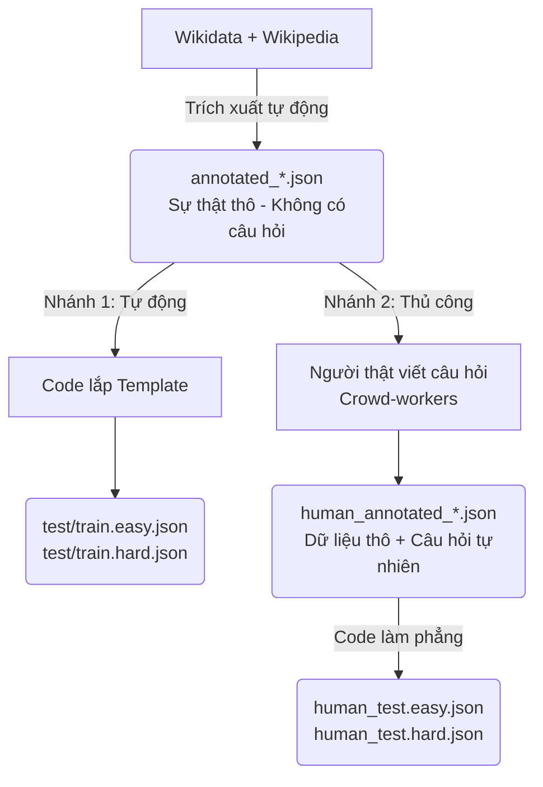

# Bộ dữ liệu TimeQA

## 1. Nguồn gốc

- **Paper gốc:** "A Dataset for Answering Time-Sensitive Questions" — Wenhu Chen và cộng sự, công bố tại **NeurIPS 2021 (Dataset & Benchmark track)**.
- **Đơn vị xây dựng:** nhóm NLP của UCSB (University of California, Santa Barbara).
- **Ngôn ngữ:** Tiếng Anh (100% English).
- **Giấy phép:** BSD 3-Clause "New"/"Revised" License.
- **Link chính thức:**
  - Paper: https://arxiv.org/abs/2108.06314
  - GitHub (dataset + code): https://github.com/wenhuchen/Time-Sensitive-QA
  - Mirror trên Hugging Face: https://huggingface.co/datasets/hugosousa/TimeQA

## 2. Mục đích ban đầu của paper

Kiểm tra xem các mô hình đọc-hiểu (reading comprehension) SOTA thời điểm đó (2021) có thực sự **hiểu và suy luận được về thời gian** hay chỉ đang khớp mẫu bề mặt. Paper thử nghiệm 2 baseline:
- **BigBird** — Transformer dùng sparse attention, đọc được văn bản dài, làm extractive QA (khoanh vùng câu trả lời trong văn bản).
- **FiD (Fusion-in-Decoder)** — kiến trúc retrieval + generation, chia văn bản thành nhiều đoạn nhỏ rồi tổng hợp lại để sinh câu trả lời.

Kết quả: mô hình tốt nhất (FiD) chỉ đạt ~46% độ chính xác, trong khi con người đạt ~87% — cho thấy khoảng cách lớn về khả năng suy luận thời gian của AI, đây chính là động lực cho các đề tài time-aware sau này (bao gồm cả đề tài của bạn).

> Lưu ý: bạn **không bắt buộc dùng BigBird/FiD** — đây chỉ là 2 baseline của paper gốc. Có thể thay bằng pipeline riêng (RAG + LLM API như Claude/GPT) và tự đánh giá trên cùng bộ test.

## 3. Chủ đề / phạm vi nội dung

TimeQA xây dựng từ các **quan hệ (relation) có tính thay đổi theo thời gian trên Wikidata**, gắn với **tiểu sử nhân vật có thật** (chủ yếu chính trị gia, quan chức, một số nhân vật công chúng khác). Các loại quan hệ điển hình:

- `P39` – position held (chức vụ đang giữ)
- Employer (nơi làm việc)
- Political party (đảng phái)
- Spouse (tình trạng hôn nhân)
- Đội thể thao đang thi đấu cho, chức vụ trong tổ chức, v.v.

→ **Lưu ý về Chủ đề:** Tất cả các chủ đề (chính trị, thể thao, kinh tế...) **bị trộn lẫn (mixed)** trong cùng một tập dataset khổng lồ, không có sự tách biệt thành các thư mục hay file riêng rẽ. 
→ **Không phải** tin tức thời sự, **không phải** dữ liệu luật hay tài chính. Muốn áp dụng ý tưởng sang các domain đó, cần tự chuyển đổi/tự thu thập dữ liệu tương ứng.

## 4. Cấu trúc dữ liệu, Dung lượng & Dây chuyền sinh File

- **Dung lượng data:** Rất nhẹ và thân thiện với máy cá nhân. Bộ nén (`.gzip`) tải về chỉ khoảng hơn 100MB. Khi giải nén toàn bộ các file JSON, tổng dung lượng chưa tới 1 GB (mỗi file test/train khoảng 60-70MB).

### Sơ đồ Dây chuyền sinh File (File Generation Pipeline)

Để hiểu rõ ý nghĩa của hàng chục file `.json` trong dataset, chúng ta có sơ đồ phân chia theo mục tiêu như sau:



**Chi tiết các giai đoạn và File tương ứng:**

**1. File Gốc (Bản phác thảo Sự thật thô)**
- **Danh sách File (3 file):** 
  - `annotated_train.json`
  - `annotated_dev.json`
  - `annotated_test.json`
- **Người tạo:** Code tự động (Cào từ Wikidata và Wikipedia).
- **Định dạng:** JSON Array.
- **Nội dung:** Chứa đoạn văn (`paras`) và các mốc thời gian sự kiện tách biệt (`[1997, 2001]`). **Tuyệt đối KHÔNG có câu hỏi.** 
- **Chức năng trong Dự án:** Đây là nguồn nguyên liệu gốc rễ (Ground Truth). Dùng cho giai đoạn **Tiền xử lý (Preprocessing)**: Vì nó cung cấp đoạn văn thô và mảng thời gian chuẩn xác nên ta dùng nó làm mốc đối chiếu để kiểm tra thuật toán "Băm chunk văn bản theo thời gian (Embedding)".

**2. Nhánh 1: Sinh câu hỏi Tự động (Synthesized)**
- **Danh sách File (6 file / 8 file nếu tính cả gzip):**
  - `train.easy.json` (kèm `train.easy.json.gzip`)
  - `train.hard.json` (kèm `train.hard.json.gzip`)
  - `dev.easy.json`
  - `dev.hard.json`
  - `test.easy.json`
  - `test.hard.json`
- **Người tạo:** Máy tính (Tự động lắp sự thật thô vào form/template).
- **Định dạng:** JSON Lines (JSONL - Đã làm phẳng thành `{idx, question, context, targets}`). Lưu ý: Đáp án nằm ở key **`targets`**.
- **Nội dung:** Chứa câu hỏi máy móc và đoạn văn, số lượng cực lớn. 
- **Chức năng trong Dự án:** Dùng cho giai đoạn **Kiểm thử cuối cùng (E2E QA Evaluation)**: Ném câu hỏi và ngữ cảnh cho AI sinh câu trả lời, so khớp với `targets` để tính điểm trên quy mô lớn.

**3. Nhánh 2: Sinh câu hỏi Thủ công (Human-written)**
- **File trung gian (2 file):** (Định dạng JSON Array, do Người thật nhìn vào mốc thời gian thô và viết ra câu hỏi tự nhiên)
  - `human_annotated_train.json`
  - `human_annotated_test.json`
- **File hoàn chỉnh (4 file / 6 file nếu tính cả gzip):** (Định dạng JSONL, đáp án nằm ở key **`targets`**)
  - `human_train.easy.json` (kèm `human_train.easy.json.gzip`)
  - `human_train.hard.json` (kèm `human_train.hard.json.gzip`)
  - `human_test.easy.json`
  - `human_test.hard.json`
- **Người tạo:** Người thật (Crowd-workers).
- **Nội dung:** Chứa câu hỏi tự nhiên, ngữ pháp phong phú. Số lượng ít hơn. 
- **Chức năng trong Dự án:** Dùng cho giai đoạn **Kiểm thử cuối cùng (E2E QA Evaluation)** như Nhánh 1, nhưng để test khả năng xử lý ngôn ngữ tự nhiên, lắt léo của con người thay vì câu hỏi máy móc.

---

### Sự đánh đổi cốt lõi (Vấn đề lớn nhất của bộ Dataset):
Có một vấn đề cực kỳ quan trọng trong bộ dataset này: **"Có câu hỏi thì không có field riêng cho mốc thời gian, có field riêng cho mốc thời gian thì không có câu hỏi"**.
- Trong file `annotated` (nhóm 1): Có trường thời gian rõ ràng (ví dụ: `["1997", "2001"]`) nhưng lại không có chuỗi câu hỏi (Question text).
- Trong các file `easy/hard` (nhóm 2 và 3): Có câu hỏi hoàn chỉnh nhưng mốc thời gian lại bị **nhúng thẳng (hard-coded)** vào trong chuỗi string của câu hỏi (VD: *"Ông A làm gì từ năm 1997 đến 2001?"*).

Chính sự đánh đổi này tạo ra 2 bài toán riêng biệt cho hệ thống Agentic Memory của chúng ta:
1. **Bài toán Chunking (Dùng nhóm 1):** Chỉ có văn bản thô, làm sao để trích xuất ra metadata thời gian.
2. **Bài toán Retrieval (Dùng nhóm 2 & 3):** Chỉ nhận được câu hỏi, làm sao để Agent tự bóc tách mốc thời gian từ câu hỏi để tìm kiếm đúng chunk.

### Ví dụ cấu trúc 1 bản ghi file Gốc (`annotated_test.json`)
```json
{
  "index": "/wiki/Ian_Gibson_(politician)#P39",
  "type": "P39",
  "link": "/wiki/Ian_Gibson_(politician)",
  "questions": [
    [["May 1997", "May 2001"], [{"para": 1, "from": 108, "end": 153,
      "answer": "Member of Parliament (MP) for Norwich North"}]],
    ...
  ],
  "paras": [
    "Ian Gibson (26 September 1938 – 9 April 2021) was a British scientist and Labour politician who served as Member of Parliament (MP) for Norwich North from 1997 to 2009.",
    "Gibson was a professor at the University of East Anglia... From 2009 to 2013, he was a journalist...",
    ...
  ]
}
```

**Giải thích các field dễ hiểu nhầm:**
- `from: 108, end: 153` → **không phải mốc thời gian**, mà là **vị trí ký tự (character offset)** trong đoạn văn để định vị chính xác câu trả lời.
- `["May 1997", "May 2001"]` → đây là khoảng thời gian **dùng để sinh câu hỏi**, lấy từ start/end của fact trên Wikidata — không phải field truyền vào lúc test như một tham số "request_time". Mốc thời gian thực tế nằm ngay trong câu hỏi dạng ngôn ngữ tự nhiên (VD: "What position did Ian Gibson hold in 2005?").

## 5. Timestamp thể hiện ở đâu? (Điểm yếu và Thách thức)

- **Không có trường `timestamp` (metadata) tách riêng gắn cho từng đoạn văn (chunk).**
- Thời gian tồn tại ở 2 dạng:
  1. **Trong văn bản thô:** Nhúng trực tiếp, chôn vùi trong câu chữ tự nhiên (VD: "...from 1997 to 2009").
  2. **Trong câu hỏi:** Mốc thời gian được nhúng thẳng vào câu hỏi ngôn ngữ tự nhiên (VD: "What was the position of Ian Gibson from May 1997 to May 2001?").
- **Điểm yếu lớn (Cũng là thách thức của benchmark):**
  - Các đoạn văn bản (paras) là văn bản Wikipedia kể chuyện tự nhiên, **CHƯA ĐƯỢC CHIA CHUNK THEO THỜI GIAN**. 
  - Một đoạn văn (Paragraph) duy nhất có thể chứa rất nhiều sự kiện và nhiều khung thời gian đan xen nhau (VD: "Năm 2005 ông làm giám đốc, nhưng đến 2008 bị sa thải, sau đó 2010 mở công ty riêng").
  - Do thiếu vắng metadata thời gian rõ ràng, hệ thống RAG không thể dùng màng lọc (Hard-filter) để truy xuất tài liệu. Bắt buộc LLM phải nhận nguyên đoạn văn dài và tự vận dụng khả năng đọc hiểu (Reading Comprehension) để suy luận logic thời gian.
- Ground-truth về start/end của mỗi fact được lấy từ **Wikidata** (structured), trong khi context đưa cho model đọc là **Wikipedia** (văn bản tự nhiên) — đây chính là "khoảng trống" mà model phải tự học cách lấp đầy.

## 6. Về khái niệm "end" và việc Wikipedia có ghi đè không

- `end` của 1 fact **không nhất thiết đồng nghĩa với việc bị fact khác ghi đè**. Có thể do: người đó qua đời, nghỉ hưu/hết nhiệm kỳ mà không có vị trí tiếp theo được ghi nhận, hoặc quan hệ đó đơn giản là chấm dứt.
- **Wikipedia (văn bản) không ghi đè** — bài viết giữ nguyên toàn bộ lịch sử các giai đoạn trong 1 bài duy nhất (tường thuật cộng dồn).
- **Wikidata (structured data) mới là nơi "ghi đè"/cập nhật** — thêm end_date hoặc statement mới khi fact hết hiệu lực.
- → TimeQA khai thác sự lệch pha này: Wikipedia không tự nói "cái nào là hiện tại", model phải tự đọc ngày tháng và suy luận, trong khi đáp án chuẩn thì lấy từ Wikidata đã có cấu trúc rõ ràng.

## 7. Tính chất — Nên dùng cho gì / Không nên dùng cho gì

| Tính chất | Có/Không | Ghi chú |
|---|---|---|
| Timestamp cụ thể trong văn bản | ✅ Có | Ngày/tháng/năm rõ ràng, không chỉ "trước/sau" |
| Nhiều fact theo mốc thời gian của 1 entity | ✅ Có | Phù hợp cho Timeline Summarization (A) |
| Theo dõi 1 entity qua nhiều giai đoạn (chiều dọc) | ✅ Có | Phù hợp Longitudinal Tracing (B), thiếu phần "ngang" |
| Temporal conflict (đơn nguồn, khác giai đoạn) | ✅ Có | Dùng được cho C ở mức đơn giản hóa |
| Multi-source conflict (đa nguồn, cùng thời điểm) | ❌ Không | Mỗi entity chỉ có 1 bài Wikipedia, không có 2 nguồn mâu thuẫn nhau |
| Dữ liệu dạng streaming, cập nhật liên tục | ❌ Không | Là snapshot tĩnh tại thời điểm 2021 |
| Có "correction" (tin sai rồi đính chính) | ❌ Không | Không mô phỏng tình huống báo chí đưa tin sai rồi sửa |
| Cập nhật đến hiện tại (2026) | ❌ Không | Dữ liệu dừng ở khoảng 2020–2021 |
| Corpus/văn bản để embedding có sẵn trong dataset | ✅ Có | Field `paras` — không cần tự crawl thêm |

**Kết luận sử dụng:**
- **Nên dùng cho:** cơ chế A (rất phù hợp), B (phù hợp một phần), C dạng temporal-conflict đơn giản.
- **Không nên dùng cho:** C dạng multi-source conflict đầy đủ, bài toán streaming update theo ngày/giờ, bài toán "tin tức đính chính sai sót".
- **Muốn làm đúng C đầy đủ:** cân nhắc StreamingQA, ChronoQA, hoặc benchmark mới LiveFact (ACL 2026, dữ liệu tin giả cập nhật hằng tháng — nhưng tính đến thời điểm tìm hiểu, code/dữ liệu công khai chưa được phát hành đầy đủ, cần theo dõi thêm). Nếu cần chủ động và chắc chắn có dữ liệu trong tay, có thể tự thu thập lịch sử chỉnh sửa Wikipedia (revision history) của cùng 1 trang qua nhiều thời điểm để mô phỏng "thông tin từng bị sai/cập nhật".

## 8. Cách đánh giá khi test

1. Lấy câu hỏi + toàn bộ đoạn văn (`paras`) từ file test (easy/hard).
2. Đưa vào pipeline của bạn (RAG hoặc gọi LLM API) để sinh câu trả lời — model không được cấp thêm bất kỳ metadata thời gian nào ngoài chính câu hỏi.
3. So khớp với đáp án chuẩn (`answer` trong file) bằng **Exact Match (EM)** hoặc **F1 score**.
4. Tính điểm trung bình trên toàn tập test, có thể tách riêng theo easy/hard để thấy rõ mức độ suy luận ngầm của hệ thống.