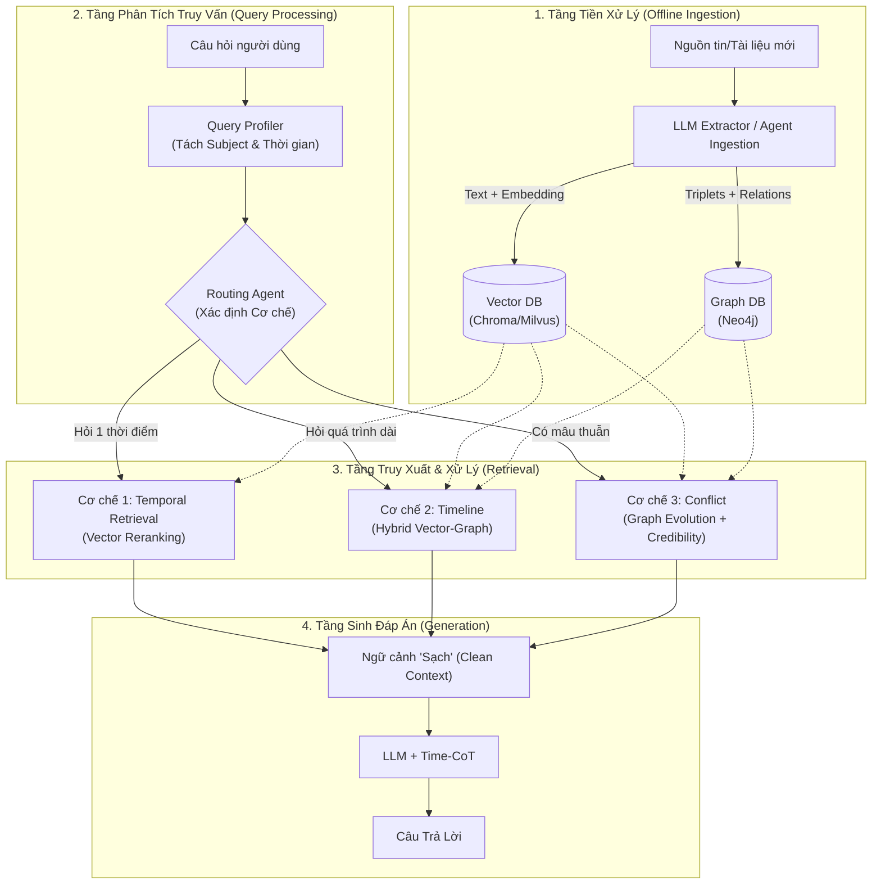
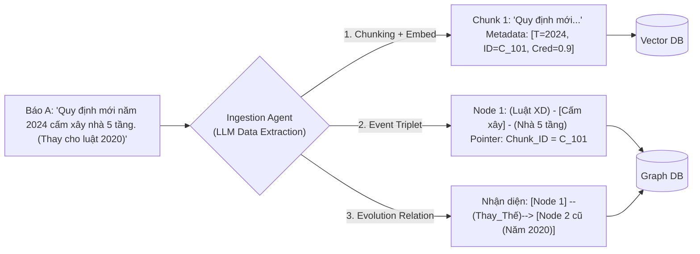
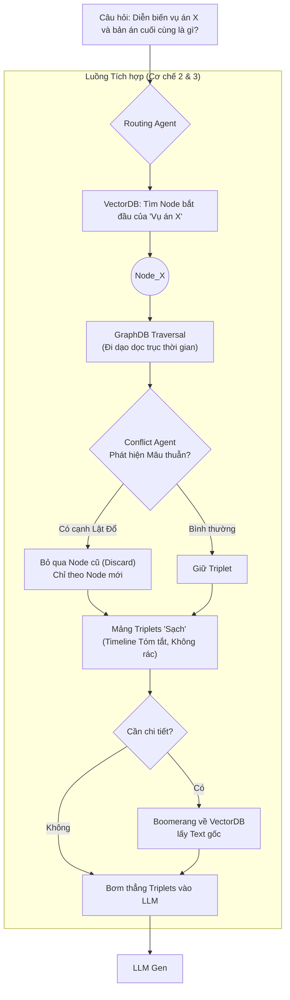

# Thiết Kế Kiến Trúc Hệ Thống Tổng Thể: Hybrid Vector-Graph Time-Aware RAG

Tài liệu này trình bày bản thiết kế kiến trúc hệ thống gốc (Initial Base Design) cho dự án Time-Aware Agentic Memory. Kiến trúc này tích hợp **Vector Database** và **Graph Database (Đồ thị)** nhằm bao phủ toàn diện cả 3 cơ chế nghiên cứu lõi:
1. **Temporal Retrieval** (Truy xuất dựa trên một mốc thời gian).
2. **Timeline Summarization** (Tóm tắt tiến trình sự kiện, chống tràn bộ nhớ).
3. **Conflict Resolution** (Giải quyết xung đột dữ liệu đa nguồn và đính chính).

---

## 1. Kiến Trúc Tổng Quan (4 Tầng)

Hệ thống được chia làm 4 phân hệ (Layers) chạy nối tiếp nhau, tách biệt rõ ràng giữa giai đoạn làm sạch dữ liệu (Offline) và giai đoạn trả lời người dùng (Online).

1. **Tầng Ingestion (Tiền xử lý & Nạp dữ liệu - Offline):** Chịu trách nhiệm đọc văn bản, dùng LLM trích xuất ngữ nghĩa, thời gian, sự kiện và đẩy vào 2 DB song song (Vector & Graph).
2. **Tầng Query Processing (Phân tích truy vấn - Online):** Agent đọc câu hỏi, định vị mốc thời gian ngầm ẩn và phân loại mục tiêu (Routing) vào 1 trong 3 Cơ chế.
3. **Tầng Retrieval & Conflict Resolution (Truy xuất & Xử lý xung đột):** Đi tìm bằng chứng. Tùy theo Cơ chế, Agent sẽ gọi VectorDB, GraphDB hoặc cả hai (Hybrid). Tại đây các thuật toán Re-ranking và Graph Traversal được kích hoạt.
4. **Tầng Generation (Sinh đáp án):** Ứng dụng Time-CoT (Chain of Thought theo thời gian) để tổng hợp ra câu trả lời chuẩn xác nhất.

---

## 2. Thiết Kế Tầng Tiền Xử Lý (Ingestion Layer) - Trích xuất như thế nào?

Để tránh việc VectorDB và GraphDB chứa rác hoặc không đồng bộ, quá trình trích xuất (Extraction) là vô cùng khắt khe. 

Khi một văn bản mới (ví dụ: Báo chí) được đưa vào, **Ingestion Agent** sẽ dùng Prompt trích xuất ra 4 thành phần sau:

1. **Văn bản thô (Text Chunk) & Metadata:** Lưu trực tiếp vào VectorDB kèm điểm Uy tín nguồn (`Credibility_Score`) và mốc thời gian hiệu lực (`Start_Time`, `End_Time`).
2. **Sự kiện Động (Dynamic Event Triplets):** Chuyển văn bản thành bộ ba `<Chủ thể> - [Hành động] - <Đối tượng> tại <Thời gian>`. Ví dụ: `(Ông A) - [Bị khởi tố] - (Cơ quan CA) tại {10/2023}`.
   - *Lưu ý Nhận thức luận (Epistemology):* Ingestion Agent phải được thiết kế Prompt để phân biệt giữa **Sự thật khách quan** và **Cáo buộc/Quan điểm**. Nếu báo viết *"A bị tình nghi là thủ phạm"*, Triplet trích xuất phải là `(Cơ quan) - [TÌNH_NGHI] - (Ông A)` thay vì khẳng định `(Ông A) - [LÀ_THỦ_PHẠM] - (Vụ án)`. Nhờ vậy, nếu sau này A được minh oan, thì việc "A đã từng bị tình nghi" vẫn là một **sự thật lịch sử đúng**. Lúc đó ta chỉ đóng `end_time` của trạng thái "bị tình nghi", chứ tuyệt đối không dùng đến trường `invalidated_at`.
3. **Quan hệ Tiến hóa (Chronos Event Evolution):** Agent đánh giá xem sự kiện mới này có **phủ định/thay thế** sự kiện nào cũ trong Database không. Nếu có, tạo ra một cạnh `[Supersedes/Thay_thế]`.
4. **Cơ chế Con trỏ (Pointer ID):** Khi lưu vào GraphDB, hệ thống **không** lưu lại toàn bộ đoạn văn (tránh tốn dung lượng). Mỗi Node trên Graph chỉ lưu Triplet và một biến `Chunk_ID` trỏ ngược về VectorDB.

> 📝 **Lưu ý: Xử lý Văn bản tự do (Sự nghiệp, Vụ án, Tin tức thô):**
> Ví dụ về pháp luật (Điều 1, Điều 2) là cách dễ nhất để minh họa cho sự "Phủ định". Tuy nhiên, với văn bản tự do (unstructured text) như một bản tin về vụ án hay tiểu sử một người, để có thể tạo được Vector và Graph, Ingestion Agent **bắt buộc (Mandatory)** phải rà quét đoạn text và trích xuất được 3 thông tin cốt lõi:
> 1. **Thực thể (Entities):** Ai, Cái gì? (VD: "Ông A", "Vụ án X").
> 2. **Mốc thời gian (Event Time):** Lấy từ trong câu văn (VD: "năm 2015", "tuần trước") hoặc fallback về ngày đăng bài (Publish Date). Nếu không có mốc thời gian, tài liệu đó không thể đưa vào hệ thống Time-Aware.
> 3. **Hành động (Relation/Event):** Xảy ra chuyện gì? (VD: "nhậm chức", "bị bắt").
> 
> *Sự khác biệt giữa Tiến trình (Timeline) và Xung đột (Conflict):*
> - **Tiến trình Sự nghiệp:** 2010 Ông A làm nhân viên -> 2015 làm Giám đốc. Hệ thống tạo cạnh `[TIẾP_THEO]` nối 2 sự kiện trên GraphDB. Trường `end_time` của năm 2010 **KHÔNG** bị đóng (bởi vì sự thật lịch sử là năm 2010 ông ấy làm nhân viên). Đây là Cơ chế 2 (Timeline).
> - **Xung đột Vụ án:** Ngày 1 báo đăng "Nghi phạm là B". Ngày 2 báo đính chính "Nhầm, nghi phạm là C". Lúc này, Agent tạo cạnh `[ĐÍNH_CHÍNH / CORRECTS]`, và **PHẢI đóng** `end_time` của tin Ngày 1 để loại bỏ thông tin sai lệch. Đây là Cơ chế 3 (Conflict).

### 2.1. Cấu Trúc Schema Cho VectorDB
Mỗi đoạn văn bản khi lưu vào VectorDB bắt buộc phải đi kèm metadata về thời gian để phục vụ Cơ chế 1.
- **Payload (Dữ liệu nhúng):** `text_chunk` (Nội dung văn bản thô được nhúng dưới 2 dạng: **Dense Vector** cho Semantic Search và **Sparse Vector / BM25** cho Keyword Search, phục vụ Hybrid Retrieval).
- **Metadata (Dữ liệu đi kèm để filter/re-rank):**
  - `chunk_id` (String): Mã định danh duy nhất (dùng để GraphDB trỏ ngược về bằng Boomerang Pointer).
  - `category` (String / Keyword): Nhãn phân loại chủ đề (VD: "Luật Nhà ở", "Thể thao", "Kinh tế"). *Bắt buộc phải đánh Payload Index trên DB để tăng tốc Pre-filtering.*
  - `source` (String): Nguồn tài liệu (ví dụ: Tên báo, đường link).
  - `credibility_score` (Float 0.0 - 1.0): Điểm uy tín của nguồn tin.
  - `start_time` (Timestamp / ISO Date): Thời điểm bắt đầu sự kiện hoặc bắt đầu có hiệu lực (Ví dụ: 01-01-2019).
  - `end_time` (Timestamp / ISO Date): Thời điểm kết thúc hiệu lực hoặc kết thúc trạng thái (Mặc định ban đầu là `null`).
  - `invalidated_at` (Timestamp / ISO Date): Mốc thời gian thông tin này bị xác nhận là tin giả/sai lệch hoàn toàn. (Mặc định là `null`. Nếu không `null`, trường này chứa đúng mốc thời gian hệ thống phát hiện nó sai).
  
  > 💡 **Giải ảo sự mơ hồ: Phân biệt "Diễn biến" và "Tin sai lệch" (Sự thật khách quan)**
  > Rất dễ nhầm lẫn giữa việc một thông tin "đã cũ" và một thông tin "bị sai". Hệ thống Agentic Memory bắt buộc phải rạch ròi 2 khái niệm này thông qua cách Agent trích xuất và lưu trữ. Có thể tổng hợp qua bảng sau:
  > 
  > | Tiêu chí | 1. Diễn Biến (Evolution / State Change) | 2. Tin sai lệch (Falsehood / Correction) |
  > | :--- | :--- | :--- |
  > | **Bản chất** | Một trạng thái đã **từng đúng** trong quá khứ, nhưng hiện nay đã thay đổi sang trạng thái mới. | Một thông tin **bị sai từ gốc**, chưa bao giờ là sự thật, do nhầm lẫn hoặc tin giả. |
  > | **Ví dụ** | - Luật 2019 bị thay bởi Luật 2020 - Ông A: Nhân viên -> Giám đốc - Vụ án: Tình nghi -> Khởi tố / Minh oan | - Báo đưa tin giả: "Ông A đã qua đời" - Lỗi đánh máy: "Nghi phạm là B" (thực chất là C) |
  > | **Hành động trong DB** | Khép mốc thời gian: Cập nhật `end_time` = Thời điểm kết thúc. | Vứt bỏ khỏi sự thật: Cập nhật `invalidated_at` = Thời điểm đính chính. |
  > | **Khi hỏi về Quá khứ** | Hệ thống **VẪN trả về kết quả này** như một sự thật lịch sử (VD: "Năm 2019 luật quy định..."). | Hệ thống **CẢNH BÁO** (VD: "Ngày đó dư luận đồn là B, nhưng tin này đã bị đính chính là sai"). |
  > 
  > *Lưu ý về Sự kiện tức thời (Point Event):* Với các sự kiện xảy ra đúng một khoảnh khắc (Ví dụ: "Nhận giải thưởng năm 2010"), `start_time` và `end_time` sẽ bằng nhau (hoặc bằng 2010), vì nó không kéo dài như một trạng thái.
  
  > ⚙️ **Xử lý Sửa đổi Cục bộ (Partial Amendment) bằng Structural Chunking:**
  > Nếu luật 2020 chỉ sửa đổi "Điều 2" của luật 2019, ta không "đóng" toàn bộ luật 2019. Để làm được điều này, Tầng Ingestion phải áp dụng **Structural Chunking** (băm tài liệu theo cấu trúc logic: từng Điều, Khoản riêng biệt) thay vì băm bừa bãi theo số lượng token.
  > Khi đó, VectorDB sẽ lưu thành các dòng độc lập: `Chunk A (Điều 1 - 2019)`, `Chunk B (Điều 2 - 2019)`.
  > Lúc luật 2020 ra mắt (chỉ sửa Điều 2), Agent sẽ chỉ tạo cạnh `[THAY_THẾ]` nhắm chính xác vào `Chunk B`. Lệnh Retrospective Update sẽ chỉ khép `end_time = 2020` đối với `Điều 2`, còn `Điều 1` vẫn nguyên vẹn `end_time = NULL` và tiếp tục có hiệu lực mà không hề sinh ra bất kỳ dữ liệu rác trùng lặp nào.

  > ⚙️ **Xử lý tài liệu trùng lặp / Nguyên vẹn nhưng khác thời gian (Deduplication & Semantic Hashing):**
  > Trả lời cho câu hỏi: *"Nếu nhận được một văn bản mới tinh năm 2020 nhưng bên trong chứa lại Điều 1 (giữ nguyên) và Điều 2 (bị sửa) thì sao?"*
  > Trước khi quyết định nhúng (embed) và lưu, Ingestion Agent sẽ chạy qua bước lọc **Content Hashing (Băm nội dung)** hoặc kiểm tra trùng lặp với các chunk đang có `end_time = NULL`.
  > - **Với phần giữ nguyên (Điều 1):** Hệ thống thấy Hash hoàn toàn trùng khớp với Chunk A (2019) -> **Bỏ qua (No-op)** việc tạo Chunk mới trên VectorDB. Ở phía GraphDB, nó chỉ cập nhật mốc `last_seen` hoặc tạo cạnh `[RE_AFFIRM / XÁC_NHẬN]` để tăng độ tin cậy. Chunk A tiếp tục giữ nguyên `end_time = NULL`.
  > - **Với phần bị sửa (Điều 2):** Hash khác biệt so với Chunk B -> Kích hoạt luồng tạo Chunk mới và khép `end_time` của Chunk B như bình thường.
  > Như vậy, hệ thống không bao giờ bị lặp văn bản dù tài liệu mới có chứa lại thông tin cũ.

### 2.2. Cấu Trúc Schema Cho GraphDB
GraphDB lưu "bộ xương" của các sự kiện và quan hệ giữa chúng, giúp tối ưu hóa dung lượng.
- **Nodes (Thực thể / Sự kiện):**
  - `node_id` (String): Mã định danh node.
  - `type` (String): Phân loại (Entity, Event).
  - `content` (String): Tên thực thể hoặc mô tả sự kiện ngắn gọn (Ví dụ: "Ông A làm giám đốc").
  - `timestamp` (Timestamp / ISO Date): Mốc thời gian cốt lõi của sự kiện.
  - `pointer_chunk_id` (String): Chìa khóa trỏ về `chunk_id` trong VectorDB để lấy text gốc khi cần.
- **Edges (Cạnh quan hệ):**
  - `relation_type` (String): Loại quan hệ (Ví dụ: `[THAM_GIA]`, `[THAY_THẾ / SUPERSEDES]`).
  - `weight` (Int): Số lượng tài liệu cùng nói về sự kiện này (để khử trùng lặp).
  - `start_time` / `end_time` (Timestamp): (Tùy chọn) Khoảng thời gian duy trì quan hệ.

---

## 3. Thiết Kế Các Tầng Truy Xuất Theo 3 Cơ Chế (Retrieval Layer)

Tùy vào loại câu hỏi, **Routing Agent** sẽ rẽ nhánh luồng truy xuất sao cho vừa nhanh (Low Latency) vừa đỡ tốn Token (Token-efficient).

### 3.1. Cơ chế 1: Temporal Retrieval (Cho các câu hỏi tại một mốc thời gian)
> 💡 **Đặc trưng cốt lõi:** Cơ chế 1 hoạt động hoàn toàn độc lập trên **VectorDB**, chỉ sử dụng duy nhất các trường `start_time` và `end_time` để khoanh vùng thời gian (không cần dùng GraphDB).
*Ví dụ: "Luật xây dựng năm 2020 quy định thế nào?"*
- **Quy trình xử lý (Chia làm 2 trường hợp):**
  1. **Bước 1 (Hybrid Search - Tích hợp Ngữ nghĩa & Từ khóa):** Lấy ra Top-K tài liệu từ VectorDB bằng phương pháp tìm kiếm lai. Kết hợp Semantic Search (hiểu ý định) và Keyword Search / BM25 (bắt chính xác các từ khóa đặc thù như "Nghị định 100", "Điều 24").
  2. **Bước 2 (Kiểm tra & Lọc thời gian):**
     - **Trường hợp 1 (Có thông tin chính xác tại mốc thời gian):** Nếu trong VectorDB có chunk khớp hoàn toàn với năm 2020 (dựa trên metadata `start_time` <= 2020 và `end_time` >= 2020, hoặc chunk nói trực tiếp về 2020), hệ thống sẽ **chọn luôn** thông tin này.
     - **Trường hợp 2 (Không có thông tin tại mốc đó):** Nếu không tìm thấy luật nào ban hành đúng năm 2020, hệ thống sẽ lấy thông tin **trước năm 2020 nhưng gần 2020 nhất và liên quan nhất** (ví dụ: Luật ban hành năm 2018). *Tuyệt đối không lấy thông tin sau 2020 (như luật 2021) vì tại thời điểm 2020 luật đó chưa tồn tại.*
  3. **Bước 3 (Re-ranking):** Nếu có nhiều tài liệu cạnh tranh (đặc biệt ở Trường hợp 2), áp dụng xếp hạng kép: 
     `Final_Score = W1 * Semantic_Score + W2 * Temporal_Score`
     *(Trong đó Temporal_Score sử dụng hàm Half-life Decay: tài liệu càng lùi xa về quá khứ so với mốc 2020 thì bị trừ điểm càng mạnh).*
- **Kết quả:** Trả về văn bản khớp ngữ nghĩa và đảm bảo tính chính xác tuyệt đối về mặt lịch sử cho LLM.

### 3.2. Cơ chế 2: Timeline Summarization (Cho các câu hỏi tóm tắt toàn bộ diễn biến)
*Ví dụ: "Tóm tắt sự nghiệp của Ông A từ 2010 đến nay."*
- **Vấn đề:** Nếu dùng VectorDB lấy top 100 bài báo thì LLM sẽ bị **tràn bộ nhớ (Context Window Explosion)**.
- **Quy trình (Hybrid Vector-Graph RAG - Kiến trúc Boomerang):**
  1. **Vector làm La Bàn:** Tìm trong VectorDB 1 bài báo bất kỳ về "Ông A", lấy ra `Node_ID`.
  2. **Graph Traversal:** Cầm `Node_ID` nhảy sang GraphDB. Đứng từ đó, đi bộ dọc theo sợi dây thời gian (Time-traversal) kéo dài từ 2010 đến 2024.
  3. **Nén Token (Triplets):** Lấy ra một mảng các Sự kiện (Triplets siêu nhẹ, thay vì text dài ngoằng). Ví dụ: `[ (2010: Thăng chức), (2015: Nhận thưởng), (2024: Nghỉ hưu) ]`.
  4. Nếu người dùng không hỏi sâu, đưa thẳng Triplets này cho LLM vẽ Timeline (< 1.000 Token, không bao giờ tràn). Nếu cần đọc chi tiết, cầm thẻ `Chunk_ID` làm "Boomerang" quay ngược lại VectorDB lấy đúng text đó.

### 3.3. Cơ chế 3: Conflict Resolution (Xử lý mâu thuẫn)
> 💡 **Sự giao thoa giữa Cơ chế 2 và Cơ chế 3 (Luồng Tích hợp):**
> Rất dễ nhầm lẫn vai trò của Đồ thị (GraphDB) trong 2 cơ chế này.
> - **Cơ chế 2 (Tiến trình):** Dùng Graph để xâu chuỗi sự kiện hợp logic (Edge: `[TIẾP_THEO]`, `[THĂNG_CHỨC]`). Các Node đều là sự thật.
> - **Cơ chế 3 (Mâu thuẫn):** Dùng Graph để phân xử tin sai/đúng (Edge: `[BÁC_BỎ]`, `[THAY_THẾ]`) và dán nhãn `invalidated_at`.
> Trong thực tế, khi yêu cầu "Tóm tắt diễn biến", hệ thống chạy **Luồng Tích hợp**: Cơ chế 2 đi bộ dọc dòng thời gian, cứ vấp phải mâu thuẫn thì Cơ chế 3 nhảy vào dùng cạnh `[BÁC_BỎ]` để gạt bỏ tin rác, giúp Cơ chế 2 tiếp tục vẽ ra một bức tranh "sạch sẽ".
*Ví dụ: Ngày 15/10/2023, Báo A (Uy tín) đăng "A bị bắt", Báo B (Lá cải) đăng "A chỉ bị mời lên phường". Hoặc Luật 2024 âm thầm thay Luật 2020.*
- **Quy trình (Agentic Filtering & Evolution Graph):**
  1. **Mâu thuẫn Đa nguồn (cùng thời điểm):** Hệ thống Vector Re-ranker kích hoạt trọng số Uy tín.
     `Final = W1 * Semantic + W2 * Time_Decay + W3 * Credibility`
     => Báo A (Điểm Credibility cao hơn) đè bẹp Báo B.
  2. **Mâu thuẫn Ghi đè (Implicit Supersede):** Hệ thống hỏi GraphDB xem có đường link tiến hóa (Evolution) nào không. Nó phát hiện cạnh: `[Bản tin đính chính 16/10] --(Lật_đổ)--> [Bản tin sai 15/10]`.
  3. RASTeR Triplet Matcher (Chạy ngầm): Vứt bỏ hoàn toàn tài liệu lỗi thời ra khỏi Context Window, chỉ nạp sự thật cuối cùng (End-node) vào cho LLM.

---

## 4. Tầng Sinh Đáp Án (Generation Layer) và Đánh giá (Metrics)

Sau khi tầng Retrieval đưa ra được tập ngữ cảnh (Context) hoàn toàn "sạch" (đúng lúc, đúng thứ tự, không chứa rác/xung đột), LLM cuối cùng sẽ thực hiện bước tạo câu trả lời.

- **Kỹ thuật Time-CoT (Time Chain-of-Thought):** Prompt ép LLM suy luận theo format: 
  > *"Dựa trên sự kiện T1... dẫn đến sự kiện T2... và luật ở T3 đã thay thế T2. Nên kết luận hiện tại là..."*
- **Đánh giá (Metrics):**
  - **Độ phủ thời gian (Coverage):** Không bỏ sót giai đoạn nào (nhờ Graph Traversal / Bucketing).
  - **Temporal Freshness:** Mức độ phục hồi trạng thái đúng sau khi có tin đính chính (đo bằng Exact Match).
  - **Token Efficiency:** So sánh số Token tiêu tốn giữa RAG thường (150K Token) và Hybrid Graph (<1K Token).

## 5. Tóm Lược Giá Trị Thiết Kế
Kiến trúc kết hợp Hybrid Vector-Graph trên đây không chỉ giải quyết bài toán "điểm mù thời gian" của RAG truyền thống, mà còn biến hệ thống thành một dạng **Bộ nhớ Nhận thức (Agentic Memory)** thực thụ: tự biết khi nào thông tin hết hạn, tự biết nén dữ liệu sự kiện lớn thành cấu trúc nhỏ gọn để xử lý timeline, và tự phân luồng giải quyết mâu thuẫn nhờ vào hệ Đồ thị Tiến hóa (Chronos).
