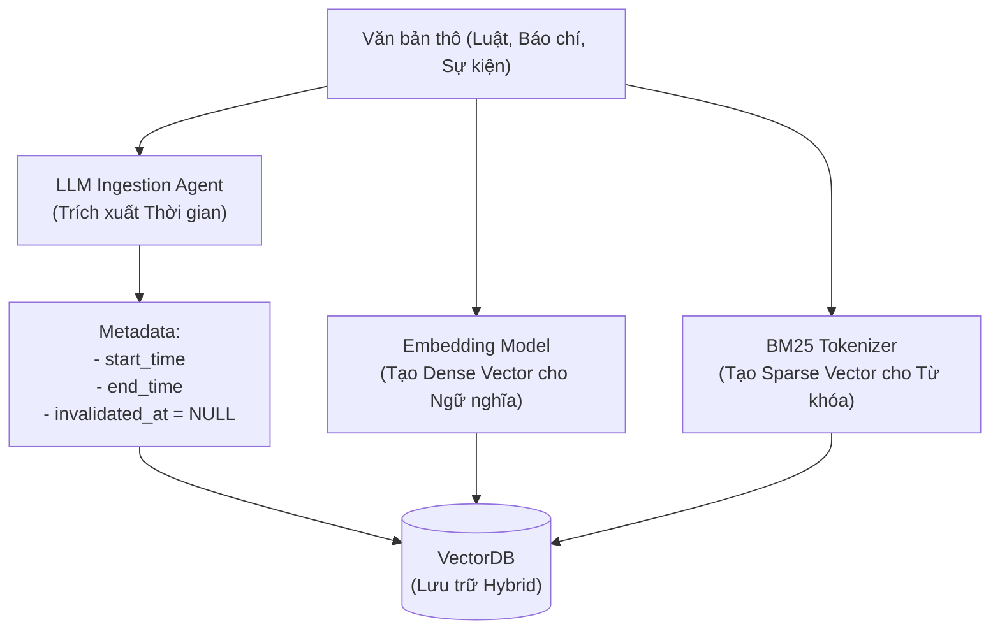
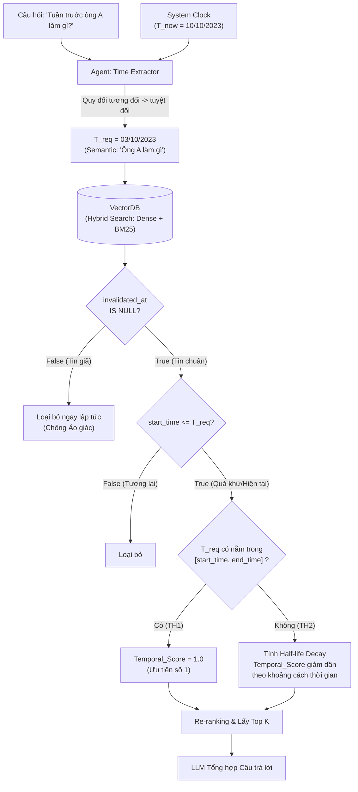

# Cơ chế 1: Temporal Retrieval (Truy xuất dựa trên Mốc thời gian)

## 1. Tổng quan (Overview)
**Mục tiêu:** Trả lời các câu hỏi yêu cầu tính chính xác về mặt thời điểm (Point-in-time Query). Ví dụ: *"Luật xây dựng năm 2020 quy định thế nào?"* hoặc *"Tháng 5/2023, chức vụ của ông A là gì?"*.

**Đặc trưng kiến trúc:**
- **Chỉ sử dụng VectorDB:** Không cần duyệt GraphDB. Giúp cơ chế này có tốc độ phản hồi cực nhanh (Low Latency).
- **Tuyệt đối không dùng thông tin tương lai (Data Leakage Prevention):** Khi được hỏi về năm 2020, hệ thống tuyệt đối không được dùng dữ liệu sinh ra vào năm 2021 để trả lời.

---

## 2. Thiết kế Schema (VectorDB)
Để phục vụ riêng cho Cơ chế 1, VectorDB cần lập chỉ mục (index) các trường sau đây để có thể dùng làm bộ lọc (Filter) cứng lúc truy vấn:

| Tên trường | Kiểu dữ liệu | Bắt buộc / Nullable | Vai trò trong Cơ chế 1 |
| :--- | :--- | :--- | :--- |
| `chunk_id` | String | **Bắt buộc** | Mã định danh duy nhất của chunk (Dùng để truy xuất ngược hoặc link với GraphDB sau này). |
| `text_chunk` | Dense & Sparse Vector | **Bắt buộc** | Payload nhúng dưới 2 định dạng: Dense Vector (Ngữ nghĩa) và Sparse Vector / BM25 (Từ khóa) để chạy Hybrid Search. |
| `domain_features` (JSON Lồng nhau) | JSON Object | **Tùy chọn** | Gom nhóm các đặc trưng của từng bài toán (VD: `{"country": "VN", "domain": "Luật"}`). VectorDB hỗ trợ đánh Index thẳng vào các key con bên trong JSON này (VD: `domain_features.country`). |
| `source` | String | **Bắt buộc** | Nguồn tài liệu (Tên báo, link văn bản). Dùng để trích dẫn nguồn khi sinh câu trả lời. |
| `start_time` | Timestamp / ISO Date | **Bắt buộc** | Thời điểm thông tin bắt đầu đúng. Dùng để tính khoảng cách thời gian (Time Decay) và chặn thông tin tương lai. |
| `end_time` | Timestamp / ISO Date | Mặc định `NULL` | Thời điểm thông tin kết thúc. Dùng để chốt khoảng `[start_time, end_time]`. Nếu chưa kết thúc, cứ để `NULL`. |
| `invalidated_at`| Timestamp / ISO Date | Mặc định `NULL` | Cờ đánh dấu tin giả. Cơ chế 1 sẽ filter cứng để **loại bỏ hoàn toàn** các chunk có trường này khác `NULL`. |

> ⚠️ **Chiến lược đánh Index (Payload Indexing Strategy):**
> Việc lạm dụng đánh index quá nhiều trường (>10 trường) sẽ gây bùng nổ RAM và làm chậm quá trình Ingestion (do DB phải liên tục cập nhật các cây B-Tree). 
> **Dự kiến cấu hình chuẩn cho đồ án này chỉ đánh Index đúng 4 trường sau:**
> 1. `start_time` (Để chặn tương lai)
> 2. `invalidated_at` (Để lọc tin giả)
> 3. `domain_features.domain` (Phân loại lĩnh vực)
> 4. `domain_features.country` (Phân loại quốc gia)
> Các trường như `source`, `chunk_id`, `end_time` tuyệt đối KHÔNG đánh index để tiết kiệm tài nguyên.

---

## 3. Luồng xử lý chi tiết (Workflow)

### Bước 1: Time Extraction (Phân tích câu hỏi & Quy đổi thời gian)
Routing Agent đọc câu hỏi của người dùng và trích xuất ra 3 thông tin:
- `Semantic_Query`: Ý định chính của câu hỏi (VD: "Quy định cấp sổ hồng").
- `T_req` (Requested Time): Mốc thời gian tuyệt đối (VD: "2020-01-01").
- `Metadata_Filters`: Một đối tượng JSON chứa các trường phân loại (VD: `{"country": "VN", "domain": "Luật Nhà ở"}`). Hệ thống cung cấp sẵn các keys/values hợp lệ trong Prompt để LLM mapping nhanh chóng, giúp thu hẹp không gian tìm kiếm.
> 💡 **Xử lý Thời gian tương đối (Relative Time Resolution):** Rất nhiều trường hợp người dùng sẽ hỏi theo ngữ cảnh mốc thời gian động (Ví dụ: *"tuần trước", "tháng ngoái", "hiện tại"*). Để giải quyết, **Hệ thống bắt buộc phải tiêm thời gian thực tế của server (System Clock - `T_now`) vào System Prompt** của Agent. Nhờ có `T_now` làm điểm neo, LLM mới có thể tự động tính toán và quy đổi "tuần trước" thành một mốc `T_req` tuyệt đối (Ví dụ: `2023-10-15`) trước khi gọi DB.

### Bước 2: Truy xuất và Lọc thô (Hybrid Search + Hard Filter)
Hệ thống truy vấn VectorDB để lấy ra Top-N tài liệu sử dụng **Hybrid Search** (kết hợp Dense Vector để hiểu ngữ nghĩa và Sparse Vector / BM25 để bắt chính xác từ khóa), kèm theo **Hard Filter**:
- **Loại bỏ thông tin sai lệch / đính chính:** `invalidated_at IS NULL` (Vì Cơ chế 1 chỉ nhắm đến việc trả lời sự thật khách quan (Factual query), hệ thống bắt buộc phải gạt bỏ mọi chunk đã bị đánh dấu là tin giả hoặc bị lật đổ để tránh LLM bị ảo giác. Bất cứ chunk nào có cờ `invalidated_at != NULL` đều bị drop ngay từ vòng này).
- **Chặn tương lai:** `start_time <= T_req` (Tuyệt đối không lấy chunk có ngày bắt đầu lớn hơn ngày người dùng hỏi).
- **Lọc đa chiều (Faceted Pre-filtering):** Kích hoạt điều kiện `AND` cho các Index được bóc tách từ `Metadata_Filters`. (Dùng các cây B-Tree Index độc lập để thu hẹp không gian tìm kiếm từ vài triệu chunks xuống chỉ còn vài trăm chunks trước khi đi tính toán Vector. Giúp tăng tốc độ (Low Latency) và giảm nhiễu chéo giữa các văn bản khác miền).

### Bước 3: Phân loại và Re-ranking (Xử lý 2 Trường hợp)
Trong số N tài liệu lấy ra ở Bước 2, hệ thống chia làm 2 trường hợp để tính điểm `Temporal_Score`:

- **Trường hợp 1 (Exact Match - Khớp mốc thời gian):**
  Lọc ra các tài liệu thỏa mãn: `start_time <= T_req` VÀ (`end_time >= T_req` HOẶC `end_time IS NULL`).
  => *Xử lý:* Đây là thông tin có hiệu lực chính xác tại thời điểm `T_req`. Gán `Temporal_Score = 1.0` (Điểm tối đa). Chọn luôn đưa cho LLM.

- **Trường hợp 2 (Nearest Past - Lùi về quá khứ gần nhất):**
  Nếu Trường hợp 1 không tìm thấy tài liệu nào, hệ thống rơi vào trạng thái Fallback (Ví dụ: Không có luật 2020, chỉ có luật 2018).
  => *Xử lý:* Áp dụng hàm suy giảm thời gian (Half-life Decay) dựa trên khoảng cách giữa `start_time` và `T_req`. 
  `Temporal_Score = e^(-λ * |T_req - start_time|)`
  Tài liệu càng lùi xa về quá khứ, điểm càng thấp. Cuối cùng, tính `Final_Score = W1 * Semantic_Score + W2 * Temporal_Score` để chọn ra chunk tốt nhất.

---

## 4. Sơ đồ Luồng hoạt động (Mermaid)

### 4.1. Giai đoạn Nạp dữ liệu (Data Ingestion & Indexing)
Sơ đồ minh họa cách dữ liệu được trích xuất và biến đổi thành các vector lai (Hybrid) trước khi đưa vào VectorDB.



### 4.2. Giai đoạn Truy xuất (Retrieval Flow)
Sơ đồ minh họa luồng hoạt động khi người dùng đặt câu hỏi.



---

## 5. Các việc cần làm (Actionable To-Do List)

Để code và hoàn thiện Cơ chế 1, chúng ta cần làm các bước sau:

- [ ] **1. Setup Database & Schema:** Khởi tạo VectorDB (VD: Qdrant, Milvus hoặc Pinecone) và cấu hình Schema có hỗ trợ filter trên các trường metadata (`start_time`, `end_time`, `invalidated_at`).
- [ ] **2. Prompting cho Time Extractor (Xử lý thời gian tương đối):** Viết Prompt (sử dụng Function Calling/Structured Output của LLM) để trích xuất `T_req`. Cần code một pipeline tiêm thời gian hệ thống (`datetime.now()`) vào System Prompt để LLM có thể quy đổi các case "năm ngoái", "hiện tại", "tháng trước" thành chuỗi ISO Date tuyệt đối.
- [ ] **3. Xây dựng hàm Half-life Decay:** Code logic tính điểm penalty bằng Python (Sử dụng thư viện `datetime` và `math.exp`). Thử nghiệm để điều chỉnh hệ số `λ` (Decay rate) sao cho hợp lý (VD: Giảm bao nhiêu % điểm nếu cách 1 năm, 5 năm?).
- [ ] **4. Tích hợp Re-ranking:** Viết hàm kết hợp `Semantic_Score` (từ VectorDB) và `Temporal_Score` với các trọng số $W_1, W_2$.
- [ ] **5. Chuẩn bị Test Data:** Tạo thủ công một tập JSON chứa 3 phiên bản luật (VD: Luật 2015, Luật 2018, Luật 2021) để test xem hệ thống có lấy đúng Luật 2018 khi được hỏi về năm 2020 hay không.

---

## 6. Ví dụ Code Minh Họa (Python)

Dưới đây là mã giả (Pseudo-code) bằng Python minh họa cho **Bước 2 (Lọc thô)** và **Bước 3 (Tính điểm Half-life Decay)** của Cơ chế 1.

### 6.1. Xây dựng Bộ lọc (Dùng cấu trúc của Qdrant làm ví dụ)
```python
from qdrant_client.http import models

def build_temporal_and_faceted_filter(t_req_timestamp: int, metadata_filters: dict):
    """
    Tạo bộ lọc để:
    1. Pre-filtering đa chiều (Faceted Filtering) dựa trên dict đầu vào.
    2. Loại bỏ tin giả (invalidated_at IS NULL).
    3. Loại bỏ thông tin tương lai (start_time <= T_req).
    """
    must_conditions = []
    
    # Điều kiện 1: Pre-filtering B-Tree (Khoanh vùng đa chiều)
    # Ví dụ metadata_filters = {"country": "VN", "domain": "Luật Nhà ở"}
    for key, value in metadata_filters.items():
        must_conditions.append(
            models.FieldCondition(
                key=key,
                match=models.MatchValue(value=value)
            )
        )
        
    # Điều kiện 2 & 3: Lọc thời gian và độ chân thực
    must_conditions.extend([
        models.IsEmptyCondition(
            is_empty=models.PayloadField(key="invalidated_at")
        ),
        models.FieldCondition(
            key="start_time",
            range=models.Range(lte=t_req_timestamp)
        )
    ])
    
    return models.Filter(must=must_conditions)
    )
```

### 6.2. Tính điểm Temporal_Score (Half-life Decay)
```python
import math
from typing import Dict, Any

def calculate_temporal_score(metadata: Dict[str, Any], t_req: float, decay_rate: float = 0.5) -> float:
    """
    Tính điểm Temporal Score cho 1 tài liệu sau khi đã lọt qua Hard Filter.
    - decay_rate (λ): Tốc độ suy giảm (càng lớn điểm tụt càng nhanh).
    """
    start_time = metadata.get("start_time")
    end_time = metadata.get("end_time")
    
    # TRƯỜNG HỢP 1: Exact Match
    # Nếu T_req nằm lọt thỏm trong khoảng [start_time, end_time] 
    # Hoặc end_time là NULL (vẫn đang có hiệu lực)
    if end_time is None or end_time >= t_req:
        return 1.0  # Điểm tối đa tuyệt đối
        
    # TRƯỜNG HỢP 2: Nearest Past
    # Lùi về quá khứ vì thông tin đã kết thúc (end_time < T_req)
    # Tính khoảng cách từ lúc T_req đến lúc thông tin bắt đầu (start_time)
    # Chú ý: Vì Hard Filter đã đảm bảo start_time <= T_req, nên time_diff luôn >= 0
    time_diff_years = (t_req - start_time) / (365 * 24 * 3600)  # Chuyển đổi timestamp sang số năm
    
    # Áp dụng hàm suy giảm mũ (Exponential Decay)
    temporal_score = math.exp(-decay_rate * time_diff_years)
    
    return temporal_score

def final_reranker(hybrid_score: float, temporal_score: float, w1: float = 0.7, w2: float = 0.3) -> float:
    """
    Kết hợp điểm từ VectorDB (Đã được hợp nhất giữa Dense Semantic và BM25) và Điểm Thời gian.
    """
    return (w1 * hybrid_score) + (w2 * temporal_score)
```
