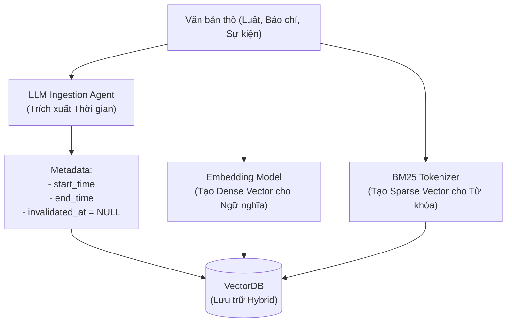
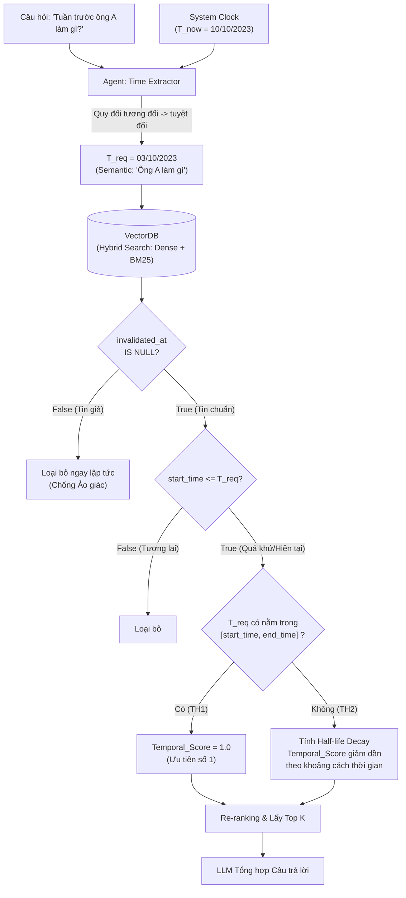

# Cơ chế 1: Temporal Retrieval (Truy xuất dựa trên Mốc thời gian)

## 1. Tổng quan (Overview)
**Mục tiêu:** Trả lời các câu hỏi yêu cầu tính chính xác về mặt thời điểm (Point-in-time Query). Ví dụ: *"Luật xây dựng năm 2020 quy định thế nào?"* hoặc *"Tháng 5/2023, chức vụ của ông A là gì?"*.

---

## 2. Thiết kế Schema (VectorDB)
Để phục vụ riêng cho Cơ chế 1, VectorDB cần lập chỉ mục (index) các trường sau đây để có thể dùng làm bộ lọc (Filter) cứng lúc truy vấn:

| Tên trường | Kiểu dữ liệu | Bắt buộc / Nullable | Vai trò trong Cơ chế 1 |
| :--- | :--- | :--- | :--- |
| `chunk_id` | String | **Bắt buộc** | Mã định danh duy nhất của chunk (Dùng để truy xuất ngược hoặc link với GraphDB sau này). |
| `text_chunk` | Dense & Sparse Vector | **Bắt buộc** | Payload nhúng dưới 2 định dạng: Dense Vector (Ngữ nghĩa) và Sparse Vector / BM25 (Từ khóa) để chạy Hybrid Search. |
| `domain_features` (JSON Lồng nhau) | JSON Object | **Tùy chọn** | Gom nhóm các đặc trưng của từng bài toán (VD: `{"country": "VN", "domain": "Luật"}`). VectorDB hỗ trợ đánh Index thẳng vào các key con bên trong JSON này (VD: `domain_features.country`). |
| `source` | String | **Bắt buộc** | Nơi phát hành (Wikipedia, tên báo). Dùng để trích dẫn nguồn khi sinh câu trả lời và là khóa tra độ tin cậy ở Cơ chế 3. |
| `doc_id` | String | Tùy chọn (mặc định `NULL`) | Tài liệu cụ thể trong `source` (VD `/wiki/Knox_Cunningham`, URL bài báo). Tách khỏi `source` để gom chunk theo nguồn và theo tài liệu độc lập. Không index. |
| `start_time` | Timestamp / ISO Date | **Bắt buộc** | Thời điểm thông tin bắt đầu đúng. Dùng để tính khoảng cách thời gian (Time Decay) và chặn thông tin tương lai. |
| `end_time` | Timestamp / ISO Date | Mặc định `NULL` | Thời điểm thông tin kết thúc. Dùng để chốt khoảng `[start_time, end_time]`. Nếu chưa kết thúc, cứ để `NULL`. |
| `invalidated_at`| Timestamp / ISO Date | Mặc định `NULL` | Cờ đánh dấu tin giả. Cơ chế 1 sẽ filter cứng để **loại bỏ hoàn toàn** các chunk có trường này khác `NULL`. |

> ⚠️ **Chiến lược đánh Index (Payload Indexing Strategy):**
> **Dự kiến cấu hình chuẩn cho đồ án này chỉ đánh Index đúng 4 trường sau:**
> 1. `start_time` (Để chặn tương lai)
> 2. `invalidated_at` (Để lọc tin giả)
> 3. `domain_features.domain` (Phân loại lĩnh vực)
> 4. `domain_features.country` (Phân loại quốc gia)
> Các trường như `source`, `chunk_id`, `end_time` tuyệt đối KHÔNG đánh index để tiết kiệm tài nguyên.

---

## 3. Luồng xử lý và Sơ đồ hoạt động (Workflow & Mermaid)

### 3.1. Sơ đồ Giai đoạn Nạp dữ liệu (Data Ingestion & Indexing)
Sơ đồ minh họa cách dữ liệu được trích xuất và biến đổi thành các vector lai (Hybrid) trước khi đưa vào VectorDB.



### 3.2. Sơ đồ Giai đoạn Truy xuất (Retrieval Flow)
Sơ đồ minh họa luồng hoạt động khi người dùng đặt câu hỏi. Các bước 1–3 ở mục 3.3 giải thích chi tiết từng khối trong sơ đồ này.



### 3.3. Giải thích chi tiết các bước

Đi theo đúng thứ tự các khối trong sơ đồ 3.2. Xuyên suốt dùng một ví dụ: *"Tuần trước ông A làm gì?"*, hỏi vào ngày `T_now = 10/10/2023`.

| Bước | Khối trong sơ đồ | Đầu vào | Đầu ra |
| :--- | :--- | :--- | :--- |
| 1 | Time Extractor | Câu hỏi + `T_now` | `Semantic_Query`, `T_req`, `Metadata_Filters` |
| 2 | VectorDB + 2 bộ lọc cứng | 3 giá trị trên | Top-N chunk hợp lệ (không tin giả, không tương lai) |
| 3 | Kiểm tra `[start_time, end_time]` | Top-N chunk + `T_req` | `Temporal_Score` của từng chunk |
| 4 | Re-ranking | `Semantic_Score` + `Temporal_Score` | Top-K chunk đưa cho LLM |

#### Bước 1: Time Extraction – Hiểu câu hỏi hỏi về thời điểm nào
Routing Agent đọc câu hỏi và trích ra 3 thông tin:
- `Semantic_Query`: nội dung cần tìm (VD: "Ông A làm gì").
- `T_req`: mốc thời gian **tuyệt đối** mà người dùng muốn hỏi (VD: `2023-10-03`).
- `Metadata_Filters`: JSON phân loại để thu hẹp phạm vi tìm (VD: `{"country": "VN", "domain": "Luật Nhà ở"}`). Prompt cung cấp sẵn danh sách key/value hợp lệ để LLM chỉ việc chọn.

> 💡 **Thời gian tương đối:** với các cụm như *"tuần trước"*, *"tháng ngoái"*, *"hiện tại"*, hệ thống **bắt buộc tiêm `T_now` (đồng hồ server) vào System Prompt** của Agent. Có `T_now` làm điểm neo, LLM mới quy đổi được "tuần trước" thành `T_req` tuyệt đối trước khi gọi DB (ví dụ trên: 10/10/2023 → 03/10/2023).

#### Bước 2: Truy xuất và Lọc thô – Lấy ứng viên, loại ngay những gì không được phép dùng
VectorDB chạy **Hybrid Search** (Dense Vector cho ngữ nghĩa + Sparse/BM25 cho từ khóa) để lấy Top-N chunk. Cùng lúc đó áp **Hard Filter**; chunk không qua được sẽ bị loại hẳn, không tham gia chấm điểm:

1. **Loại tin giả:** `invalidated_at IS NULL`. Cơ chế 1 chỉ trả lời sự thật khách quan, nên chunk đã bị đánh dấu sai/bị lật đổ (`invalidated_at != NULL`) bị drop để LLM không bị ảo giác.
2. **Chặn tương lai:** `start_time <= T_req`. Không lấy chunk bắt đầu sau thời điểm được hỏi.
3. **Lọc đa chiều (Faceted Pre-filtering):** `AND` thêm các điều kiện từ `Metadata_Filters` (dựa trên index của `domain_features.domain`, `domain_features.country`). Bước này thu hẹp từ hàng triệu chunk xuống vài trăm **trước** khi tính vector, giúp nhanh hơn và tránh nhiễu từ văn bản khác lĩnh vực.

#### Bước 3: Phân loại thời gian – Chunk nào đang có hiệu lực tại `T_req`?
Với mỗi chunk còn lại, kiểm tra `T_req` có nằm trong `[start_time, end_time]` hay không (`end_time = NULL` nghĩa là vẫn còn hiệu lực):

| | Điều kiện | Ý nghĩa | `Temporal_Score` |
| :--- | :--- | :--- | :--- |
| **TH1 – Exact Match** | `start_time <= T_req` và (`end_time >= T_req` hoặc `end_time IS NULL`) | Thông tin có hiệu lực đúng tại `T_req` | `1.0` (tối đa) |
| **TH2 – Nearest Past** | `end_time < T_req` (đã hết hiệu lực trước `T_req`) | Fallback: không có bản đúng mốc (VD: hỏi luật 2020 nhưng chỉ có luật 2018) nên lùi về bản gần nhất | `e^(-λ · Δyears)`, với `Δyears = (T_req − start_time)` tính theo năm |

Ở TH2, chunk càng cũ so với `T_req` thì điểm càng thấp. `λ` là tốc độ suy giảm, cần chỉnh thực nghiệm (xem To-Do mục 4).

#### Bước 4: Re-ranking – Chọn chunk tốt nhất đưa cho LLM
Chunk của cả TH1 và TH2 được gộp lại và chấm điểm cuối bằng 2 thành phần:

`Final_Score = W1 · Semantic_Score + W2 · Temporal_Score`

**a) `Semantic_Score` – chunk có liên quan đến nội dung câu hỏi không?**
Hybrid Search ở Bước 2 chạy 2 nhánh độc lập (Hard Filter được áp trong từng nhánh), mỗi nhánh trả về một danh sách chunk:
- **Dense:** điểm là cosine similarity (thường 0.3–0.9), đo độ gần về nghĩa.
- **BM25:** điểm là tổng TF-IDF theo từ khóa, không giới hạn trên (có thể 5, 20, 40…), đo độ trùng từ khóa.

Hai điểm này **khác thang đo nên không cộng thẳng được**. Vì vậy hệ thống gộp bằng **RRF** rồi chuẩn hóa:

1. **RRF (Reciprocal Rank Fusion) – gộp theo thứ hạng, bỏ qua điểm gốc.** Mỗi chunk nhận điểm từ mỗi nhánh có chứa nó:

   `RRF(d) = Σ 1 / (k + rank_i(d))`

   - `rank_i(d)`: thứ hạng của chunk `d` trong nhánh `i` (hạng 1 là tốt nhất). Chunk càng cao hạng thì `1/(k + rank)` càng lớn.
   - `k`: hằng số làm mượt, thường chọn `k = 60`. Nếu `k = 0`, hạng 1 được 1.0 còn hạng 2 chỉ được 0.5 (hạng 1 áp đảo). Với `k = 60`, hạng 1 được ≈ 0.0164 còn hạng 2 ≈ 0.0161, nên chênh lệch giữa các hạng đầu nhỏ lại và chunk có mặt ở cả 2 nhánh có cơ hội thắng chunk chỉ đứng cao ở một nhánh.
   - Chunk chỉ xuất hiện ở một nhánh vẫn được giữ, chỉ nhận một số hạng.

   | Chunk | Hạng dense | Hạng BM25 | RRF (k = 60) |
   | :--- | :--- | :--- | :--- |
   | A | 1 | 3 | 1/61 + 1/63 ≈ **0.0323** |
   | C | 5 | 1 | 1/65 + 1/61 ≈ **0.0318** |
   | B | 2 | không có | 1/62 ≈ **0.0161** |

   A và C có mặt ở cả 2 nhánh nên đứng trên B, dù B hạng 2 ở dense.

2. **Min-max về [0, 1] trên Top-N:** `Semantic_Score = (RRF − min) / (max − min)`. Bước này cần vì điểm RRF rất nhỏ (tối đa ≈ 0.033 với 2 nhánh), nếu nhân `W1` thẳng thì thành phần thời gian sẽ lấn át. Ở ví dụ trên: A = 1.0, C ≈ 0.97, B = 0.


**b) `Temporal_Score` – chunk có "đúng thời điểm" cần hỏi không?**
Là điểm thể hiện mức độ khớp về thời gian giữa chunk và `T_req`, nằm trong khoảng (0, 1]. Cách tính phụ thuộc kết quả phân loại ở Bước 3:

- **TH1 (đúng mốc):** `Temporal_Score = 1.0`, không bị trừ điểm vì chunk có hiệu lực đúng tại `T_req`.
- **TH2 (lùi về quá khứ):** chunk đã hết hiệu lực trước `T_req` nên bị phạt theo khoảng cách thời gian:

  ```
  Δyears         = (T_req − start_time) tính theo năm
  Temporal_Score = e^(−λ · Δyears)
  ```

  - `Δyears` càng lớn (chunk càng cũ so với `T_req`) thì điểm càng thấp.
  - `λ` (decay rate) quyết định điểm tụt nhanh hay chậm. Với `λ = 0.5`: cách 1 năm còn ≈ 0.61, 2 năm ≈ 0.37, 5 năm ≈ 0.08.

**c) Trọng số `W1`, `W2`:** điều chỉnh mức ưu tiên giữa "đúng nội dung" và "đúng thời điểm" (mặc định `W1 = 0.7`, `W2 = 0.3`, cần tinh chỉnh bằng thực nghiệm).

**Ví dụ:** hỏi về 01/2020, chỉ có 2 chunk liên quan về quy định cấp sổ hồng:

| Chunk | Trường hợp | Semantic | Temporal | Final (0.7 / 0.3) |
| :--- | :--- | :--- | :--- | :--- |
| Luật 2018 (`start_time` 01/2018, đã hết hiệu lực) | TH2, Δ = 2 năm | 0.90 | e^(−0.5·2) ≈ 0.37 | 0.7·0.90 + 0.3·0.37 ≈ **0.74** |
| Luật 2015 (`start_time` 01/2015, đã hết hiệu lực) | TH2, Δ = 5 năm | 0.92 | e^(−0.5·5) ≈ 0.08 | 0.7·0.92 + 0.3·0.08 ≈ **0.67** |

Dù Luật 2015 có độ liên quan ngữ nghĩa nhỉnh hơn, Luật 2018 vẫn thắng vì gần `T_req` hơn. Nếu có thêm một chunk TH1 (đang có hiệu lực tại 01/2020) với `Temporal_Score = 1.0`, nó thường đứng đầu, nhưng vẫn có thể thua nếu độ liên quan ngữ nghĩa thấp hơn hẳn.

Cuối cùng lấy Top-K theo `Final_Score` đưa cho LLM tổng hợp câu trả lời.

---

## 4. Các việc cần làm (Actionable To-Do List)

Để code và hoàn thiện Cơ chế 1, chúng ta cần làm các bước sau:

- [ ] **1. Setup Database & Schema:** Khởi tạo VectorDB (VD: Qdrant, Milvus hoặc Pinecone) và cấu hình Schema có hỗ trợ filter trên các trường metadata (`start_time`, `end_time`, `invalidated_at`).
- [ ] **2. Prompting cho Time Extractor (Xử lý thời gian tương đối):** Viết Prompt (sử dụng Function Calling/Structured Output của LLM) để trích xuất `T_req`. Cần code một pipeline tiêm thời gian hệ thống (`datetime.now()`) vào System Prompt để LLM có thể quy đổi các case "năm ngoái", "hiện tại", "tháng trước" thành chuỗi ISO Date tuyệt đối.
- [ ] **3. Xây dựng hàm Half-life Decay:** Code logic tính điểm penalty bằng Python (Sử dụng thư viện `datetime` và `math.exp`). Thử nghiệm để điều chỉnh hệ số `λ` (Decay rate) sao cho hợp lý (VD: Giảm bao nhiêu % điểm nếu cách 1 năm, 5 năm?).
- [ ] **4. Tích hợp Re-ranking:** Viết hàm kết hợp `Semantic_Score` (từ VectorDB) và `Temporal_Score` với các trọng số $W_1, W_2$.
- [ ] **5. Chuẩn bị Test Data:** Tạo thủ công một tập JSON chứa 3 phiên bản luật (VD: Luật 2015, Luật 2018, Luật 2021) để test xem hệ thống có lấy đúng Luật 2018 khi được hỏi về năm 2020 hay không.

---

## 5. Ví dụ Code Minh Họa (Python)

Dưới đây là mã giả (Pseudo-code) bằng Python minh họa cho **Bước 2 (Lọc thô)** và **Bước 3 (Tính điểm Half-life Decay)** của Cơ chế 1.

### 5.1. Xây dựng Bộ lọc (Dùng cấu trúc của Qdrant làm ví dụ)
```python
from qdrant_client.http import models

def build_temporal_and_faceted_filter(t_req_timestamp: int, metadata_filters: dict):
    """
    Tạo bộ lọc để:
    1. Pre-filtering đa chiều (Faceted Filtering) dựa trên dict đầu vào.
    2. Loại bỏ tin giả (invalidated_at IS NULL).
    3. Loại bỏ thông tin tương lai (start_time <= T_req).
    """
    must_conditions = []
    
    # Điều kiện 1: Pre-filtering B-Tree (Khoanh vùng đa chiều)
    # Ví dụ metadata_filters = {"country": "VN", "domain": "Luật Nhà ở"}
    for key, value in metadata_filters.items():
        must_conditions.append(
            models.FieldCondition(
                key=key,
                match=models.MatchValue(value=value)
            )
        )
        
    # Điều kiện 2 & 3: Lọc thời gian và độ chân thực
    must_conditions.extend([
        models.IsEmptyCondition(
            is_empty=models.PayloadField(key="invalidated_at")
        ),
        models.FieldCondition(
            key="start_time",
            range=models.Range(lte=t_req_timestamp)
        )
    ])
    
    return models.Filter(must=must_conditions)
    )
```

### 5.2. Tính điểm Temporal_Score (Half-life Decay)
```python
import math
from typing import Dict, Any

def calculate_temporal_score(metadata: Dict[str, Any], t_req: float, decay_rate: float = 0.5) -> float:
    """
    Tính điểm Temporal Score cho 1 tài liệu sau khi đã lọt qua Hard Filter.
    - decay_rate (λ): Tốc độ suy giảm (càng lớn điểm tụt càng nhanh).
    """
    start_time = metadata.get("start_time")
    end_time = metadata.get("end_time")
    
    # TRƯỜNG HỢP 1: Exact Match
    # Nếu T_req nằm lọt thỏm trong khoảng [start_time, end_time] 
    # Hoặc end_time là NULL (vẫn đang có hiệu lực)
    if end_time is None or end_time >= t_req:
        return 1.0  # Điểm tối đa tuyệt đối
        
    # TRƯỜNG HỢP 2: Nearest Past
    # Lùi về quá khứ vì thông tin đã kết thúc (end_time < T_req)
    # Tính khoảng cách từ lúc T_req đến lúc thông tin bắt đầu (start_time)
    # Chú ý: Vì Hard Filter đã đảm bảo start_time <= T_req, nên time_diff luôn >= 0
    time_diff_years = (t_req - start_time) / (365 * 24 * 3600)  # Chuyển đổi timestamp sang số năm
    
    # Áp dụng hàm suy giảm mũ (Exponential Decay)
    temporal_score = math.exp(-decay_rate * time_diff_years)
    
    return temporal_score

def final_reranker(hybrid_score: float, temporal_score: float, w1: float = 0.7, w2: float = 0.3) -> float:
    """
    Kết hợp điểm từ VectorDB (Đã được hợp nhất giữa Dense Semantic và BM25) và Điểm Thời gian.
    Lưu ý: hybrid_score phải là điểm RRF đã min-max về [0, 1] (xem normalize_minmax),
    nếu không sẽ lệch thang đo so với temporal_score.
    """
    return (w1 * hybrid_score) + (w2 * temporal_score)

def normalize_minmax(scores: list[float]) -> list[float]:
    """Chuẩn hóa điểm RRF của Top-N chunk về [0, 1]."""
    lo, hi = min(scores), max(scores)
    if hi == lo:  # tất cả bằng nhau (hoặc chỉ có 1 chunk)
        return [1.0] * len(scores)
    return [(s - lo) / (hi - lo) for s in scores]
```
