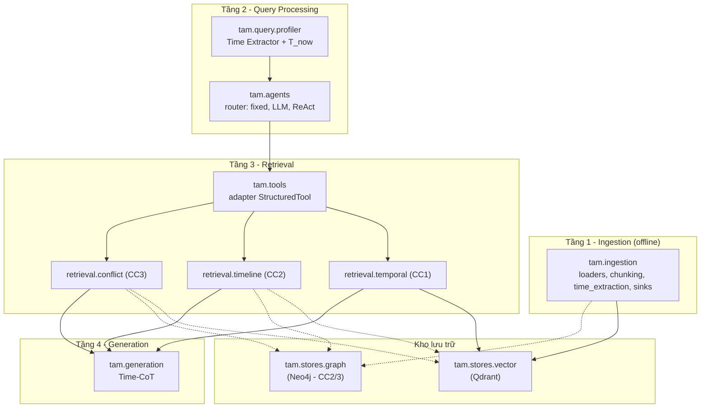

# Kế hoạch tổng quan triển khai (cả 3 cơ chế)

Tài liệu này là bản đồ "sẽ làm gì, theo thứ tự nào, nối với nhau ra sao" cho toàn đồ án. Phạm vi: `docs/scope/01_PROJECT_SCOPE.md`. Thiết kế: `docs/design/`. Kế hoạch chi tiết cho tuần này (Cơ chế 1): [`01_TEMPORAL_RETRIEVAL_IMPLEMENTATION.md`](01_TEMPORAL_RETRIEVAL_IMPLEMENTATION.md).

---

## 1. Mục tiêu

Xây hệ thống RAG **nhận thức thời gian** (Time-Aware Agentic Memory) và chứng minh nó tốt hơn RAG thường (không phân biệt thời gian) trên bộ câu hỏi nhạy cảm thời gian (TimeQA enriched). Phần time-aware (metadata thời gian, lọc cứng, chấm điểm thời gian, đồ thị tiến hóa) là **đóng góp chính**, tự viết, không phụ thuộc framework có sẵn.

## 2. Ba cơ chế

| | Cơ chế 1 — Temporal Retrieval | Cơ chế 2 — Timeline Summarization | Cơ chế 3 — Conflict Resolution |
|---|---|---|---|
| Câu hỏi mẫu | "Năm 2020 luật xây dựng quy định gì?" | "Tóm tắt sự nghiệp ông A từ 2005 đến nay" | "Báo A nói bị bắt, báo B nói chỉ bị triệu tập, cái nào đúng?" |
| Kho dùng | **VectorDB** (không cần Graph) | VectorDB tìm node vào → **GraphDB** đi dọc thời gian (Boomerang) | VectorDB (credibility) + **GraphDB** (cạnh Evolution) |
| Kỹ thuật lõi | Hybrid dense+BM25 (RRF) → hard filter → `W1·Sem + W2·Temp` (half-life decay) | Time-traversal ra triplets (<1K token); `Chunk_ID` quay về VectorDB lấy text khi cần | `Final = W1·Sem + W2·Decay + W3·Cred`; cạnh `SUPERSEDES`/`CORRECTS`/`BÁC_BỎ`; `invalidated_at` |
| Dataset | TimeQA enriched (có sẵn) | TimeQA (câu nhiều mốc) | Cần dữ liệu đa nguồn (StreamingQA, ChronoQA…) hoặc tự tạo |
| Trạng thái | **Tuần 3 (đang làm)** | Dự kiến | Dự kiến; scope cho phép chỉ đi sâu 2/3 |

### Bất biến phải giữ xuyên suốt

- **Evolution ≠ Falsehood.** Trạng thái từng đúng rồi đổi → đóng `end_time` (vẫn trả về khi hỏi quá khứ). Sai từ gốc → `invalidated_at` (CC1 lọc cứng; câu trả lời lịch sử phải cảnh báo). Cáo buộc trích thành `(Authority)-[SUSPECTS]->(A)`, không phải sự thật.
- **Timeline ≠ Conflict.** Thăng tiến sự nghiệp nối bằng cạnh next-event, **không** đóng `end_time` sự kiện trước; chỉ đính chính/thay thế mới đóng.
- **Không rò rỉ tương lai:** `start_time <= T_req`. TH1 (`T_req ∈ [start, end]`, `end = NULL` là còn hiệu lực) → `Temporal = 1.0`; TH2 (lùi về quá khứ gần nhất) → `exp(-λ·Δyears)`.
- **Thời gian tương đối** quy đổi bằng cách tiêm `T_now` (đồng hồ server) vào system prompt.
- **Structural chunking + content hashing** lúc ingestion; hash trùng là no-op.
- **Payload index đúng 4 trường:** `start_time`, `invalidated_at`, `domain_features.domain`, `domain_features.country`.
- Tài liệu không có mốc thời gian (kể cả fallback ngày đăng) thì không vào kho time-aware.

## 3. Kiến trúc hệ thống ↔ kiến trúc code

Hệ thống có 4 tầng (design 01). Mỗi tầng map vào một nhóm package trong `src/tam/`.

> **`tam`** = **T**ime-**A**ware **M**emory, viết tắt từ tên đề tài *Time-Aware Agentic Memory* (bỏ "Agentic" cho gọn).



Nét liền = làm tuần này. Nét đứt, `R2`, `R3`, `GS` = làm sau, **nhưng chỗ đặt đã có sẵn** nên thêm vào không phải dời code cũ.

### Quy tắc phụ thuộc

```
schemas  <-  stores, retrieval  <-  tools  <-  agents, pipeline  <-  scripts
```

- `retrieval/*` là logic thuần Python, **không** import langchain/langgraph: dễ test, dễ giải thích khi bảo vệ.
- `tools/` là lớp mỏng bọc Retriever thành tool cho LLM.
- `agents/` là nơi duy nhất quyết định "dùng cơ chế nào": đổi từ cố định sang LLM sang agent chỉ sửa ở đây.

Layout đầy đủ từng thư mục: mục 3 của file 01.

## 4. Orchestration: từ pipeline cố định đến Agent

Thiết kế 01 có Routing Agent và Ingestion Agent, nên nâng lên agent là đúng hướng. Làm 3 nấc, mỗi nấc chỉ thay lớp `agents/` và đăng ký thêm tool:

| Nấc | Khi nào | Orchestration | Quyết định cơ chế |
|---|---|---|---|
| A | Tuần 3 (CC1) | LangGraph `StateGraph` cố định `profile → route → retrieve → generate` | `route` trả hằng `temporal` |
| B | Có CC2 | Cùng graph, `route` thành **conditional edge** | LLM phân loại có cấu trúc: `temporal / timeline / conflict` |
| C | Có CC3, hoặc cần "Luồng Tích hợp" CC2+CC3 | Node `agent` = LLM tool-calling (ReAct) gọi lặp các tool | LLM tự chọn và kết hợp tool |

Vì sao chưa làm agent ngay: pipeline cố định cho kết quả **tái lập được** (cần để so EM/F1 với baseline), rẻ token, dễ debug. Agent chỉ đáng giá khi có ≥2 cơ chế để chọn. Cách nối cụ thể: mục 7 của file 01.

## 5. Lộ trình theo tuần (dự kiến, điều chỉnh theo tiến độ)

| Tuần | Nội dung | Kiểm chứng được |
|---|---|---|
| 1–2 | Nghiên cứu, scope, thiết kế 01–02, chốt dataset | Tài liệu `docs/` |
| **3** | **CC1:** khung `src/`, Qdrant + schema, scoring/fusion/filter, Time Extractor, ingestion TimeQA bộ local, generation, baseline plain RAG, eval bộ local | Hỏi "luật 2020" ra bản 2018 (TH2); EM/F1 CC1 vs baseline trên bộ local |
| 4 | Tinh chỉnh CC1 (λ, W1/W2, top-N/K), eval bộ thật 300 câu + per-time-slice; dựng `GraphStore` + `GraphSink` | Bảng kết quả CC1; Neo4j chạy được |
| 5 | **CC2:** triplets + cạnh next-event, `retrieval/timeline`, Boomerang, `timeline_tool`; router lên nấc B | Timeline <1K token; coverage |
| 6 | **CC3** (hoặc đào sâu CC2 nếu chọn 2/3): credibility, cạnh Evolution, retro-update `end_time`/`invalidated_at` | Test Evolution vs Falsehood |
| 7 | Nấc C (ReAct) nếu cần Luồng Tích hợp; eval toàn bộ | Bảng so sánh tổng |
| 8+ | Ablation, viết luận văn, dọn code | — |

Quyết định "2 trong 3" chốt sau tuần 4, dựa trên kết quả CC1 và chất lượng dữ liệu cho CC3.

## 6. Đánh giá

So hệ time-aware với **plain RAG** (`tam.baselines.plain_rag`, cùng embedding và LLM, không filter, không temporal score):

- **EM / F1** theo đáp án chuẩn đúng khung thời gian được hỏi.
- **Accuracy theo time slice**: phát hiện hệ thiên lệch về "mới nhất" hay "cũ nhất".
- **Temporal Freshness**: phục hồi sau khi có thông tin cập nhật (CC3).
- **Coverage** (CC2) và **Token efficiency**: context RAG đầy đủ vs triplets <1K token.

Dữ liệu: bộ local 25 câu chỉ để kiểm tra chạy được (không so điểm); bộ thật 300 câu từ `D/test`, seed cố định (xem `dataset/full_dataset/EVAL_PLAN.md`).

## 7. Rủi ro và quyết định còn mở

| Vấn đề | Hướng xử lý |
|---|---|
| Stack chưa chốt (VectorDB/GraphDB) | Mặc định Qdrant + Neo4j; truy cập qua ABC nên đổi chỉ sửa 1 file store |
| Chi phí LLM khi ingestion (trích `start_time` mỗi chunk) | Chạy bộ local trước; cache kết quả trích xuất vào `data/processed/` |
| Mốc thời gian chỉ-năm, trước 1970 trong TimeQA | Chuẩn hóa `YYYY-01-01`, dùng kiểu datetime hỗ trợ giá trị âm |
| Dữ liệu đa nguồn cho CC3 hiếm | Chốt 2/3 sau tuần 4; có thể tự tạo bộ từ lịch sử chỉnh sửa Wikipedia |
| Hiệu quả decay phụ thuộc λ, W1/W2 | Quét tham số trên bộ local, kiểm chứng trên bộ thật |
