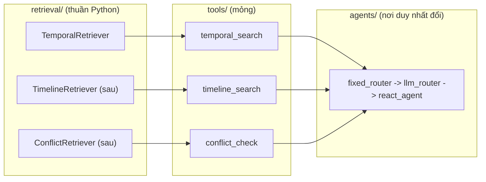
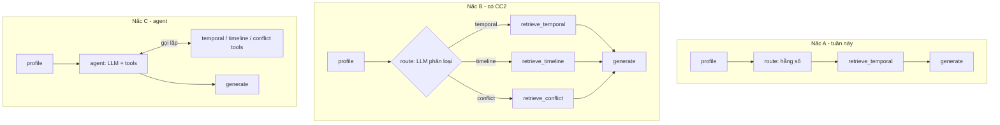

# Kế hoạch code Cơ chế 1: Temporal Retrieval (tuần 3)

Thiết kế thuật toán: [`../design/02_TEMPORAL_RETRIEVAL_DESIGN.md`](../design/02_TEMPORAL_RETRIEVAL_DESIGN.md). Tổng quan 3 cơ chế: [`00_OVERALL_PLAN.md`](00_OVERALL_PLAN.md). File này chỉ nói **code thế nào**.

> Package Python tên **`tam`** = **T**ime-**A**ware **M**emory (viết tắt từ *Time-Aware Agentic Memory*, bỏ "Agentic" cho gọn).

---

## 1. Phạm vi tuần này

Làm: ingestion TimeQA → Qdrant (hybrid dense + BM25) → Time Extractor → hard filter → Temporal_Score (TH1/TH2) → RRF + min-max → re-rank → sinh đáp án → baseline plain RAG → eval EM/F1.

Chưa làm: GraphDB, Cơ chế 2/3, LLM router, ReAct agent. Nhưng **chỗ đặt cho chúng đã có** (mục 7).

## 2. Có code AI agent không?

Tuần này: **dùng LLM, chưa dùng agent tự trị**. Chỉ có 2 lệnh gọi LLM trong luồng online (Time Extractor, sinh đáp án) và 1 lệnh gọi lúc ingestion (trích `start_time`). Phần retrieval là code tất định.

Lý do: kết quả phải tái lập được để so với baseline, ít token, dễ debug. Nhưng luồng vẫn dựng bằng **LangGraph `StateGraph` cố định** và mỗi cơ chế có sẵn **Tool adapter**, nên nâng lên agent sau này chỉ là thêm file ở `agents/` và sửa `pipeline/builder.py` (mục 7).

## 3. Cấu trúc thư mục

```
time-aware-agentic-memory/
├── configs/
│   ├── config.dev.yaml       # môi trường dev (model rẻ, bộ dữ liệu local, log DEBUG)
│   └── config.prod.yaml      # môi trường prod/eval (model mạnh, bộ thật, log INFO)
├── .env.example              # mẫu biến bí mật (commit); .env thật nằm trong .gitignore
├── docker-compose.yml        # qdrant; neo4j để sẵn dạng comment
├── requirements.txt          # thư viện chạy
├── requirements-dev.txt      # pytest, ruff
├── pyproject.toml            # tối thiểu, chỉ để `pip install -e .` cho import tam.* (xem ghi chú dưới)
├── src/tam/
│   ├── config/
│   │   ├── loader.py         #   chọn file theo APP_ENV, thay ${VAR} từ .env -> Config (dict, truy cập bằng dấu chấm)
│   │   └── logging.py        #   setup_logging() tạo output/<timestamp>/ + handler; get_logger(); get_run_dir()
│   ├── schemas/
│   │   ├── chunk.py          #   Chunk: chunk_id, text, source, start_time, end_time, invalidated_at, domain_features
│   │   ├── query.py          #   ProfiledQuery: semantic_query, t_req, filters, mechanism
│   │   └── result.py         #   ScoredChunk, RetrievalResult (dùng chung cho cả 3 cơ chế)
│   ├── llm/
│   │   ├── registry.py       #   LLM_PROVIDERS = {}; decorator @register_llm("openai")
│   │   ├── factory.py        #   get_llm(cfg, name) / get_llm_for_role(cfg, role): tra profile -> provider -> chat model
│   │   ├── providers/        #   openai.py, anthropic.py, ollama.py...: mỗi file một hàm build(profile)
│   │   └── prompts/          #   time_extractor.md, ingestion_time.md, time_cot.md
│   ├── embedding/            #   base (ABC), registry, factory, providers/; profiles dense/sparse; đổi độc lập với LLM
│   ├── stores/
│   │   ├── vector/           #   base.py (ABC VectorStore), qdrant_store.py
│   │   └── graph/            #   (trống; Neo4j ở CC2/3, cùng kiểu ABC)
│   ├── ingestion/
│   │   ├── loaders/          #   timeqa.py, json_laws.py (fixture 3 bộ luật)
│   │   ├── chunking.py       #   structural chunking + content hash
│   │   ├── time_extraction.py#   LLM trích start_time/end_time, chuẩn hóa chỉ-năm -> YYYY-01-01
│   │   └── pipeline.py       #   chạy chuỗi "sink" (hiện chỉ VectorSink; sau thêm GraphSink)
│   ├── query/
│   │   └── profiler.py       #   Time Extractor: câu hỏi + T_now + llm -> ProfiledQuery
│   ├── retrieval/
│   │   ├── base.py           #   ABC Retriever (hợp đồng chung)
│   │   ├── temporal/         #   filters.py, scoring.py, fusion.py, retriever.py   <- CC1
│   │   ├── timeline/         #   (sau) CC2
│   │   └── conflict/         #   (sau) CC3
│   ├── tools/
│   │   └── temporal_tool.py  #   bọc TemporalRetriever thành StructuredTool (sau: timeline_tool, conflict_tool)
│   ├── agents/
│   │   └── fixed_router.py   #   tuần này trả "temporal"; sau: llm_router.py, react_agent.py
│   ├── generation/
│   │   └── time_cot.py       #   prompt Time-CoT + gọi LLM
│   ├── pipeline/
│   │   ├── state.py          #   AgentState (TypedDict)
│   │   ├── nodes.py          #   profile / route / retrieve / generate
│   │   └── builder.py        #   build_graph(cfg): nơi duy nhất lắp ráp LLM, store, retriever
│   ├── baselines/
│   │   └── plain_rag.py      #   PlainRagRetriever: dense-only, không filter, không temporal score
│   └── evaluation/
│       ├── timeqa_loader.py  #   bộ local 25 câu / bộ thật 300 câu (seed cố định, theo EVAL_PLAN)
│       ├── metrics.py        #   EM, F1, accuracy theo time slice
│       └── runner.py         #   chạy hệ thống + baseline trên cùng bộ câu
├── scripts/                  # ingest.py, ask.py, evaluate.py: mỏng, chỉ gọi vào tam.*
├── tests/
│   ├── fixtures/temporal_corpus.json   # nhiều chủ đề (luật, chức vụ, thể thao, chính trị) + các case mong đợi
│   └── test_scoring.py, test_filters.py, test_fusion.py, test_temporal_retriever.py, test_profiler.py, test_config.py
├── output/                   # tự tạo, gitignore: mỗi lần chạy một thư mục theo timestamp (log + kết quả)
└── data/                     # gitignore: qdrant_storage/, processed/
```

**Ghi chú về `pyproject.toml`:** không phải để tái sử dụng package ở dự án khác. Dự án này dùng layout `src/`, nên Python không tự thấy `tam`. Chạy một lần `pip install -e .` (editable, không đẩy lên PyPI) để `scripts/`, `tests/`, notebook cùng import được `from tam...`. Nội dung chỉ gồm tên package, dependency, cấu hình `pytest`/`ruff`. Phương án thay thế: bỏ file này, đặt `pythonpath = ["src"]` trong cấu hình pytest và chạy script với `PYTHONPATH=src`.

### Vai trò từng lớp

- `schemas`: **hình dạng dữ liệu** (lớp thụ động, không logic, không phụ thuộc ai). `ProfiledQuery` nằm ở đây vì `profiler` ghi nó, `retriever` đọc nó.
- `query/profiler.py`: **hành vi**: nhận câu hỏi + `T_now` + LLM, tạo ra một `ProfiledQuery`.
- `stores`: nói chuyện với DB; chỉ `qdrant_store.py` biết cú pháp Qdrant.
- `retrieval`: thuật toán time-aware, **không import langchain/langgraph**.
- `retrieval/base.py`: hợp đồng chung, gần như không có logic:

  ```python
  class Retriever(ABC):
      mechanism: str  # "temporal" | "timeline" | "conflict"
      def retrieve(self, query: ProfiledQuery) -> RetrievalResult: ...
  ```

  `tools/`, `pipeline/`, `evaluation/` phụ thuộc vào hợp đồng này, không phụ thuộc `TemporalRetriever`.
- `tools`: bọc Retriever thành tool cho LLM.
- `agents`: quyết định dùng cơ chế nào.
- `pipeline`: **hệ thống đề xuất**, nối các bước bằng LangGraph.
- `baselines`: **hệ thống đối chứng** (plain RAG), chỉ phục vụ đánh giá. `PlainRagRetriever` cũng cài đặt `Retriever` để `runner.py` chạy hai hệ thống qua cùng giao diện; hai bên dùng chung embedding, LLM sinh đáp án và `top_k` cho công bằng.
- `scripts`: điểm vào dòng lệnh.

### Bất biến phải thể hiện trong code

- `qdrant_store.py` chỉ tạo **đúng 4 payload index**: `start_time`, `invalidated_at`, `domain_features.domain`, `domain_features.country`. `end_time` không index; kiểm tra trong `scoring.py`.
- Hard filter: `invalidated_at IS NULL` và `start_time <= T_req` (đặt trong `filters.py`, áp trong từng nhánh dense và BM25).
- `scoring.py`: `end_time is None or end_time >= t_req` → 1.0 (TH1); ngược lại `exp(-λ·Δyears)` với `Δyears = (t_req - start_time)/365.25 ngày` (TH2).
- `fusion.py`: RRF (`k = 60`) rồi min-max về [0,1] trên Top-N; trường hợp mọi điểm bằng nhau trả 1.0.
- `profiler.py`: luôn tiêm `T_now` vào system prompt; nhận `T_now` qua tham số để test bằng đồng hồ giả.
- `Chunk.chunk_id` giữ ngay từ giờ: đó là con trỏ Boomerang cho GraphDB sau này.
- Tài liệu/chunk không trích được mốc thời gian thì **bỏ qua**, không nạp vào store.
- Lưu ý dữ liệu: TimeQA có mốc chỉ-năm ("1985") và trước 1970 → chuẩn hóa `YYYY-01-01`, dùng kiểu datetime hỗ trợ giá trị âm (hoặc epoch âm).

## 4. Cấu hình, LLM, logging, hạ tầng

### 4.1 Cấu hình theo môi trường

Biến `APP_ENV` (`dev` hoặc `prod`, mặc định `dev`) quyết định file nào được nạp: `configs/config.{APP_ENV}.yaml`. Thư mục có thể ghi đè bằng `TAM_CONFIG_DIR`.

Luồng nạp trong `config/loader.py`:

1. Nạp `.env` bằng `python-dotenv`.
2. Đọc `APP_ENV`, mở file yaml tương ứng.
3. **Thay thế mọi `${VAR}` bằng biến môi trường** (hỗ trợ `${VAR:-giá_trị_mặc_định}`). Thiếu biến bắt buộc thì báo lỗi nêu rõ tên biến và tên khóa yaml, không để chuỗi `${...}` lọt vào hệ thống.
4. Trả về `Config`: bọc dict lồng nhau, đọc bằng `cfg.retrieval.top_k` hoặc `cfg["retrieval"]["top_k"]`. **Không có schema cố định** (không `settings.py`): thêm khóa mới chỉ cần sửa yaml. Đánh đổi: gõ sai tên khóa chỉ lộ ra khi code đọc đến khóa đó, lúc đó báo `Thiếu khóa cấu hình 'retrieval.top_kk'` kèm danh sách khóa hiện có. Chuỗi chỉ gồm `${VAR:-}` mà rỗng sẽ thành `None`.

Chạy thử loader: `python src/tam/config/loader.py [dev|prod]` (chạy thẳng, kể cả từ IDE) hoặc `PYTHONPATH=src python -m tam.config.loader [dev|prod]`; in ra cấu hình đã nạp, khóa bí mật bị che.

Quy ước: **bí mật và địa chỉ phụ thuộc máy** (API key, mật khẩu, URL) viết dạng `${VAR}` trong yaml, giá trị thật nằm ở `.env` nên không lộ trong file được commit. Tên provider, `model_id`, trọng số, λ… ghi thẳng trong yaml vì không phải bí mật. Khóa có tên chứa `key`, `secret`, `token`, `password` bị che khi in và khi ghi `config.resolved.yaml`.

Ví dụ `configs/config.dev.yaml` (cùng phong cách với file mẫu trong `local/src/config.dev.yml`: khối `app`, các mục ngăn cách bằng comment, chuỗi đặt trong dấu nháy):

```yaml
app:
  name: "Time-Aware Agentic Memory"
  env: "dev"                      # loader kiểm tra khớp với APP_ENV, lệch thì cảnh báo
  version: "0.1.0"

# ================================================================
# LLM - profiles: tên dễ nhớ -> provider + model_id
# api_key để dạng ${VAR:-}: thiếu thì để trống, lỗi chỉ báo khi profile đó thực sự được dùng
# ================================================================
llm:
  profiles:
    claude_haiku:
      provider: "anthropic"
      model_id: "claude-haiku-5-5"
      api_key: "${ANTHROPIC_API_KEY:-}"
      temperature: 0
    claude_sonnet:
      provider: "anthropic"
      model_id: "claude-sonnet-5-5"
      api_key: "${ANTHROPIC_API_KEY:-}"
      temperature: 0
    gpt_mini:
      provider: "openai"
      model_id: "<điền model id>"
      api_key: "${OPENAI_API_KEY:-}"
      temperature: 0
    local_llama:
      provider: "ollama"
      model_id: "<điền model id>"
      base_url: "${OLLAMA_URL:-http://localhost:11434}"
  # mỗi chỗ gọi LLM trỏ tới một tên profile ở trên
  roles:
    time_extractor: "claude_haiku"
    ingestion_time: "claude_haiku"
    router: "claude_haiku"
    generation: "claude_sonnet"
    judge: "claude_sonnet"

# ================================================================
# Embedding
# ================================================================
embedding:
  profiles:                              # tên -> provider + model_id, chia theo loại
    dense:
      bge_small_en:
        provider: "fastembed"
        model_id: "BAAI/bge-small-en-v1.5"
    sparse:
      bm25:
        provider: "fastembed"
        model_id: "Qdrant/bm25"
  dense: "bge_small_en"                  # chọn profile; đổi dense thì phải tạo lại collection
  sparse: "bm25"

# ================================================================
# Qdrant
# ================================================================
vector_store:
  url: "${QDRANT_URL:-http://localhost:6333}"
  api_key: "${QDRANT_API_KEY:-}"
  collection: "tam_chunks_dev"

# ================================================================
# Retrieval (Cơ chế 1)
# ================================================================
retrieval:
  w1: 0.7
  w2: 0.3
  decay_lambda: 0.5
  rrf_k: 60
  top_n: 50
  top_k: 5

# ================================================================
# Evaluation
# ================================================================
evaluation:
  subset: "local"                 # prod: "real"

# ================================================================
# Logging (xem mục 4.3)
# ================================================================
logging:
  level: "DEBUG"
  format: "text"                  # prod: "json"
  log_dir: "output"               # thư mục gốc chứa các thư mục theo lần chạy
  file_name: "run.log"
  module_levels:                  # hạ mức log của thư viện ồn
    httpx: "WARNING"
    qdrant_client: "WARNING"
```

`config.prod.yaml` cùng cấu trúc, đổi: tên collection, `evaluation.subset`, mức log, định dạng log, và có thể cho `roles` dùng profile mạnh hơn.

Thay đổi LLM của một chỗ = sửa một dòng trong `roles`. Thêm một profile mới = thêm một khối dưới `profiles`.

### 4.2 LLM: factory theo vai trò

Tách **provider** khỏi **vai trò**: `roles` trỏ tới `profiles`, `profiles` ghi rõ provider và `model_id`.

```
get_llm("claude_haiku")           -> chat model theo profile (gọi nhanh theo tên)
get_llm_for_role("generation")    -> tra roles -> profile -> chat model
```

Nội bộ: `factory` tra profile, lấy `provider`, tìm trong `LLM_PROVIDERS` (registry) rồi gọi hàm `build(profile)` của provider đó. **Thêm provider mới = thêm một file trong `llm/providers/` có hàm `build` dán `@register_llm("tên")`, và một dòng import trong `providers/__init__.py`**, không sửa `factory.py`. `embedding/` làm cùng kiểu (đăng ký class thay vì hàm). Đã cài: [`../process/02_CORE_COMPONENTS.md`](../process/02_CORE_COMPONENTS.md).

Hai nguyên tắc để dùng nhiều LLM gọn:

- **Tiêm phụ thuộc:** `profiler`, `generation`, `time_extraction` nhận LLM qua tham số hoặc constructor, không tự gọi factory bên trong. Nơi duy nhất gọi `get_llm_for_role` là chỗ lắp ráp (`pipeline/builder.py`, `scripts/*`). Khi test chỉ truyền LLM giả.
- Kiểu trả về là chat model của `langchain-core`, nên `with_structured_output` và `bind_tools` dùng được bất kể provider.

`embedding/` làm tương tự, vì embedding có thể đổi độc lập với LLM.

### 4.3 Logging và thư mục output

`config/logging.py` là **nơi duy nhất khởi tạo log**. Các module khác không cấu hình gì, chỉ lấy logger:

```python
from tam.config.logging import get_logger

logger = get_logger(__name__)
```

`get_logger` bọc `logging.getLogger`, nên module nào cũng gọi được kể cả khi chưa khởi tạo (ví dụ khi chạy `pytest`, lúc đó không tạo thư mục output nào).

> Tên `logging.py` trong package `config` không đè thư viện chuẩn vì Python 3 dùng import tuyệt đối. Chỉ cần không chạy trực tiếp `logging.py` và không thêm thư mục `config/` vào `PYTHONPATH`. Riêng `loader.py` có khối `if __name__ == "__main__"` tự gỡ thư mục `config/` khỏi `sys.path`, nên chạy thẳng file đó vẫn an toàn.

**`setup_logging(cfg)`** (`cfg` là toàn bộ `Config`, hàm tự đọc nhóm `logging`) được gọi **một lần** ở điểm vào (`scripts/*.py`), ngay sau khi nạp config. Nó:

1. Tạo `output/` ở gốc project nếu chưa có (gốc = thư mục chứa `configs/`; đổi bằng `TAM_OUTPUT_DIR`).
2. Tạo thư mục của lần chạy: `output/<YYYYMMDD_HHMMSS>/` theo giờ bắt đầu. Hai lần chạy trùng giây thì thêm hậu tố `_2`.
3. Gắn handler: console và file `output/<timestamp>/run.log` (định dạng `text` hoặc `json` theo config).
4. Cung cấp `get_run_dir() -> Path` để module khác ghi sản phẩm của lần chạy vào **cùng thư mục** (ví dụ `evaluation/runner.py`).

```
output/
└── 20261009_153012/
    ├── run.log                 # toàn bộ log của lần chạy
    ├── config.resolved.yaml    # config đã nạp, đã che bí mật (để tái lập)
    ├── metrics.json            # (evaluate) EM/F1, theo time slice
    └── predictions.jsonl       # (evaluate) từng câu hỏi, đáp án, chunk được chọn
```

Vì mỗi lần chạy có thư mục riêng nên không cần xoay vòng file log. Thêm `output/` và `data/` vào `.gitignore` khi dựng khung.

**Nên log:**
- `profiler`: `T_now`, `T_req`, `Metadata_Filters` rút ra được.
- Retrieval: số ứng viên trước và sau từng hard filter; số chunk TH1 và TH2; điểm Semantic, Temporal, Final của top-K (mức DEBUG).
- Mỗi lệnh gọi LLM: tên role, tên profile, `model_id`, độ trễ, số token (bọc ở lớp factory hoặc callback, không rải khắp nơi).
- Ingestion: số chunk nạp, số chunk bỏ vì không có mốc thời gian, số chunk bỏ vì hash trùng.

**Mã truy vấn (`query_id`)** được gắn vào mọi dòng log của một câu hỏi (qua `contextvars`), để lọc được toàn bộ hành trình của một câu khi phân tích lỗi eval.

**Không log:** API key, nội dung `.env`. Văn bản chunk dài chỉ log ở DEBUG và cắt ngắn. Không nuốt ngoại lệ im lặng: bắt thì phải `logger.exception(...)` hoặc ném lại. Không dùng `print`.

### 4.4 `.env.example` và hạ tầng

`.env.example` chỉ chứa **bí mật và địa chỉ phụ thuộc máy** (copy thành `.env`, không commit `.env`):

```
APP_ENV=dev
ANTHROPIC_API_KEY=
OPENAI_API_KEY=
QDRANT_URL=http://localhost:6333
QDRANT_API_KEY=
# OLLAMA_URL=http://localhost:11434
# NEO4J_URI=bolt://localhost:7687   (CC2/3)
# NEO4J_USER=neo4j
# NEO4J_PASSWORD=
```

**`docker-compose.yml`**: service `qdrant` (cổng 6333/6334, volume `./data/qdrant_storage`); service `neo4j` để comment sẵn.

**`requirements.txt`** (ghim phiên bản lúc cài): `qdrant-client`, `fastembed` (dense + BM25 sparse), `langgraph`, `langchain-core`, các gói provider cần dùng (`langchain-anthropic`, `langchain-openai`, `langchain-ollama`), `pydantic` (cho `schemas/`), `pyyaml`, `python-dotenv`, `python-dateutil`, `tqdm`. Dev: `pytest`, `ruff`. Python hiện tại: 3.10.

Chọn Qdrant vì design 02 đã dùng cú pháp Qdrant, hỗ trợ dense + sparse trong một collection, payload index và fusion RRF.

## 5. Lộ trình tuần này (map với To-Do mục 4 của design 02)

| Bước | Việc | To-Do design 02 |
|---|---|---|
| 1 | Khung thư mục, `pyproject`, `config` + `configs/config.*.yaml`, `config/logging.py`, `schemas`, docker-compose, `qdrant_store` (schema + 4 index) | #1 |
| 2 | `scoring`, `fusion`, `filters` + unit test với fixture 3 bộ luật 2015/2018/2021 (hỏi 2020 phải ra 2018). **Làm trước, chưa cần LLM** | #3, #4, #5 |
| 3 | `llm/` (registry, factory, 1–2 provider) + `profiler` + prompt tiêm `T_now`, test bằng đồng hồ giả ("tuần trước", "năm ngoái", "hiện tại") | #2 |
| 4 | Ingestion TimeQA bộ local (21 trang) → hybrid search end-to-end → `time_cot` → LangGraph | — |
| 5 | `plain_rag` baseline + `runner` + `metrics`; chạy bộ local; nếu kịp, bộ thật 300 câu | — |

## 6. Kiểm chứng và chiến lược test

### 6.1 Chạy thử nhanh

- `docker compose up -d qdrant`
- `pytest tests/` xanh.
- `python scripts/ingest.py --subset local` nạp 21 trang, in số chunk nạp / bỏ (không có mốc thời gian) / bỏ (hash trùng).
- `python scripts/ask.py "Luật năm 2020 quy định gì?"` trả bản 2018 (TH2), không trả bản 2021 (chặn tương lai).
- `python scripts/evaluate.py --subset local` in EM/F1 của hệ time-aware và baseline; log và kết quả nằm trong `output/<timestamp>/`.

### 6.2 Test bằng cách gọi thẳng hàm, không cần chạy agent hay đồ thị

| Tầng | Cách test | Cần graph? | Cần LLM thật? |
|---|---|---|---|
| `scoring`, `filters`, `fusion` | Gọi hàm với fixture | Không | Không |
| `TemporalRetriever` | `retriever.retrieve(ProfiledQuery(t_req=...))` với `t_req` viết sẵn, trên Qdrant thật hoặc store giả | Không | Không |
| `profiler` | Gọi với `T_now` giả; LLM giả cho logic, LLM thật cho vài ca | Không | Chỉ vài ca |
| `generation` | Gọi với context cố định | Không | Giả hoặc thật |
| `config` | Nạp yaml mẫu với biến môi trường giả; thiếu biến phải báo lỗi rõ | Không | Không |
| Cả đồ thị | `graph.invoke(...)` với LLM giả, 1–2 test | Có | Giả |

Vì `ProfiledQuery` đã chứa `t_req` tuyệt đối, test retriever **bỏ qua hẳn LLM và agent**, nên kiểm chứng "hỏi 2020 ra luật 2018" là tất định.

### 6.3 Hai chế độ khi đánh giá

- **Oracle `t_req`:** lấy `t_req` từ nhãn dataset (`time_start`, `time_end`), bỏ qua `profiler`. Đo riêng chất lượng retrieval.
- **End-to-end:** `profiler` → retriever → generation. Đo cả hệ thống.

So hai chế độ cho biết lỗi nằm ở `profiler` hay ở retrieval.

Điều kiện để làm được: `retrieval/` và `query/profiler.py` là hàm thuần nhận tham số rõ ràng (`t_now`, LLM, store), không tự đọc đồng hồ hay biến môi trường bên trong.

## 7. Nâng lên Agent: code vào đâu, nối như nào

### 7.1 Nguyên tắc: mỗi cơ chế = Retriever thuần + Tool adapter



Cả 3 Retriever cùng chữ ký `retrieve(ProfiledQuery) -> RetrievalResult`, nên `generation` và `pipeline` không biết đang dùng cơ chế nào.

### 7.2 Ví dụ Tool adapter (viết ở `tools/temporal_tool.py`, khi code)

```python
from langchain_core.tools import StructuredTool
from pydantic import BaseModel, Field

class TemporalArgs(BaseModel):
    semantic_query: str = Field(description="Nội dung cần tìm")
    t_req: str = Field(description="Mốc thời gian tuyệt đối ISO, vd 2020-01-01")

def make_temporal_tool(retriever) -> StructuredTool:
    def run(semantic_query: str, t_req: str):
        return retriever.retrieve(ProfiledQuery(semantic_query=semantic_query, t_req=t_req))
    return StructuredTool.from_function(
        run, name="temporal_search", args_schema=TemporalArgs,
        description="Tìm thông tin đúng tại MỘT mốc thời gian cụ thể (luật năm X, chức vụ vào tháng Y, hiện tại).",
    )
```

`description` là thứ LLM đọc để chọn tool. Viết từ ranh giới trong scope doc §2: tool timeline mô tả "quá trình/diễn biến nhiều mốc", tool conflict mô tả "hai thông tin mâu thuẫn, cần biết cái nào là sự thật".

### 7.3 Ba nấc của `agents/` (cùng một chữ ký `route(state) -> mechanism`)

| Nấc | File | Thay đổi so với nấc trước |
|---|---|---|
| A (tuần này) | `agents/fixed_router.py` | `return "temporal"` |
| B (có CC2) | `agents/llm_router.py` | LLM structured output ra `temporal / timeline / conflict` (dùng role `router` trong config). Trong `pipeline/builder.py` đổi cạnh cố định `route -> retrieve_temporal` thành `add_conditional_edges("route", route_fn, {"temporal": "retrieve_temporal", "timeline": "retrieve_timeline", ...})` |
| C (có CC3 / Luồng Tích hợp) | `agents/react_agent.py` | Thay cụm `route + retrieve_*` bằng một node `agent`: LLM tool-calling với danh sách `[temporal_tool, timeline_tool, conflict_tool]`, lặp tới khi đủ bằng chứng (vd tìm timeline, gặp mâu thuẫn thì gọi `conflict_check`). Có thể dùng agent dựng sẵn của LangGraph. Thêm role `agent` trong config |



### 7.4 Checklist "thêm Cơ chế 2" (ví dụ)

**Thêm mới** (không sửa file cũ):

1. `stores/graph/base.py` + `neo4j_store.py` (ABC `GraphStore`).
2. `ingestion/`: thêm `GraphSink` vào chuỗi sink trong `pipeline.py` (ghi triplet + `pointer_chunk_id`).
3. `retrieval/timeline/retriever.py` (VectorDB tìm node vào → graph traversal → triplets → Boomerang qua `chunk_id`).
4. `tools/timeline_tool.py`.
5. `agents/llm_router.py`, rồi đổi cạnh trong `pipeline/builder.py` và thêm node `retrieve_timeline` ở `nodes.py`.
6. `tests/` cho timeline; bỏ comment Neo4j trong `docker-compose.yml`; thêm khối `graph_store` vào `configs/*.yaml` và biến `NEO4J_*` vào `.env`.

**Không đụng:** `retrieval/temporal/*`, `schemas/*` (`RetrievalResult` đã chung), `generation/*`, `stores/vector/*`, `llm/*`, `evaluation/*` (chỉ thêm tập câu hỏi).

Nếu `RetrievalResult` cần chứa triplets thay vì chunk, thêm trường tùy chọn `triplets` (không đổi trường cũ).

### 7.5 Ingestion Agent

Thiết kế 01 cũng có Ingestion Agent (trích triplet, phát hiện cạnh `SUPERSEDES`). Tuần này `ingestion/time_extraction.py` mới chỉ là một lệnh gọi LLM structured output. Khi cần CC3, nâng thành agent trong `ingestion/` (thêm `ingestion/agent.py` gọi lại `time_extraction` và `stores`), không ảnh hưởng luồng online.
