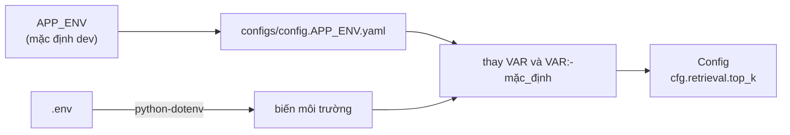

# Nhật ký triển khai 01: Khởi tạo nền tảng (cấu hình, biến môi trường, logging)

Bước đầu tiên của tuần 3: dựng phần nền mà mọi cơ chế sau này đều dùng. **Chưa có logic time-aware nào** (retrieval, ingestion, LLM). Kế hoạch tổng thể và cấu trúc đích: [`../planning/00_OVERALL_PLAN.md`](../planning/00_OVERALL_PLAN.md), [`../planning/01_TEMPORAL_RETRIEVAL_IMPLEMENTATION.md`](../planning/01_TEMPORAL_RETRIEVAL_IMPLEMENTATION.md).

---

## 1. Đã làm được

| Hạng mục | File | Trạng thái |
|---|---|---|
| Cấu hình theo môi trường | `configs/config.dev.yaml`, `configs/config.prod.yaml` | Xong |
| Nạp cấu hình | `src/tam/config/loader.py` | Xong, có khối chạy thử |
| Logging + thư mục output theo lần chạy | `src/tam/config/logging.py` | Xong |
| Bí mật và địa chỉ phụ thuộc máy | `.env` (không commit), `.example.env` (mẫu, có commit) | Xong; các API key trong `.env` bạn tự điền |
| Package gốc | `src/tam/__init__.py` (`tam` = Time-Aware Memory) | Xong |
| Dependency | `requirements.txt` | Mới bật `pydantic`, `pyyaml`, `python-dotenv`; các dòng còn lại đang comment, bật dần khi code tới |
| Hạ tầng | `docker-compose.yml` (Qdrant) | Có sẵn, chưa dùng |
| `.gitignore` | thêm `output/` và `data/` | Xong |

Cấu trúc hiện có:

```
configs/
├── config.dev.yaml
└── config.prod.yaml
src/tam/
├── __init__.py
└── config/
    ├── __init__.py          # rỗng; import trực tiếp từ loader / logging
    ├── loader.py            # load_config(), get_config(), Config, ConfigError, project_root()
    └── logging.py           # setup_logging(), get_logger(), get_run_dir(), query_context()
```

## 2. Cấu hình

### 2.1 Luồng nạp



1. `load_dotenv` đọc `<gốc project>/.env`. Biến đã có sẵn trong môi trường thì **giữ nguyên**, không bị `.env` ghi đè.
2. `APP_ENV` (`dev` hoặc `prod`, mặc định `dev`) chọn file `configs/config.{APP_ENV}.yaml`. Ghi đè thư mục bằng `TAM_CONFIG_DIR`.
3. Mọi chuỗi trong yaml được thay `${VAR}` (bắt buộc: thiếu thì báo lỗi nêu rõ khóa) và `${VAR:-mặc_định}`. Chuỗi chỉ gồm `${VAR:-}` mà rỗng sẽ thành `None`.
4. Kết quả là `Config`: bọc dict lồng nhau, đọc bằng `cfg.retrieval.top_k` hoặc `cfg["retrieval"]["top_k"]`.

Gốc project là thư mục tổ tiên đầu tiên có chứa `configs/` (đổi bằng `TAM_PROJECT_ROOT`).

### 2.2 Nội dung các nhóm trong yaml

| Nhóm | Ý nghĩa |
|---|---|
| `app` | tên, `env`, phiên bản; `env` lệch với `APP_ENV` thì cảnh báo |
| `llm.profiles` | tên dễ nhớ → `provider`, `model_id`, `api_key`, `base_url`, `temperature` (`claude_haiku`, `claude_sonnet`, `gpt_mini`, `local_llama`, `9router`) |
| `llm.roles` | mỗi chỗ gọi LLM trỏ tới một tên profile (`time_extractor`, `ingestion_time`, `router`, `generation`, `judge`) |
| `embedding` | `profiles.dense` / `profiles.sparse` (tên → `provider`, `model_id`) và hai khóa `dense`, `sparse` chọn profile theo tên (xem process 02) |
| `vector_store` | `url`, `api_key`, `collection` |
| `retrieval` | `w1`, `w2`, `decay_lambda`, `rrf_k`, `top_n`, `top_k` |
| `evaluation` | `subset` (`local` hoặc `real`) |
| `logging` | `level`, `format`, `log_dir`, `file_name`, `module_levels` |

Dev và prod khác nhau ở: tên collection (`tam_chunks_dev` / `tam_chunks`), `evaluation.subset` (`local` / `real`), log (`DEBUG`+text / `INFO`+json), và profile của `time_extractor`, `ingestion_time` (Haiku / Sonnet).

### 2.3 Quyết định thiết kế

- **Không có schema cố định** (không `settings.py`, không pydantic cho config). Lý do: mỗi lần thêm khóa phải sửa cả yaml lẫn lớp, gây phiền. Đánh đổi: không kiểm tra kiểu và tên khóa lúc nạp; gõ sai khóa chỉ lộ ra khi code đọc tới, khi đó báo `Thiếu khóa cấu hình 'retrieval.top_kk'` kèm danh sách khóa hiện có.
- **`api_key` viết dạng `${VAR:-}`** (không bắt buộc): chỉ có key của một provider vẫn nạp được. Thiếu key chỉ lỗi khi profile đó thực sự được dùng (sẽ xử lý ở LLM factory).
- **Che bí mật:** khóa có tên chứa `key`, `secret`, `token`, `password` bị che thành `********` trong `repr(cfg)` và trong `config.resolved.yaml`. Riêng khối chạy thử của `loader.py` in nguyên giá trị để kiểm tra (có dòng cảnh báo).
- `model_id` của OpenAI và Ollama đang là `<điền model id>`; embedding dense đặt tạm `BAAI/bge-small-en-v1.5` (dữ liệu TimeQA là tiếng Anh).

### 2.4 Chạy thử

```bash
python src/tam/config/loader.py [dev|prod]               # chạy thẳng file, kể cả từ IDE
PYTHONPATH=src python -m tam.config.loader [dev|prod]    # chạy dạng module
```

In ra cấu hình đã nạp và vài ví dụ truy cập. Tên env không tồn tại thì in lỗi kèm danh sách file hiện có và thoát với mã 1.

> Vì `config/logging.py` trùng tên thư viện chuẩn, chạy thẳng `loader.py` sẽ làm Python đặt thư mục `config/` lên đầu `sys.path`, khiến `import logging` (kể cả trong `yaml`, `dotenv`) nhận nhầm file này. Khối `if __name__ == "__main__"` ở đầu `loader.py` gỡ thư mục đó khỏi `sys.path` trước mọi import. Đừng chạy thẳng `logging.py` và đừng thêm thư mục `config/` vào `PYTHONPATH`.

## 3. Biến môi trường (`.env`)

`.example.env` là mẫu có trong git; `.env` là bản thật, đã bị `.gitignore`. Chỉ để bí mật và địa chỉ phụ thuộc máy:

| Biến | Dùng cho |
|---|---|
| `APP_ENV` | chọn `dev` hay `prod` |
| `ANTHROPIC_API_KEY`, `OPENAI_API_KEY` | key của provider nào dùng thì điền |
| `OLLAMA_URL` | tùy chọn, mặc định `http://localhost:11434` |
| `NINE_ROUTER_API_KEY`, `NINE_ROUTER_URL` | profile `9router` (proxy tương thích OpenAI); URL mặc định `http://localhost:20128/v1` (chưa kiểm chứng). Tên biến không được bắt đầu bằng chữ số nên không đặt `9ROUTER_*` |
| `QDRANT_URL`, `QDRANT_API_KEY` | Qdrant; URL mặc định `http://localhost:6333` |
| `TAM_CONFIG_DIR`, `TAM_OUTPUT_DIR`, `TAM_PROJECT_ROOT` | tùy chọn, đổi chỗ đặt thư mục |

Không dán key thật vào `.example.env` vì file này được đưa vào git.

## 4. Logging và thư mục output

`config/logging.py` là nơi duy nhất cấu hình log. Module khác chỉ lấy logger:

```python
from tam.config.logging import get_logger
logger = get_logger(__name__)
```

`setup_logging(cfg)` được gọi **một lần** ở điểm vào (sau này là `scripts/*.py`), với `cfg` là toàn bộ `Config`. Nó:

1. Tạo `output/` ở gốc project nếu chưa có (đổi bằng `TAM_OUTPUT_DIR` hoặc `logging.log_dir`).
2. Tạo thư mục lần chạy `output/<YYYYMMDD_HHMMSS>/`; trùng giây thì thêm hậu tố `_2`, `_3`.
3. Gắn handler console và file `run.log`; định dạng `text` (dev) hoặc `json` (prod); mức log và mức riêng cho từng thư viện (`module_levels`) lấy từ yaml.
4. Ghi `config.resolved.yaml` (bí mật đã che) để tái lập lần chạy.

Các hàm khác:

| Hàm | Công dụng |
|---|---|
| `get_run_dir()` | trả thư mục output của lần chạy, để module khác ghi kết quả (ví dụ eval) vào cùng chỗ; chưa setup thì báo lỗi rõ |
| `query_context(query_id)` | mọi log trong khối `with` mang `query_id`, lọc được hành trình của một câu hỏi |
| `setup_logging(cfg, force=True)` | tạo thư mục lần chạy mới và thay handler cũ (không nhân đôi log) |

`setup_logging` gọi lần hai (không `force`) trả về cùng thư mục. Chưa gọi `setup_logging` (ví dụ khi chạy test) thì `get_logger` vẫn dùng được và không tạo thư mục nào.

Ví dụ một lần chạy:

```
output/
└── 20261009_143833/
    ├── run.log
    └── config.resolved.yaml
```

## 5. Đã kiểm chứng những gì

Kiểm chứng bằng script tạm chạy ngoài repo, trong venv tạm (chỉ có `pydantic`, `pyyaml`, `python-dotenv`), **chưa có test tự động trong repo**:

- Nạp được dev và prod; đúng giá trị mặc định khi biến thiếu; biến có thật trong môi trường được thay đúng.
- Biến bắt buộc thiếu → `ConfigError` nêu rõ khóa và tên biến. `APP_ENV` lạ → báo lỗi kèm danh sách file.
- Truy cập `cfg.x.y`, `cfg["x"]["y"]`, `cfg.get`, `in`; khóa không có → lỗi nêu đường dẫn; thêm nhóm mới vào yaml là đọc được ngay.
- Key bị che trong `repr` và `config.resolved.yaml`.
- Logging: thư mục theo timestamp được tạo, `run.log` có `query_id`, `logger.exception` ghi traceback, `httpx` bị hạ xuống WARNING, định dạng json parse được, gọi `setup_logging` hai lần không tạo thêm thư mục.
- Chạy `loader.py` bằng cả hai cách (chạy thẳng và `-m`) đều thành công.

**Chưa kiểm chứng:** chạy từ PyCharm; Windows; chạy với Python khác 3.10.

## 6. Việc tiếp theo

Theo kế hoạch ở `docs/planning/01_TEMPORAL_RETRIEVAL_IMPLEMENTATION.md`, mục 5:

1. `schemas/` (`Chunk`, `ProfiledQuery`, `RetrievalResult`, `ScoredChunk`).
2. `stores/vector/` (Protocol + `qdrant_store.py` với đúng 4 payload index).
3. `retrieval/temporal/`: `scoring`, `fusion`, `filters` + unit test với fixture 3 bộ luật. Làm trước khi đụng LLM.
4. `llm/` (registry, factory theo profile và role; đã xong, xem process 02), `query/profiler.py`.
5. ~~Thêm `requirements-dev.txt` và `tests/test_config.py`~~ (đã xong, xem process 02). Còn lại: bật nốt `langgraph`, `python-dateutil`, `tqdm` trong `requirements.txt` khi code tới.
