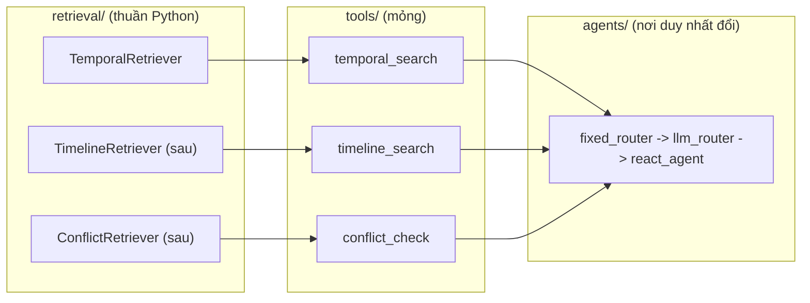
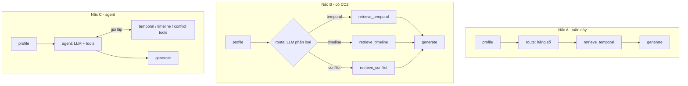

# Kế hoạch code Cơ chế 1: Temporal Retrieval (tuần 3)

Thiết kế thuật toán: [`../design/02_TEMPORAL_RETRIEVAL_DESIGN.md`](../design/02_TEMPORAL_RETRIEVAL_DESIGN.md). Tổng quan 3 cơ chế: [`00_OVERALL_PLAN.md`](00_OVERALL_PLAN.md). File này chỉ nói **code thế nào**.

> Package Python tên **`tam`** = **T**ime-**A**ware **M**emory (viết tắt từ *Time-Aware Agentic Memory*, bỏ "Agentic" cho gọn).

---

## 1. Phạm vi tuần này

Làm: ingestion TimeQA → Qdrant (hybrid dense + BM25) → Time Extractor → hard filter → Temporal_Score (TH1/TH2) → RRF + min-max → re-rank → sinh đáp án → baseline plain RAG → eval EM/F1.

Chưa làm: GraphDB, Cơ chế 2/3, LLM router, ReAct agent. Nhưng **chỗ đặt cho chúng đã có** (mục 7).

## 2. Có code AI agent không?

Tuần này: **dùng LLM, chưa dùng agent tự trị**. Chỉ có 2 lệnh gọi LLM trong luồng online (Time Extractor, sinh đáp án) và 1 lệnh gọi lúc ingestion (trích `start_time`). Phần retrieval là code tất định.

Lý do: kết quả phải tái lập được để so với baseline, ít token, dễ debug. Nhưng luồng vẫn dựng bằng **LangGraph `StateGraph` cố định** và mỗi cơ chế có sẵn **Tool adapter**, nên nâng lên agent sau này chỉ là thay lớp `agents/` (mục 7).

## 3. Cấu trúc thư mục

```
time-aware-agentic-memory/
├── .env.example              # mẫu biến môi trường (commit); .env thật đã nằm trong .gitignore
├── docker-compose.yml        # qdrant; neo4j để sẵn dạng comment
├── requirements.txt          # thư viện chạy
├── requirements-dev.txt      # pytest, ruff
├── pyproject.toml            # khai báo package tam (layout src/) để pip install -e .
├── src/tam/
│   ├── config.py             # pydantic-settings: đọc .env (URL, key, W1, W2, λ, k, top_n, top_k)
│   ├── schemas/
│   │   ├── chunk.py          #   Chunk: chunk_id, text, source, start_time, end_time, invalidated_at, domain_features
│   │   ├── query.py          #   ProfiledQuery: semantic_query, t_req, filters, mechanism
│   │   └── result.py         #   ScoredChunk, RetrievalResult (dùng chung cho cả 3 cơ chế)
│   ├── llm/
│   │   ├── factory.py        #   LLM_PROVIDER/LLM_MODEL (env) -> chat model; đổi nhà cung cấp không sửa code
│   │   └── prompts/          #   time_extractor.md, ingestion_time.md, time_cot.md
│   ├── stores/
│   │   ├── vector/           #   base.py (Protocol VectorStore), qdrant_store.py
│   │   └── graph/            #   (trống; Neo4j ở CC2/3, cùng kiểu Protocol)
│   ├── ingestion/
│   │   ├── loaders/          #   timeqa.py, json_laws.py (fixture 3 bộ luật)
│   │   ├── chunking.py       #   structural chunking + content hash
│   │   ├── time_extraction.py#   LLM trích start_time/end_time, chuẩn hóa chỉ-năm -> YYYY-01-01
│   │   └── pipeline.py       #   chạy chuỗi "sink" (hiện chỉ VectorSink; sau thêm GraphSink)
│   ├── query/
│   │   └── profiler.py       #   Time Extractor: câu hỏi + T_now -> ProfiledQuery
│   ├── retrieval/
│   │   ├── base.py           #   Protocol Retriever.retrieve(ProfiledQuery) -> RetrievalResult
│   │   ├── temporal/         #   filters.py, scoring.py, fusion.py, retriever.py   <- CC1
│   │   ├── timeline/         #   (sau) CC2
│   │   └── conflict/         #   (sau) CC3
│   ├── tools/
│   │   └── temporal_tool.py  #   bọc TemporalRetriever thành StructuredTool (sau: timeline_tool, conflict_tool)
│   ├── agents/
│   │   └── fixed_router.py   #   tuần này trả "temporal"; sau: llm_router.py, react_agent.py
│   ├── generation/
│   │   └── time_cot.py       #   prompt Time-CoT + gọi LLM
│   ├── pipeline/
│   │   ├── state.py          #   AgentState (TypedDict)
│   │   ├── nodes.py          #   profile / route / retrieve / generate
│   │   └── builder.py        #   build_graph() -> LangGraph đã compile
│   ├── baselines/
│   │   └── plain_rag.py      #   dense-only, không filter, không temporal score
│   └── evaluation/
│       ├── timeqa_loader.py  #   bộ local 25 câu / bộ thật 300 câu (seed cố định, theo EVAL_PLAN)
│       ├── metrics.py        #   EM, F1, accuracy theo time slice
│       └── runner.py         #   chạy hệ thống + baseline trên cùng bộ câu
├── scripts/                  # ingest.py, ask.py, evaluate.py: mỏng, chỉ gọi vào tam.*
├── tests/
│   ├── fixtures/laws_2015_2018_2021.json
│   └── test_scoring.py, test_filters.py, test_fusion.py, test_profiler.py
└── data/                     # gitignore: qdrant_storage/, processed/, eval_runs/
```

### Vai trò từng lớp (một dòng)

- `schemas`: kiểu dữ liệu dùng chung, không phụ thuộc ai.
- `stores`: nói chuyện với DB; chỉ `qdrant_store.py` biết cú pháp Qdrant.
- `retrieval`: thuật toán time-aware, **không import langchain/langgraph**.
- `tools`: bọc Retriever thành tool cho LLM.
- `agents`: quyết định dùng cơ chế nào.
- `pipeline`: nối các bước bằng LangGraph.
- `scripts`: điểm vào dòng lệnh.

### Bất biến phải thể hiện trong code

- `qdrant_store.py` chỉ tạo **đúng 4 payload index**: `start_time`, `invalidated_at`, `domain_features.domain`, `domain_features.country`. `end_time` không index; kiểm tra trong `scoring.py`.
- Hard filter: `invalidated_at IS NULL` và `start_time <= T_req` (đặt trong `filters.py`, áp trong từng nhánh dense và BM25).
- `scoring.py`: `end_time is None or end_time >= t_req` → 1.0 (TH1); ngược lại `exp(-λ·Δyears)` với `Δyears = (t_req - start_time)/365.25 ngày` (TH2).
- `fusion.py`: RRF (`k = 60`) rồi min-max về [0,1] trên Top-N; trường hợp mọi điểm bằng nhau trả 1.0.
- `profiler.py`: luôn tiêm `T_now` vào system prompt; nhận `T_now` qua tham số để test bằng đồng hồ giả.
- `Chunk.chunk_id` giữ ngay từ giờ: đó là con trỏ Boomerang cho GraphDB sau này.
- Tài liệu/chunk không trích được mốc thời gian thì **bỏ qua**, không nạp vào store.
- Lưu ý dữ liệu: TimeQA có mốc chỉ-năm ("1985") và trước 1970 → chuẩn hóa `YYYY-01-01`, dùng kiểu datetime hỗ trợ giá trị âm (hoặc epoch âm).

## 4. Cấu hình và hạ tầng

**`.env.example`** (copy thành `.env`, không commit `.env`):

```
LLM_PROVIDER=openai          # openai | anthropic | ...
LLM_MODEL=
OPENAI_API_KEY=
ANTHROPIC_API_KEY=
EMBED_MODEL=
QDRANT_URL=http://localhost:6333
QDRANT_COLLECTION=tam_chunks
W1=0.7
W2=0.3
DECAY_LAMBDA=0.5
RRF_K=60
TOP_N=50
TOP_K=5
# NEO4J_URI=bolt://localhost:7687   (CC2/3)
# NEO4J_USER=neo4j
# NEO4J_PASSWORD=
```

**`docker-compose.yml`**: service `qdrant` (cổng 6333/6334, volume `./data/qdrant_storage`); service `neo4j` để comment sẵn.

**`requirements.txt`** (ghim phiên bản lúc cài): `qdrant-client`, `fastembed` (dense + BM25 sparse), `langgraph`, `langchain-core`, một gói provider (`langchain-openai` hoặc `langchain-anthropic`), `pydantic`, `pydantic-settings`, `python-dotenv`, `python-dateutil`, `tqdm`. Dev: `pytest`, `ruff`. Python hiện tại: 3.10.

Chọn Qdrant vì design 02 đã dùng cú pháp Qdrant, hỗ trợ dense + sparse trong một collection, payload index và fusion RRF.

## 5. Lộ trình tuần này (map với To-Do mục 4 của design 02)

| Bước | Việc | To-Do design 02 |
|---|---|---|
| 1 | Khung thư mục, `pyproject`, `config`, `schemas`, docker-compose, `qdrant_store` (schema + 4 index) | #1 |
| 2 | `scoring`, `fusion`, `filters` + unit test với fixture 3 bộ luật 2015/2018/2021 (hỏi 2020 phải ra 2018). **Làm trước, chưa cần LLM** | #3, #4, #5 |
| 3 | `profiler` + prompt tiêm `T_now`, test bằng đồng hồ giả ("tuần trước", "năm ngoái", "hiện tại") | #2 |
| 4 | Ingestion TimeQA bộ local (21 trang) → hybrid search end-to-end → `time_cot` → LangGraph | — |
| 5 | `plain_rag` baseline + `runner` + `metrics`; chạy bộ local; nếu kịp, bộ thật 300 câu | — |

## 6. Kiểm chứng

- `docker compose up -d qdrant`
- `pytest tests/` xanh (scoring, filters, fusion, profiler).
- `python scripts/ingest.py --subset local` nạp 21 trang, in số chunk nạp / bỏ (không có mốc thời gian).
- `python scripts/ask.py "Luật năm 2020 quy định gì?"` trả bản 2018 (TH2), không trả bản 2021 (chặn tương lai).
- `python scripts/evaluate.py --subset local` in EM/F1 của hệ time-aware và baseline.

## 7. Nâng lên Agent: code vào đâu, nối như nào

### 7.1 Nguyên tắc: mỗi cơ chế = Retriever thuần + Tool adapter



Cả 3 Retriever cùng chữ ký `retrieve(ProfiledQuery) -> RetrievalResult`, nên `generation` và `pipeline` không biết đang dùng cơ chế nào.

### 7.2 Ví dụ Tool adapter (viết ở `tools/temporal_tool.py`, khi code)

```python
from langchain_core.tools import StructuredTool
from pydantic import BaseModel, Field

class TemporalArgs(BaseModel):
    semantic_query: str = Field(description="Nội dung cần tìm")
    t_req: str = Field(description="Mốc thời gian tuyệt đối ISO, vd 2020-01-01")

def make_temporal_tool(retriever) -> StructuredTool:
    def run(semantic_query: str, t_req: str):
        return retriever.retrieve(ProfiledQuery(semantic_query=semantic_query, t_req=t_req))
    return StructuredTool.from_function(
        run, name="temporal_search", args_schema=TemporalArgs,
        description="Tìm thông tin đúng tại MỘT mốc thời gian cụ thể (luật năm X, chức vụ vào tháng Y, hiện tại).",
    )
```

`description` là thứ LLM đọc để chọn tool. Viết từ ranh giới trong scope doc §2: tool timeline mô tả "quá trình/diễn biến nhiều mốc", tool conflict mô tả "hai thông tin mâu thuẫn, cần biết cái nào là sự thật".

### 7.3 Ba nấc của `agents/` (cùng một chữ ký `route(state) -> mechanism`)

| Nấc | File | Thay đổi so với nấc trước |
|---|---|---|
| A (tuần này) | `agents/fixed_router.py` | `return "temporal"` |
| B (có CC2) | `agents/llm_router.py` | LLM structured output ra `temporal / timeline / conflict`. Trong `pipeline/builder.py` đổi cạnh cố định `route -> retrieve_temporal` thành `add_conditional_edges("route", route_fn, {"temporal": "retrieve_temporal", "timeline": "retrieve_timeline", ...})` |
| C (có CC3 / Luồng Tích hợp) | `agents/react_agent.py` | Thay cụm `route + retrieve_*` bằng một node `agent`: LLM tool-calling với danh sách `[temporal_tool, timeline_tool, conflict_tool]`, lặp tới khi đủ bằng chứng (vd tìm timeline, gặp mâu thuẫn thì gọi `conflict_check`). Có thể dùng agent dựng sẵn của LangGraph |



### 7.4 Checklist "thêm Cơ chế 2" (ví dụ)

**Thêm mới** (không sửa file cũ):

1. `stores/graph/base.py` + `neo4j_store.py` (Protocol `GraphStore`).
2. `ingestion/` : thêm `GraphSink` vào chuỗi sink trong `pipeline.py` (ghi triplet + `pointer_chunk_id`).
3. `retrieval/timeline/retriever.py` (VectorDB tìm node vào → graph traversal → triplets → Boomerang qua `chunk_id`).
4. `tools/timeline_tool.py`.
5. `agents/llm_router.py`, rồi đổi cạnh trong `pipeline/builder.py` và thêm node `retrieve_timeline` ở `nodes.py`.
6. `tests/` cho timeline; `docker-compose.yml` bỏ comment Neo4j; thêm biến `NEO4J_*` vào `.env`.

**Không đụng:** `retrieval/temporal/*`, `schemas/*` (`RetrievalResult` đã chung), `generation/*`, `stores/vector/*`, `evaluation/*` (chỉ thêm tập câu hỏi).

Nếu `RetrievalResult` cần chứa triplets thay vì chunk, thêm trường tùy chọn `triplets` (không đổi trường cũ).

### 7.5 Ingestion Agent

Thiết kế 01 cũng có Ingestion Agent (trích triplet, phát hiện cạnh `SUPERSEDES`). Tuần này `ingestion/time_extraction.py` mới chỉ là một lệnh gọi LLM structured output. Khi cần CC3, nâng thành agent trong `ingestion/` (thêm `ingestion/agent.py` gọi lại `time_extraction` và `stores`), không ảnh hưởng luồng online.
