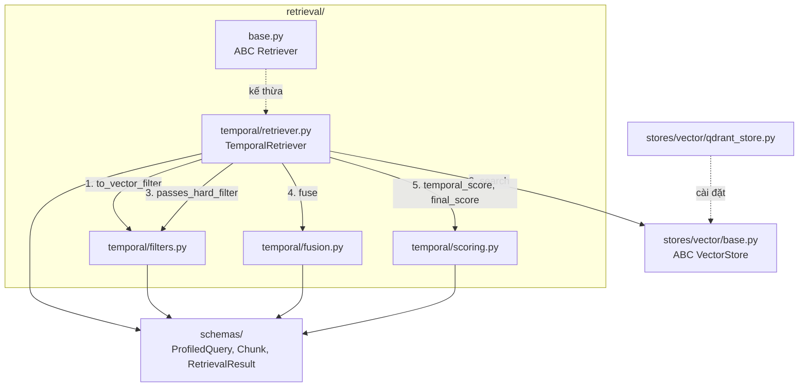

# Nhật ký triển khai 03: Lõi Cơ chế 1 (scoring, fusion, filters, TemporalRetriever)

Tiếp nối [`02_CORE_COMPONENTS.md`](02_CORE_COMPONENTS.md). Kế hoạch: [`../planning/01_TEMPORAL_RETRIEVAL_IMPLEMENTATION.md`](../planning/01_TEMPORAL_RETRIEVAL_IMPLEMENTATION.md) mục 5, bước 2. Thiết kế thuật toán: [`../design/02_TEMPORAL_RETRIEVAL_DESIGN.md`](../design/02_TEMPORAL_RETRIEVAL_DESIGN.md). **Chưa có** profiler, ingestion, generation.

---

## 1. Đã làm được

| Hạng mục | File | Ghi chú |
|---|---|---|
| Hợp đồng Retriever | `src/tam/retrieval/base.py` | ABC `Retriever` với `retrieve(ProfiledQuery) -> RetrievalResult` |
| Chấm điểm thời gian | `retrieval/temporal/scoring.py` | TH1 = 1.0, TH2 = `exp(-λ·Δyears)`, `final_score` |
| Gộp hai nhánh | `retrieval/temporal/fusion.py` | RRF (k=60) + min-max (đúng design 02, xem mục 3) |
| Hard filter | `retrieval/temporal/filters.py` | `to_vector_filter`, `passes_hard_filter`, `FACET_KEYS` |
| Retriever | `retrieval/temporal/retriever.py` | `TemporalRetriever`, `from_config` |
| Corpus test | `tests/fixtures/temporal_corpus.json` | 15 chunk, 5 lĩnh vực, 11 case có đáp án mong đợi |
| Kho giả | `tests/conftest.py` (`FakeVectorStore`) | Test không cần Qdrant hay embedding |
| Test | `test_scoring`, `test_fusion`, `test_filters`, `test_temporal_retriever` | 78 xanh, 4 xfail có chủ đích |

## 2. Quyết định thiết kế

- **`retrieval/` thuần Python**, chỉ phụ thuộc `schemas` và hợp đồng `VectorStore`; không import langchain.
- **`scoring`:** `end_time is None or end_time >= t_req` là TH1 (hai đầu khoảng đều bao gồm). `Δyears = (t_req - start_time) / 365.25 ngày`, tính từ `start_time` đúng như design. Chunk có `start_time > t_req` thì ném `ValueError` (rò rỉ tương lai là lỗi, không chấm im lặng). `λ`, `w1`, `w2` âm bị từ chối.
- **`fusion`:** id lặp trong một nhánh chỉ tính lần đầu; chunk chỉ ở một nhánh vẫn giữ. Hòa điểm RRF giữ thứ tự gặp đầu tiên (dense trước) để tất định. Min-max chạy trên đúng tập Top-N sau khi cắt.
- **`filters`:** chỉ nhận facet `domain`, `country` (khớp 4 payload index; có test so với `PAYLOAD_INDEXES`). Khóa khác (vd `source`) bị từ chối để không quét toàn bộ.
- **Chốt chặn trong retriever:** store trả hit nào vi phạm hard filter thì bị loại trước khi tính điểm và ghi cảnh báo. Store lỗi cũng không làm lọt tương lai hay tin giả.
- **Hợp đồng là ABC, không phải Protocol.** `VectorStore` và `Retriever` kế thừa tường minh, giống `embedding/`: nhìn là biết ai cài hợp đồng nào, thiếu hàm thì lỗi ngay khi tạo đối tượng. Đổi lại, kho giả trong test cũng phải kế thừa `VectorStore`.
- **Hard filter chạy TRƯỚC khi xếp hạng, ở trong Qdrant** (`query_filter`, mỗi nhánh áp riêng, rồi mới lấy `top_n`). `passes_hard_filter` bằng Python chạy sau search chỉ là chốt chặn và là bộ lọc của kho giả; với Qdrant thật nó không nên loại gì. Giữ lại vì bất biến "không rò rỉ tương lai" là cốt lõi, và nó bắt được trường hợp logic lọc của store lệch với Python.
- **Hòa Final_Score:** xếp theo `temporal_score` giảm dần, rồi `chunk_id`, để kết quả tái lập được.
- **Corpus nhiều chủ đề, không chỉ luật:** luật nhà ở, luật giao thông (không có bản mới, ép TH2), lương tối thiểu VN/US (facet), CEO công ty (có chunk tin giả `invalidated_at`), cầu thủ, thủ tướng trước 1970. Dữ liệu tự soạn.

## 2b. Vai trò từng file và cách gọi nhau

| File | Việc của file | Gọi / dùng |
|---|---|---|
| `retrieval/base.py` | ABC `Retriever`: mọi cơ chế phải có `mechanism` và `retrieve(ProfiledQuery) -> RetrievalResult` | `schemas.query`, `schemas.result` |
| `temporal/filters.py` | Đổi `ProfiledQuery` thành `VectorFilter` (kiểm tra facet hợp lệ); `passes_hard_filter` kiểm tra lại bằng Python | `schemas`, `stores.vector.base.VectorFilter` |
| `temporal/fusion.py` | Gộp hai danh sách dense + BM25 thành `Semantic_Score` ([0,1]): `rrf`, `normalize_minmax`, `fuse` | `schemas.chunk`, `stores.vector.base.{BranchHits, SearchHit}` |
| `temporal/scoring.py` | `Temporal_Score` (TH1/TH2) và `Final = W1·Sem + W2·Temp` | `schemas.chunk` |
| `temporal/retriever.py` | `TemporalRetriever(Retriever)`: ghép các bước trên, sắp xếp, lấy Top-K, ghi log | `filters`, `fusion`, `scoring`, `VectorStore`, `Config` |

`filters`, `fusion`, `scoring` **không gọi nhau**; chỉ `retriever.py` gọi cả ba. Mỗi file là hàm thuần nhận tham số rõ ràng, nên test từng cái riêng được. Không file nào trong `retrieval/` biết Qdrant, LLM hay langchain: store được tiêm qua constructor dưới dạng `VectorStore`.

Luồng một lần `retrieve(query)`:

1. `filters.to_vector_filter(query)` -> `VectorFilter` (`t_req`, bỏ tin giả, facet).
2. `store.search(semantic_query, flt, top_n)` -> `BranchHits` (dense, BM25), mỗi nhánh đã lọc ở trong Qdrant.
3. `_guard` dùng `filters.passes_hard_filter` loại hit vi phạm (chốt chặn).
4. `fusion.fuse(hits, k, top_n)` -> danh sách `(chunk, semantic_score)`.
5. Với mỗi chunk: `scoring.temporal_score` rồi `scoring.final_score` -> `ScoredChunk`.
6. Sắp xếp theo `final_score` giảm dần (hòa: `temporal_score`, rồi `chunk_id`), lấy Top-K, trả `RetrievalResult`.

Về tìm kiếm trong bước 2: nhánh BM25 tách câu hỏi thành từ, bỏ stopword, đưa về gốc từ rồi khớp từng từ với chunk (từ hiếm nặng hơn nhờ IDF). Không sửa lỗi gõ; nhánh dense chịu lỗi gõ tốt hơn và RRF bù lại. Model `Qdrant/bm25` xử lý tiếng Anh.

## 3. Rủi ro: min-max nhạy với hòa nghĩa (chưa kiểm chứng là lỗi)

Các phiên bản của cùng một văn bản gần hòa về ngữ nghĩa; min-max trên Top-N có thể kéo chênh lệch nhỏ thành 1.0 so với 0.0, trong khi `W2 = 0.3`.

- **Kho giả** (hòa điểm tuyệt đối): min-max đúng 7/11 case; 4 case sai đang `xfail(strict=True)`. Test `test_minmax_turns_semantic_tie_into_gap` ghi lại hiện tượng.
- **Qdrant thật + `bge-small-en` + BM25** (collection tạm, script ngoài repo): min-max đúng **11/11**. Biên mỏng ở vài case (vd `traffic_2020`: 0.72 so với 0.71).
- Ứng viên thay thế (đề xuất của Claude, không có trong design): `Semantic = RRF / (n_nhánh/(k+1))`, cũng 11/11 với biên rộng hơn chút. **Chưa áp dụng**; sẽ so trong ablation bằng EM/F1 trên TimeQA local. Chi tiết: `local/docs/` (không commit).

## 4. Đã kiểm chứng và chưa

- Đã: toàn bộ logic trên kho giả tất định và 11 case corpus trên Qdrant thật với embedding thật (6 test `qdrant` cũng xanh); ví dụ số trong design 02 (RRF A/B/C, λ=0.5 → 0.61/0.37/0.08, Final 0.74/0.67) khớp.
- **Chưa:** đo trên dữ liệu TimeQA thật; ảnh hưởng của hòa nghĩa ở quy mô lớn; λ, W1/W2 mới là giá trị mặc định.

## 5. Việc tiếp theo

1. Giữ min-max theo design; đưa "min-max vs chia cho max lý thuyết" vào ablation khi có eval.
2. `query/profiler.py` + prompt tiêm `T_now`. Cùng lần gọi LLM đó, cho `semantic_query` ra dạng sạch (bỏ từ đệm kiểu "cho tôi biết", sửa lỗi gõ rõ ràng, giữ nguyên tên riêng) để nhánh BM25 không bị nhiễu. Thêm test: lỗi gõ, từ đệm, tên riêng.
3. `evaluation/metrics_temporal.py`: Hit@1/3/5, MRR và leakage rate (kỳ vọng 0%) theo `chunk_id`, không gọi LLM; chạy trước trên corpus 11 case, rồi TimeQA (nhãn = chunk chứa vị trí đáp án). Prompt generation phải đưa `start_time`/`end_time` của từng chunk vào context.
4. Ingestion TimeQA bộ local, rồi `generation`, LangGraph nấc A.
