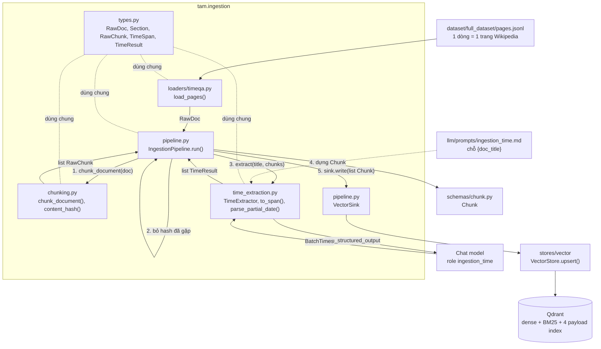

# Nhật ký triển khai 04: Profiler (Time Extractor), metric retrieval Cơ chế 1 và Ingestion

Tiếp nối [`03_TEMPORAL_RETRIEVAL_CORE.md`](03_TEMPORAL_RETRIEVAL_CORE.md) mục 5, việc 2 và 3. Kế hoạch: [`../planning/01_TEMPORAL_RETRIEVAL_IMPLEMENTATION.md`](../planning/01_TEMPORAL_RETRIEVAL_IMPLEMENTATION.md) mục 5, bước 3. Thiết kế: [`../design/02_TEMPORAL_RETRIEVAL_DESIGN.md`](../design/02_TEMPORAL_RETRIEVAL_DESIGN.md) mục 3.2. Phần 6 là ingestion. **Chưa có** generation, pipeline, baseline.

---

## 1. Đã làm được

| Hạng mục | File | Ghi chú |
|---|---|---|
| Profiler | `src/tam/query/profiler.py` | `Profiler(llm).profile(question, t_now) -> ProfiledQuery` |
| Prompt | `src/tam/llm/prompts/time_extractor.md` | Tiếng Anh, few-shot 8 ví dụ, có chỗ `{t_now}` |
| Metric CC1 | `src/tam/evaluation/metrics_temporal.py` | Hit@k, MRR, leakage, invalidated, forbidden |
| Ingestion | `src/tam/ingestion/` (`types`, `loaders/timeqa`, `chunking`, `time_extraction`, `pipeline`) | Xem mục 6 |
| Prompt ingestion | `src/tam/llm/prompts/ingestion_time.md` | Tiếng Anh, few-shot 4 ví dụ, có chỗ `{doc_title}` |
| Test | `tests/test_profiler.py`, `tests/test_metrics_temporal.py`, `tests/test_ingestion.py`, thêm 1 test vào `tests/test_qdrant_store.py` | Toàn bộ: 119 xanh, 4 xfail cũ (+ test Qdrant thật xanh) |

## 2. Profiler

### 2.1 Luồng một lần `profile(question, t_now)`

1. Đọc `time_extractor.md`, thay `{t_now}` bằng `t_now.date().isoformat()`, gửi làm system message. Câu hỏi là human message.
2. LLM trả structured output `Extraction` (`llm.with_structured_output(Extraction)`): `semantic_query`, `t_req` (chuỗi ISO hoặc `null`), `domain`, `country`.
3. Chuẩn hóa trong code (không tin hoàn toàn vào LLM):
   - `t_req` đọc bằng `dateutil.isoparse`, chấp nhận `2020`, `2020-03`, `2020-03-01`, có hoặc không giờ; quy về UTC. Không đọc được thì ném `ValueError` kèm câu hỏi.
   - `t_req = null` (câu hỏi không nhắc thời gian) thì dùng `T_now`.
   - `t_req > T_now` chỉ cảnh báo log, vẫn cho qua.
   - `domain` viết thường, `country` viết hoa, chuỗi rỗng bỏ. Chỉ còn hai khóa nằm trong `FACET_KEYS` (khớp payload index).
   - `semantic_query` rỗng thì quay về nguyên câu hỏi.
4. Trả `ProfiledQuery(mechanism="temporal")`.

### 2.2 Quyết định thiết kế

- **LLM và đồng hồ được tiêm vào**: `Profiler.__init__(llm)` và tham số `t_now`. Không đọc đồng hồ hay biến môi trường bên trong, nên test bằng đồng hồ giả và LLM giả.
- **`T_now` đi qua placeholder `{t_now}` trong file `.md`**, thay bằng `str.replace` (không dùng `format`, vì prompt có thể chứa dấu ngoặc nhọn).
- **Prompt tiếng Anh**: dataset (TimeQA) là tiếng Anh nên câu hỏi là tiếng Anh; prompt và mô tả field của `Extraction` cũng tiếng Anh vì LLM đọc cả schema. Prompt dặn không dịch và không đổi ngôn ngữ câu hỏi.
- **Few-shot nằm trong system prompt**, không dùng lượt hội thoại giả: với structured output (tool calling) lượt giả của AI phải kèm tool-call, rất rườm rà. Mọi ví dụ cùng `T_now = 2023-10-10`; ngày đã tính tay (vd "last week" = 2023-10-03).
- **Quy ước khoảng thời gian**: lấy mốc cuối khoảng ("during the 1990s" -> `1999-01-01`), vì `t_req` là một điểm.
- **`domain`, `country` chỉ điền khi câu hỏi nêu rõ**: đoán sai sẽ làm filter lọc mất đáp án đúng (kết quả rỗng), tệ hơn là không lọc.
- **Làm sạch `semantic_query` ngay trong lần gọi này** (bỏ từ đệm, sửa lỗi gõ, giữ tên riêng), để nhánh BM25 không bị nhiễu. Xem 03 mục 2b về BM25.
- Dùng role `time_extractor` trong config (hiện `claude_haiku`); chỗ lắp ráp mới được gọi `get_llm_for_role`.

### 2.3 Test (`tests/test_profiler.py`)

LLM giả (`FakeLLM.with_structured_output`) ghi lại message nhận được. Phủ: `T_now` vào system prompt; quy đổi tương đối thành tuyệt đối UTC; `parse_t_req` (chỉ năm, năm-tháng, trước 1970, có múi giờ); không nhắc thời gian thì `T_now`; chuẩn hóa filter; đầu ra dạng dict; `semantic_query` rỗng; `t_req` rác ném lỗi; `t_req` tương lai chỉ cảnh báo.

## 3. Metric retrieval Cơ chế 1

`evaluation/metrics_temporal.py`, không gọi LLM. Nhãn ở mức `chunk_id`.

| Metric | Định nghĩa | Kỳ vọng |
|---|---|---|
| `hit@k` | Có chunk đúng trong top-k (k = 1, 3, 5) | cao |
| `mrr` | Trung bình 1/hạng của chunk đúng đầu tiên | cao |
| `leakage_rate` | Tỉ lệ câu hỏi có ít nhất một chunk với `start_time > t_req` | 0% |
| `invalidated_rate` | Tỉ lệ câu hỏi có chunk đã `invalidated_at` | 0% |
| `forbidden_rate` | Tỉ lệ câu hỏi có chunk thuộc `expect_absent` (tương lai, tin giả, sai facet) | 0% |

- `EvalCase(id, query, t_req, gold_ids, forbidden_ids, filters)`; `cases_from_corpus` đổi `cases` của `temporal_corpus.json`.
- `evaluate_retrieval(retriever, cases, ks)` chạy **chế độ oracle `t_req`** (bỏ qua profiler, xem planning mục 6.3), trả `{"summary", "cases"}` để ghi `metrics.json` / `predictions.jsonl`.
- Case không có đáp án hợp lệ (vd `t_req` trước mọi phiên bản) bị loại khỏi Hit@k/MRR nhưng vẫn tính vào ba tỉ lệ vi phạm. Không có case thì giá trị là `None`.
- Test bất biến: trên 11 case corpus với kho giả, ba tỉ lệ vi phạm bằng 0%, kể cả 4 case min-max đang xfail (xfail chỉ là top-1 sai, không phải rò rỉ).

### Tên file và Cơ chế 2/3

Đổi `metrics.py` thành `metrics_temporal.py` để mỗi cơ chế một file: `metrics_timeline.py` (coverage, thứ tự thời gian, token efficiency, Boomerang) và `metrics_conflict.py` (Evolution vs Falsehood, Temporal Freshness, chọn đúng nguồn) thêm sau, không sửa file này. Hàm dùng chung (`hit_at_k`, `is_future_leak`, `is_invalidated`) hiện còn nằm trong `metrics_temporal.py`; khi bắt đầu CC2 sẽ tách phần dùng chung ra `metrics.py`.

## 4. Đã kiểm chứng và chưa

- Đã: logic profiler, metric và ingestion bằng LLM giả, kho giả; ba tỉ lệ vi phạm của metric bằng 0% trên corpus; Qdrant thật lọc đúng datetime năm 1136, 1955, 1969 (`test_very_old_start_times_are_filtered_correctly`).
- **Chưa:** chạy profiler và ingestion với LLM thật (chưa biết Haiku quy đổi "last week", khoảng thời gian và mốc trong đoạn Wikipedia có đúng không, và bao nhiêu chunk bị bỏ vì không có mốc); metric trên Qdrant thật và TimeQA; chưa có `metrics.json` ghi ra `output/`.

## 5. Ingestion: các file gọi nhau thế nào

### 5.1 Sơ đồ

Nét liền = dữ liệu đi qua. Nét đứt = tài nguyên phụ. `pipeline.py` là nơi duy nhất gọi các file còn lại; `chunking.py`, `time_extraction.py` và loader không gọi nhau. LLM và kho được tiêm qua constructor, không file nào tự gọi factory.

### 5.2 Dữ liệu đi qua từng bước (ví dụ trang Knox Cunningham, 11 đoạn)

| Bước | Ai làm | Vào | Ra |
|---|---|---|---|
| 0 | `load_pages(path, page_ids)` | Một dòng `pages.jsonl`: `page_id`, `paragraphs=[{title, text}]` | `RawDoc(doc_id="/wiki/Knox_Cunningham", title="Knox Cunningham", source="Wikipedia: Knox Cunningham", sections)`. Lọc theo `page_ids` nếu có; trang không có đoạn thì bỏ |
| 1 | `chunk_document(doc)` | `RawDoc` | `list[RawChunk]`, mỗi section một chunk, `chunk_id="/wiki/Knox_Cunningham#<chỉ số section>"`. Text có header: `"Knox Cunningham \| Early career\n<nội dung>"`. Section rỗng bị bỏ. `content_hash` = SHA-256 của text đã gộp khoảng trắng và chữ thường |
| 2 | `IngestionPipeline.run` | `RawChunk` | Bỏ chunk có hash đã gặp **trong cùng lần chạy** (đếm `skipped_duplicate`); còn lại là `fresh` |
| 3 | `TimeExtractor.extract(title, fresh)` | `fresh` | Cắt lô 30 chunk. Mỗi lô một lệnh gọi LLM: system = `ingestion_time.md` với `{doc_title}` thay bằng tên bài; human = `[0] <text>\n\n[1] <text>...`. LLM trả `BatchTimes(items=[ChunkTime(index, start, end, ongoing)])` |
| 4 | `to_span(item)` | `ChunkTime` | `TimeResult`: có `TimeSpan(start, end)` hoặc `reason`. Chuẩn hóa: start chỉ-năm thành `YYYY-01-01`, end chỉ-năm thành `YYYY-12-31`, chỉ-tháng thành ngày 1 hoặc ngày cuối tháng; `ongoing` thì `end=None`; không có `end` thì `end` = hết kỳ của `start`. `reason="no_time"`: không có `start`, hoặc LLM bỏ sót chunk. `reason="invalid_time"`: không đọc được ngày, năm < 1, hoặc `end < start` |
| 5 | `IngestionPipeline.run` | `RawChunk` + `TimeResult` | Có `span` thì dựng `Chunk(chunk_id, text, source, start_time, end_time, domain_features)`. Không có thì bỏ và đếm `skipped_no_time` hoặc `skipped_invalid_time` |
| 6 | `VectorSink.write(chunks)` | `list[Chunk]` | `VectorStore.upsert`: embed dense + BM25 rồi ghi vào Qdrant, chỉ 4 trường được index (`start_time`, `invalidated_at`, `domain_features.domain`, `domain_features.country`). `chunk_id` ổn định nên chạy lại là ghi đè, không nhân đôi |
| 7 | `run` trả về | | `IngestStats`: `docs`, `chunks_total`, `ingested`, `skipped_no_time`, `skipped_invalid_time`, `skipped_duplicate` |

Chunk bị bỏ ở bước 2 hoặc 5 **không bao giờ vào Qdrant** (bất biến: không có mốc thời gian thì không vào kho time-aware).

### 5.3 Quyết định thiết kế

- **Header trong text chunk** ("Tiêu đề bài \| Tên mục"): đoạn đơn lẻ thường chỉ nói "he", "the club", không có tên thực thể, nên thiếu header thì cả embedding lẫn BM25 không tìm ra.
- **Một lệnh LLM cho một lô chunk của cùng tài liệu**, không gọi từng chunk: rẻ hơn, và LLM thấy các mốc lân cận để hiểu "năm sau". Lô lớn hơn 30 chunk bị cắt, mỗi lô tự đánh index từ 0.
- **Khoảng hiệu lực của chunk** = [mốc sớm nhất, mốc muộn nhất] của các sự việc trong đoạn. Một đoạn liệt kê nhiều giai đoạn sẽ cho một khoảng rộng; đây là giới hạn đã biết của chunk theo đoạn.
- **end chỉ-năm lấy ngày cuối năm** (khác ghi chú "luôn `YYYY-01-01`" của planning, vốn đúng cho `start`): để "2004 đến 2005" phủ hết năm 2005 và `T_req = 2005-xx` vẫn là TH1.
- **Lỗi thì đếm, không im lặng**: `invalid_time` được ghi cảnh báo và có bộ đếm riêng.
- **Sink là ABC**: CC2/3 thêm `GraphSink` vào danh sách `sinks`, không sửa `pipeline.py`.
- **Khử trùng chỉ trong một lần chạy** (tập `seen` trong bộ nhớ). Qua các lần chạy thì `chunk_id` ổn định lo việc ghi đè. Chưa có cache kết quả LLM nên chạy lại sẽ gọi LLM lại.
- Dùng role `ingestion_time` trong config (hiện `claude_haiku`).

### 5.4 Chưa làm / giới hạn

- Cách chọn tập con dataset (trang nào, bao nhiêu câu) và nơi lưu kết quả trích (cache `data/processed/`): để sau. `load_pages` mới chỉ nhận danh sách `page_ids`.
- `domain_features` của chunk TimeQA đang rỗng. Nếu profiler trả `domain` hoặc `country` thì filter loại hết chunk; với TimeQA cần để profiler không đặt facet.
- Đoạn không có năm (vd "He joined the club after graduating") bị bỏ. Nếu đoạn đó chứa đáp án thì không retriever nào cứu được, nên cần chỉ số "tỉ lệ chunk đáp án còn sống sau ingestion" (xem mục 6).
- Chưa có script `scripts/ingest.py` và chưa nạp thử bằng LLM thật.

## 6. Việc tiếp theo

1. Script `scripts/ingest.py` và chạy thử ingestion + profiler với LLM thật trên bộ local (21 trang); xem tỉ lệ chunk bị bỏ vì không có mốc, sửa few-shot nếu sai.
2. Chỉ số "tỉ lệ chunk đáp án còn sống sau ingestion": nhãn chunk đúng lấy từ `from`/`end` (vị trí ký tự trên `context`), cần ánh xạ sang đoạn của `paragraphs`.
3. `generation/time_cot.py` (đưa `start_time`/`end_time` của chunk vào context), rồi LangGraph nấc A; chỗ lấy `T_now` (`datetime.now(timezone.utc)`) nằm ở node `profile` và `scripts/ask.py`.
4. `baselines/plain_rag.py`, `runner`, EM/F1; chạy bộ local. Tinh chỉnh λ, W1/W2 trên mẫu `D/train`, tách khỏi `D/test` dùng báo cáo.
