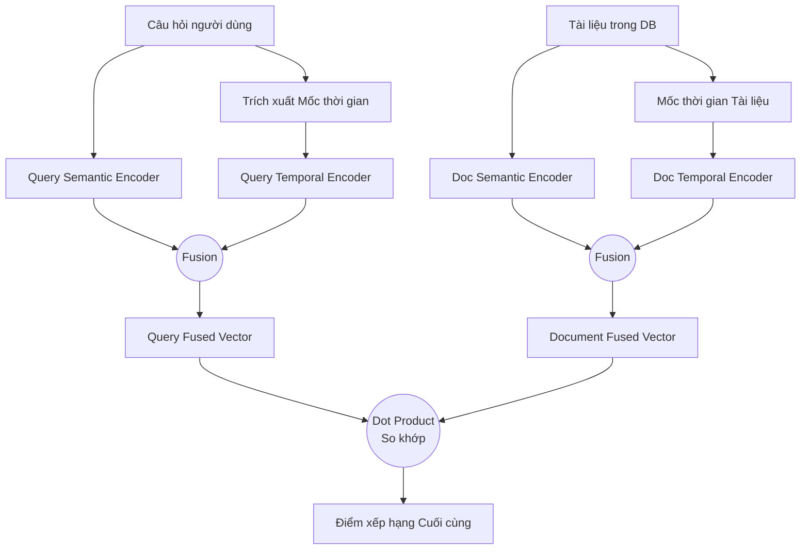
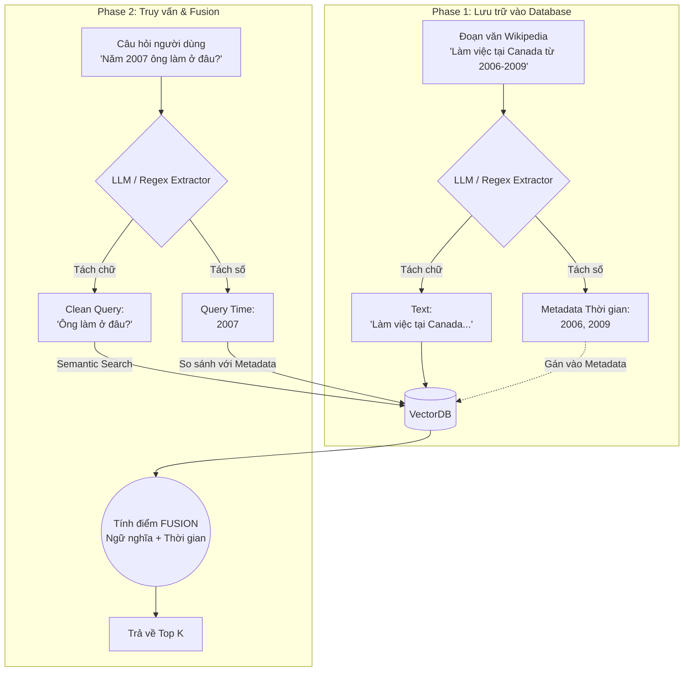
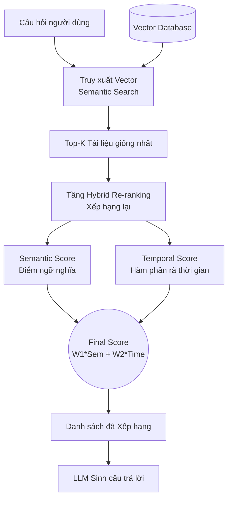
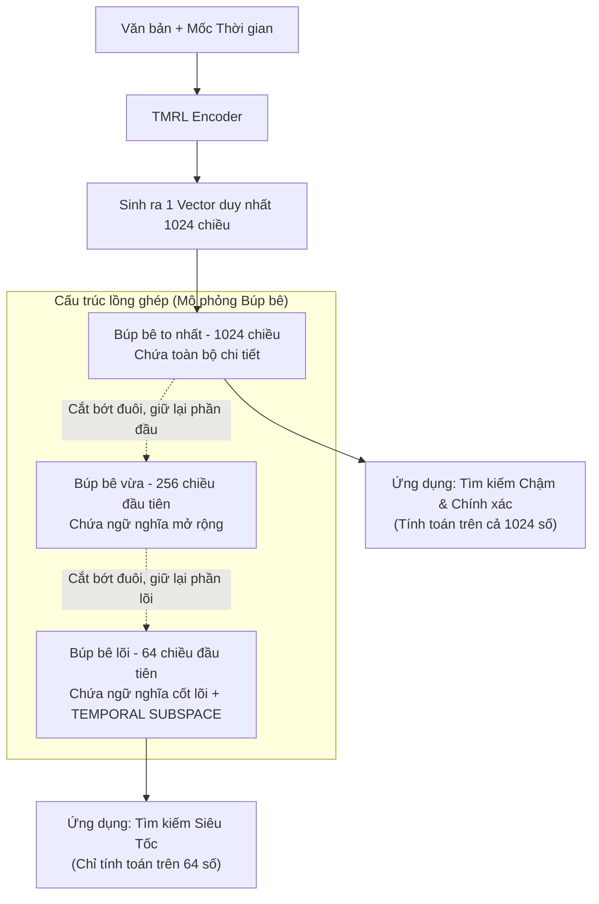

# Cơ chế 1 — Temporal Information Retrieval (Truy xuất dựa trên Thời gian)

> Tổng hợp các tài liệu nghiên cứu trong thư mục [`temporal_retrieval/`](./temporal_retrieval/). Mục tiêu của Cơ chế 1: hệ thống hiểu mốc thời gian (tường minh hoặc ngầm ẩn) trong câu hỏi để truy xuất **đúng tài liệu tại đúng thời điểm** (VD: *"Năm 2005 ai là Thủ tướng Anh?"*, *"Quy định hiện tại là gì?"*).

## Bảng tổng quan

| # | Bài báo | arXiv | GitHub | Đồ án cần? |
|---|---|---|---|---|
| 01 | It's High Time: A Survey of Temporal QA | [2505.20243](https://arxiv.org/abs/2505.20243) | [✅](https://github.com/DataScienceUIBK/TemporalQA-Survey) | 🟢 Cần (nền tảng lý thuyết + chọn dataset) |
| 02 | TempRetriever | [2502.21024](https://arxiv.org/abs/2502.21024) | ❌ Chưa public | 🟢 Cần (tư duy Fusion + tiền xử lý timestamp), ❌ không fine-tune |
| 03 | TimelyRAG | [2609.11572](https://arxiv.org/abs/2609.11572) | [✅](https://github.com/kaist-dmlab/TimelyRAG) | 🟢 **Bắt buộc** (Re-ranking bằng Time Decay — logic lõi) |
| 04 | TMRL (Temporal Matryoshka) | [2601.05549](https://arxiv.org/abs/2601.05549) | ❌ Không đề cập | 🔴 Không code, chỉ đưa vào Future Works |

---

## 01. It's High Time: A Survey of Temporal Question Answering

- **Tên bài báo:** It's High Time: A Survey of Temporal Question Answering
- **Link bài báo:** [arXiv 2505.20243](https://arxiv.org/abs/2505.20243) — [HTML v2](https://arxiv.org/html/2505.20243v2)
- **GitHub:** [DataScienceUIBK/TemporalQA-Survey](https://github.com/DataScienceUIBK/TemporalQA-Survey)
- **File phân tích chi tiết:** [01_TemporalQA_Survey.md](./temporal_retrieval/01_TemporalQA_Survey.md)

**Nói về vấn đề gì:** Khảo sát toàn cảnh lĩnh vực Temporal QA (TQA) — hệ thống hóa 27+ dataset (~2.5 triệu câu hỏi, 1367–2025) trong News, Web, Knowledge Base.

**Làm gì:**
- Phân loại dataset thành 5 nhóm: Diachronic (ArchivalQA, StreamingQA...), Synchronic (**TimeQA**, SituatedQA...), Web/Real-time (ReaLTimeQA, FreshQA), Synthetic (ContextAQA, COTEMPQA), KG-based.
- Vẽ dòng tiến hóa phương pháp: Rule-based (HeidelTime) → Statistical → Transformer (TempoT5, BiTimeBERT) → LLM & RAG (TempRetriever, TimeR4, MRAG, TempRALM, FreshLLMs).
- Định nghĩa các task con: Event Dating, Document Dating, Focus Time Estimation, **Query Time Profiling**.
- Đưa ra 7 hướng tương lai (Temporally-Aware Agents, Implicit Temporal Intent, Dynamic Knowledge Management...).

**Giải quyết vấn đề nào của đồ án:** Cung cấp nền tảng lý thuyết cho cả 3 cơ chế và căn cứ chọn dataset: **TimeQA** cho Cơ chế 1 & 2, **StreamingQA** cho Cơ chế 3 (đa nguồn/cập nhật). Bỏ ChroniclingAmericaQA (báo 1800–1920, quá cũ) và ContextAQA/ContextTQE (không public data).

**Ưu điểm:**
- Bao quát, cập nhật (2025), có bảng so sánh dataset rõ ràng.
- Cung cấp "từ khóa" và hướng phát triển dùng được cho phần Related Works / Future Works.

**Nhược điểm:**
- Là survey, không đề xuất thuật toán cụ thể để code.

**Đồ án có cần không:** 🟢 **Cần** — dùng cho chương Tổng quan/Related Works, lý giải lựa chọn dataset, và mục "Ý nghĩa khoa học / Hướng phát triển".

---

## 02. TempRetriever

- **Tên bài báo:** TempRetriever: Fusion-based Temporal Dense Passage Retrieval for Time-Sensitive Questions
- **Link bài báo:** [arXiv 2502.21024](https://arxiv.org/abs/2502.21024)
- **GitHub:** ❌ Chưa public code ("Contact authors"). Dataset dùng: [ArchivalQA](https://github.com/WangJiexin/ArchivalQA), [ChroniclingAmericaQA](https://github.com/datascienceUIBK/ChroniclingAmericaQA)
- **File phân tích chi tiết:** [02_TempRetriever.md](./temporal_retrieval/02_TempRetriever.md)

**Nói về vấn đề gì:** Retriever truyền thống (BM25, DPR) chỉ dựa vào độ giống ngữ nghĩa, phớt lờ thời gian. VD: hỏi *"Ai là tổng thống Mỹ?"* năm 2008 → tài liệu 2024 (Biden) có thể bị kéo lên trước tài liệu 2008 (Bush).

**Làm gì:**
- **Fusion-based Temporal Dense Retrieval:** Mã hóa riêng thời gian của query và document thành vector, hòa trộn với vector ngữ nghĩa → `Điểm = Semantic + Time Similarity`.
- **Time-based Negative Sampling:** Khi train, dùng các tài liệu *đúng ngữ nghĩa nhưng sai thời điểm* làm hard negative, ép model nhìn vào timestamp.
- Kết quả: +6.63% Top-1 trên ArchivalQA, +9.56% trên ChroniclingAmericaQA so với DPR.

**Giải quyết vấn đề nào của đồ án:** Cơ chế 1 (truy xuất tại một mốc thời gian) — tư duy **cộng điểm ngữ nghĩa + điểm thời gian**. Ngoài ra gợi ý luồng **tiền xử lý**: dùng LLM/Regex tách timestamp từ văn bản Wikipedia/TimeQA (VD: *"từ 2006 đến 2009"*) để gán vào metadata trước khi embedding.

**Ưu điểm:**
- Cải thiện rõ độ chính xác với câu hỏi nhạy cảm thời gian.
- Ý tưởng Fusion đơn giản, dễ tái hiện ở tầng truy vấn.

**Nhược điểm:**
- Không có code public.
- Cần fine-tune embedding (tốn GPU).
- Dataset ArchivalQA: corpus NYT bị bản quyền LDC, dữ liệu dừng ở 2007, chỉ extractive.

**Đồ án có cần không:** 🟢 **Cần một phần** — áp dụng tư duy Fusion (3.1) + pipeline tiền xử lý timestamp. ❌ **Không** cần làm Negative Sampling/fine-tune; dùng embedding public (OpenAI, BGE) + hàm tính điểm thời gian tự viết là đủ.

**Mermaid — Kiến trúc tổng quan TempRetriever:**

**Mermaid — Luồng tiền xử lý dữ liệu Wikipedia/TimeQA cho đồ án:**

---

## 03. TimelyRAG

- **Tên bài báo:** TimelyRAG: Semantic-Temporal Hybrid Retrieval for Time-Critical Question Answering in Overlapping-Evolving Documents
- **Link bài báo:** [arXiv 2609.11572](https://arxiv.org/abs/2609.11572)
- **GitHub:** [kaist-dmlab/TimelyRAG](https://github.com/kaist-dmlab/TimelyRAG) (kèm dataset `TimelyQABench`)
- **File phân tích chi tiết:** [03_TimelyRAG.md](./temporal_retrieval/03_TimelyRAG.md)

**Nói về vấn đề gì:** Hiện tượng **Overlapping-Evolving** — văn bản sửa đổi gần như copy y nguyên văn bản cũ (VD: Luật thuế 2020 ghi 10%, luật 2023 ghi 12%, còn lại giống 99%). Semantic Search hòa điểm, dễ lấy nhầm bản đã hết hiệu lực.

**Làm gì:**
- **Semantic-Temporal Hybrid Re-ranking (retriever-agnostic):** Giữ nguyên retriever (BM25/DPR) để lấy Top-K, rồi re-rank bằng `Final = w1·Semantic + w2·TimeDecay`, với `TimeDecay = exp(-λ·|t_query − t_doc|)`.
- **Structural Chunking:** chunk theo Điều/Khoản/Mục thay vì theo số token.
- **Không xóa chunk cũ:** lưu song song các phiên bản, phân biệt bằng metadata `Valid_From` / `Valid_To`.
- Kết quả: +28.6% nDCG@10 so với DPR/BM25.

**Giải quyết vấn đề nào của đồ án:**
- Cơ chế 1: trả lời đúng cả câu hỏi "hiện hành" lẫn "du hành thời gian" (VD: *"Năm 2021 thuế là bao nhiêu?"*) — điều mà Recency Filter cứng không làm được.
- Cơ chế 3: xử lý Semantic Bias của VectorDB và tin đính chính/cập nhật.

**Ưu điểm:**
- Không cần train lại embedding, chỉ thêm 1 tầng re-rank → dễ code.
- Có code + benchmark public.
- Không vứt bỏ dữ liệu lịch sử (khác Version-based / Recency Filter).

**Nhược điểm:**
- Phụ thuộc vào chất lượng metadata thời gian (phải trích xuất timestamp chuẩn).
- Phải tune tay trọng số `alpha` và hệ số decay `λ` theo domain.

**Đồ án có cần không:** 🟢 **Bắt buộc** — đây là logic lõi: sau bước VectorDB lấy Top-K, **phải** có tầng Re-ranking theo khoảng cách thời gian. Tái sử dụng trực tiếp cho Cơ chế 3.

**Mermaid — Kiến trúc tổng quan TimelyRAG:**

---

## 04. TMRL — Temporal-aware Matryoshka

- **Tên bài báo:** Efficient Temporal-aware Matryoshka Adaptation for Temporal Information Retrieval
- **Link bài báo:** [arXiv 2601.05549](https://arxiv.org/abs/2601.05549) (01/2026)
- **GitHub:** ❌ Không đề cập
- **File phân tích chi tiết:** [04_TMRL_Matryoshka.md](./temporal_retrieval/04_TMRL_Matryoshka.md)

**Nói về vấn đề gì:** Bài toán **hiệu năng (Efficiency)** — nhúng thời gian vào vector (như TempRetriever) làm vector lớn (1024–1536 chiều), gây thắt cổ chai khi DB lên hàng chục triệu tài liệu.

**Làm gì:**
- **Matryoshka Representation Learning (MRL):** vector lồng ghép, có thể cắt chỉ giữ 64 chiều đầu mà vẫn giữ ngữ nghĩa cốt lõi → tìm kiếm nhanh hơn nhiều lần.
- **Temporal Subspace:** ép mô hình dành riêng một phần chiều (VD: 16/64 chiều đầu) để mã hóa thời gian → cắt vector nhỏ vẫn không mất thông tin thời gian.
- Kết quả: cân bằng tốt giữa Accuracy và Efficiency so với RAG thường và MRL gốc.

**Giải quyết vấn đề nào của đồ án:** Không giải quyết logic thời gian/mâu thuẫn; chỉ tối ưu tốc độ khi scale lớn.

**Ưu điểm:**
- Tăng tốc tìm kiếm đáng kể, giảm tài nguyên.
- Rất mới (2026), thể hiện tầm nhìn SOTA.

**Nhược điểm:**
- Phải huấn luyện lại cấu trúc vector, cần GPU mạnh, phức tạp.
- Demo đồ án chỉ vài nghìn tài liệu → không thấy được khác biệt tốc độ.

**Đồ án có cần không:** 🔴 **Không code.** Chỉ đưa vào chương **"Hạn chế & Hướng phát triển (Future Works)"**: khi scale hàng chục triệu văn bản, đề xuất tích hợp TMRL để giảm vector xuống 64 chiều mà vẫn giữ subspace thời gian.

**Mermaid — Kiến trúc TMRL:**

---

## Kết luận cho Cơ chế 1

| Thành phần trong pipeline | Lấy từ |
|---|---|
| Tiền xử lý: trích xuất timestamp (LLM/Regex) → metadata | TempRetriever (02) |
| Query Time Profiling / tách thời gian khỏi câu hỏi | Survey (01), TempRetriever (02) |
| Re-ranking: `w1·Semantic + w2·TimeDecay` | **TimelyRAG (03)** — lõi |
| Lưu nhiều phiên bản với `Valid_From`/`Valid_To` | TimelyRAG (03) |
| Tối ưu hiệu năng khi scale | TMRL (04) — Future Works |
