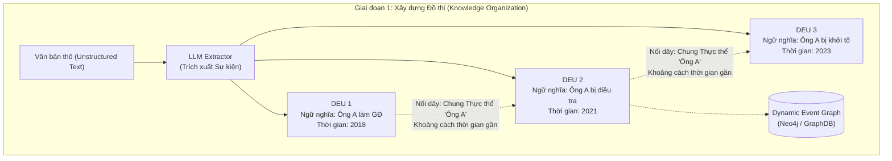
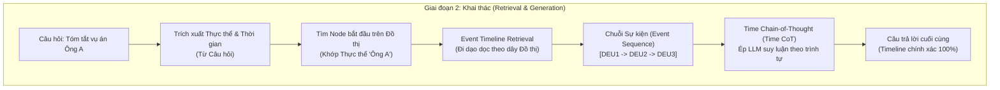
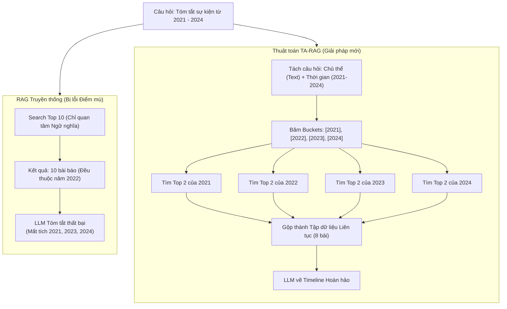
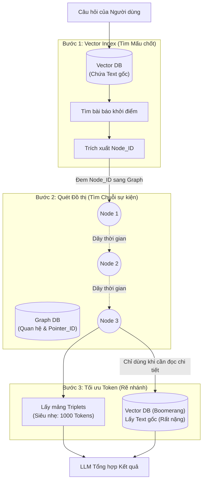
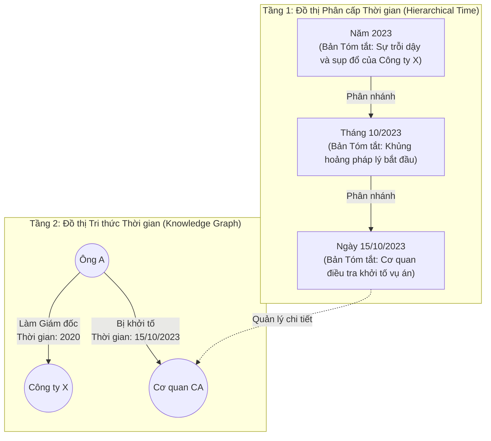

# Cơ chế 2 — Timeline Summarization (Tóm tắt Dòng thời gian)

> Tổng hợp các tài liệu nghiên cứu trong thư mục [`timeline_summarization/`](./timeline_summarization/). Mục tiêu của Cơ chế 2: tổng hợp chuỗi sự kiện thay đổi theo thời gian của một thực thể/vấn đề (VD: *"Tóm tắt sự nghiệp ông A từ 2005 đến nay"*, *"Diễn biến vụ án X"*). Đây là **sự tiến hóa (Evolution)**, không phải xung đột → giữ lại tất cả và xếp thành sợi dây liền mạch.

## Bảng tổng quan

| # | Bài báo | arXiv | GitHub | Đồ án cần? |
|---|---|---|---|---|
| 01 | DyG-RAG (Dynamic Event Graph) | [2507.13396](https://arxiv.org/abs/2507.13396) | [✅](https://github.com/RingBDStack/DyG-RAG) | 🟡 Nâng cao (Graph) / Future Works |
| 02 | TA-RAG (Diachronic Questions) | [2507.22917](https://arxiv.org/abs/2507.22917) | [✅](https://github.com/kwunhang/TA-RAG) | 🟢 **Core Logic** cho Cơ chế 2 |
| 03 | Hybrid Vector-Graph RAG | ⚠️ Không phải bài báo (nhóm tự đề xuất) | — | 🟡 Thiết kế mở rộng / Phụ lục |
| 04 | TG-RAG (Bi-Level Temporal Graph) | [2510.13590](https://arxiv.org/abs/2510.13590) | ❌ Không đề cập | 🟡 Tham khảo cho Graph/Incremental Update |

---

## 01. DyG-RAG — Dynamic Graph RAG with Event-Centric Reasoning

- **Tên bài báo:** DyG-RAG: Dynamic Graph Retrieval-Augmented Generation with Event-Centric Reasoning
- **Link bài báo:** [arXiv 2507.13396](https://arxiv.org/abs/2507.13396) (07/2025)
- **GitHub:** [RingBDStack/DyG-RAG](https://github.com/RingBDStack/DyG-RAG)
- **File phân tích chi tiết:** [01_DyG_RAG_Event_Graph.md](./timeline_summarization/01_DyG_RAG_Event_Graph.md)

**Nói về vấn đề gì:** Vector RAG trả về các đoạn văn rời rạc, "mù" về **trật tự thời gian** và **quan hệ nhân quả** giữa chúng → LLM dễ xâu chuỗi sai, ảo giác khi tóm tắt timeline.

**Làm gì:**
- **Dynamic Event Unit (DEU):** dùng LLM trích xuất mỗi sự kiện thành một đơn vị gồm ngữ nghĩa + thời gian.
- **Dynamic Event Graph:** nối các DEU có chung thực thể và gần nhau về thời gian thành đồ thị (event-centric).
- **Event Timeline Retrieval:** từ node khớp thực thể trong câu hỏi, "đi dạo" (traversal) dọc đồ thị để lấy chuỗi sự kiện có thứ tự.
- **Time-CoT (Time Chain-of-Thought):** prompt ép LLM suy luận theo trình tự thời gian.

**Giải quyết vấn đề nào của đồ án:** Cơ chế 2 — đảm bảo timeline có thứ tự và nhân quả. Gợi ý kiến trúc **Hybrid** (Vector cho Cơ chế 1 & 3, Graph cho Cơ chế 2) và kiến trúc **Con trỏ (Pointer)**: GraphDB chỉ lưu "bộ xương" (thực thể, thời gian, `chunk_id`), VectorDB lưu "xác thịt" (text) → text chỉ lưu 1 lần.

**Ưu điểm:**
- Timeline có thứ tự và quan hệ nhân quả rõ ràng, giảm ảo giác.
- Có code public, là hình mẫu chuẩn cho Timeline Summarization.

**Nhược điểm:**
- Phải dùng LLM trích xuất DEU khi nạp dữ liệu → chi phí API cao.
- Phải học/vận hành GraphDB (Neo4j), code phức tạp.

**Đồ án có cần không:** 🟡 **Tùy mức độ** —
- Muốn đồ án xuất sắc: cài Hybrid RAG, dùng Event Graph cho Cơ chế 2.
- Phương án an toàn (khuyên dùng): dùng VectorDB (TA-RAG) cho Cơ chế 2, đưa DyG-RAG vào **Future Works**.

**Sơ đồ framework gốc:**

**Mermaid — Giai đoạn 1: Xây dựng đồ thị:**

**Mermaid — Giai đoạn 2: Khai thác:**

---

## 02. TA-RAG — RAG for Answering Diachronic Questions

- **Tên bài báo:** Reading Between the Timelines: RAG for Answering Diachronic Questions
- **Link bài báo:** [arXiv 2507.22917](https://arxiv.org/abs/2507.22917) (07/2025)
- **GitHub:** [kwunhang/TA-RAG](https://github.com/kwunhang/TA-RAG)
- **File phân tích chi tiết:** [02_TA_RAG_Diachronic.md](./timeline_summarization/02_TA_RAG_Diachronic.md)

**Nói về vấn đề gì:** **Coverage Blind Spot (Điểm mù bao phủ thời gian)** — với câu hỏi lịch đại (VD: *"Diễn biến vụ X từ 2021 đến 2024"*), Top-K semantic bị hút hết vào giai đoạn "nóng" nhất (VD: cả 10 bài đều tháng 4/2022), bỏ trống các năm khác → LLM không thể dựng timeline liên tục.

**Làm gì:**
- **Query Disentanglement:** LLM tách câu hỏi thành *Core Subject* (để embed) và *Temporal Window* (VD: `[01/2021 → 12/2024]`).
- **Temporal Bucket Calibration:** băm cửa sổ thời gian thành các bucket (năm/tháng — kích thước **động** theo độ dài cửa sổ), truy xuất riêng từng bucket → tập bằng chứng trải đều liên tục.
- Kỹ thuật triển khai (phân tích thêm):
  - Lưu thời gian dạng Unix timestamp `start_time`/`end_time`; lọc theo overlap: `doc.start <= bucket.end AND doc.end >= bucket.start`.
  - **Top-K rộng + Similarity Threshold chặt** → số tài liệu mỗi bucket tự co giãn theo mật độ sự kiện (xử lý Information Density Imbalance); bucket trống trả `[]` để LLM trả lời grounded.
- Kết quả: Accuracy tăng từ ~13% lên ~27%.

**Giải quyết vấn đề nào của đồ án:** Cơ chế 2 — đảm bảo độ phủ thời gian cho câu hỏi tóm tắt diễn biến, chỉ cần VectorDB (ChromaDB) + metadata filtering.

**Ưu điểm:**
- Không cần GraphDB, code bằng Python + VectorDB thông thường.
- Lập luận "Coverage Blind Spot" rất thuyết phục khi bảo vệ; có code public.
- Xử lý được dữ liệu thưa (empty bucket) và mật độ không đều.

**Nhược điểm:**
- Gọi truy vấn nhiều lần (mỗi bucket 1 lần).
- Sự kiện quá lớn (hàng trăm bài/bucket) → dễ tràn context window LLM (xem mục 03).
- Không mô hình hóa quan hệ nhân quả giữa sự kiện như Graph.

**Đồ án có cần không:** 🟢 **Rất cần — chọn làm Core Logic** cho Cơ chế 2 (Bucket-based Retrieval).

**Mermaid — So sánh RAG truyền thống và TA-RAG:**

---

## 03. Hybrid Vector-Graph RAG (Kiến trúc nhóm tự đề xuất)

- **Tên:** Hybrid Vector-Graph RAG — Giải pháp cho Timeline với sự kiện lớn
- **Link bài báo:** ⚠️ **Không phải bài báo arXiv** — là bản thiết kế kiến trúc do nhóm tự đề xuất, kết hợp TA-RAG (02) và DyG-RAG (01)
- **GitHub:** —
- **File phân tích chi tiết:** [03_Hybrid_Vector_Graph_RAG.md](./timeline_summarization/03_Hybrid_Vector_Graph_RAG.md)

**Nói về vấn đề gì:** **Context Window Explosion** — với sự kiện quá lớn (Covid-19, bầu cử Mỹ), Bucket + Threshold có thể vớt 50 bài/bucket × 5 năm = 250 bài (~150K token) → tràn context, lỗi "Lost in the Middle".

**Làm gì:**
- **Bước 1 — Vector làm La bàn:** dùng VectorDB tìm bài khởi điểm, lấy `Node_ID` của thực thể từ metadata.
- **Bước 2 — Graph Traversal:** sang GraphDB đi dọc dây thời gian lấy chuỗi node (node chỉ chứa pointer về VectorDB).
- **Bước 3 — Rẽ nhánh tối ưu token:**
  - *3A:* chỉ cần timeline tổng quan → đưa mảng Triplets siêu nhẹ (<1.000 token) cho LLM.
  - *3B (Boomerang):* cần chi tiết → cầm ID quay lại VectorDB lấy đúng chunk gốc.
- **Pre-compression & Deduplication:** khi nạp, 50 bài cùng nói một sự kiện → chỉ 1 cạnh (tăng `weight`).

**Giải quyết vấn đề nào của đồ án:** Cơ chế 2 khi gặp sự kiện mật độ cao; là câu trả lời cho câu hỏi phản biện *"Nếu năm đó có 100 sự kiện thì tràn bộ nhớ LLM?"*.

**Ưu điểm:**
- Giảm từ ~150K token xuống <1K token (Triplets).
- Khử trùng lặp ngay từ lúc nạp.
- Routing linh hoạt: Vector cho tra cứu đơn, Graph cho timeline dài.

**Nhược điểm:**
- Chi phí xây dựng cao (LLM trích Triplets cho mọi bài).
- Latency tăng do 3 bước (Vector → Graph → Vector).
- Bảo trì/đồng bộ 2 DB (Neo4j + Chroma) phức tạp, lệch ID là đứt gãy.

**Đồ án có cần không:** 🟡 **Không bắt buộc code** — bản hiện tại dùng Vector + Bucket; đưa sơ đồ Hybrid vào **Phụ lục / Hướng mở rộng** để trả lời phản biện.

**Mermaid — Kiến trúc Hybrid Vector-Graph:**

---

## 04. TG-RAG — Bi-Level Temporal Graph

- **Tên bài báo:** RAG Meets Temporal Graphs: Time-Sensitive Modeling and Retrieval for Evolving Knowledge
- **Link bài báo:** [arXiv 2510.13590](https://arxiv.org/abs/2510.13590) (10/2025)
- **GitHub:** ❌ Không đề cập (Dataset: ECT-QA)
- **File phân tích chi tiết:** [04_TG_RAG_BiLevel.md](./timeline_summarization/04_TG_RAG_BiLevel.md)

**Nói về vấn đề gì:** Chi phí cập nhật khi kiến thức thay đổi (**Incremental Updates**) — VectorDB dễ trả lẫn câu cũ/mới, re-index toàn bộ tốn kém; đồng thời cần trả lời cả câu hỏi bao quát (Macro) và chi tiết (Micro).

**Làm gì:**
- **Temporal Quadruple Extraction:** LLM nén văn bản thành bộ tứ `(Entity) - [Relation] - (Entity) - <Time>`.
- **Bi-Level Graph:**
  - *Tầng 1 — Cây thời gian phân cấp* (Năm → Tháng → Ngày), mỗi node có **bản tóm tắt tính sẵn** (pre-compute).
  - *Tầng 2 — Temporal KG* các thực thể; cùng sự thật ở thời điểm khác nhau → cạnh độc lập, không ghi đè.
- Hai tầng nối bằng **Reification** (biến sự kiện thành node trung gian nối với thực thể và node thời gian) — thực chất là 1 đồ thị trong Neo4j.
- **Multi-granularity:** câu hỏi Macro → đọc node Tầng 1; câu hỏi Micro → traverse Tầng 2.
- **Incremental Update:** tin mới chỉ cần thêm quadruple/node/cạnh, không re-index.

**Giải quyết vấn đề nào của đồ án:** Cơ chế 2 (tóm tắt đa độ phân giải) và trả lời câu hỏi *"Hệ thống cập nhật tin mới hằng ngày thế nào?"*.

**Ưu điểm:**
- Tóm tắt Macro rất nhẹ nhờ pre-compute; tiết kiệm token nhờ quadruple.
- Cập nhật tăng dần rẻ.
- Tương thích ngược: có thể chỉ code Tầng 2 trước (đủ cho timeline 1 thực thể), thêm Tầng 1 sau bằng batch job.

**Nhược điểm:**
- Vẫn cần GraphDB + chi phí LLM trích xuất khi nạp.
- GraphDB kém tìm kiếm ngữ nghĩa mờ → **bắt buộc** chạy kèm VectorDB làm la bàn.
- Không thấy code public.

**Đồ án có cần không:** 🟡 **Tham khảo** — củng cố lập luận cho hướng Graph/Hybrid và Incremental Update; nếu làm Graph thì có thể chỉ triển khai Tầng 2.

**Mermaid — Kiến trúc Bi-Level:**

---

## Kết luận cho Cơ chế 2

| Mức triển khai | Giải pháp | Nguồn |
|---|---|---|
| **Core (bắt buộc)** | Query Disentanglement + Temporal Bucket + Threshold động trên VectorDB | TA-RAG (02) |
| Nâng cao | Event Graph + Time-CoT | DyG-RAG (01) |
| Nâng cao | Bi-Level Temporal Graph, Incremental Update | TG-RAG (04) |
| Phụ lục / Phản biện | Hybrid Vector-Graph (Pointer + Boomerang) chống Context Window Explosion | Nhóm đề xuất (03) |
