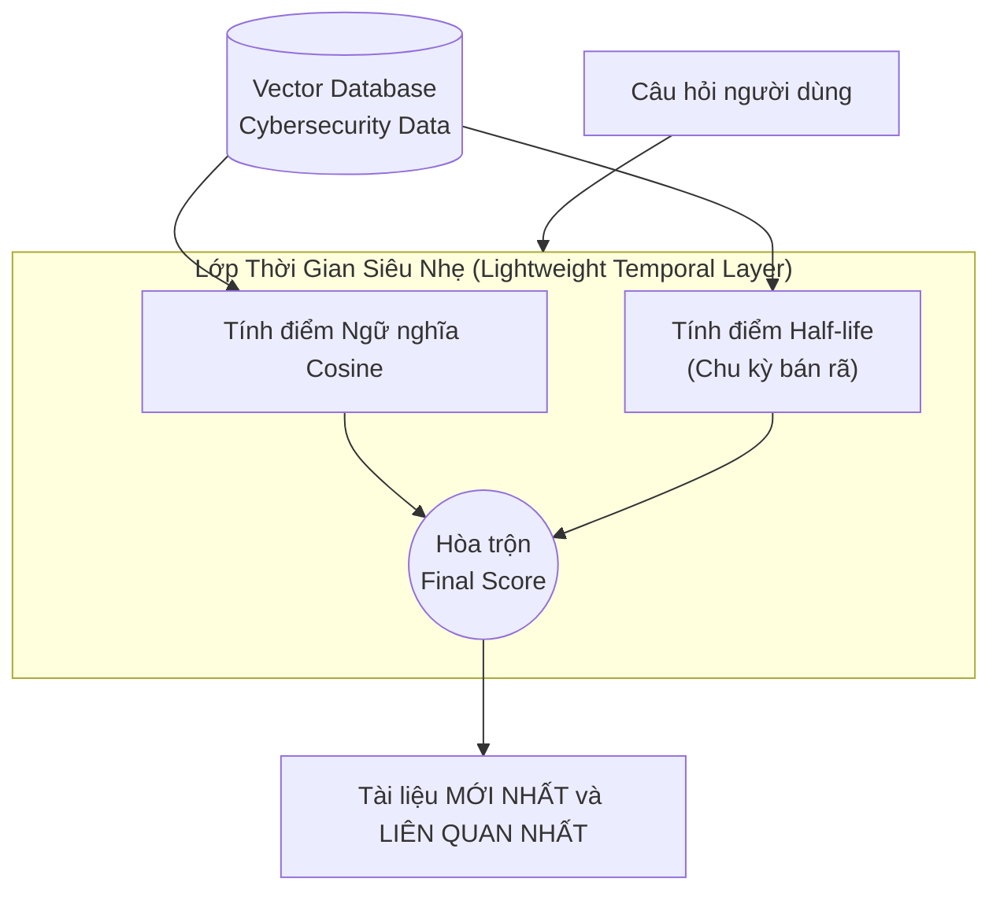
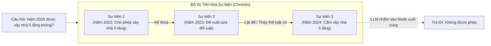
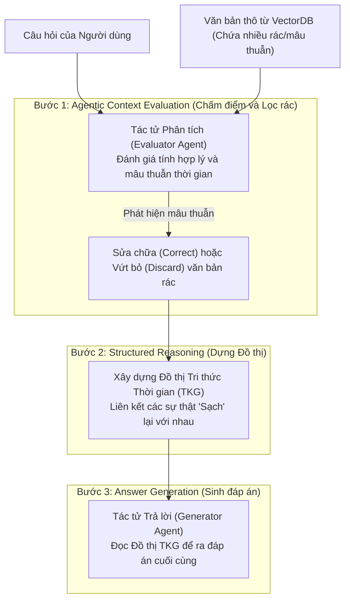

# Cơ chế 3 — Conflict Resolution (Giải quyết Xung đột / Mâu thuẫn)

> Tổng hợp các tài liệu nghiên cứu trong thư mục [`conflict_resolution/`](./conflict_resolution/). Mục tiêu của Cơ chế 3: khi có thông tin **mâu thuẫn** về cùng một vấn đề, xác định đâu là sự thật hiện hành (lọc bỏ cái sai/cái cũ). Ba nguyên nhân cần xử lý: **Semantic Bias** của VectorDB, **nhiễu nguồn tin cùng timestamp**, và **thay thế ngầm (Implicit Supersede / Knowledge Drift)**.

## Bảng tổng quan

| # | Bài báo | arXiv | GitHub | Đồ án cần? |
|---|---|---|---|---|
| 01 | Re-ranking kép Thời gian + Uy tín (kế thừa TimelyRAG) | ⚠️ Thiết kế của nhóm, dựa trên [TimelyRAG 2609.11572](https://arxiv.org/abs/2609.11572) | [TimelyRAG ✅](https://github.com/kaist-dmlab/TimelyRAG) | 🟢 **Core Logic** cho Cơ chế 3 |
| 02 | Freshness & Limits of Heuristic Trend Detection | [2509.19376](https://arxiv.org/abs/2509.19376) | ❌ Không đề cập | 🟢 Cần (Half-life + luận cứ bảo vệ) |
| 03 | Chronos — RAG or Learning? (Knowledge Drift) | [2604.05096](https://arxiv.org/abs/2604.05096) | ❌ Không đề cập | 🟢 Cần (Related Works + Evolution Graph) |
| 04 | RASTeR — Agentic Temporal Reasoning | [2406.19538](https://arxiv.org/abs/2406.19538) | ❌ Repo đã ẩn/xóa | 🟡 Chỉ lấy logic lọc Triplet, đưa về offline |

---

## 01. Re-ranking kép Thời gian + Uy tín (Conflict Logic kế thừa TimelyRAG)

- **Tên:** Xử lý Xung đột Dữ liệu & Cập nhật Luồng tin — Thuật toán Re-ranking kép
- **Link bài báo:** ⚠️ **Không phải một bài báo riêng** — là thiết kế của nhóm, kế thừa tư tưởng **TimelyRAG** ([arXiv 2609.11572](https://arxiv.org/abs/2609.11572))
- **GitHub:** [kaist-dmlab/TimelyRAG](https://github.com/kaist-dmlab/TimelyRAG) (gốc tham khảo)
- **File phân tích chi tiết:** [01_TimelyRAG_Conflict_Logic.md](./conflict_resolution/01_TimelyRAG_Conflict_Logic.md)

**Nói về vấn đề gì:** Hai dạng xung đột trong luồng tin:
1. **Xung đột tuyến tính (ghi đè/đính chính):** Ngày 1 "A là nghi phạm" → Ngày 3 "B là hung thủ, A bị oan". Cả 2 bài đều chứa từ khóa giống nhau → RAG dễ đọc nhầm bài cũ.
2. **Xung đột đa nguồn (cùng thời điểm):** Báo chính thống nói "B là hung thủ", blog nói "A đã nhận tội" → thời gian hòa, phải xét độ tin cậy.

**Làm gì:**
- Thêm tầng Re-ranker với công thức:
  `Final_Score = W1·Semantic + W2·Temporal + W3·Credibility`
  - `Temporal`: Exponential Decay theo khoảng cách ngày → trị xung đột tuyến tính.
  - `Credibility`: điểm uy tín nguồn gán sẵn vào metadata (Báo lớn = 1.0, Blog = 0.3–0.5) → trị xung đột đa nguồn.
- Pipeline 3 bước: Retrieval Top-K → Re-ranking → LLM chỉ đọc Top đầu.

**Giải quyết vấn đề nào của đồ án:** Cơ chế 3 — Semantic Bias (nguyên nhân 1) và Nhiễu nguồn tin cùng timestamp (nguyên nhân 2); hỗ trợ truy xuất trạng thái sự việc tại bất kỳ mốc thời gian nào.

**Ưu điểm:**
- Đơn giản, chỉ là hàm tính điểm Python, không cần train.
- Giải quyết được cả 2 dạng xung đột trong một công thức.
- Dễ giải thích, dễ minh họa khi demo.

**Nhược điểm:**
- Credibility gán cứng thủ công, khó mở rộng/khách quan.
- Phải tune 3 trọng số `W1, W2, W3` và hệ số decay theo domain.
- Không xử lý được thay thế ngầm khi tài liệu không có quan hệ rõ ràng (cần Chronos — mục 03).

**Đồ án có cần không:** 🟢 **Rất cần — Core Logic** cho Cơ chế 3.

*(File gốc không có sơ đồ Mermaid.)*

---

## 02. Freshness and the Limits of Heuristic Trend Detection in Temporal RAG

- **Tên bài báo:** Freshness and the Limits of Heuristic Trend Detection in Temporal RAG
- **Link bài báo:** [arXiv 2509.19376](https://arxiv.org/abs/2509.19376) (09/2025)
- **GitHub:** ❌ Không đề cập
- **File phân tích chi tiết:** [02_Freshness_and_Trend_RAG.md](./conflict_resolution/02_Freshness_and_Trend_RAG.md)

**Nói về vấn đề gì:** Giới nghiên cứu hay gộp chung 2 bài toán khác nhau: **Freshness** (lấy tin mới nhất mà vẫn liên quan — ~Cơ chế 3) và **Topic Evolution** (theo dõi sự kiện thay đổi — ~Cơ chế 2). Thử nghiệm trên dữ liệu an ninh mạng NVD CVE (cập nhật liên tục), nhưng thuật toán model-agnostic.

**Làm gì:**
- **Half-life Prior** (lớp thời gian siêu nhẹ): `S_time = 0.5 ^ (Δt / T_half)`, nhân/cộng với điểm Cosine.
  - `T_half` tùy domain: tin tức nóng 1–7 ngày, luật/thuế ~365 ngày.
  - Kết quả: `Latest@10 = 0.60` so với **"Semantic-then-newest"** (filter cứng) chỉ `0.20`.
- **Phê bình thực nghiệm Topic Evolution:** gom cụm HDBSCAN + heuristic gán nhãn để dựng timeline chỉ đạt Macro-F1 = 0.08 → heuristic không đáng tin.
- Bản chất: không phát minh thuật toán mới, đóng vai trò **"trọng tài thực nghiệm"**.

**Giải quyết vấn đề nào của đồ án:**
- Cơ chế 3: chứng minh decay-based re-ranking tốt hơn filter cứng; hướng dẫn chọn `T_half`.
- Cơ chế 2: luận cứ cho việc dùng LLM tổng hợp timeline thay vì clustering heuristic.

**Ưu điểm:**
- Có số liệu cụ thể để trích dẫn khi bảo vệ (0.60 vs 0.20; F1 = 0.08).
- Công thức Half-life trực quan, tham số có ý nghĩa vật lý dễ giải thích.
- Phân định rõ Freshness vs Evolution — khớp với ranh giới Cơ chế 2/3 của đồ án.

**Nhược điểm:**
- Không có đóng góp thuật toán mới.
- Domain thử nghiệm (CVE) khác domain đồ án.

**Đồ án có cần không:** 🟢 **Cần** — không viết code mới (đã có TimelyRAG/01), nhưng dùng công thức Half-life cho `Temporal_Score` và đưa vào **Tài liệu tham khảo** để trả lời phản biện *"Sao không filter lấy bài mới nhất?"* / *"Sao không gom cụm sự kiện?"*.

**Mermaid — Lightweight Temporal Layer:**

---

## 03. Chronos — RAG or Learning? (Continuous Knowledge Drift)

- **Tên bài báo:** RAG or Learning? Understanding the Limits of LLM Adaptation under Continuous Knowledge Drift in the Real World
- **Link bài báo:** [arXiv 2604.05096](https://arxiv.org/abs/2604.05096) (04/2026)
- **GitHub:** ❌ Không đề cập
- **File phân tích chi tiết:** [03_Chronos_Knowledge_Drift.md](./conflict_resolution/03_Chronos_Knowledge_Drift.md)

**Nói về vấn đề gì:** **Knowledge Drift** — thế giới liên tục thay đổi (luật mới thay luật cũ). Hai cách hiện tại đều thất bại:
1. **Fine-tuning / Knowledge Editing** → *Catastrophic Forgetting* (học mới quên cũ, mất khả năng suy luận lịch sử).
2. **Vector RAG truyền thống** → *Temporal Inconsistency* (lôi cả luật cũ lẫn mới, LLM rối).

**Làm gì:**
- Đề xuất **Chronos** — time-aware retrieval với **Event Evolution Graph**:
  1. Sắp xếp bằng chứng thành cây tiến hóa thay vì ném đống tài liệu lộn xộn.
  2. Tự động gắn cạnh quan hệ tiến hóa giữa các bằng chứng mâu thuẫn, VD `[Lật đổ / Thay thế]`.
  3. Prompt nhận thức thời gian: yêu cầu LLM căn cứ vào node cuối của dòng tiến hóa để trả lời.
- Không cần huấn luyện thêm (no additional training).

**Giải quyết vấn đề nào của đồ án:** Cơ chế 3 — nguyên nhân 3: **Implicit Supersede** (văn bản mới âm thầm phủ định văn bản cũ mà không ghi rõ). Đồng thời là luận cứ cho lý do tồn tại của đề tài: Memory/RAG an toàn hơn re-train.

**Ưu điểm:**
- Rất mới (2026), có số liệu chứng minh RAG > Learning khi kiến thức trôi dạt.
- Dán nhãn quan hệ "thay thế" rõ ràng → LLM hiểu được thứ tự hiệu lực.
- Không tốn chi phí training.

**Nhược điểm:**
- Cần bước xây dựng đồ thị tiến hóa (LLM xác định quan hệ) → tốn chi phí/độ phức tạp.
- Không thấy code public.

**Đồ án có cần không:** 🟢 **Cần** — đưa vào **Related Works** của Cơ chế 3 (bảo vệ tính khả thi của đồ án); ý tưởng Evolution Graph là giải pháp đề xuất cho Implicit Supersede (`[Sự thật 2024] --(Thay thế)--> [Sự thật 2020]`).

**Mermaid — Kiến trúc Chronos:**

---

## 04. RASTeR — Robust, Agentic, and Structured Temporal Reasoning

- **Tên bài báo:** RASTeR: Robust, Agentic, and Structured Temporal Reasoning
- **Link bài báo:** [arXiv 2406.19538](https://arxiv.org/abs/2406.19538) (06/2024)
- **GitHub:** ❌ Tác giả đã ẩn/xóa repo (logic prompt mô tả chi tiết trong paper)
- **File phân tích chi tiết:** [04_RASTeR_Agentic.md](./conflict_resolution/04_RASTeR_Agentic.md)

**Nói về vấn đề gì:** Context từ VectorDB là "đống cỏ khô" lẫn thông tin **Irrelevant**, **Outdated**, **Temporally Inconsistent** → LLM ảo giác; RAG thường thất bại ở bài test needle-in-a-haystack (1 sự thật giữa 40 đoạn nhiễu).

**Làm gì:** Tách khâu đánh giá ngữ cảnh khỏi khâu sinh câu trả lời bằng luồng đa tác tử:
1. **Evaluator Agent** — so khớp chéo bằng Triplet:
   - *Conflict:* 2 triplet cùng Subject + Relation nhưng khác Object.
   - *Outdated:* trong cặp xung đột, bản có timestamp cũ hơn so với câu hỏi.
   - *Irrelevant:* Relation lệch với triplet mục tiêu trích từ câu hỏi (VD: hỏi `(OpenAI, CEO, ?)` mà đoạn văn nói `(OpenAI, ra_mắt, GPT-4)`).
   - Hành động: **Discard** toàn đoạn nếu chỉ chứa sự thật lỗi thời; **Correct** nếu chỉ một câu lỗi thời.
2. **On-the-fly TKG:** dựng mini Temporal KG trong RAM từ thông tin sạch, dùng xong bỏ.
3. **Generator Agent:** đọc TKG sạch để trả lời.
- Kết quả: ~75% accuracy dù bị nhồi 40 đoạn nhiễu (hơn top-2 khoảng 12%).

**Giải quyết vấn đề nào của đồ án:** Cơ chế 3 — logic phát hiện xung đột/lỗi thời bằng Triplet; và gợi ý về tính **Agentic** của hệ thống.

**Ưu điểm:**
- Robustness rất cao trước nhiễu và tin đính chính.
- Logic phát hiện mâu thuẫn chặt chẽ, giải thích được.

**Nhược điểm:**
- Chạy lúc truy vấn → nhiều vòng LLM, latency 10–20 giây (UX kém).
- Chi phí API tăng mạnh vì LLM đọc lại toàn bộ rác mỗi lần hỏi.
- Không có code public.

**Đồ án có cần không:** 🟡 **Chỉ tham khảo logic** — lấy thuật toán so sánh Triplet nhưng **chuyển về giai đoạn Offline Ingestion** (làm sạch và dựng Graph sẵn như TG-RAG/Hybrid) thay vì chạy realtime.
- Ghi chú thêm từ phân tích: không cần RASTeR mới gọi là *Agentic* — việc hệ thống tự Query Rewriting, tự định tuyến Vector/Graph, tự chia Bucket đã là **Routing Agent**. Khuyến nghị dùng **LangGraph** để hiện thực hóa thành State Machine (có cạnh vòng lặp quay lại tìm kiếm khi lọc mâu thuẫn thất bại).

**Mermaid — Luồng đa tác tử RASTeR:**

---

## Kết luận cho Cơ chế 3

| Nguyên nhân xung đột (theo Scope) | Giải pháp | Nguồn |
|---|---|---|
| 1. Semantic Bias của VectorDB | Re-ranking với Temporal Decay / Half-life | 01, 02 (+ TimelyRAG) |
| 2. Nhiễu nguồn tin cùng timestamp | Thêm `Credibility_Score` vào Re-ranker | 01 |
| 3. Implicit Supersede / Knowledge Drift | Event Evolution Graph với cạnh `[Thay thế]` | 03 (Chronos) |
| Phát hiện conflict/outdated/irrelevant | So khớp Triplet — chạy ở **offline ingestion** | 04 (RASTeR) |
| Tính Agentic của hệ thống | Routing Agent trên LangGraph | 04 (phân tích) |
