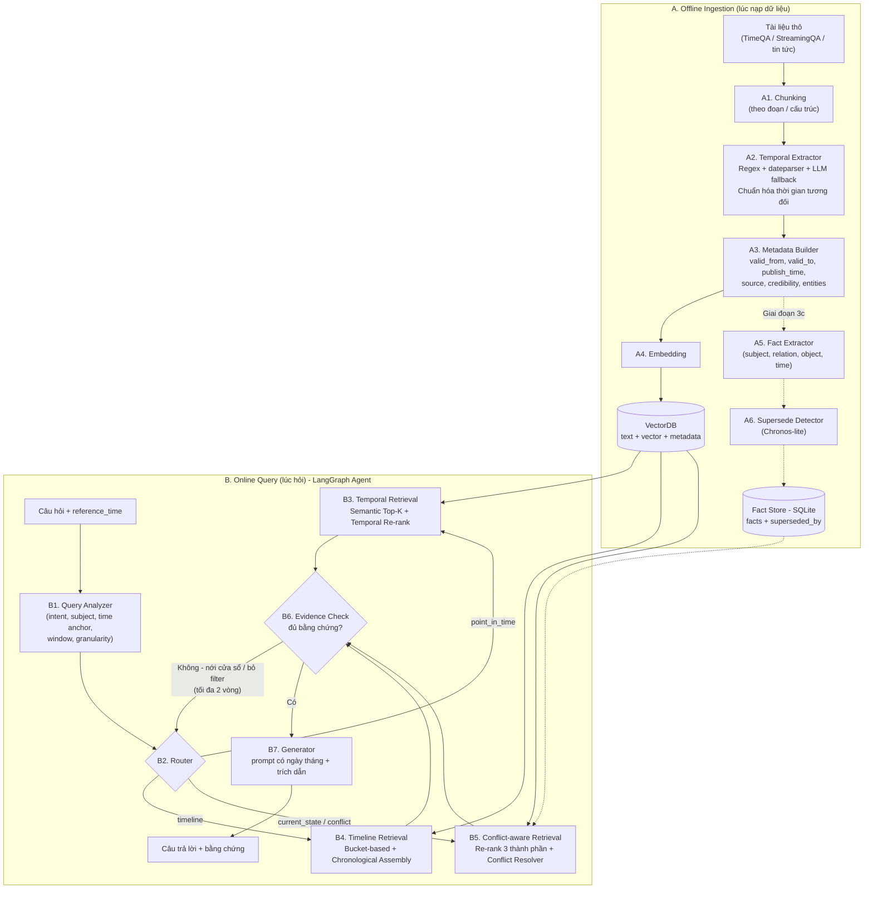
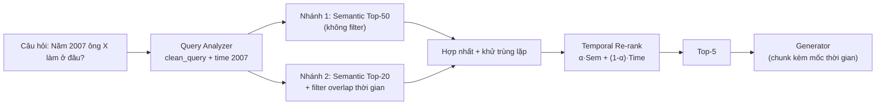
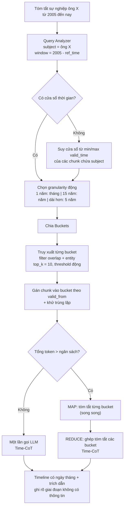
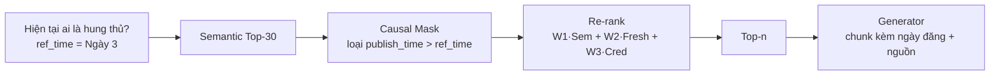
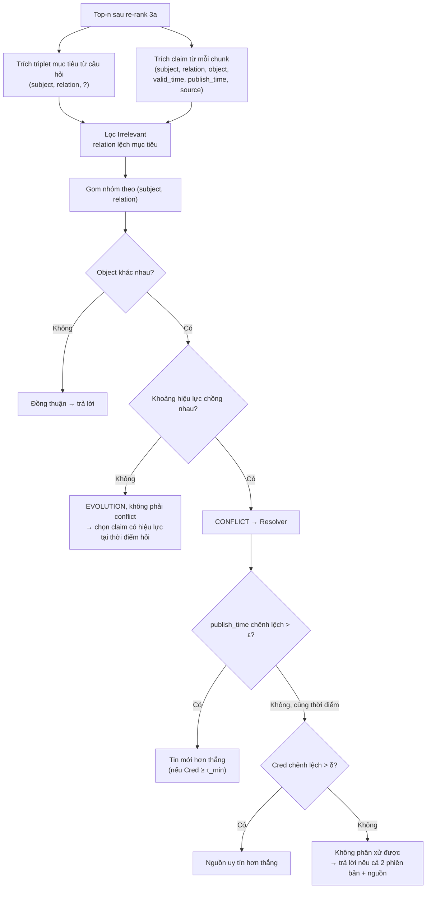
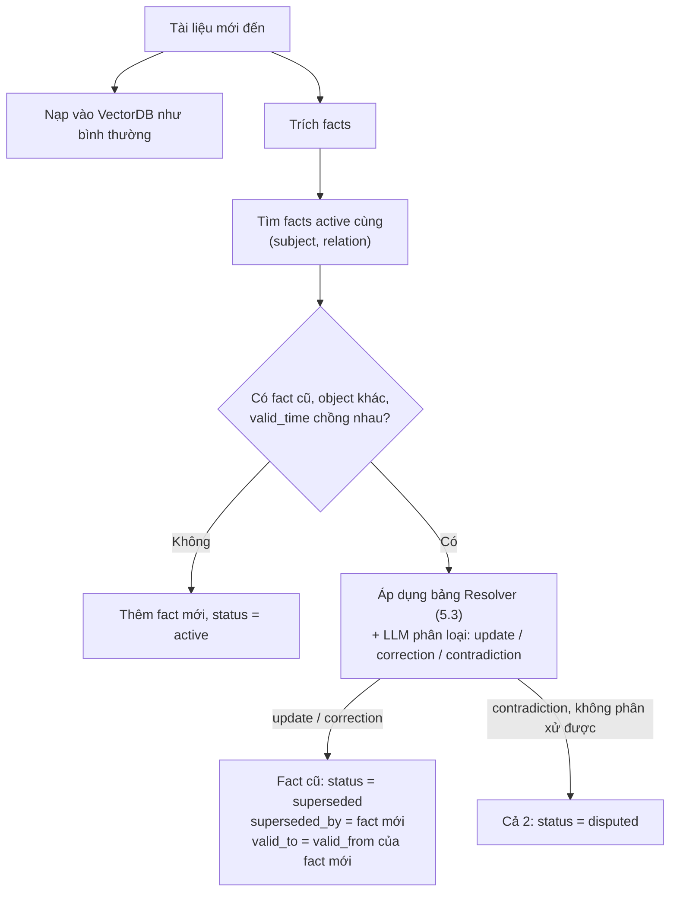
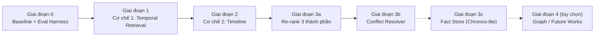

# Thiết kế Kiến trúc Ban đầu (Initial Base Design) — Time-Aware Agentic Memory

> Tài liệu này đề xuất **một kiến trúc thống nhất** xử lý cả 3 loại câu hỏi/cơ chế của đề tài, dựa trên đánh giá các bài báo trong:
> - [01_RAG_METHODs.md](./01_RAG_METHODs.md) — các phương pháp RAG nền tảng
> - [02_TEMPORAL_INFO_RETRIEVAL.md](./02_TEMPORAL_INFO_RETRIEVAL.md) — Cơ chế 1
> - [03_TIMELINE_SUMMARIZATION.md](./03_TIMELINE_SUMMARIZATION.md) — Cơ chế 2
> - [04_CONFLICT_RESOLUTION.md](./04_CONFLICT_RESOLUTION.md) — Cơ chế 3
> - Phạm vi đề tài: [01_PROJECT_SCOPE.md](../scope/01_PROJECT_SCOPE.md)
>
> Đồng thời đưa ra **thứ tự triển khai** (không làm hết), chỉ rõ với mỗi cơ chế thì **làm phần nào, bỏ phần nào**.

---

## 0. Nguyên tắc thiết kế (Design Principles)

| # | Nguyên tắc | Lý do / Nguồn |
|---|---|---|
| P1 | **Một kho dữ liệu, nhiều chiến lược truy xuất.** Dùng chung 1 VectorDB + metadata thời gian cho cả 3 cơ chế; chỉ khác nhau ở tầng truy xuất/xếp hạng/tổng hợp. | Tránh 3 hệ thống rời rạc; dễ so sánh với baseline. |
| P2 | **Không fine-tune model.** Dùng embedding/LLM public, "time-aware" nằm ở tiền xử lý + re-ranking + agent. | TempRetriever (fine-tune) và TMRL (train lại vector) tốn GPU, không hợp phạm vi đồ án. |
| P3 | **Mô hình 2 trục thời gian (Bi-temporal).** Tách *thời gian hiệu lực của sự kiện* (`valid_time`) và *thời gian thông tin được công bố* (`publish_time`). | Đây là chìa khóa phân định Cơ chế 1 (hỏi theo `valid_time`) và Cơ chế 3 (cập nhật theo `publish_time`). |
| P4 | **Không lọc cứng, chỉ chấm điểm mềm.** Không vứt tài liệu cũ khỏi DB, dùng decay để xếp hạng. | TimelyRAG: recency filter cứng chết ở câu hỏi quá khứ; Freshness paper: Half-life 0.60 vs Semantic-then-newest 0.20. |
| P5 | **Việc nặng làm lúc nạp (offline), việc nhẹ làm lúc hỏi (online).** | Bài học từ RASTeR (chạy realtime → 10–20s, đốt API). |
| P6 | **Graph là phần mở rộng, không phải lõi MVP.** Lõi chạy trên VectorDB + bảng quan hệ (SQLite); Graph (Neo4j) để giai đoạn sau. | DyG-RAG / TG-RAG mạnh nhưng chi phí cao; TA-RAG chứng minh làm được Cơ chế 2 chỉ với VectorDB. |
| P7 | **Ranh giới Evolution vs Conflict được mã hóa bằng logic, không để LLM tự đoán.** Hai sự thật chỉ là *xung đột* khi **khoảng hiệu lực chồng nhau** và giá trị khác nhau trên một **quan hệ đơn trị**. | Đúng định nghĩa ranh giới Cơ chế 2/3 trong Scope (GĐ 2005 → CT 2007 là tiến hóa, không phải xung đột). |

---

## 1. Kiến trúc tổng thể

### 1.1 Sơ đồ tổng quan



### 1.2 Mô hình dữ liệu (Schema metadata của mỗi chunk)

Đây là "hợp đồng dữ liệu" dùng chung cho cả 3 cơ chế:

| Trường | Kiểu | Ý nghĩa | Dùng cho |
|---|---|---|---|
| `chunk_id` | str | ID duy nhất (dùng làm pointer nếu sau này có Graph) | Tất cả |
| `doc_id` | str | Tài liệu gốc | Tất cả |
| `text` | str | Nội dung chunk (có thể kèm câu ngữ cảnh — Contextual Retrieval) | Tất cả |
| `entities` | list[str] | Thực thể chính (tên người, tổ chức...) | Cơ chế 2 (lọc theo chủ thể), 3 |
| `valid_from` | int (Unix ts) | Thời điểm sự kiện/sự thật bắt đầu đúng | Cơ chế 1, 2 |
| `valid_to` | int (Unix ts) \| null | Thời điểm hết đúng (`null` = chưa rõ/đang đúng) | Cơ chế 1, 2 |
| `time_granularity` | enum | `day` / `month` / `year` — độ chính xác của mốc trích được | Cơ chế 1 (dung sai) |
| `time_source` | enum | `explicit` / `relative_resolved` / `publish_fallback` / `none` | Debug, đánh giá |
| `publish_time` | int (Unix ts) \| null | Ngày bài viết được công bố (tin tức có; Wikipedia/TimeQA thường không) | Cơ chế 3 |
| `source` | str | Tên nguồn | Cơ chế 3 |
| `credibility` | float [0,1] | Điểm uy tín nguồn (tra từ bảng cấu hình) | Cơ chế 3 |

> [!IMPORTANT]
> **Thời gian lưu dạng Unix timestamp với 2 đầu mút** (`valid_from`, `valid_to`), không lưu mảng năm. Đây là bài học từ phân tích TA-RAG: mảng năm sụp đổ khi cần độ chi tiết ngày/giờ, còn 2 đầu mút cho phép truy vấn overlap một dòng: `valid_from <= window_end AND valid_to >= window_start`.

### 1.3 Trục thời gian kép (Bi-temporal) — vì sao cần

| | `valid_time` (thời gian hiệu lực) | `publish_time` (thời gian công bố) |
|---|---|---|
| Câu hỏi trả lời | "Sự thật này đúng **trong khoảng nào**?" | "Hệ thống **biết** thông tin này **từ khi nào**?" |
| Ví dụ | "Ông A làm GĐ từ 2014 đến 2016" → `[2014, 2016]` | Bài báo đăng ngày 15/10/2023 |
| Cơ chế chính | **Cơ chế 1** (hỏi "Năm 2005 ai là...?"), **Cơ chế 2** (xếp timeline) | **Cơ chế 3** (tin nào mới hơn ghi đè tin cũ; trạng thái "tính đến ngày T") |

Ví dụ phân biệt: *"Ngày 1 báo nói A là nghi phạm, ngày 3 báo nói B là hung thủ"* — hai tin có **cùng `valid_time`** (cùng nói về vụ án), nhưng **khác `publish_time`** → đây là xung đột → Cơ chế 3 dùng `publish_time` để phân xử. Còn *"GĐ 2005, CT 2007"* có **`valid_time` khác nhau, không chồng nhau** → tiến hóa → Cơ chế 2.

---

## 2. Thành phần dùng chung (làm trước tiên, phục vụ cả 3 cơ chế)

### 2.1 A2 — Temporal Extractor (tiền xử lý thời gian)

**Nguồn:** TempRetriever (pipeline tách thời gian khỏi văn bản), Survey (Event Dating / Document Dating), Scope (vấn đề "thời gian tương đối").

Chiến lược 3 tầng, rẻ trước đắt sau:

1. **Regex + `dateparser`** cho mốc tường minh: `"from 2006 to 2009"`, `"in March 2015"`, `"15/10/2023"`.
2. **Chuẩn hóa thời gian tương đối** theo `publish_time` của tài liệu: `"tuần trước"`, `"last year"` → mốc tuyệt đối. Nếu tài liệu không có `publish_time` → đánh dấu `time_source = none`, **không đoán**.
3. **LLM fallback** (structured output JSON) chỉ cho chunk mà regex không bắt được hoặc bắt ra quá nhiều mốc mơ hồ. Prompt yêu cầu trả về `{valid_from, valid_to, granularity}`.

Quy tắc chuẩn hóa:
- Chỉ có năm `2006` → `valid_from = 2006-01-01`, `valid_to = 2006-12-31`, `granularity = year`.
- `"from 2006"` không có điểm kết thúc → `valid_to = null`.
- Nhiều mốc trong 1 chunk → lấy `min` làm `valid_from`, `max` làm `valid_to` (chấp nhận thô ở MVP; chunk nhỏ thì sai số nhỏ).
- Không có mốc nào → nếu có `publish_time` thì `valid_* = publish_time` (`time_source = publish_fallback`), nếu không thì để trống.

> [!TIP]
> Chạy Temporal Extractor **một lần** lúc nạp và cache lại kết quả (JSONL). Thống kê tỷ lệ chunk có/không có thời gian — con số này cần đưa vào báo cáo.

### 2.2 B1 — Query Analyzer (phân tích câu hỏi)

**Nguồn:** TA-RAG (Query Disentanglement), Survey (Query Time Profiling, Implicit Temporal Intent), Scope (Time-aware Query Rewriting).

Một lần gọi LLM với structured output:

```json
{
  "intent": "point_in_time | timeline | current_state",
  "clean_query": "which institution employed Sabine Hossenfelder",
  "subject": "Sabine Hossenfelder",
  "time_anchor": {
    "type": "explicit | implicit_now | implicit_relative | none",
    "start": "2006-01-01",
    "end": "2009-12-31"
  },
  "granularity": "day | month | year"
}
```

- `reference_time` được truyền vào từ ngoài (mặc định = hôm nay; khi chạy benchmark = ngày hỏi của dataset, VD StreamingQA có question date). Mọi biểu thức "hiện tại", "năm ngoái", "gần đây" được giải theo `reference_time`.
- **Chính sách mặc định khi không có mốc thời gian** (lựa chọn thiết kế của nhóm, theo mục 5 của Scope): coi như hỏi **trạng thái hiện tại** (`intent = current_state`, `time_anchor = implicit_now`) và **ghi rõ trong câu trả lời** "tính đến <reference_time>".
- Có thể làm bản rule-based (regex từ khóa "hiện tại / năm X / từ X đến Y / tóm tắt / diễn biến") làm fallback và để so sánh chi phí.

### 2.3 B2 — Router & Agent (LangGraph)

**Nguồn:** Phân tích RASTeR (Agentic = tự quyết định + tự gọi tool, không cần đa tác tử realtime), khuyến nghị LangGraph.

- Mỗi khối B1…B7 là một node trong `StateGraph`. State chứa: `query`, `analysis`, `candidates`, `evidence`, `retry_count`, `answer`.
- **Vòng lặp tự sửa (B6 Evidence Check):** nếu không có bằng chứng vượt ngưỡng → nới cửa sổ thời gian ±1 đơn vị granularity hoặc bỏ metadata filter → thử lại (tối đa 2 vòng) → nếu vẫn không có thì trả lời "không đủ thông tin" (chống ảo giác).
- Đây là phần thể hiện tính **"Agentic"** của đề tài mà không phải trả giá latency như RASTeR.

---

## 3. Cơ chế 1 — Temporal Retrieval: triển khai phần nào

### 3.1 Chọn gì / Bỏ gì

| Thành phần | Quyết định | Nguồn |
|---|---|---|
| Tiền xử lý tách thời gian → metadata | ✅ **Làm** (mục 2.1) | TempRetriever |
| Query Time Profiling / Query Rewriting | ✅ **Làm** (mục 2.2) | Survey, TA-RAG |
| Fusion điểm Semantic + Temporal ở tầng re-rank | ✅ **Làm — lõi** | TimelyRAG, TempRetriever (ý tưởng 3.1) |
| Lưu song song nhiều phiên bản, không xóa bản cũ | ✅ **Làm** | TimelyRAG |
| Time Encoder (vector thời gian học được) + Negative Sampling | ❌ **Bỏ** (cần fine-tune) | TempRetriever 3.2 |
| Matryoshka / Temporal Subspace | ❌ **Bỏ** → Future Works | TMRL |

### 3.2 Luồng xử lý



**Vì sao truy xuất 2 nhánh?** Nhánh có filter cho độ chính xác cao, nhưng nếu Temporal Extractor gán sai/thiếu thời gian thì filter cứng sẽ giết recall. Nhánh không filter là lưới an toàn; re-rank sẽ quyết định cuối cùng (nguyên tắc P4).

### 3.3 Công thức chấm điểm thời gian (cải tiến cho dữ liệu dạng khoảng)

TimelyRAG dùng `exp(-λ·|t_q − t_doc|)` với một mốc duy nhất. Dữ liệu TimeQA/Wikipedia là **khoảng** (`2006–2009`), nên dùng phiên bản theo khoảng:

$$
\text{Time}(q, d) =
\begin{cases}
1 & \text{nếu } [q_s, q_e] \cap [d_{from}, d_{to}] \neq \emptyset \\
0.5^{\,\Delta / T_{half}} & \text{ngược lại, } \Delta = \text{khoảng cách tới đầu mút gần nhất} \\
0.5 & \text{nếu tài liệu không có thời gian (trung tính, không phạt chết)}
\end{cases}
$$

$$
\text{Final}(q,d) = \alpha \cdot \widehat{\text{Sem}}(q,d) + (1-\alpha)\cdot \text{Time}(q,d)
$$

- $\widehat{\text{Sem}}$: điểm cosine **chuẩn hóa min-max trong tập ứng viên** (để hai thành phần cùng thang).
- Với `intent = current_state` (không có khoảng, chỉ có "hiện tại"): `Time = 0.5^((ref_time − d_from)/T_half)` nếu `d_to` là null hoặc ≥ ref_time thì cho 1.
- Tham số ban đầu: `α = 0.6`, `T_half = 1 năm` cho TimeQA; **tune trên tập dev** (grid search α ∈ {0.3…0.8}).

```python
def time_score(q_start, q_end, d_from, d_to, t_half):
    if d_from is None:
        return 0.5                        # không có thời gian -> trung tính
    d_to = d_to if d_to is not None else d_from
    if d_from <= q_end and d_to >= q_start:
        return 1.0                        # chồng lấn -> khớp hoàn toàn
    gap = (d_from - q_end) if d_from > q_end else (q_start - d_to)
    return 0.5 ** (gap / t_half)

def rerank(cands, q, alpha=0.6, t_half=YEAR):
    sems = [c.sem for c in cands]
    lo, hi = min(sems), max(sems)
    for c in cands:
        sem_n = (c.sem - lo) / (hi - lo + 1e-9)
        c.final = alpha * sem_n + (1 - alpha) * time_score(q.start, q.end, c.valid_from, c.valid_to, t_half)
    return sorted(cands, key=lambda c: c.final, reverse=True)
```

### 3.4 Generator prompt

Mỗi chunk đưa vào prompt kèm nhãn `[Hiệu lực: 2006–2009]`. Yêu cầu LLM: chỉ trả lời dựa trên chunk có hiệu lực bao trùm mốc hỏi; nếu không có thì nói không đủ thông tin.

### 3.5 Đánh giá Cơ chế 1

- **Dataset:** TimeQA (easy + hard split).
- **Metric:** EM / F1; Recall@k của retrieval (chunk chứa đáp án có nằm trong top-k không); **Accuracy theo time slice** (chia câu hỏi theo thập kỷ) để phát hiện thiên lệch về mốc mới/cũ.
- **Ablation (bắt buộc để chứng minh đóng góp):**

| Cấu hình | Mô tả |
|---|---|
| B0 | Naive RAG (semantic top-k) |
| B1 | B0 + hard filter theo năm (giống "version filter") |
| B2 | B0 + temporal re-rank (không query analyzer, chỉ regex năm) |
| **Ours** | Query Analyzer + 2 nhánh + temporal re-rank |

---

## 4. Cơ chế 2 — Timeline Summarization: triển khai như thế nào

### 4.1 Chọn gì / Bỏ gì

| Thành phần | Quyết định | Nguồn |
|---|---|---|
| Query Disentanglement (chủ thể + cửa sổ) | ✅ **Làm** (dùng lại B1) | TA-RAG |
| Temporal Bucket + Top-K rộng + Threshold động | ✅ **Làm — lõi** | TA-RAG |
| Sắp xếp theo thời gian + Time-CoT prompt | ✅ **Làm** (bản nhẹ, không cần Graph) | DyG-RAG (ý tưởng Time-CoT) |
| Map-Reduce theo bucket khi quá nhiều bằng chứng | ✅ **Làm** — thay cho Graph để chống tràn context | Giải pháp nhóm, thay thế phần "pre-compression" của Hybrid (03) |
| Khử trùng lặp | ✅ **Làm** (cosine-based) | Hybrid (03) — dedup |
| Event Graph (DEU) / Neo4j / Bi-Level Graph | ⏸️ **Để giai đoạn 4 (tùy chọn)** | DyG-RAG, TG-RAG |
| Clustering HDBSCAN + heuristic gán nhãn | ❌ **Không làm** (F1 = 0.08) | Freshness paper |

### 4.2 Luồng xử lý



### 4.3 Chi tiết từng bước

**Bước 1 — Cửa sổ & granularity.**
- Nếu câu hỏi không có cửa sổ ("Tóm tắt sự nghiệp ông X") → truy vấn metadata các chunk có `entities ∋ X` (hoặc semantic top-50 theo subject) → `window = [min(valid_from), max(valid_to)]`.
- Granularity động (TA-RAG): cửa sổ ≤ 1 năm → bucket tháng; ≤ 15 năm → bucket năm; dài hơn → bucket 5 năm. **Giới hạn ≤ 20 bucket** để kiểm soát số lần truy vấn.

**Bước 2 — Truy xuất từng bucket.**
- Filter overlap: `valid_from <= bucket_end AND (valid_to >= bucket_start OR valid_to IS NULL)`.
- Thêm filter thực thể nếu metadata `entities` đủ tin cậy (tăng precision).
- `top_k = 10` mỗi bucket, sau đó **threshold động**: giữ chunk có `sim >= max(τ_abs, sim_top1_global − δ)`. Dùng ngưỡng tương đối vì giá trị cosine tuyệt đối thay đổi theo model embedding (0.75 của model này ≠ 0.75 của model khác) → **phải calibrate τ, δ trên tập dev**.
- Bucket rỗng → giữ `[]`, không bỏ — để LLM viết "giai đoạn 2010–2012 không có thông tin" (grounded, theo TA-RAG).

**Bước 3 — Gán & khử trùng lặp.**
- Chunk có khoảng dài (VD 2014–2016) sẽ rơi vào nhiều bucket → **chỉ gán vào bucket chứa `valid_from`**, các bucket sau chỉ tham chiếu ("tiếp tục từ 2014").
- Hai chunk có cosine > 0.95 → giữ 1, ưu tiên chunk có thời gian chi tiết hơn (`granularity` nhỏ hơn).

**Bước 4 — Tổng hợp (chống Context Window Explosion không cần Graph).**
- Ước lượng token của toàn bộ bằng chứng. Nếu vượt ngân sách (VD 8K token):
  - **MAP:** mỗi bucket → LLM tóm tắt thành danh sách sự kiện ngắn `[(ngày, sự kiện, chunk_id)]` (gọi song song).
  - **REDUCE:** ghép các danh sách theo thứ tự thời gian → LLM viết timeline cuối.
- Đây là bản "pre-compression lúc truy vấn" thay cho Graph của Hybrid (03) — rẻ hơn về hạ tầng, đắt hơn một chút về token, nhưng đủ cho quy mô đồ án.

**Bước 5 — Time-CoT prompt (ý tưởng DyG-RAG):**
```
Các bằng chứng dưới đây đã được SẮP XẾP THEO THỜI GIAN, nhóm theo giai đoạn.
1. Duyệt lần lượt từng giai đoạn từ cũ đến mới.
2. Với mỗi giai đoạn, liệt kê sự kiện kèm mốc thời gian và [chunk_id].
3. Giai đoạn không có bằng chứng: ghi "Không có thông tin". KHÔNG suy đoán.
4. Các thay đổi (chức vụ, nơi làm việc...) là TIẾN TRÌNH, không phải mâu thuẫn.
```

### 4.4 Đánh giá Cơ chế 2

TimeQA không có sẵn "timeline chuẩn", nên **tự dựng gold timeline**: với mỗi thực thể, gom tất cả cặp (câu hỏi có mốc thời gian, đáp án) của TimeQA → danh sách `(sự kiện, khoảng thời gian)` chuẩn.

| Metric | Ý nghĩa |
|---|---|
| **Event Recall / Precision** | Tỷ lệ sự kiện gold xuất hiện trong timeline sinh ra (so khớp bằng LLM-as-judge) / tỷ lệ sự kiện sinh ra là đúng |
| **Date Accuracy** | Sự kiện được gán đúng mốc thời gian |
| **Ordering (Kendall τ)** | Thứ tự sự kiện có đúng không |
| **Temporal Coverage** | Tỷ lệ bucket có bằng chứng / tổng bucket có sự kiện gold |
| **Hallucination rate** | Sự kiện không có trong bằng chứng nào |

Ablation: Naive top-K vs Bucket (top_k cứng) vs Bucket + threshold động vs + Map-Reduce. Kỳ vọng tái hiện kết luận "Coverage Blind Spot" của TA-RAG.

---

## 5. Cơ chế 3 — Conflict Resolution: triển khai chi tiết

Cơ chế 3 chia **3 nấc**, làm lần lượt; nấc sau dựa trên nấc trước. Mỗi nấc tương ứng với một nguyên nhân xung đột trong Scope.

| Nấc | Giải quyết nguyên nhân (Scope) | Nguồn | Mức ưu tiên |
|---|---|---|---|
| **3a** Re-rank 3 thành phần + causal mask | (1) Semantic Bias, (2) Nhiễu nguồn tin | TimelyRAG, Freshness (Half-life), Conflict Logic (01) | **Must** |
| **3b** Conflict Detector & Resolver lúc truy vấn (trên top-n nhỏ) | (1)(2) + phân biệt Evolution vs Conflict | RASTeR (logic triplet, chạy nhẹ) | **Should** |
| **3c** Fact Store + Supersede Detector lúc nạp (Chronos-lite) | (3) Implicit Supersede / Knowledge Drift + Streaming Updates | Chronos, RASTeR (offline), TG-RAG (incremental) | **Could** |

### 5.1 Dữ liệu cho Cơ chế 3

TimeQA chỉ có 1 nguồn (Wikipedia) → không đủ để test xung đột. Đề xuất 2 nguồn dữ liệu:

1. **StreamingQA** — tin tức có `publish_time` thật và câu hỏi có ngày hỏi → test xung đột tuyến tính và Temporal Freshness.
2. **Bộ xung đột tổng hợp (Synthetic Conflict Set) từ TimeQA** — có nhãn chuẩn, kiểm soát được. Với mỗi sự thật gốc, dùng LLM sinh:
   - **(i) Bản cập nhật tường minh:** tài liệu mới hơn có câu "đã được thay thế / đính chính".
   - **(ii) Bản thay thế ngầm:** tài liệu mới hơn chỉ nêu giá trị mới, không nhắc giá trị cũ.
   - **(iii) Nhiễu đa nguồn:** cùng `publish_time`, giá trị khác, nguồn uy tín thấp.
   - **(iv) Tiến hóa hợp lệ (đối chứng âm):** giá trị khác nhưng khoảng hiệu lực không chồng nhau → hệ thống **không được** coi là xung đột.

   Gán `source` và `credibility` có chủ đích cho từng tài liệu.

### 5.2 Nấc 3a — Re-ranking 3 thành phần + Causal Mask



**Causal Mask (điểm mới so với các bài báo):** khi hỏi trạng thái "tính đến ngày T", loại các tài liệu có `publish_time > T` — hệ thống không thể "biết" tin chưa được đăng. Điều này bắt buộc khi chạy **replay luồng tin** để đo Temporal Freshness, và cho phép trả lời câu hỏi kiểu *"Vào ngày 2, mọi người tin ai là nghi phạm?"* (yêu cầu trong Scope: truy xuất trạng thái sự việc tại bất kỳ mốc nào).

**Công thức:**

$$
\text{Final} = W_1\cdot\widehat{\text{Sem}} + W_2\cdot 0.5^{\,(T_{ref} - t_{publish})/T_{half}} + W_3\cdot \text{Cred}(source)
$$

- `T_half` theo domain (Freshness paper): tin tức nóng 1–7 ngày; luật/quy định ~365 ngày. Đặt trong file cấu hình theo domain.
- `Cred(source)`: bảng tra trong `config/sources.yaml` (VD: báo chính thống = 1.0, báo khác = 0.7, blog/MXH = 0.3, không rõ = 0.5).
- Khởi điểm: `W1 = 0.4, W2 = 0.4, W3 = 0.2` (theo file Conflict Logic), tune trên synthetic dev set.
- Tài liệu không có `publish_time` (Wikipedia) → dùng `valid_from` làm thay thế, hoặc điểm Fresh trung tính 0.5.

> [!NOTE]
> Nấc 3a là phần mở rộng trực tiếp của re-ranker Cơ chế 1 (thêm 1 thành phần + đổi trục thời gian từ `valid_time` sang `publish_time`). Code dùng chung một hàm `rerank()` với cấu hình khác nhau → ít công sức, nhiều giá trị.

### 5.3 Nấc 3b — Conflict Detector & Resolver (lúc truy vấn, top-n nhỏ)

Re-rank chỉ đẩy thứ hạng; LLM vẫn có thể đọc cả tin cũ ở vị trí 2–3 và bị lẫn. Nấc 3b **phát hiện và phân xử tường minh**, nhưng chỉ chạy trên **top-n ≤ 8** (khác RASTeR chạy trên 40 đoạn) → 1–2 lần gọi LLM, latency chấp nhận được.



**Quy tắc phân xử (Resolver) — tất định, giải thích được:**

| Tình huống | Điều kiện | Quyết định |
|---|---|---|
| Đồng thuận | Cùng object | Trả lời bình thường |
| Tiến hóa (Evolution) | Object khác, **valid_time không chồng nhau** | Không phải conflict; chọn claim có hiệu lực tại `ref_time` (đúng ranh giới Cơ chế 2/3) |
| Cập nhật / đính chính | Chồng nhau, `publish_time` mới hơn > ε, nguồn mới có `Cred ≥ τ_min` | Tin mới **thay thế** tin cũ |
| Cập nhật từ nguồn kém | Như trên nhưng nguồn mới `Cred < τ_min`, nguồn cũ uy tín cao | Giữ tin cũ, **cảnh báo** có tin mới chưa kiểm chứng |
| Nhiễu đa nguồn | `|Δpublish| ≤ ε`, `|ΔCred| > δ` | Nguồn uy tín hơn thắng |
| Bất định | `|Δpublish| ≤ ε`, `|ΔCred| ≤ δ` | Nêu cả hai phiên bản kèm nguồn, không chốt |

> [!IMPORTANT]
> Chỉ áp dụng logic conflict cho **quan hệ đơn trị** (một thời điểm chỉ có một giá trị: CEO, chức vụ, mức thuế, "hung thủ"...). Với quan hệ đa trị (giải thưởng, sản phẩm đã ra mắt...) hai object khác nhau **không** phải xung đột. Ở MVP, để LLM đánh dấu `is_functional` khi trích claim.

Câu trả lời cuối kèm **giải thích phân xử**: *"Theo VnExpress (ngày 3), B là thủ phạm; thông tin ngày 1 cho rằng A là nghi phạm đã được đính chính."* — tăng tính minh bạch khi demo.

### 5.4 Nấc 3c — Fact Store + Supersede Detector lúc nạp (Chronos-lite)

Giải quyết **Implicit Supersede** (văn bản mới âm thầm phủ định văn bản cũ) và **Streaming Updates** một cách bền vững: chuyển logic của 3b từ lúc hỏi sang **lúc nạp** (nguyên tắc P5), lưu kết quả thành "đồ thị tiến hóa" dạng bảng quan hệ thay vì Neo4j.

**Bảng `facts` (SQLite):**

| Cột | Ý nghĩa |
|---|---|
| `fact_id` | ID |
| `subject`, `relation`, `object` | Triplet (subject đã chuẩn hóa tên) |
| `is_functional` | Quan hệ đơn trị? |
| `valid_from`, `valid_to` | Khoảng hiệu lực |
| `publish_time`, `source`, `credibility` | Thông tin nguồn |
| `chunk_id` | Con trỏ về VectorDB (kiến trúc pointer của DyG-RAG — text chỉ lưu 1 lần) |
| `status` | `active` / `superseded` / `disputed` |
| `superseded_by` | `fact_id` của fact thay thế (cạnh "Lật đổ / Thay thế" của Chronos) |
| `relation_type` | `update` / `correction` / `contradiction` / `evolution` |

**Luồng khi có tài liệu mới (incremental, không re-index — theo TG-RAG):**



**Khi truy vấn:** nhánh B5 tra Fact Store trước:
- Hỏi "hiện tại" → lấy fact `active` của `(subject, relation)` → lấy `chunk_id` → đọc chunk gốc từ VectorDB làm bằng chứng.
- Hỏi "tại thời điểm T" → lấy fact có `valid_from ≤ T ≤ valid_to` và `publish_time ≤ T`.
- Chuỗi `superseded_by` chính là **dòng tiến hóa** → có thể đưa cho LLM như prompt của Chronos: *"Sự thật đã tiến hóa như sau..., căn cứ vào nút cuối cùng để trả lời"*. Cũng dùng lại được làm nguồn sự kiện có cấu trúc cho Cơ chế 2.
- Nếu Fact Store không có kết quả → rơi về nấc 3a/3b (VectorDB).

> [!TIP]
> Bảng `facts` + cột `superseded_by` về bản chất là **Tầng 2 của TG-RAG / Event Graph của DyG-RAG** được biểu diễn bằng quan hệ. Nếu sau này cần Graph thật, chỉ cần xuất bảng này sang Neo4j — không phải làm lại.

### 5.5 Đánh giá Cơ chế 3

| Metric | Cách đo |
|---|---|
| **EM / F1 câu hỏi trạng thái hiện tại** | Trên StreamingQA + Synthetic Conflict Set |
| **Conflict Resolution Accuracy** | Theo từng loại (i) cập nhật, (ii) thay thế ngầm, (iii) nhiễu đa nguồn — chọn đúng phiên bản |
| **False Conflict Rate** | Trên loại (iv) Evolution: tỷ lệ hệ thống coi nhầm tiến hóa là xung đột (càng thấp càng tốt) |
| **Temporal Freshness** | **Replay luồng tin** theo `publish_time`; tại các checkpoint hỏi lại câu hỏi bị ảnh hưởng; đo (a) accuracy ngay sau khi cập nhật, (b) số tài liệu/thời gian cho tới khi hệ thống trả lời đúng giá trị mới |
| **Latency & chi phí** | Thời gian/ số token mỗi truy vấn của 3a vs 3a+3b vs 3c — cho thấy lợi ích của việc dời xử lý về offline |

Ablation: Naive RAG → + Fresh (semantic-then-newest filter cứng) → + Half-life → + Credibility → + Resolver 3b → + Fact Store 3c.

---

## 6. Thứ tự triển khai

### 6.1 Lộ trình



| Giai đoạn | Nội dung | Phụ thuộc | Ưu tiên | Kết quả bàn giao |
|---|---|---|---|---|
| **0. Nền móng** | Loader TimeQA; chunking; embedding; VectorDB; **Naive RAG baseline**; bộ chạy đánh giá (EM/F1, Recall@k, accuracy theo time slice) | — | **Must** | Số liệu baseline — mốc so sánh cho mọi thứ sau |
| **1. Cơ chế 1** | Temporal Extractor (2.1); schema metadata (1.2); Query Analyzer (2.2); retrieval 2 nhánh + temporal re-rank (3.2–3.3); ablation B0–B2 | 0 | **Must** | Bảng kết quả TimeQA: Ours vs baseline |
| **2. Cơ chế 2** | Bucket retrieval + threshold động; gán & dedup; Time-CoT; Map-Reduce; gold timeline từ TimeQA; metric 4.4 | 1 (dùng lại extractor + analyzer) | **Must** | Bảng so sánh Naive vs Bucket + ví dụ timeline minh họa |
| **Agent hóa** | Bọc B1–B7 vào LangGraph, router theo intent, vòng lặp Evidence Check | 1, 2 | **Must** (làm xen kẽ sau GĐ 2) | Demo 1 endpoint trả lời cả 2 loại câu hỏi |
| **3a. Cơ chế 3 — Re-rank** | Thêm `publish_time`, `source`, `credibility`; causal mask; Half-life; Synthetic Conflict Set; StreamingQA loader | 1 | **Must** | Kết quả conflict accuracy theo loại |
| **3b. Resolver** | Trích claim trên top-n; phát hiện conflict; bảng phân xử; câu trả lời có giải thích | 3a | **Should** | False Conflict Rate, ví dụ demo vụ án A/B |
| **3c. Fact Store** | Bảng `facts`; supersede detector lúc nạp; replay luồng tin để đo Temporal Freshness | 3b | **Could** | Đồ thị Freshness theo thời gian |
| **4. Mở rộng** | Xuất `facts` sang Neo4j (TG-RAG Tầng 2 / DyG-RAG); Tầng 1 tóm tắt sẵn theo năm; Hybrid Vector-Graph | 3c | **Won't (trong đồ án)** | Viết vào Future Works |

> [!IMPORTANT]
> **Đường cắt MVP (nếu thiếu thời gian):** Giai đoạn 0 → 1 → 2 → Agent hóa → 3a. Với tập này đồ án đã trả lời được **cả 3 loại câu hỏi** (Cơ chế 3 ở mức re-rank thời gian + uy tín), có baseline và ablation. 3b là phần nên có để thể hiện việc phân biệt Evolution/Conflict; 3c là điểm cộng.

### 6.2 Vì sao thứ tự này

1. **Cơ chế 1 trước** vì nó xây toàn bộ hạ tầng dùng chung (extractor, schema, analyzer, re-ranker). Cơ chế 2 và 3 đều tái sử dụng.
2. **Cơ chế 2 thứ hai** vì chạy được ngay trên TimeQA (không cần dữ liệu mới), chỉ thêm logic bucket.
3. **Cơ chế 3 cuối** vì cần dữ liệu mới (StreamingQA + bộ tổng hợp) và là phần dễ bị cuốn vào độ phức tạp nhất — chia nấc để luôn có kết quả dừng được.

### 6.3 Những gì KHÔNG làm (và đưa vào báo cáo ở đâu)

| Không làm | Lý do | Đưa vào báo cáo |
|---|---|---|
| Fine-tune retriever (TempRetriever Negative Sampling) | Tốn GPU, ngoài phạm vi | Related Works |
| TMRL / Matryoshka | Tối ưu hiệu năng, demo nhỏ không thấy khác biệt | Future Works |
| Neo4j / Event Graph đầy đủ (DyG-RAG, TG-RAG Bi-level) | Chi phí xây dựng + bảo trì 2 DB | Future Works + Phụ lục kiến trúc Hybrid |
| RASTeR chạy realtime trên 40 đoạn | Latency 10–20s, chi phí API | Related Works; logic đã dời về 3b (top-n nhỏ) và 3c (offline) |
| Clustering HDBSCAN cho timeline | Đã bị chứng minh kém (F1 = 0.08) | Lập luận phản biện |

---

## 7. Gợi ý cấu trúc mã nguồn

```
src/
├── ingestion/
│   ├── loaders/            # timeqa.py, streamingqa.py, synthetic_conflict.py
│   ├── chunker.py
│   ├── temporal_extractor.py   # regex + dateparser + LLM fallback (2.1)
│   ├── metadata.py             # schema 1.2, bảng credibility
│   └── fact_extractor.py       # (3c) facts + supersede detector
├── stores/
│   ├── vector_store.py         # wrapper VectorDB (filter range theo timestamp)
│   └── fact_store.py           # (3c) SQLite
├── retrieval/
│   ├── query_analyzer.py       # (2.2)
│   ├── scoring.py              # time_score, half-life, rerank() dùng chung
│   ├── point_in_time.py        # Cơ chế 1
│   ├── timeline.py             # Cơ chế 2: bucket, dedup, map-reduce
│   └── conflict.py             # Cơ chế 3: causal mask, resolver
├── agent/
│   └── graph.py                # LangGraph StateGraph (B1-B7)
├── generation/prompts.py       # temporal prompt, Time-CoT, conflict explanation
└── evaluation/
    ├── metrics.py              # EM/F1, Recall@k, Kendall τ, conflict acc, freshness
    ├── gold_timeline.py        # dựng gold timeline từ TimeQA
    └── run_ablation.py
config/
├── default.yaml                # α, T_half, W1-W3, ngưỡng, ngân sách token
└── sources.yaml                # bảng credibility nguồn
```

**Stack gợi ý (có thể đổi):** Python · LangGraph · Qdrant hoặc ChromaDB (cả hai hỗ trợ filter khoảng số trên metadata) · embedding BGE-M3 / OpenAI · LLM có structured output (GPT-4o-mini / Gemini Flash / Qwen chạy local) · `dateparser` · SQLite.

---

## 8. Câu hỏi mở cần chốt trước khi code

1. **Domain case study** cho Cơ chế 3: tin tức (StreamingQA) hay luật (LegalMind)? Ảnh hưởng tới `T_half` và bảng credibility.
2. **LLM chính** (API hay local)? Ảnh hưởng chi phí Temporal Extractor fallback, Map-Reduce và nấc 3b/3c.
3. **`reference_time` mặc định** khi demo: ngày thật hay "ngày ảo" theo dataset (StreamingQA dừng ở 2020)?
4. **Chính sách khi câu hỏi không có mốc thời gian:** mặc định "hiện tại" (đề xuất ở 2.2) hay hỏi lại người dùng?
