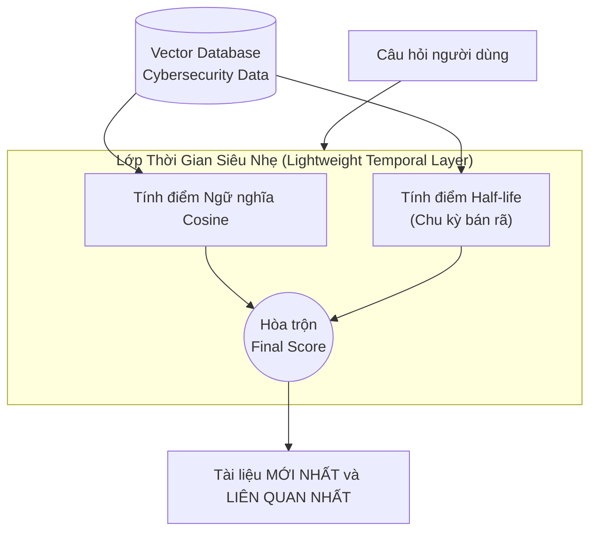

# Phân tích bài báo: Freshness & Limits in Temporal RAG (2509.19376)

## 1. Thông tin chung & Tài nguyên
- **Tiêu đề:** Freshness and the Limits of Heuristic Trend Detection in Temporal RAG
- **Mã arXiv:** [2509.19376](https://arxiv.org/abs/2509.19376)
- **Lĩnh vực thử nghiệm (Evaluation Domain):** Bài báo lấy **Dữ liệu an ninh mạng** (Cybersecurity - Lỗ hổng NVD CVE) ra làm "bãi thử" vì đây là loại dữ liệu cập nhật từng phút, có độ mâu thuẫn cao. Nhưng **thuật toán của họ là thuật toán chung (model-agnostic)**, có thể áp dụng cho mọi loại dữ liệu (Tin tức, Luật pháp, Y tế...).

## 2. Vấn đề giải quyết
Bài báo này chỉ ra rằng giới nghiên cứu thường **nhầm lẫn và gộp chung** hai bài toán hoàn toàn khác nhau của Temporal RAG:
1. **Freshness (Độ tươi mới của dữ liệu):** Bài toán tìm kiếm thông tin mới nhất và vẫn giữ được độ liên quan (Giống Cơ chế 3 của Đồ án).
2. **Topic Evolution (Sự tiến hóa của chủ đề):** Bài toán theo dõi xem một sự kiện đã thay đổi như thế nào theo thời gian (Giống Cơ chế 2 của Đồ án).

Nhóm tác giả đã bóc tách rõ ràng 2 bài toán này, đề xuất một "lớp thời gian siêu nhẹ" (lightweight temporal layer) không phụ thuộc vào model (model-agnostic) và đưa ra những cảnh báo rất đắt giá về giới hạn của các thuật toán gom cụm truyền thống.

## 3. Cơ chế giải quyết (Kiến trúc & Thuật toán)

### 3.1 Giải quyết bài toán Freshness (Độ tươi mới) bằng Half-life Prior
Khái niệm **Half-life (Chu kỳ bán rã)** thực chất chính là một dạng của hàm **Exponential Decay (Phân rã hàm mũ)** mà bạn đã thấy ở TimelyRAG.
- **Cơ chế:** Thay vì dùng IF/ELSE cứng nhắc để lọc tin (chỉ lấy tin mới nhất), họ nhân điểm Cosine với một hệ số suy giảm. Tin càng cũ, điểm càng "bốc hơi" về 0.
- **Kết quả:** Ở những bài test cực khó, thuật toán Half-life này đạt điểm `Latest@10` là **0.60**, đánh bại hoàn toàn cách làm truyền thống **"Semantic-then-newest"** (chỉ đạt **0.20**).

**Công thức Toán học & Cách xác định Tham số:**
Công thức chuẩn: `S_time = 0.5 ^ (Δt / T_half)`

Trong đó:
1. `Δt` (Khoảng cách thời gian): Là hiệu số giữa *Thời điểm người dùng hỏi* và *Thời điểm bài báo ra mắt*. Đơn vị tính có thể là Giờ, Ngày, hoặc Năm tùy domain.
2. `T_half` (Chu kỳ bán rã): Đây là tham số (Hyperparameter) **quan trọng nhất** mà bạn phải tự set tùy theo ngữ cảnh của Data:
   - **Với Tin tức / Vụ án nóng:** `T_half` nên đặt là 1-7 ngày. (Tin hôm qua nay đã cũ).
   - **Với Luật pháp / Văn bản thuế:** `T_half` nên đặt là 365 ngày (1 năm). (Luật giữ nguyên hiệu lực rất lâu).
   - **Ý nghĩa:** Cứ khi `Δt` đạt tới mốc `T_half`, điểm thời gian của bài báo sẽ bị chia đôi (0.5).

Dưới đây là Code mô phỏng cách tính:
```python
import math

def calculate_halflife_score(query_time, doc_time, T_half=7):
    # Δt: Tính số ngày chênh lệch
    delta_t = abs(query_time - doc_time)
    
    # S_time: Tính điểm suy giảm
    decay_score = math.pow(0.5, delta_t / T_half)
    return decay_score

# Final_Score = w1 * Cosine_Score + w2 * decay_score
```

### 3.2 Bài toán Topic Evolution (Giới hạn của thuật toán Gom cụm)
Đúng như bạn hiểu, mục này chỉ đơn giản là một **Thảo luận chứng minh (Empirical Critique)**.
- Khi muốn tóm tắt dòng thời gian (Timeline Summarize), các kỹ sư thường dùng thuật toán gom cụm tự động (như HDBSCAN) để gom các bài báo lại rồi dùng code IF/ELSE gán nhãn sự kiện.
- **Phát hiện sốc:** Nhóm tác giả chứng minh rằng cách làm này có điểm số cực thấp (Macro-F1 = 0.08). Lý do là vì ngôn ngữ báo chí biến thiên liên tục, các quy tắc gán nhãn cứng nhắc (Heuristic) không thể gom nhóm chính xác được.

> 💡 **BẢN CHẤT CỦA BÀI BÁO (LƯU Ý):** Bài báo này **không phát minh ra mạng Neural hay thuật toán mới**. Hàm Half-life hay HDBSCAN đều đã tồn tại từ lâu. Vai trò của bài này là **"Trọng tài thực nghiệm"** — nó rạch ròi 2 bài toán (Freshness vs Evolution) và đo đạc bằng số liệu thực tế để chứng minh rằng: "Heuristic thì nát, còn Half-life thì ngon". Nó đóng vai trò làm nền tảng lý luận cực vững chắc cho kiến trúc hệ thống của bạn.

Dưới đây là sơ đồ mô phỏng kiến trúc Lớp Thời Gian Siêu Nhẹ (Lightweight Temporal Layer):



## 4. Đánh giá tính phù hợp với Đồ án 🎯 (CỰC KỲ QUAN TRỌNG)

### ✅ Rất phù hợp làm "Bệ phóng" lý luận để bảo vệ Đồ án
Tuy kiến trúc của nó khá giống TimelyRAG, nhưng bài báo này (xuất bản tháng 9/2025) lại cung cấp những **luận điểm học thuật đắt giá** để bạn đưa vào báo cáo và bảo vệ đồ án trước hội đồng:

1. **Bảo vệ tính đúng đắn của Cơ chế 3 (Conflict/Freshness):** Đồ án của bạn đề xuất dùng hàm phân rã thời gian (Exponential Decay) để xếp hạng lại tin tức. Bài báo này chứng minh bằng số liệu thực tế rằng: Phương pháp này ăn đứt cách làm truyền thống là Filter cứng (Semantic-then-newest). Bạn hoàn toàn có thể trích dẫn bài này (với kết quả 0.60 vs 0.20) để bảo vệ tính hiệu quả của thuật toán Hybrid Re-ranking.
2. **Bảo vệ Cơ chế 2 (Timeline Summarization):** Bài báo này chỉ ra rằng dùng các thuật toán Gom cụm (Clustering/HDBSCAN) để vẽ dòng thời gian rất dễ thất bại do nhiễu và luật gán nhãn cứng nhắc. Qua đó, bạn có thể tự tin khẳng định: Hướng đi của đồ án là **dùng thẳng LLM để đọc và tự tổng hợp dòng thời gian** là một sự lựa chọn khôn ngoan, linh hoạt và hiện đại hơn nhiều so với việc code bằng Heuristic truyền thống.

**💡 Chốt lại:** Không cần phải viết thêm code dựa trên bài này (vì thuật toán đã có TimelyRAG lo), nhưng hãy **lưu bài này vào mục Tài liệu tham khảo** trong quyển Đồ án tốt nghiệp. Khi bị hội đồng vặn hỏi: *"Tại sao em không dùng hàm Filter để lấy bài mới nhất?"* hoặc *"Tại sao em không gom cụm sự kiện?"*, bạn chỉ cần lôi luận điểm của bài báo này ra là sẽ dành trọn 10 điểm phản biện!
