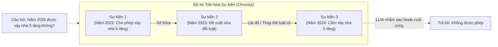

# Phân tích bài báo: Chronos & Kiến thức trôi dạt (2604.05096)

## 1. Thông tin chung
- **Tiêu đề:** RAG or Learning? Understanding the Limits of LLM Adaptation under Continuous Knowledge Drift in the Real World
- **Mã arXiv:** [2604.05096](https://arxiv.org/abs/2604.05096)
- **Công bố:** Tháng 4/2026 (Rất mới)

## 2. Vấn đề giải quyết: Kiến thức Trôi dạt (Knowledge Drift)
Bài báo này không tập trung vào vẽ Timeline, mà đánh thẳng vào lõi của **Cơ chế 3: Giải quyết Mâu thuẫn Kiến thức**.
Thế giới thực liên tục thay đổi (Luật mới thay luật cũ, quan điểm mới lật đổ quan điểm cũ). Hiện tượng này gọi là **Knowledge Drift (Kiến thức trôi dạt)**.

Bài báo làm một bài kiểm tra siêu khó và phát hiện ra sự thật phũ phàng:
1. **Dùng Finetuning / Knowledge Editing:** Bắt LLM học lại kiến thức mới sẽ gây ra hiện tượng **"Quên thảm khốc" (Catastrophic Forgetting)**. LLM học cái mới thì quên sạch cái cũ, dẫn đến mất khả năng suy luận lịch sử.
2. **Dùng Vector RAG truyền thống:** Gặp lỗi **Bất nhất thời gian (Temporal inconsistency)**. Do Vector lôi ra cả luật cũ lẫn luật mới cùng lúc, LLM bị rối loạn tiêu hóa, không biết cái nào là sự thật hiện tại.

## 3. Kiến trúc Giải pháp: Chronos (Event Evolution Graph)
Trái với lo ngại của bạn, bài báo này KHÔNG CHỈ vạch trần khuyết điểm, mà họ còn đề xuất một giải pháp cụ thể mang tên **Chronos**. 

Thay vì bắt LLM phải học lại (Finetuning) để sửa lỗi sai, Chronos dùng thuật toán Truy xuất Nhận thức Thời gian (Time-aware Retrieval) để dọn cỗ sẵn cho LLM đọc. Bí quyết nằm ở **Đồ thị Tiến hóa Sự kiện (Event Evolution Graph)**.

Dưới đây là sơ đồ mô phỏng Kiến trúc Chronos:

Quy trình giải quyết mâu thuẫn (Knowledge Drift) hoạt động như sau:
1. **Khởi tạo Đồ thị:** Khi người dùng đặt câu hỏi, Chronos KHÔNG ném cho LLM một mớ bài báo lộn xộn (kiểu mạnh thằng nào thằng nấy nhận mình đúng). Nó dùng thuật toán để sắp xếp các bằng chứng theo một **Cây tiến hóa**.
2. **Xác định Mối quan hệ Tiến hóa:** Nếu có 2 bài báo mâu thuẫn (Ví dụ: Năm 2022 nói A đúng, Năm 2024 nói A sai), Chronos tự động vẽ một sợi dây liên kết giữa chúng với nhãn là **`[Lật đổ / Thay thế]`**. 
3. **Prompt Nhận thức Thời gian:** Hệ thống ném cái Đồ thị tiến hóa này cho LLM kèm theo mệnh lệnh: *"Sự thật đã tiến hóa qua các mốc thời gian như Đồ thị này. Căn cứ vào nút mạng (Node) cuối cùng của dòng thời gian, hãy đưa ra câu trả lời."*

Bằng cách phân định rạch ròi Quan hệ Tiến hóa này, LLM có thể dễ dàng hiểu được *"À, hóa ra quy định năm 2024 đã lật đổ quy định năm 2022"*. Nhờ đó, LLM trả lời chính xác thực tại mà KHÔNG CẦN phải tốn tiền huấn luyện lại (No additional training).

## 4. Ứng dụng cho Đồ án (Cơ chế 3)
Bài báo này là "Lá chắn thép" để bảo vệ tính khả thi của Đồ án:
- **Luận điểm 1:** Nó chứng minh bằng số liệu (tháng 4/2026) rằng việc dùng RAG (Memory) để cập nhật kiến thức là an toàn và khả thi hơn rất nhiều so với việc bắt Model phải học lại (Finetuning/Learning). (Bảo vệ lý do tồn tại của đồ án).
- **Luận điểm 2:** Nó tái khẳng định lại việc dùng các Cơ chế đánh trọng số thời gian (như Half-life Decay ở TimelyRAG) hay dùng Đồ thị (Chronos) là **bắt buộc** để giải quyết Mâu thuẫn tin tức. Bạn hãy bổ sung bài báo này vào phần Lịch sử Nghiên cứu (Related Works) của Cơ chế 3 để cho thấy đồ án của bạn bám cực sát vào các nghiên cứu mới nhất của thế giới!
