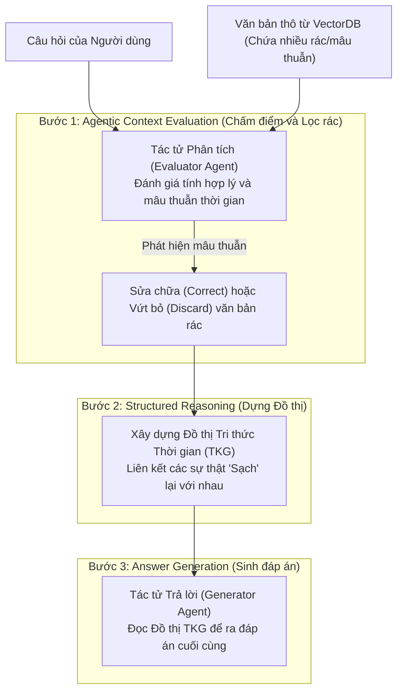

# Phân tích bài báo: RASTeR - Robust, Agentic, and Structured Temporal Reasoning (2406.19538)

## 1. Thông tin chung
- **Tiêu đề:** RASTeR: Robust, Agentic, and Structured Temporal Reasoning
- **Mã arXiv:** [2406.19538](https://arxiv.org/abs/2406.19538)
- **Công bố:** Tháng 6/2024
- **Mã nguồn:** (Tác giả đã ẩn/xóa repo GitHub, nhưng logic Prompt được giải thích chi tiết trong bài báo).
- **Cơ chế áp dụng trong Đồ án:** Cơ chế 3 (Conflict Resolution / Giải quyết Xung đột).

## 2. Bài toán: Nhiễu loạn và Mâu thuẫn thông tin (Needle-in-a-haystack)
Trong thực tế, khi dùng RAG cho các câu hỏi về thời gian (Temporal Question Answering), VectorDB thường trả về một mớ "rác" (Haystack).
Mớ rác này bao gồm:
1. **Irrelevant (Không liên quan):** Các thông tin ngoài lề.
2. **Outdated (Lỗi thời):** Luật cũ, quy định cũ đã bị thay thế.
3. **Temporally Inconsistent (Mâu thuẫn thời gian):** Hôm qua nói A đúng, hôm nay nói A sai.

Nếu hệ thống nhét tất cả mớ rác này cho LLM để tạo câu trả lời, LLM sẽ sinh ra "Ảo giác" (Hallucination) nặng nề. RASTeR chứng minh rằng RAG thông thường thất bại thảm hại trong bài test "Mò kim đáy bể" (Tìm đúng sự thật giữa 40 thông tin gây nhiễu).

## 3. Kiến trúc Đa Tác Tử (Agentic Workflow) của RASTeR
Để giải quyết, RASTeR **tách biệt hoàn toàn** khâu "Đánh giá Ngữ cảnh" ra khỏi khâu "Sinh câu trả lời" bằng một luồng Đa tác tử (Agentic).

### Luồng hoạt động chi tiết (Giải mã Logic của Tác tử):
1. **Bước 1 (Evaluator Agent - Bộ lọc logic):** 
   Tác tử này KHÔNG ĐOÁN MÒ, nó hoạt động dựa trên thuật toán **So khớp chéo (Pairwise Comparison)** và trích xuất Triplet. Cụ thể:
   - **Làm sao nhận biết sự Va đập (Conflict):** Agent phân tích 2 đoạn văn bản và ép LLM trích xuất ra 2 Triplets. Nếu 2 Triplets có cùng Chủ thể (Entity) và Cùng Loại Quan hệ (Relation) nhưng Khác Tân ngữ (Object), đó là Va đập. 
     *(Ví dụ: Bản ghi 1 `(Phố X, được_xây_tối_đa, 5_tầng)`. Bản ghi 2 `(Phố X, được_xây_tối_đa, 3_tầng)`. Cùng chủ thể "Phố X", cùng quan hệ "được xây", nhưng đáp án đập nhau).*
   - **Làm sao biết cái nào Outdate:** Khi đã phát hiện Va đập, Agent kiểm tra nhãn thời gian (Timestamp) đính kèm của 2 bản ghi. Bản ghi nào có mốc thời gian cũ hơn so với câu hỏi thì bị dán nhãn là Outdate.
   - **Khi nào thì Vứt bỏ (Discard):** Nếu TOÀN BỘ đoạn văn bản đó chỉ nói về một sự thật đã bị lật đổ (Outdate), Agent sẽ vứt bỏ hoàn toàn đoạn văn đó không thương tiếc, không cho nó đi tiếp vào hệ thống.
   - **Khi nào thì Chỉnh sửa (Correct) và Chỉnh sửa phần nào:** 
     Nếu đoạn văn chứa **nhiều** thông tin hữu ích, nhưng chỉ có **1 câu duy nhất** bị Outdate. 
   - **Làm sao nhận diện thông tin Không liên quan (Irrelevant):**
     Agent sẽ trích xuất Triplet từ chính **Câu hỏi** của người dùng.
     *(Ví dụ: Hỏi "Ai là CEO của OpenAI năm 2024?", Triplet mục tiêu là: `(OpenAI, CEO, ?)`).*
     Sau đó nó quét các bản ghi. Nếu bản ghi lảm nhảm về việc *"OpenAI ra mắt GPT-4"* -> Triplet là `(OpenAI, ra_mắt, GPT-4)`. Agent thấy Quan hệ (Relation) hoàn toàn lệch pha với mục tiêu `CEO`, nó lập tức dán nhãn Irrelevant và vứt thẳng tay.

2. **Bước 2 (Dựng TKG Tức thời - On-the-fly Graph):** 
   Khác với các hệ thống xây Graph vĩnh viễn bằng Neo4j (như TG-RAG), RASTeR dựng **Đồ thị Tức thời (On-the-fly Graph)**.
   Từ đống thông tin "sạch" vừa lọc được ở Bước 1, Agent tự vẽ ra một cái Graph nhỏ xíu (Mini-Graph) nằm ngay trong bộ nhớ RAM, phục vụ ĐÚNG MỘT câu hỏi hiện tại. Vẽ xong, trả lời xong là nó vứt cái Graph đó đi. (Đây là câu trả lời cho thắc mắc của bạn: Nó không tốn công xây Graph khổng lồ từ đầu).
3. **Bước 3 (Generator Agent):** Agent sinh văn bản cuối cùng chỉ việc nhìn vào cái Đồ thị sạch sẽ đó để chốt hạ câu trả lời. Nhờ đó RASTeR đạt độ chính xác lên tới 75% kể cả khi bị nhồi 40 văn bản gây nhiễu (vượt 12% so với top 2).

## 4. Đánh giá Ưu và Nhược điểm (Góc nhìn Kỹ sư Hệ thống)

**✅ Ưu điểm:**
- **Độ chính xác (Robustness) cực cao:** Giải quyết triệt để bệnh "ảo giác" khi đọc phải tin đính chính/tin sai.
- **Tính Logic:** Thuật toán phát hiện mâu thuẫn rất chặt chẽ và thông minh.

**❌ Nhược điểm (Lý do KHÔNG dùng kiến trúc này vào code thực tế):**
- **Trải nghiệm người dùng (UX) thảm họa:** Quy trình On-the-fly này cực kỳ cồng kềnh. LLM phải trải qua 3 vòng lặp. Nếu dùng GPT-4, thời gian phản hồi có thể lên tới **10-20 giây**. Trong thực tế, user phải nhìn vòng quay loading 20 giây thì họ sẽ tắt App ngay lập tức. Nguyên tắc tối thượng là: *"Thà Server cực khổ lúc nạp (Offline Ingestion), còn hơn bắt User đợi lúc truy vấn"*.
- **Đốt tiền API (API Cost Explosion):** Khi User gõ câu hỏi, hệ thống lôi lên một đống Chunk chứa cả rác, thông tin lặp lại, thông tin outdate. Việc ép LLM (vốn tính tiền theo Token) phải đọc đi đọc lại cái đống rác này ở thời gian thực (Real-time) sẽ khiến chi phí API tăng phi mã.

**=> KẾT LUẬN CHO ĐỒ ÁN:** 
Bài báo RASTeR này **chỉ để THAM KHẢO phần tư duy (Logic)**. Cụ thể, chúng ta sẽ "ăn cắp" thuật toán lọc rác (So sánh Triplet) của nó, nhưng KHÔNG bắt hệ thống chạy lúc truy vấn.
Thay vào đó, chúng ta sẽ đẩy việc chạy thuật toán này về **Giai đoạn Nạp dữ liệu (Offline Ingestion)** như kiến trúc Hybrid / TG-RAG. Dữ liệu được làm sạch và dựng sẵn thành Graph lưu vào Database. Khi User hỏi, hệ thống chỉ mất chưa tới 2 giây và tốn cực ít Token để kéo Graph ra trả lời!

1. **Có cần RASTeR mới được gọi là Agentic?**
   - **KHÔNG.** Bản chất của Agentic (Đa tác tử) là việc hệ thống không chạy theo 1 đường thẳng (như RAG truyền thống), mà nó có khả năng **Tự suy nghĩ, Tự quyết định, Tự gọi Tool**.
   - Việc hệ thống của bạn tự nhận diện câu hỏi (Query Rewriting), tự đưa ra quyết định ném vào Vector hay Graph, tự xác định khoảng thời gian để chia Bucket... **ĐÓ CHÍNH LÀ TƯ DUY AGENTIC (Agentic Reasoning)**. Bạn đang xây dựng một **Routing Agent (Tác tử định tuyến)**, hoàn toàn đạt chuẩn tiêu chí của đề tài.

2. **Có cần dùng LangGraph để xây dựng hệ thống không?**
   - **KHUYẾN NGHỊ LÀ CÓ (RẤT NÊN DÙNG).**
   - Đồ án của bạn tên là *"Agentic Memory"*. Nếu bạn chỉ dùng code Python if/else bình thường, nó trông giống một đoạn Script cứng nhắc.
   - Nhưng nếu bạn bọc nó trong **LangGraph** (hoặc AutoGen), bạn sẽ tạo ra một State Machine (Máy trạng thái) thực thụ. Các bước như: *Kiểm tra câu hỏi -> Lấy Bucket -> Lọc mâu thuẫn -> Sinh đáp án* sẽ trở thành các Node trên LangGraph. Nếu Lọc mâu thuẫn thất bại, đồ thị tự động quay đầu (Cyclic Edge) về bước tìm kiếm. Khung sườn LangGraph sẽ nâng tầm học thuật của Đồ án lên rất cao và giải quyết triệt để tính chất "Agentic" mà giáo viên hướng dẫn yêu cầu!
