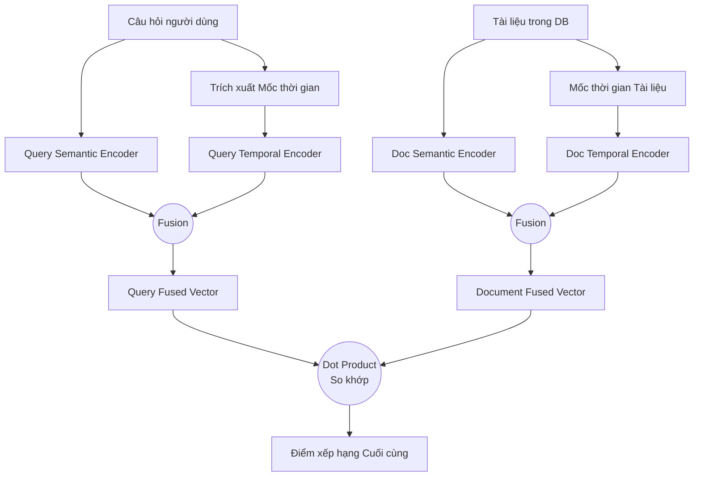
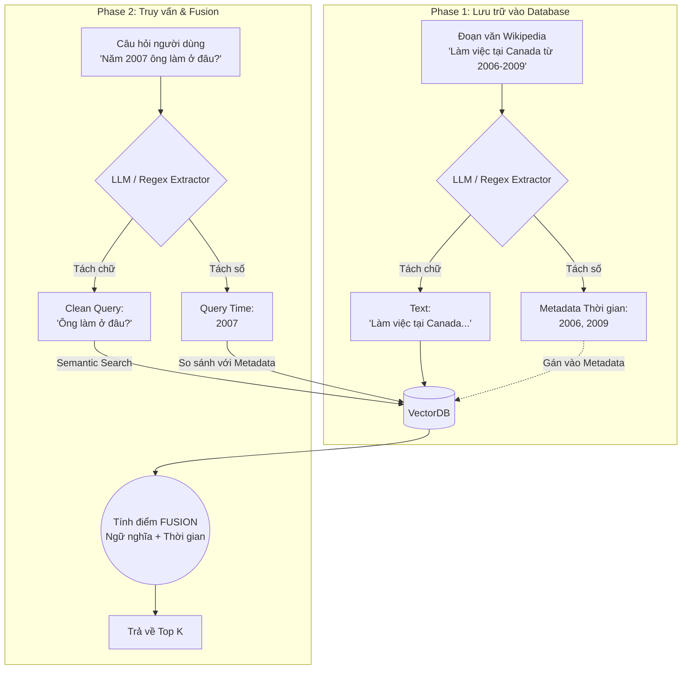

# Phân tích bài báo: TempRetriever (2502.21024)

## 1. Thông tin chung & Tài nguyên (Links)
- **Tiêu đề:** TempRetriever: Fusion-based Temporal Dense Passage Retrieval for Time-Sensitive Questions
- **Mã arXiv:** [2502.21024](https://arxiv.org/abs/2502.21024)
- **Mã nguồn (GitHub):** ❌ *Tác giả chưa public code (Trong danh sách khảo sát ghi chú là "Contact authors").*
- **Datasets sử dụng (Có link public):** 
  - [ArchivalQA](https://github.com/WangJiexin/ArchivalQA) (Tin tức lịch sử 1987-2007)
  - [ChroniclingAmericaQA](https://github.com/datascienceUIBK/ChroniclingAmericaQA) (Báo lịch sử Mỹ)

## 2. Vấn đề giải quyết (Problem Statement)
Các hệ thống RAG hiện tại (như BM25 hay DPR) thường chỉ tìm kiếm dựa trên "độ giống nhau về chữ/nghĩa" (Semantic Similarity) mà phớt lờ thời gian.
> **Ví dụ:** Người dùng hỏi *"Ai là tổng thống Mỹ?"* với thời gian truy vấn là **năm 2008**. 
> Hệ thống tìm thấy 2 tài liệu:
> - Tài liệu A (Năm 2008): *"George W. Bush là tổng thống Mỹ."*
> - Tài liệu B (Năm 2024): *"Joe Biden là tổng thống Mỹ."*
> 
> Về mặt ngữ nghĩa, cả 2 câu này đều cực kỳ khớp với câu hỏi. RAG truyền thống rất dễ kéo nhầm Tài liệu B lên đầu (vì vô tình có nhiều chữ giống hơn), dẫn đến mô hình LLM sinh ra câu trả lời sai bét cho bối cảnh năm 2008.

## 3. Giải thích chi tiết Cơ chế cốt lõi (Core Mechanisms)

Dưới đây là sơ đồ kiến trúc tổng quan của TempRetriever:



### Cơ chế 3.1: Fusion-based Temporal Dense Retrieval (Kết hợp Ngữ nghĩa + Thời gian)
Thay vì chỉ dùng chữ để tìm kiếm, TempRetriever đem cả **thời gian** đi so sánh.
- **Cách hoạt động:** 
  Hệ thống sẽ mã hóa (embed) thời gian của câu hỏi (năm 2008) thành 1 vector, và thời gian của tài liệu (2008 và 2024) thành các vector khác.
  Điểm số cuối cùng để xếp hạng tài liệu sẽ là sự **hòa trộn (fusion)**:
  `Điểm Tổng = Điểm Ngữ nghĩa (Text Similarity) + Điểm Thời gian (Time Similarity)`
- **Áp dụng vào ví dụ trên:** 
  Tài liệu B (2024) dù có Điểm Ngữ nghĩa cao, nhưng Điểm Thời gian bị trừ rất nặng vì 2024 cách quá xa 2008. Kết quả: Điểm tổng của Tài liệu A (2008) vươn lên Top 1. Hệ thống trả về đúng người.

### Cơ chế 3.2: Time-based Negative Sampling (Huấn luyện AI bằng "Cạm bẫy thời gian")
Để một mô hình AI thông minh, khi huấn luyện (train) bạn phải đưa ra cả ví dụ đúng (Positive) và ví dụ sai (Negative) để nó học cách phân biệt.
- **DPR truyền thống:** Mẫu sai (Negative) thường là một đoạn văn vớ vẩn, không liên quan (VD: đoạn văn mô tả cái ô tô). AI nhắm mắt cũng phân biệt được. Quá dễ!
- **Cách của TempRetriever:** Họ cố tình tạo ra các mẫu sai "hiểm hóc" (Hard Negative). Họ lấy chính các tài liệu **đúng ngữ nghĩa nhưng sai thời điểm** để làm mẫu sai.
- **Ví dụ lúc Train AI:** 
  - *Câu hỏi (2008):* Ai là tổng thống Mỹ?
  - *Mẫu Đúng (Positive):* Tài liệu A (Bush - 2008). Chọn đúng thì cộng điểm.
  - *Mẫu Sai "Cạm bẫy" (Hard Negative):* Tài liệu B (Biden - 2024). Nếu chọn cái này sẽ bị phạt nặng.
> **Tác dụng:** Việc bị AI phạt liên tục khi chọn nhầm tài liệu khác năm ép mô hình phải "mở to mắt" ra học cách nhìn vào cái Timestamp thay vì chỉ nhắm mắt bắt từ khóa "Tổng thống".
> 
> 🛑 **LƯU Ý QUAN TRỌNG CHO ĐỒ ÁN:** Cơ chế 3.2 này là kỹ thuật **Fine-tune (Huấn luyện lại)** model Embedding. Trong phạm vi đồ án, bạn **KHÔNG CẦN TRAIN LẠI** mô hình vì tốn kém GPU và phức tạp. Bạn chỉ cần dùng các mô hình nhúng public (OpenAI, BGE) và tự code thêm một hàm toán học để cộng điểm thời gian (Fusion) ở lúc truy vấn là đủ!

## 4. Kết quả & Bài học cho Đồ án
- **Kết quả:** Tăng **6.63%** độ chính xác Top-1 trên ArchivalQA so với DPR truyền thống.
- **Bài học cho Đồ án:** 
  1. **Tư duy kết hợp điểm (Fusion):** Đồ án của bạn (Cơ chế 1 - Truy xuất tại 1 điểm thời gian) **BẮT BUỘC** phải có tư duy của bước 3.1. Bạn phải viết thuật toán để cộng điểm ngữ nghĩa (Cosine Similarity của Text) với điểm thời gian.
  2. **Vấn đề Tiền xử lý (Preprocessing) với dữ liệu trộn lẫn (Wikipedia/TimeQA):** 
  Dữ liệu báo chí có sẵn ngày xuất bản rõ ràng, nhưng dữ liệu Wikipedia thường trộn lẫn chữ và số (VD: *"Ông ấy làm việc ở Canada từ 2006 đến 2009"*). Bạn không thể nhét mù quáng đoạn văn này vào VectorDB được. 
  **Đúng như bạn phán đoán, giải pháp thực tế nhất là "Bắt LLM bóc tách và gán lại" (hoặc dùng Regex để tiết kiệm chi phí).** 

  Dưới đây là sơ đồ luồng Tiền xử lý (End-to-End) dành riêng cho dạng dữ liệu này:



  Dưới đây là ví dụ mô phỏng code Python cho bước Tiền xử lý bắt buộc này:

```python
# ==========================================
# VÍ DỤ: TIỀN XỬ LÝ DỮ LIỆU WIKIPEDIA / TIMEQA
# ==========================================
import re

# 1. Hàm bóc tách (Có thể dùng Regex cho năm, hoặc gọi API ChatGPT cho phức tạp)
def extract_years(text):
    # Regex tìm các cụm 4 chữ số (mô phỏng năm từ 1900-2099)
    years = re.findall(r'\b(19\d{2}|20\d{2})\b', text)
    return [int(y) for y in years]

# --- A. LÚC LƯU VÀO DATABASE ---
raw_paragraph = "Sabine Hossenfelder worked at Perimeter Institute, Canada from 2006 to 2009."

# Bắt hàm/LLM bóc tách thời gian ẩn trong đoạn văn:
extracted_years = extract_years(raw_paragraph) # Kết quả: [2006, 2009]

# Lưu vào VectorDB với trường metadata phân minh:
vector_db.insert(
    text=raw_paragraph, 
    metadata={"time_spans": extracted_years} # Đã gán lại gọn gàng!
)

# --- B. LÚC NGƯỜI DÙNG ĐẶT CÂU HỎI ---
user_query = "From 2006 to 2009, which Canadian institution employed Sabine Hossenfelder?"

# LLM bóc tách câu hỏi thành 2 phần: Thời gian và Ngữ nghĩa
query_intent_years = extract_years(user_query) # Kết quả: [2006, 2009]
clean_query = "which Canadian institution employed Sabine Hossenfelder?"

# Chốt lại: 
# Mang `clean_query` đi so sánh Vector Text.
# Mang `query_intent_years` đi so sánh với `metadata` để tính điểm Thời gian.
# Rồi FUSION lại với nhau như thuật toán ở phần 6 bên dưới!
```

---


## 5. Phụ lục: Đánh giá chi tiết bộ dữ liệu ArchivalQA
Vì TempRetriever dùng ArchivalQA làm thước đo chính, dưới đây là phân tích để bạn hiểu rõ hơn về "bãi thử" này:

### 5.1. ArchivalQA là gì?
- **Nguồn gốc:** Được công bố năm 2022. Nó là một bộ dữ liệu Hỏi-Đáp quy mô khổng lồ (Large-scale QA benchmark) dành riêng cho các tài liệu tin tức lịch sử.
- **Quy mô:** Hơn **532.000** cặp câu hỏi - câu trả lời.
- **Kho văn bản:** Lấy từ kho lưu trữ báo *The New York Times (NYT Corpus)*.
- **Dải thời gian:** Kéo dài 20 năm, từ **1987 đến 2007**.
- **Loại câu trả lời (Answer Type):** Extractive (Trích xuất) - tức là câu trả lời luôn nằm nguyên si trong một đoạn văn bản (span of text) của bài báo gốc.

### 5.2. Ưu điểm (Pros)
1. **Quy mô siêu bự:** Khác với TimeQA (khoảng 40K câu), ArchivalQA có tới nửa triệu câu. Nó cung cấp đủ dữ liệu để huấn luyện (Fine-tune) các mô hình Retriever (như cách bài báo TempRetriever đã làm) mà không lo bị Overfitting.
2. **Dữ liệu báo chí thực tế (Real-world News):** Không giống như Wikipedia (tri thức trung lập và đã được tổng hợp), tin tức báo chí thay đổi theo từng ngày. Một người hôm nay là bộ trưởng, mai có thể từ chức. Điều này ép các mô hình AI phải thực sự hiểu được cái "Date" đính kèm bài báo.
3. **Tuyệt vời cho Cơ chế 1 (Point-in-time):** Rất phù hợp để kiểm tra khả năng truy xuất đúng tin tức tại đúng một ngày/tháng/năm cụ thể trong quá khứ.

### 5.3. Nhược điểm (Cons)
1. **Bị kẹt trong quá khứ (Lỗi thời):** Dữ liệu dừng ở năm 2007. Việc test LLM hiện đại trên dữ liệu trước 2007 đôi khi không phản ánh đúng năng lực, vì LLM đã "học thuộc lòng" toàn bộ lịch sử này trong lúc Pre-training rồi. Nó không test được khả năng thích ứng với "sự thật mới xuất hiện ngày hôm qua" (như StreamingQA làm được).
2. **Khó tiếp cận văn bản gốc:** Mặc dù bộ câu hỏi (Questions) có trên GitHub, nhưng kho văn bản gốc (NYT Corpus) lại bị đánh bản quyền bởi tổ chức LDC (Linguistic Data Consortium). Bạn thường phải trả tiền hoặc xin license học thuật qua trường Đại học mới tải được toàn bộ kho báo gốc để làm Retriever.
3. **Chỉ là Trích xuất (Extractive):** Các câu hỏi chỉ mang tính chất tìm kiếm thông tin ngắn gọn trong 1 bài báo, không đòi hỏi việc đọc 5-10 bài báo khác nhau trải dài nhiều năm để "tóm tắt dòng thời gian" (Cơ chế 2 của đồ án bạn).

> 💡 **Tóm lại:** ArchivalQA là một "phòng gym" tuyệt vời để **huấn luyện** các mô hình truy xuất (như TempRetriever) vì dữ liệu dồi dào. Nhưng để **làm đồ án demo**, việc tải kho NYT Corpus rất phiền phức về bản quyền, và dữ liệu quá cũ không tạo được hiệu ứng "Wow" bằng việc dùng tin tức mới đây. Đồ án của bạn dùng **TimeQA** hoặc **StreamingQA** vẫn thực dụng và dễ thở hơn!

---

## 6. Mô phỏng Kiến trúc và Ví dụ Code (Pseudo-code)
Dù tác giả chưa public mã nguồn, chúng ta hoàn toàn có thể tái hiện lại cơ chế "Fusion-based Temporal Dense Retrieval" của họ qua các bước sau:

### Bước 1: Tiền xử lý và Lưu trữ (Vector DB)
Mỗi đoạn văn (chunk) khi đưa vào Vector DB (như Qdrant, Milvus, Chroma) không chỉ chứa Text Vector, mà phải chứa cả metadata thời gian.

```python
# Ví dụ dữ liệu đầu vào
documents = [
    {"id": 1, "text": "George W. Bush là tổng thống Mỹ.", "timestamp": 2008},
    {"id": 2, "text": "Joe Biden là tổng thống Mỹ.", "timestamp": 2024}
]

for doc in documents:
    # 1. Biến text thành vector (DPR Text Encoder truyền thống)
    text_vector = text_encoder.encode(doc["text"])
    
    # 2. Biến thời gian thành vector (Time Encoder - Điểm khác biệt của TempRetriever)
    # Cần một mạng NN nhỏ hoặc hàm Time2Vec để chuyển đổi timestamp thành mảng số
    time_vector = time_encoder.encode(doc["timestamp"]) 
    
    # 3. Lưu cả 2 vector này vào Vector DB
    vector_db.insert(
        id=doc["id"],
        vector={"text_vec": text_vector, "time_vec": time_vector},
        payload={"text": doc["text"], "timestamp": doc["timestamp"]}
    )
```

### Bước 2: Tầng truy xuất (Retrieval) và Tính điểm Fusion
Khi người dùng đặt câu hỏi, hệ thống cũng phải trích xuất ra mốc thời gian của câu hỏi để làm đối trọng.

```python
def temp_retriever_search(query_text, query_time, top_k=5):
    # 1. Mã hóa câu hỏi (Bao gồm cả Text và Time)
    q_text_vec = text_encoder.encode(query_text) 
    q_time_vec = time_encoder.encode(query_time) # Ví dụ: Vector của năm 2008
    
    results = []
    # 2. Quét qua database (Thực tế VectorDB sẽ làm phép nhân ma trận cực nhanh)
    for doc in vector_db.get_all():
        # Tính điểm ngữ nghĩa (Cosine Similarity giữa 2 vector text)
        semantic_score = cosine_similarity(q_text_vec, doc["text_vec"])
        
        # Tính điểm thời gian (Cosine Similarity giữa 2 vector thời gian)
        time_score = cosine_similarity(q_time_vec, doc["time_vec"])
        
        # 3. FUSION (HÒA TRỘN): Kết hợp 2 điểm số bằng trọng số alpha
        alpha = 0.7 # Ưu tiên ngữ nghĩa 70%, thời gian 30%
        fusion_score = (alpha * semantic_score) + ((1 - alpha) * time_score)
        
        results.append({
            "doc_id": doc["id"], 
            "text": doc["payload"]["text"],
            "score": fusion_score
        })
        
    # 4. Trả về top K tài liệu có điểm Fusion cao nhất
    return sorted(results, key=lambda x: x["score"], reverse=True)[:top_k]

# --- TEST THỬ ---
# Truy vấn: "Ai là tổng thống Mỹ?", Thời gian hỏi: 2008
# Kết quả: Doc 1 (George W. Bush) sẽ có fusion_score cao hơn vì time_score của nó cực kỳ khớp với 2008, ăn đứt Doc 2.
```

---

## 7. Các phương pháp Baseline (Đối thủ) được mang ra so sánh
Trước khi khẳng định TempRetriever là phương pháp tối ưu, nhóm tác giả đã mang nó đi "so găng" với các hệ thống truy xuất sừng sỏ nhất thời điểm đó để chứng minh sức mạnh:

1. **BM25 (Truy xuất Cổ điển):** 
   - *Cách hoạt động:* Thuật toán tìm kiếm theo từ khóa (Lexical Search) y hệt Google thời sơ khai.
   - *Lý do thất bại:* Nó chỉ biết đếm tần suất xuất hiện của từ khóa "tổng thống", "2008" chứ không hiểu được sự liên kết ngữ nghĩa giữa "George Bush" và "tổng thống năm 2008". Hoàn toàn mù mờ về trục thời gian.
2. **DPR (Dense Passage Retrieval - Kẻ thống trị RAG truyền thống):**
   - *Cách hoạt động:* Thuật toán AI cực giỏi hiểu nghĩa của câu (Vector Semantic Search).
   - *Lý do thất bại:* Bị "việt vị" nặng nề khi gặp các câu hỏi yêu cầu mốc thời gian. Vector của DPR chỉ biểu diễn chữ chứ không có khái niệm về "khoảng cách năm tháng". Nó sẽ lôi lên tài liệu có chữ giống nhất bất kể năm nào.
3. **Các phiên bản lai (Hybrid BM25 + DPR):**
   - *Cách hoạt động:* Kết hợp điểm đếm từ khóa (BM25) và điểm ngữ nghĩa (DPR).
   - *Lý do thất bại:* Dù kết quả có tốt hơn một chút, nhưng vẫn thua xa TempRetriever vì chúng thiếu đi mảnh ghép quan trọng nhất: **Vector Thời gian (Time Vector)**.

**🏆 Kết quả so sánh thực tế:**
- Khi đối đầu với **DPR thuần túy**, thuật toán Fusion của TempRetriever đã áp đảo hoàn toàn khi tăng **+6.63%** độ chính xác (Top-1 Accuracy) trên tập ArchivalQA và **+9.56%** trên tập ChroniclingAmericaQA.
- So với các hệ thống không có "Time-based Negative Sampling" (Huấn luyện bằng cạm bẫy thời gian), TempRetriever vượt trội ở khả năng miễn nhiễm với "ảo giác" (hallucination) khi đối mặt với các bài báo có nội dung na ná nhau nhưng khác năm xuất bản.
