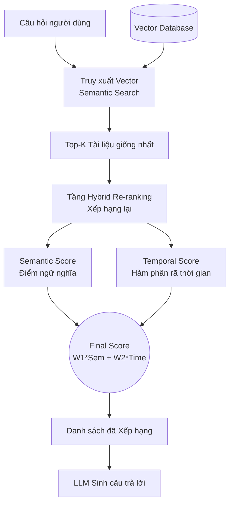

# Phân tích bài báo: TimelyRAG (2609.11572)

## 1. Thông tin chung & Tài nguyên (Links)
- **Tiêu đề:** TimelyRAG: Semantic-Temporal Hybrid Retrieval for Time-Critical Question Answering in Overlapping-Evolving Documents
- **Mã arXiv:** [2609.11572](https://arxiv.org/abs/2609.11572)
- **Mã nguồn (GitHub):** [✅ github.com/kaist-dmlab/TimelyRAG](https://github.com/kaist-dmlab/TimelyRAG) (Mở mã nguồn hoàn toàn)
- **Dataset đề xuất:** `TimelyQABench` (Nằm sẵn trong repo GitHub ở trên).

## 2. Vấn đề giải quyết: "Tài liệu tiến hóa chồng chéo" (Overlapping-Evolving)
Rất nhiều hệ thống RAG giải quyết êm đẹp các tin tức tách biệt (Bản tin A và Bản tin B nói về 2 sự kiện khác nhau hoàn toàn). Nhưng khi áp dụng vào lĩnh vực **Luật pháp, Quy định, Chính sách**, RAG chết gục vì hiện tượng **Overlapping-Evolving (Tiến hóa nhưng chồng chéo)**.

> **Ví dụ thực tế (Nỗi đau của RAG truyền thống):**
> - **Luật năm 2020 (Tài liệu cũ):** *"Điều 5: Thuế thu nhập doanh nghiệp là **10%**. Áp dụng cho mọi công ty..."* (Đoạn văn dài 1000 chữ).
> - **Luật năm 2023 (Tài liệu sửa đổi):** *"Điều 5 sửa đổi: Thuế thu nhập doanh nghiệp là **12%**. Áp dụng cho mọi công ty..."* (Vẫn copy y nguyên 990 chữ cũ, chỉ đổi số 10% thành 12%).
> 
> Khi người dùng hỏi: *"Thuế doanh nghiệp hiện hành (Năm 2024) là bao nhiêu?"*
> Vì 2 tài liệu giống hệt nhau đến 99% về mặt từ ngữ, AI (Semantic Search) bị lú lẫn, nó không biết văn bản nào là bản chính thức đang có hiệu lực và rất dễ lấy nhầm số 10% của năm 2020 lên để sinh câu trả lời.

## 3. Giải thích chi tiết Cơ chế cốt lõi (Core Mechanisms)

Dưới đây là sơ đồ kiến trúc tổng quan của TimelyRAG:



Để trị dứt điểm căn bệnh trên, bài báo đề xuất khung **TimelyRAG**. Khung này không bắt bạn phải tạo lại bộ nhúng (Retriever-agnostic) mà chỉ can thiệp vào khâu cuối cùng: **Tính điểm Xếp hạng (Ranking)**.

### Cơ chế: Semantic-Temporal Hybrid Retrieval (Trộn lẫn Ngữ nghĩa + Khoảng cách Thời gian)
Thuật toán sẽ tự động tính **Khoảng cách thời gian (Temporal Distance)** giữa "Thời điểm người dùng hỏi" và "Thời điểm tài liệu ban hành".

> **Trở lại ví dụ Thuế doanh nghiệp:**
> - Câu hỏi: Mức thuế hiện tại (Năm 2024) là bao nhiêu?
> - **Tài liệu 1 (2020):** Khoảng cách thời gian = `2024 - 2020 = 4 năm`.
> - **Tài liệu 2 (2023):** Khoảng cách thời gian = `2024 - 2023 = 1 năm`.
>
> Thuật toán TimelyRAG sẽ lý luận rằng: *"Ê, 2 tài liệu này có điểm ngữ nghĩa (Semantic Score) cao ngang ngửa nhau. Nhưng Tài liệu 2 (2023) có Khoảng cách thời gian gần với năm 2024 hơn (chỉ cách 1 năm). Chắc chắn Tài liệu 2 là bản sửa đổi cập nhật mới nhất, ghi đè lên bản cũ!"*
> 
> Từ đó, nó **Cộng điểm vọt lên** cho Tài liệu 2 và **Dìm điểm** Tài liệu 1 xuống đáy. Mô hình LLM sẽ chỉ đọc Tài liệu 2 và trả lời chính xác số 12%.

## 4. Kết quả & Bài học cho Đồ án
- **Kết quả:** Việc đưa "khoảng cách thời gian" vào phép tính Ranking giúp hệ thống tăng vọt **+28.6%** độ chính xác (thang điểm nDCG@10) so với việc chỉ dùng tìm kiếm ngữ nghĩa (DPR/BM25) thông thường.
- **Bài học cho Đồ án (Cực kỳ giá trị cho Cơ chế 3 - Xử lý xung đột):**
  - Khi dữ liệu tin tức có sự "đính chính" hoặc "cập nhật" (Ví dụ: Tin tức nói số người thương vong lúc đầu là 5, hôm sau tìm thấy thêm nên cập nhật lên 8), các bản tin cũ và mới sẽ rất giống nhau về câu từ (vì cùng copy từ 1 sự kiện). 
  - Để giải quyết mâu thuẫn này, trong bước xây dựng pipeline RAG của đồ án, sau khi dùng VectorDB lôi ra top 5 tài liệu giống nhất, bạn **BẮT BUỘC** phải chèn thêm 1 khâu **Re-ranking (Xếp hạng lại)**: Viết thuật toán đẩy đoạn văn có `timestamp` gần với thời điểm hiện tại nhất (hoặc gần với câu hỏi nhất) lên vị trí số 1. Như vậy AI sẽ luôn tin tưởng vào tài liệu có tính "mới nhất" thay vì bị nhiễu bởi tin cũ.

---

## 5. Kiến trúc, Phương pháp RAG và Ví dụ Code
Vì TimelyRAG đã public mã nguồn, chúng ta có thể mổ xẻ phương pháp của họ một cách rõ ràng.

### 5.1. TimelyRAG dùng cơ chế/phương pháp RAG nào?
- **Thuộc nhóm:** *Retriever-Agnostic Hybrid Re-ranking RAG* (RAG xếp hạng lại lai ghép, không phụ thuộc bộ truy xuất).
- **Đặc biệt ở điểm nào?** Nó **KHÔNG** bắt bạn phải thay đổi cách dùng model embedding (OpenAI, BGE...). Bạn cứ dùng thuật toán BM25 hoặc DPR bình thường để kéo ra Top 100 tài liệu. Điểm ăn tiền của TimelyRAG nằm ở **Tầng Xếp hạng lại (Re-ranker)**. Tầng này sẽ áp dụng một thuật toán "Hình phạt" (Penalty) dựa trên độ lệch thời gian giữa câu hỏi và tài liệu, ép các văn bản cũ phải "chìm" xuống.

### 5.2. TimelyRAG chia chunk và lưu trữ vào VectorDB như thế nào?
Vì áp dụng trên văn bản pháp luật/quy định, cách chia chunk cực kỳ quan trọng:
- **Chunk theo cấp độ cấu trúc (Structural Chunking):** Họ không cắt ngang câu bằng số token (VD: 500 token/chunk) vì sẽ làm đứt gãy điều luật. Thay vào đó, họ cắt gọn gàng theo từng **Điều, Khoản, Mục (Article, Section)**. Ví dụ: Nguyên cái "Điều 5" sẽ là 1 chunk.
- **Cách xử lý khi có ghi đè (Update/Overlapping):** 
  - Trong VectorDB của TimelyRAG, khi có một luật mới sửa đổi luật cũ, hệ thống **không xóa bỏ** chunk cũ. 
  - Nó tạo ra một chunk mới tinh chứa nội dung luật mới và chèn thêm vào DB.
  - Kết quả là: VectorDB sẽ **chứa cả 2 bản y hệt nhau về ngữ nghĩa** (Ví dụ: `Chunk A - Điều 5 bản 2020` và `Chunk B - Điều 5 bản 2023`).
  - Điểm phân biệt duy nhất của 2 chunk này là metadata: Mỗi chunk bắt buộc phải dính kèm trường `timestamp` cực kỳ chi tiết gồm `Valid_From` (Ngày bắt đầu có hiệu lực) và `Valid_To` (Ngày hết hiệu lực). `Chunk A` sẽ có `Valid_To = 2023`, còn `Chunk B` sẽ có `Valid_To = Null` (Đang hiện hành).

### 5.3. Mô phỏng Code (Cách tính điểm Re-ranking)
Dưới đây là phiên bản đơn giản hóa của thuật toán Hybrid Re-ranking trong TimelyRAG để trị căn bệnh "Overlapping":

```python
import math

def calculate_time_decay_score(query_time, doc_valid_time):
    """
    Hàm tính điểm thời gian bằng hàm phân rã (Decay function).
    Tài liệu ban hành càng xa thời điểm câu hỏi, điểm càng tụt dần về 0.
    """
    # 1. Tính khoảng cách năm (hoặc ngày)
    time_diff = abs(query_time - doc_valid_time)
    
    # 2. Dùng Exponential Decay (Phân rã hàm mũ)
    time_score = math.exp(-0.1 * time_diff) 
    return time_score

def timely_rag_pipeline(query, query_year):
    # BƯỚC 1: Retrieval truyền thống (Lấy Top 20 tài liệu giống ngữ nghĩa nhất)
    # VD: Kéo lên Luật năm 2020 (10% thuế) và Luật sửa đổi năm 2023 (12% thuế)
    top_docs = traditional_dpr_search(query, top_k=20)
    
    # BƯỚC 2: Tầng TimelyRAG Re-ranking
    reranked_docs = []
    alpha = 0.5 # Trọng số cân bằng 50-50 giữa Chữ và Thời gian
    
    for doc in top_docs:
        semantic_score = doc['semantic_score'] # Điểm từ DPR (Rất cao cho cả 2 bản luật vì giống nhau 99%)
        
        # Tính điểm thời gian so với query_year
        time_score = calculate_time_decay_score(query_year, doc['year_issued'])
        
        # TÍNH HYBRID SCORE (ĐIỂM TỔNG HỢP)
        final_score = (alpha * semantic_score) + ((1 - alpha) * time_score)
        
        reranked_docs.append({
            "text": doc['text'],
            "year": doc['year_issued'],
            "final_score": final_score
        })
        
    # BƯỚC 3: Trả về Top 3 tài liệu cho LLM đọc và sinh câu trả lời
    return sorted(reranked_docs, key=lambda x: x["final_score"], reverse=True)[:3]
```

### Tại sao thuật toán này giải quyết được mâu thuẫn chồng chéo (Overlapping)?
Trở lại ví dụ Thuế doanh nghiệp:
Vì đoạn luật năm 2020 và 2023 copy của nhau nên `semantic_score` gần như bằng nhau. Lúc này `semantic_score` bị vô hiệu hóa (coi như hòa). **Người quyết định thắng thua chính là `time_score`.** 
Luật 2023 ban hành gần với năm hỏi (2024) hơn so với luật 2020 $\rightarrow$ `time_score` của 2023 cao hơn $\rightarrow$ Vươn lên Top 1 một cách thuyết phục mà không cần train lại model Embedding!

---

## 6. Các phương pháp Baseline (Đối thủ) được mang ra so sánh
Để chứng minh thuật toán Hybrid Re-ranking của mình là số 1, nhóm tác giả TimelyRAG đã thiết lập một "võ đài" (bộ dữ liệu TimelyQABench) và cho TimelyRAG thi đấu với các phương pháp RAG phổ biến nhất hiện nay:

1. **Truy xuất Ngữ nghĩa Truyền thống (Standard DPR / RAG):**
   - *Cách hoạt động:* Chỉ dùng vector embedding (như OpenAI, BGE) để tìm tài liệu có chữ giống câu hỏi nhất. 
   - *Lý do thất bại:* Thất bại thảm hại (bị nhầm lẫn liên tục) khi gặp các bộ luật "Tiến hóa chồng chéo" (Overlapping-Evolving). Vì bản luật cũ (10% thuế) và bản luật mới (12% thuế) giống nhau tới 99% về câu chữ, khiến Semantic Score hòa nhau. Mô hình AI dễ dàng chọn nhầm bản luật đã hết hạn.
2. **Truy xuất dựa trên Phiên bản (Version-based Retrieval / Recency Filter):**
   - *Cách hoạt động:* Lọc cứng bằng thuật toán IF/ELSE. Cứ tìm ra các luật liên quan, rồi lấy cứng cái nào có Timestamp mới nhất.
   - *Lý do thất bại:* Hoạt động rất tốt với câu hỏi "Luật hiện hành là gì?". **Nhưng chết đứng** khi người dùng muốn "du hành thời gian" hỏi mốc trong quá khứ (Ví dụ: *"Năm 2021 thuế là bao nhiêu?"*). Do bộ lọc đã trót giấu nhẹm các bản luật cũ, hệ thống không có dữ liệu quá khứ để trả lời.

**🏆 Kết quả so sánh thực tế (Sức mạnh của TimelyRAG):**
- Bằng cách áp dụng **Hàm phân rã thời gian (Exponential Decay)** để xếp hạng lại (Re-rank) khoảng cách giữa Năm ban hành và Năm truy vấn, TimelyRAG đã giải quyết được nhược điểm của cả 2 đối thủ trên:
  - Vượt mặt DPR truyền thống tới **+28.6%** (theo thang điểm nDCG@10).
  - Khác biệt với Version-based Retrieval, TimelyRAG **vừa linh hoạt** trả lời được luật HIỆN HÀNH, **vừa quay ngược thời gian** trả lời chính xác được luật QUÁ KHỨ mà không cần lọc cứng (hard filter) vứt bỏ bất kỳ văn bản lịch sử nào ra khỏi VectorDB.
