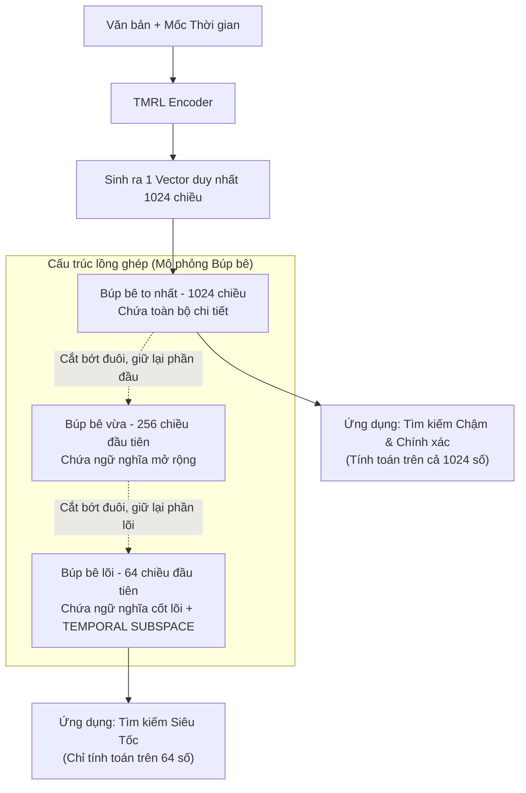

# Phân tích bài báo: TMRL (2601.05549)

## 1. Thông tin chung & Tài nguyên
- **Tiêu đề:** Efficient Temporal-aware Matryoshka Adaptation for Temporal Information Retrieval
- **Mã arXiv:** [2601.05549](https://arxiv.org/abs/2601.05549)
- **Công bố:** Tháng 1/2026
- **Công nghệ lõi:** Matryoshka Representation Learning (MRL) + Temporal Subspace

## 2. Vấn đề giải quyết (Bài toán Hiệu năng - Efficiency)
Các phương pháp như TempRetriever (Bài 02) mang lại độ chính xác rất cao vì nó nhồi thêm thông tin thời gian vào Vector (Fusion). Nhưng đi kèm với đó là một cái giá đắt: **Tốc độ chậm và ngốn phần cứng**.

Khi cơ sở dữ liệu (VectorDB) phình to lên hàng chục triệu bài báo, việc dùng những Vector khổng lồ (ví dụ 1024 hoặc 1536 chiều) để chạy thuật toán tính khoảng cách Cosine sẽ gây ra tình trạng thắt cổ chai (bottleneck) khiến hệ thống RAG bị treo hoặc phản hồi chậm chạp. 

Bài báo này sinh ra để giải quyết câu hỏi: **"Làm sao để nhúng được thời gian vào Vector, nhưng tốc độ tìm kiếm phải siêu nhanh và nhẹ máy?"**

## 3. Giải thích chi tiết Cơ chế cốt lõi (Core Mechanisms)

### 3.1 Giải nghĩa thuật ngữ: Matryoshka Representation Learning (MRL)
- **Định nghĩa:** Búp bê Matryoshka của Nga là loại đồ chơi mở con to ra sẽ có con nhỏ bên trong, mở con nhỏ ra lại có con nhỏ hơn. Thuật toán **MRL** hoạt động y hệt: Nó huấn luyện một Vector khổng lồ (ví dụ 1024 chiều), nhưng được cấu trúc lồng ghép. 
- **Đặc điểm:** Khi cần tìm kiếm nhanh, bạn có thể "chặt" bỏ phần đuôi, chỉ lấy **64 chiều đầu tiên** (như con búp bê lõi nhỏ nhất) đem đi so sánh mà nó *vẫn giữ được những đặc trưng ngữ nghĩa quan trọng nhất*. Việc tìm kiếm trên Vector 64 chiều nhanh hơn hàng chục lần so với 1024 chiều.

### 3.2 Giải nghĩa thuật ngữ: Temporal Subspace (Không gian phụ Thời gian)
- **Vấn đề:** Nếu dùng MRL thông thường, khi bạn cắt vector xuống còn 64 chiều, thông tin về "Thời gian" rất dễ bị rơi rụng mất, chỉ còn lại ngữ nghĩa chung chung.
- **Đề xuất TMRL:** Tác giả quy định ép buộc mô hình phải tạo ra một **Temporal Subspace (Không gian chuyên biệt cho thời gian)** ngay bên trong lõi của con búp bê nhỏ nhất (ví dụ: 16 chiều trong số 64 chiều đầu tiên chỉ dùng để mã hóa ngày/tháng/năm). 
- **Kết quả:** Dù bạn cắt gọt Vector nhỏ đến đâu đi nữa, mô hình vẫn không bao giờ quên mất các mốc thời gian.

Dưới đây là sơ đồ mô phỏng kiến trúc của TMRL:

## 4. Kết quả & Các phương pháp Baseline
- **Baseline so sánh:** So với RAG truyền thống và Matryoshka nguyên thủy (không có nhận thức thời gian).
- **Kết quả:** TMRL đạt được mức cân bằng tuyệt vời giữa Độ chính xác (Accuracy) và Hiệu năng (Efficiency). Hệ thống RAG dùng TMRL có thể tìm kiếm dữ liệu thời gian nhanh hơn nhiều lần nhưng vẫn giữ được thứ hạng tài liệu chuẩn xác.

---

## 5. Đánh giá tính phù hợp với Đồ án 🛑 (QUAN TRỌNG)

### ❌ KHÔNG PHÙ HỢP để làm tính năng cốt lõi
- Lý do: Đồ án của bạn đang giải quyết bài toán về **Mặt Logic (Accuracy)** — làm sao để hệ thống hiểu được dòng thời gian (Timeline) và giải quyết mâu thuẫn (Conflict). 
- Bài báo TMRL này KHÔNG giải quyết logic mâu thuẫn. Nó chỉ thuần túy giải quyết bài toán **Tối ưu Hệ thống (System Performance / Efficiency)**. Việc cài đặt thuật toán Matryoshka (huấn luyện lại cấu trúc Vector) là cực kỳ phức tạp, đòi hỏi GPU mạnh và không mang lại giá trị trình diễn trực quan cho thầy cô xem (bởi vì demo đồ án chỉ có vài nghìn file, không thể thấy sự khác biệt về tốc độ milisecond).

### 💡 Gợi ý sử dụng (Tuyệt chiêu ăn điểm báo cáo)
Tuy không code bài này, nhưng bạn **BẮT BUỘC NÊN ĐƯA NÓ VÀO QUYỂN BÁO CÁO** ở chương cuối cùng: **"Hạn chế của hệ thống và Hướng phát triển trong tương lai (Future Works)"**.

- **Văn mẫu viết báo cáo:** *"Hệ thống hiện tại của nhóm (dùng cơ chế Fusion/Re-ranking) đã giải quyết triệt để bài toán logic về xung đột thời gian. Tuy nhiên, nếu triển khai thực tế ở scale hàng chục triệu văn bản pháp luật, việc dùng Vector lớn và Re-ranking sẽ gặp nút thắt cổ chai về tài nguyên (Bottleneck). Trong tương lai, nhóm đề xuất tích hợp thuật toán **TMRL (Temporal-aware Matryoshka)** của nghiên cứu mới nhất tháng 1/2026. Giải pháp này cho phép cắt ngắn kích thước Vector xuống 64 chiều nhưng vẫn giữ được 'subspace' thời gian, giúp tăng tốc độ truy vấn lên nhiều lần mà không làm suy giảm tính chính xác của các thuật toán Xử lý Xung đột đã xây dựng."* 

Đây là cách bạn chứng minh với hội đồng rằng mình có tầm nhìn bao quát và thường xuyên update các công nghệ State-of-the-art mới nhất!
