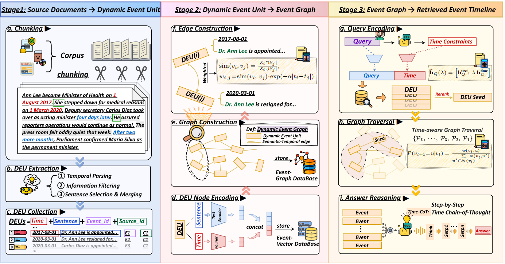
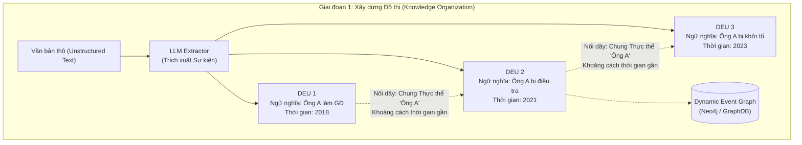
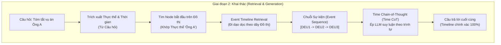

# Phân tích bài báo: DyG-RAG (2507.13396)

## 1. Thông tin chung & Tài nguyên
- **Tiêu đề:** DyG-RAG: Dynamic Graph Retrieval-Augmented Generation with Event-Centric Reasoning
- **Mã arXiv:** [2507.13396](https://arxiv.org/abs/2507.13396)
- **Công bố:** Tháng 7/2025
- **Mã nguồn:** [GitHub - DyG-RAG](https://github.com/RingBDStack/DyG-RAG)
- **Lĩnh vực:** Đồ thị Tri thức Động (Dynamic Graph RAG) & Trích xuất Sự kiện Thời gian (Temporal Event Extraction).

## 2. Vấn đề giải quyết (Nút thắt của VectorDB)
Bài báo này nhắm thẳng vào điểm yếu chí mạng của các hệ thống RAG dùng Vector Database thông thường khi xử lý dạng câu hỏi **Timeline Summarization (Cơ chế 2 của đồ án)**.

- **Vấn đề của Vector RAG:** Khi bạn tìm kiếm, VectorDB chỉ trả về một mớ các đoạn văn rời rạc (Ví dụ: Trả về 5 mảnh báo rời rạc về một vụ án). Nó hoàn toàn "mù tịt" về **Trật tự thời gian (Temporal order)** và **Quan hệ nhân quả (Causal dependency)** giữa các mảnh vỡ đó. Ép LLM đọc một đống văn bản lộn xộn để tự tóm tắt rất dễ sinh ra ảo giác (Hallucination) hoặc xâu chuỗi sai sự kiện.
- **Giải pháp của DyG-RAG:** Thay vì lưu văn bản thành các vector độc lập, họ vẽ một **Mạng lưới Đồ thị (Graph)** để xâu chuỗi các sự kiện liên quan lại với nhau bằng "sợi dây thời gian".

## 3. Giải thích chi tiết Cơ chế cốt lõi (Core Mechanisms)

### 3. Bốn Đóng góp Cốt lõi của Bài báo (Key Contributions)
Bài báo nhấn mạnh 4 thành tựu chính của hệ thống DyG-RAG:
1. **First Dynamic Graph Structure (Cấu trúc Đồ thị Động đầu tiên):** Đây là hệ thống Graph RAG đầu tiên lưu trữ kiến thức dưới lăng kính "Lấy sự kiện làm trung tâm" (Event-centric).
2. **Event Granularity với DEU (Đơn vị Sự kiện Động):** Đề xuất đơn vị DEU (Dynamic Event Unit) để nhúng trực tiếp thời gian vào khâu tổ chức dữ liệu, loại bỏ hoàn toàn sự mơ hồ về thời gian.
3. **RAG-Reasoning Integration (Tích hợp Suy luận & Time-CoT):** Đồ thị động hỗ trợ việc "đi dạo" (traversal) trên các Node để tạo ra kỹ thuật prompt mới có tên **Time-CoT (Time Chain-of-Thought)** cho các bài toán QA phức tạp.
4. **Empirical Validation (Đo đạc Thực nghiệm):** Chứng minh hiệu năng vượt trội trên 3 loại câu hỏi Temporal QA khác nhau trong thực tế.

## 4. Giải thích chi tiết Cơ chế cốt lõi & Sơ đồ

Dưới đây là Sơ đồ Kiến trúc Framework nguyên bản của bài báo:

Để dễ hình dung hơn luồng chạy từ đầu đến cuối, dưới đây là sơ đồ Mermaid được mô phỏng chi tiết:

## 5. Đánh giá tính phù hợp với Đồ án 🎯 (DÀNH CHO CƠ CHẾ 2)

### 5.1 Giải đáp: "Có chạy song song Vector và Graph trong 1 hệ thống được không?"
**Câu trả lời là CÓ. Đây được gọi là kiến trúc Hybrid RAG (Vector + Graph RAG).**
Thực tế, các hệ thống AI doanh nghiệp xịn nhất hiện nay đều chạy song song cả 2.
- **Lúc xử lý câu hỏi Cơ chế 1 & 3 (Hỏi điểm thời gian / Xung đột):** Hệ thống sẽ nhảy vào nhánh **VectorDB + Half-life Decay (TimelyRAG)** vì nhánh này tìm kiếm tốc độ siêu nhanh và chính xác cho 1 tài liệu cụ thể.
- **Lúc xử lý câu hỏi Cơ chế 2 (Tóm tắt diễn biến / Timeline):** Hệ thống sẽ nhảy vào nhánh **GraphDB (DyG-RAG)** vì chỉ có Graph mới xâu chuỗi được quan hệ nhân quả dài hạn.

#### Vấn đề Tối ưu lưu trữ: Làm sao để không bị lưu x2 dữ liệu?
Để giải quyết bài toán tốn bộ nhớ khi chạy cả 2 Database, người ta dùng kiến trúc **Con trỏ (Pointer / Reference Architecture)**:
- **Bên VectorDB (Chroma/FAISS):** Chứa "Xác thịt". Nơi đây lưu trữ toàn bộ văn bản thô dài ngoằng (Text) và nhúng thành Vector. Mỗi chunk văn bản được đánh 1 ID duy nhất (VD: `chunk_123`).
- **Bên GraphDB (Neo4j):** Chứa "Bộ xương". Các Node trên đồ thị KHÔNG LƯU lại văn bản thô. Chúng chỉ là những cái vỏ rỗng chứa: Tên thực thể (Ông A), Mốc thời gian (2018), và quan trọng nhất là một **Con trỏ trỏ ngược về VectorDB** (VD: Node này trỏ đến `chunk_123`).
- **Quá trình chạy:** Khi hệ thống Graph đi dạo xong và chốt được chuỗi Node `Node1 -> Node2 -> Node3`, nó chỉ việc lấy 3 cái `chunk_id` đó chạy sang VectorDB "gắp" đúng 3 đoạn văn bản gốc lên ném cho LLM đọc. Bằng cách này, văn bản nặng nề **chỉ được lưu đúng 1 lần duy nhất** bên VectorDB!

### 5.2 Ứng dụng thực tế cho Đồ án của bạn
Bài báo này sinh ra để làm hình mẫu chuẩn mực cho tính năng **Timeline Summarization (Cơ chế 2)**. 

- **Nếu bạn muốn Đồ án đạt giải Xuất sắc (Nâng cấp tối đa):** 
  Hãy cài đặt Hybrid RAG! Bạn có thể dùng VectorDB cho Cơ chế 1, 3. Còn riêng Cơ chế 2, bạn dùng LLM để trích xuất DEU và vẽ Event Graph. Code sẽ rất khó và chi phí API cao, nhưng Đồ án của bạn sẽ lọt Top vì áp dụng công nghệ quá khủng.
  
- **Nếu làm không kịp (Phương án an toàn - Khuyên dùng):**
  Bạn vẫn dùng VectorDB cho Cơ chế 2 (Tìm Top K văn bản theo khoảng thời gian -> Ép LLM tự đọc). Nhược điểm là dễ bị đứt gãy sự kiện. **Nhưng bù lại**, hãy đưa bài báo DyG-RAG này vào quyển báo cáo ở mục **"Hướng phát triển tương lai (Future Works)"**:
  *"Hệ thống hiện tại dùng Vector Retrieval cho Timeline. Theo nghiên cứu mới nhất của DyG-RAG (7/2025), việc áp dụng **Event Graph (Đồ thị sự kiện)** khắc phục triệt để vấn đề này nhờ cấu trúc DEU và Time-CoT. Nhóm xin đề xuất xây dựng Hybrid RAG (Vector + Graph) trong giai đoạn nâng cấp tiếp theo..."*
  Luận điểm này chứng tỏ bạn am hiểu sâu sắc giới hạn của VectorDB và biết rõ giải pháp State-of-the-art nằm ở đâu!
