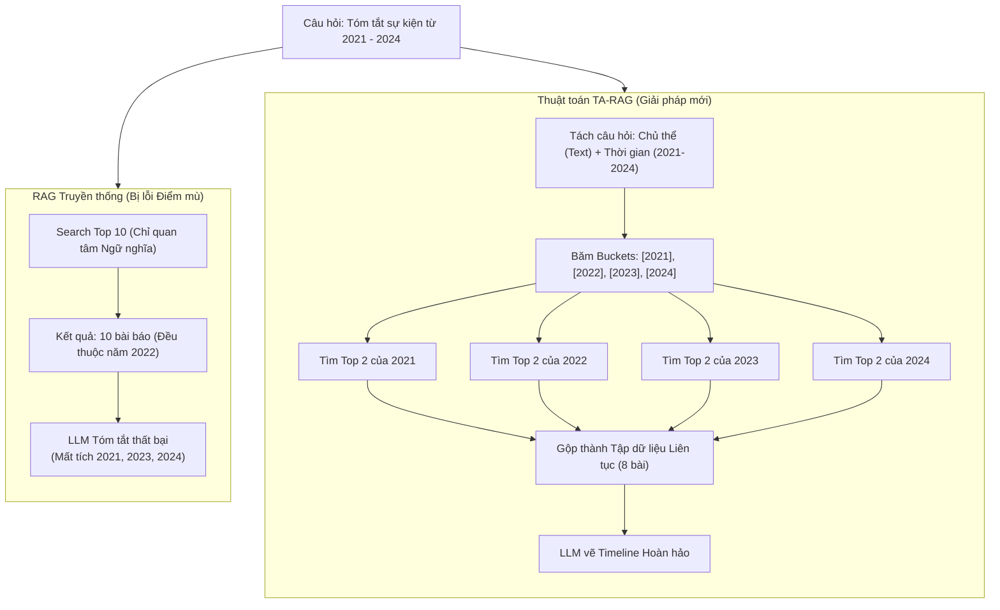

# Phân tích bài báo: TA-RAG cho Diachronic Questions (2507.22917)

## 1. Thông tin chung & Tài nguyên
- **Tiêu đề:** Reading Between the Timelines: RAG for Answering Diachronic Questions
- **Mã arXiv:** [2507.22917](https://arxiv.org/abs/2507.22917)
- **Công bố:** Tháng 7/2025
- **Mã nguồn:** [GitHub - TA-RAG](https://github.com/kwunhang/TA-RAG)
- **Lĩnh vực thử nghiệm (Domain):** Tin tức Tài chính & Doanh nghiệp (Financial News).

*(Lưu ý: "Diachronic Questions" là thuật ngữ học thuật chỉ các câu hỏi mang tính lịch đại/dọc theo thời gian, ví dụ như: Diễn biến vụ việc này từ 2020 đến nay như thế nào?)*

## 2. Vấn đề giải quyết: Điểm mù "Bỏ sót thời gian" (Coverage Blind Spot)
Khi giải quyết Cơ chế 2 (Vẽ lại dòng thời gian sự kiện), Vector RAG truyền thống sẽ gặp một lỗi cực kỳ nghiêm trọng, bài báo gọi đây là **"Blind Spot" (Điểm mù)**.

- **Kịch bản:** Người dùng hỏi *"Tóm tắt diễn biến vụ án Tân Hoàng Minh từ 2021 đến 2024"*.
- **Cơ chế cũ (Top-K Semantic):** Hệ thống so sánh vector và lôi ra Top 10 bài báo giống câu hỏi nhất. 
- **Lỗi xảy ra:** Do sự kiện bị bắt vào tháng 4/2022 quá rầm rộ (từ khóa trùng khớp cực cao), VectorDB sẽ lôi ra **cả 10 bài báo đều nằm trong tháng 4/2022**. Hệ thống hoàn toàn bỏ trống (Zero evidence) các năm 2021, 2023, 2024.
- **Hậu quả:** LLM nhận được 10 bài báo cùng một mốc thời gian, nó không thể nào vẽ ra được một cái Timeline liên tục kéo dài 4 năm như người dùng yêu cầu.

## 3. Kiến trúc Giải pháp của TA-RAG

Để trị căn bệnh này, nhóm tác giả đề xuất thay đổi luồng Pipeline của RAG:

### Bước 1: Query Disentanglement (Giải phẫu câu hỏi)
Thay vì ném nguyên câu hỏi vào VectorDB, dùng LLM chém câu hỏi ra làm 2 phần độc lập:
- **Core Subject (Chủ thể lõi):** *Vụ án Tân Hoàng Minh*. (Dùng cái này để nhúng ra Vector Search).
- **Temporal Window (Cửa sổ thời gian):** *[01/2021 -> 12/2024]*.

### Bước 2: Temporal Bucket Calibration (Băm ô thời gian & Truy xuất rải đều)
Đây là "vũ khí" bí mật của bài báo:
- Thay vì truy xuất một cục Top 10, hệ thống sẽ **băm Cửa sổ thời gian ra thành các ô nhỏ (Buckets)** (Ví dụ: Mỗi ô là 1 năm). Ta có 4 ô: [2021], [2022], [2023], [2024].
- Hệ thống ép VectorDB phải thực hiện truy xuất cho **từng ô một**. Lấy Top 3 bài của 2021, Top 3 bài của 2022, Top 3 bài của 2023...
- **Kết quả:** Ta thu được một tập hợp tài liệu **Trải dài liên tục (Contiguous Evidence Set)**. Giao tập tài liệu rải đều này cho LLM, nó sẽ tự tin vẽ ra một Timeline hoàn hảo không bị thủng lỗ.

Dưới đây là sơ đồ so sánh sự khác biệt:



### 3.3 Các vấn đề Kỹ thuật khi Code thực tế (Giải đáp chuyên sâu)
Bài báo và các kỹ thuật RAG hiện đại giải quyết các câu hỏi thực tiễn của bạn như sau:

**Câu hỏi 1: Thiết kế VectorDB, Chunking và Metadata như thế nào? (Xử lý Ngày/Tháng/Năm/Giờ)**
- Sai lầm phổ biến là dùng Mảng (Array) để lưu thời gian (VD: `[2000, 2001]`). Cách này sẽ sụp đổ hoàn toàn nếu bạn cần truy xuất theo Ngày hoặc Giờ (Chẳng lẽ lưu mảng 3650 ngày cho 10 năm?).
- **Cách giải quyết (Chuẩn Doanh nghiệp):** BẮT BUỘC quy đổi mọi thời gian ra **Unix Timestamp (Giây)** và chỉ lưu 2 biến `start_time` và `end_time`.
- Khi tạo Bucket để tìm kiếm (Ví dụ Bucket là tháng 1/2022), Bucket đó cũng sẽ có khoảng thời gian `[bucket_start, bucket_end]`.
- Lệnh truy vấn kinh điển để tìm các sự kiện giao nhau (Overlap) với Bucket là: 
  `WHERE (doc.start_time <= bucket_end) AND (doc.end_time >= bucket_start)`

**Câu hỏi 2: Chia Bucket như thế nào là hợp lý?**
Bài báo không fix cứng kích thước Bucket (không bắt buộc phải là 1 năm hay 1 tháng). Kích thước Bucket được tính **Động (Dynamic)** dựa vào "Cửa sổ thời gian" của câu hỏi:
- Nếu user hỏi: *"Sự kiện trong năm 2023"* -> Cửa sổ 1 năm -> Chia Bucket theo **Tháng** (12 Buckets).
- Nếu user hỏi: *"Sự nghiệp 10 năm từ 2014-2024"* -> Cửa sổ dài -> Chia Bucket theo **Năm** (10 Buckets).
- Kỹ thuật: Nhờ LLM ở bước "Giải phẫu câu hỏi" tự đưa ra quyết định chia độ chia nhỏ (Granularity) cho hợp lý.

**Câu hỏi 3: Rủi ro Dữ liệu ngắt quãng (Sparse Data / Empty Buckets)**
*Nếu hỏi sự nghiệp 10 năm, nhưng DB chỉ có bài báo của 2 năm đầu và 8 năm cuối không có thông tin gì thì sao?*
- Lỗi này nếu dùng Vector tìm kiếm chay sẽ ra kết quả rác. Nhưng nhờ **Metadata Filtering** kết hợp **Similarity Threshold**, VectorDB sẽ thẳng tay nhả ra mảng rỗng `[]` nếu năm đó trắng thông tin.
- Ném các mảng rỗng này cho LLM. Nhờ đó LLM sẽ tổng hợp ra một câu trả lời mang tính **Chính xác tuyệt đối (Grounded)**, không bị ảo giác: *"Trong 2 năm đầu, ông A làm việc tại... Từ năm 3 đến năm 9, không có sự kiện nào liên quan. Đến năm 10..."*

**Câu hỏi 4: Bất bình đẳng mật độ sự kiện (Năm này 8 sự kiện, năm kia 1 sự kiện)?**
*Nếu ta fix cứng lấy `Top_K = 2` cho mỗi năm. Vậy lỡ năm 2021 xảy ra 8 sự kiện cực kỳ quan trọng, việc giới hạn bằng 2 có phải làm mất thông tin không?*
- Chính xác! Hiện tượng này gọi là **Information Density Imbalance (Mất cân bằng mật độ thông tin)**.
- **Cách giải quyết:** Khi truy xuất Bucket, chúng ta KHÔNG dùng `Top_K = 2` cứng nhắc. Thay vào đó, ta mở rộng `Top_K = 10` (hoặc cao hơn) cho mỗi Bucket, NHƯNG siết thật chặt biến **`SIMILARITY_THRESHOLD` (Ngưỡng tương đồng)**.
- **Hiệu ứng xảy ra:** 
  - Năm 2021 (Nhiều biến cố): VectorDB lôi ra 10 bài. Cả 10 bài đều cực kỳ sát câu hỏi (Điểm > 0.8). Ta lấy hết cả 10 bài!
  - Năm 2022 (Bình yên): VectorDB cũng lôi ra 10 bài. Nhưng vì chả có biến cố gì, 10 bài này toàn điểm thấp (< 0.5). Biến Threshold chặn lại, ta chỉ lấy đúng 1 bài (hoặc 0 bài).
  - Bằng cách dùng Threshold để "gạn đục khơi trong", số lượng sự kiện mỗi năm sẽ **tự động co giãn (Dynamic)** đúng với độ "Nóng" của năm đó!

Dưới đây là Code Python mô phỏng toàn bộ luồng chạy (Sử dụng Unix Timestamp & Dynamic Top-K):

```python
# ==========================================
# 1. LÚC LƯU DỮ LIỆU (QUY ĐỔI RA TIMESTAMP)
# ==========================================
# VD: 2014-01-01 -> 1388534400, 2016-12-31 -> 1483142399
vector_db.insert([
    {
        "text": "Ông A làm GĐ từ 2014 đến hết 2016.", 
        "metadata": {"start_time": 1388534400, "end_time": 1483142399}
    },
    {
        "text": "Ông A bị bắt lúc 9h sáng ngày 15/5/2024.", 
        "metadata": {"start_time": 1715738400, "end_time": 1715738400} # Sự kiện 1 thời điểm: start = end
    }
])

# ==========================================
# 2. LÚC TRUY VẤN TỪNG BUCKET (DÙNG LOGIC OVERLAP & THRESHOLD ĐỘNG)
# ==========================================
# Mảng các Bucket, mỗi Bucket là một khoảng thời gian (VD: Từ ngày X đến ngày Y)
buckets = [
    {"name": "2014", "start": 1388534400, "end": 1419983999},
    {"name": "2015", "start": 1420070400, "end": 1451519999},
    # ...
]
query_vector = embed("Sự nghiệp ông A")
final_timeline_data = {}
SIMILARITY_THRESHOLD = 0.75 # Siết chặt ngưỡng tương đồng

for bucket in buckets:
    # Set top_k đủ lớn (VD: 10) để hứng trọn các năm có nhiều sự kiện
    results = vector_db.search(
        vector = query_vector,
        filter = {
            "$and": [
                {"start_time": {"$lte": bucket["end"]}},   # doc.start <= bucket.end
                {"end_time": {"$gte": bucket["start"]}}    # doc.end >= bucket.start
            ]
        },
        top_k = 10 
    )
    
    valid_docs = []
    for doc in results:
        # BÍ QUYẾT LÀ Ở ĐÂY: Dùng Threshold để gọt bớt các kết quả rác.
        # Năm nhiều biến cố -> lấy được 8 bài. Năm chán -> lấy được 0 bài.
        if doc.similarity_score > SIMILARITY_THRESHOLD:
            valid_docs.append(doc.text)
            
    final_timeline_data[bucket["name"]] = valid_docs

# Kết quả in ra LLM sẽ nhận được:
# {
#   "2014": ["Ông A làm GĐ từ 2014 đến hết 2016."],
#   "2015": ["Ông A làm GĐ từ 2014 đến hết 2016."], # LLM tự xử lý lặp
#   "2016": ["Ông A làm GĐ từ 2014 đến hết 2016."],
#   "2017": [],  <-- MẢNG RỖNG
#   ...
# }
```

## 4. Đánh giá tính phù hợp với Đồ án 🎯 (LỐI THOÁT CHO CƠ CHẾ 2)

Nếu bài báo **DyG-RAG (File 01)** đòi hỏi bạn phải học cách dùng GraphDB (Neo4j) cực kỳ khó nhằn, thì bài báo **TA-RAG** này chính là **Lối thoát hoàn hảo và thực tế nhất** để code Cơ chế 2!

- **Phù hợp 100% về mặt Kỹ thuật:** Bạn KHÔNG CẦN cài GraphDB. Bạn hoàn toàn có thể tái hiện lại thuật toán "Băm Bucket Thời Gian" của bài báo này bằng các đoạn code Python If/Else For-loop bình thường kết hợp với ChromaDB.
- **Có số liệu bảo vệ vững chắc:** Khi hội đồng hỏi: *"Sao em lại phải tách thời gian ra rồi search lắt nhắt từng năm làm gì cho mất công?"*. Bạn chỉ cần đập luận điểm **"Coverage Blind Spot"** (Tránh hiện tượng Vector Search hút hết bài báo vào 1 tháng nóng nhất) là các thầy cô sẽ tâm phục khẩu phục. Bài báo chứng minh cách làm này tăng Accuracy từ 13% lên đến 27%.
- **Quyết định cho đồ án:** Hãy đưa thuật toán Bucket-based Retrieval này làm **Core Logic (Luồng Code chính)** cho Cơ chế 2 (Timeline Summarization) của bạn!
