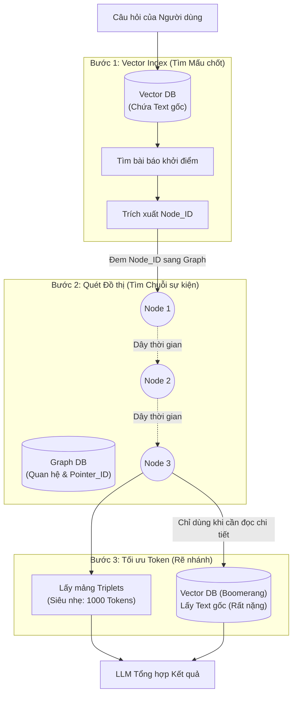

# Kiến trúc lai: Hybrid Vector-Graph RAG (Giải pháp tối thượng cho Timeline)

> ⚠️ **LƯU Ý QUAN TRỌNG:** Đây **KHÔNG PHẢI** là bản tóm tắt của một bài báo cụ thể nào trên arXiv. Đây là **Bản thiết kế Kiến trúc Hệ thống (Proposed Architecture)** do nhóm tự đề xuất, dựa trên sự kết hợp giữa các nhược điểm của Vector RAG (Bài TA-RAG) và ưu điểm của Graph RAG (Bài DyG-RAG) để giải quyết triệt để bài toán "Mất cân bằng mật độ thông tin" và "Tràn bộ nhớ LLM" cho Cơ chế 2.

## 1. Nút thắt cổ chai của Vector RAG (Context Window Explosion)
Khi bạn dùng thuật toán "Băm Bucket Thời Gian + Threshold Động" (như ở TA-RAG - File 02), hệ thống chạy rất tốt với các sự kiện vừa và nhỏ. Nhưng khi đối mặt với một **Sự kiện quá lớn (High-profile event)**, giới hạn của VectorDB sẽ bị phá vỡ.

**Bài toán:** Bạn cần tìm sự kiện năm 2021 của "Đại dịch Covid-19" hoặc "Bầu cử Tổng thống Mỹ".
- Thực tế năm đó có tới **hàng trăm** sự kiện quan trọng. Điểm Threshold `> 0.8` có thể vớt được tới 50 bài báo cốt lõi chỉ trong 1 năm (Bucket).
- Nếu lấy `Top_K = 50` cho mỗi Bucket, nhân lên cho 5 năm, bạn sẽ có 250 bài báo (Tương đương khoảng 150.000 Tokens).
- **Hậu quả:** 
  1. Tràn bộ nhớ của LLM (Vượt quá Context Window).
  2. Lỗi "Lost in the Middle": LLM bị nhồi nhét quá nhiều chữ sẽ bị "lú", đọc đoạn đầu quên đoạn cuối, không tóm tắt nổi Timeline.
  
*(Đây là một case study RẤT PHỔ BIẾN trong xử lý News/Báo chí).*

## 2. Tại sao Graph RAG giải quyết được vấn đề này?
Đây chính là lúc bạn BẮT BUỘC phải chuyển sang **Đồ thị (Graph)** hoặc kết hợp **Hybrid (Vector + Graph)**.

GraphDB chiến thắng VectorDB ở chỗ: **Nó nén dữ liệu từ trước (Pre-compression).**
- Nếu có 50 bài báo cùng viết về việc *"Ông A bị bắt năm 2021"*, VectorDB sẽ lưu 50 đoạn Text dài ngoằng.
- Nhưng GraphDB đã dùng LLM đọc 50 bài đó từ lúc lưu (Knowledge Organization), và nó phát hiện ra 50 bài này có chung Thực thể (Ông A) và Hành động (Bị bắt). Nó lập tức nén 50 bài báo thành ĐÚNG MỘT NODE DUY NHẤT trên đồ thị: `[Ông A] --(bị bắt lúc 2021)--> [Cơ quan CA]`.

## 3. Kiến trúc Hybrid Vector-Graph (Bản thiết kế tối ưu nhất)

Thay vì chọn 1 trong 2, các hệ thống RAG doanh nghiệp sẽ thiết kế luồng Hybrid như sau:

### Bước 1: Khởi động La Bàn (Vector Indexing)
- Người dùng hỏi: *"Hãy tóm tắt sự nghiệp ông A 10 năm qua"*.
- Đầu tiên, ném câu hỏi vào VectorDB để tìm **1 bài báo bất kỳ** nhắc đến "Ông A" (Truy vấn lần 1). 
- Đọc Metadata của bài báo đó, ta trích xuất được `Node_ID = N123` (Đây là mã định danh của "Ông A" trên Đồ thị).

### Bước 2: Kéo cáp Thời gian (Graph Traversal)
- Cầm `Node_ID = N123`, hệ thống nhảy sang GraphDB. Đứng từ Node này, hệ thống men theo các sợi dây liên kết thời gian (Time-traversal).
- Kết quả thu được là một chuỗi các Node liền kề: `N123 -> N456 -> N789`. 
- **Lưu ý tột độ (Kiến trúc Con trỏ):** Như đã phân tích, để tránh x2 dung lượng, GraphDB KHÔNG HỀ lưu văn bản thô. Ba cái Node vừa lấy ra chỉ là 3 cái "Vỏ rỗng" chứa ID trỏ ngược về VectorDB.

### Bước 3: Ép xung Token (Token-efficient Generation) hoặc Boomerang
Tùy vào mục đích câu hỏi của người dùng, hệ thống sẽ rẽ nhánh để tối ưu Token:

**Kịch bản 3A (Vẽ Timeline Tóm tắt - Tiết kiệm Token tuyệt đối):**
- Nếu người dùng chỉ cần xem dòng thời gian tổng quan, hệ thống **KHÔNG** quay lại VectorDB. 
- Chuỗi sự kiện rút ra từ Graph là một mảng Triplets siêu nhẹ: `[(Ông A, thăng chức, 2014), (Ông A, bị bắt, 2024)]`.
- Dù có 100 sự kiện, mảng Triplets này chỉ tốn chưa tới 1.000 Tokens. LLM nhận mảng này và tự diễn đạt thành văn xuôi. Đây là lúc nó khắc phục triệt để lỗi "Tràn bộ nhớ"!

**Kịch bản 3B (Hỏi sâu vào chi tiết - Kiến trúc Boomerang):**
- Nếu người dùng hỏi sâu: *"Hãy kể chi tiết ngày ông A bị bắt"*. 
- Lúc này, hệ thống cầm đúng cái thẻ `ID_2024` quay ngược lại VectorDB (Boomerang).
- Lệnh: `GET chunk WHERE id = ID_2024`. VectorDB nhả ra đúng 1 bài báo thô gốc dài 1000 chữ về ngày bị bắt cho LLM đọc. 

Dưới đây là sơ đồ kiến trúc Hybrid (Luồng chạy đa năng):

### 3.4 Đánh giá Ưu và Nhược điểm của Kiến trúc Hybrid
Để bảo vệ đồ án chặt chẽ, bạn cần nắm vững cả 2 mặt của kiến trúc này:

**✅ Ưu điểm (Pros):**
1. **Giải quyết triệt để Nút thắt Token (Context Window Explosion):** Chuyển từ việc nạp 150.000 tokens văn bản thô xuống còn <1.000 tokens cấu trúc (Triplets), giúp LLM chạy siêu nhanh và không bao giờ bị tràn RAM hay ảo giác.
2. **Khử trùng lặp tự động (Deduplication trước khi nạp):** 
   - *Cách hoạt động:* Trước khi đưa dữ liệu vào Graph, LLM đã đọc bài báo và trích xuất ra các Triplets. Nếu có 50 bài báo cùng nói về việc *"Ông A bị bắt năm 2023"*, nó đều trích ra cùng 1 Triplet giống nhau. Khi nạp vào GraphDB, hệ thống nhận diện trùng lặp và CHỈ TẠO 1 CẠNH DUY NHẤT (chỉ tăng biến đếm `weight = 50`).
   - Nhờ cơ chế "nén và lọc" từ trong trứng nước này, mớ dữ liệu rác khổng lồ đã bị triệt tiêu hoàn toàn trước khi đến tay LLM. VectorDB lúc này chỉ dùng làm kho lưu trữ Backup (Boomerang) nếu cần đọc chi tiết.
3. **Routing Thông minh (Linh hoạt tuyệt đối):** Vừa trả lời cực nhanh các câu hỏi tìm kiếm đơn lẻ (nhờ màng lọc Vector), vừa tóm tắt xuất sắc các câu hỏi dòng thời gian dài hạn (nhờ Graph Traversal).

**❌ Nhược điểm & Thách thức (Cons):**
1. **Chi phí Xây dựng (Construction Cost):** Để tạo ra các Node trên GraphDB, khi nạp dữ liệu (Ingestion), hệ thống phải gọi API của LLM để đọc mọi bài báo và rút trích ra các Triplets *(Ai làm gì, Khi nào)*. Việc này tốn tiền API (Token đầu vào) cao hơn rất nhiều so với VectorDB chỉ cần chạy mô hình Embedding miễn phí.
2. **Độ trễ khi Truy vấn (Latency):** Việc phải chạy qua 3 bước (Vector -> Graph -> Vector) sẽ làm tăng thời gian phản hồi (Response Time) so với Vector RAG truyền thống. 
3. **Phức tạp trong Bảo trì (Maintenance Overhead):** Cùng lúc phải quản lý, đồng bộ hóa (Sync), và Backup cả 2 hệ thống Database khác nhau (Ví dụ: Neo4j và ChromaDB). Nếu một bên sập hoặc lệch ID, toàn bộ "Kiến trúc Boomerang" sẽ bị đứt gãy.

## 4. Lời khuyên cho Báo cáo Đồ án 💡
Câu hỏi của bạn chính là điểm giao thoa (Bridge) giữa bài báo TA-RAG (Vector) và DyG-RAG (Graph).
Trong buổi bảo vệ, khi bạn trình bày Cơ chế 2 bằng Vector, nếu hội đồng hỏi câu y hệt như bạn vừa hỏi: *"Nhỡ năm đó có 100 sự kiện quan trọng, em lấy Top 100 thì tràn bộ nhớ LLM thì sao?"*

👉 **Câu trả lời xuất sắc nhất:**
*"Dạ, em nhận thức rất rõ điểm giới hạn (Bottleneck) này của Vector RAG gọi là Context Window Explosion. Trong phiên bản hiện tại, vì giới hạn thời gian, em đang dùng Vector kết hợp Bucket-based Retrieval. Tuy nhiên, bản thiết kế System Architecture lý tưởng nhất mà em đã chuẩn bị cho giai đoạn mở rộng là **Kiến trúc Hybrid Vector-Graph**. Trong đó VectorDB làm Index để định vị Node bắt đầu, còn GraphDB chịu trách nhiệm nén dữ liệu (Pre-compression) thành các bộ Triplets siêu nhẹ để tránh tràn Token. Em có đính kèm sơ đồ kiến trúc Hybrid này trong Phụ lục đồ án ạ!"*
