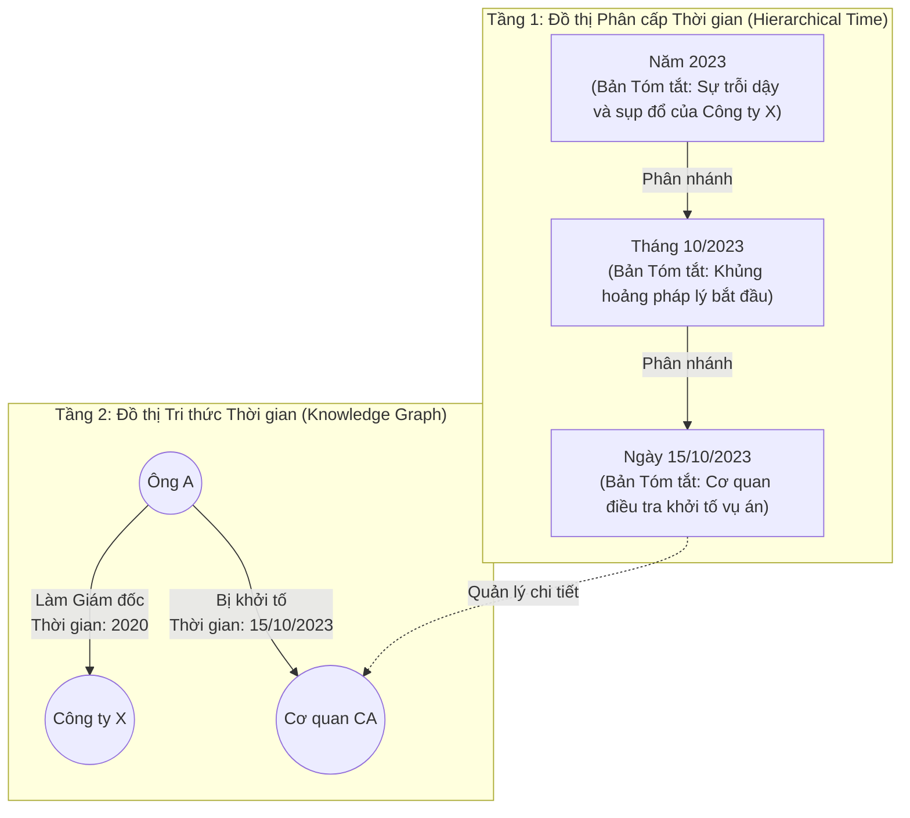

# Phân tích bài báo: TG-RAG (2510.13590)

## 1. Thông tin chung
- **Tiêu đề:** RAG Meets Temporal Graphs: Time-Sensitive Modeling and Retrieval for Evolving Knowledge
- **Mã arXiv:** [2510.13590](https://arxiv.org/abs/2510.13590)
- **Công bố:** Tháng 10/2025
- **Dataset:** ECT-QA (Dữ liệu QA nhạy cảm với thời gian).

## 2. Bài toán: Chi phí Cập nhật Dữ liệu (Incremental Updates)
Các hệ thống RAG thông thường (bao gồm cả Vector RAG) đối mặt với một vấn đề rất lớn khi **Kiến thức thay đổi**:
- Hôm qua: "Ông A là giám đốc".
- Hôm nay: "Ông A đã bị cách chức".
Nếu dùng VectorDB, bạn sẽ phải Embed lại văn bản mới, và có nguy cơ VectorDB trả về lẫn lộn cả câu cũ và câu mới, gây nhiễu cho LLM. Hơn nữa, việc đánh index lại toàn bộ (Re-indexing) mỗi ngày là cực kỳ tốn kém.

## 3. Kiến trúc TG-RAG (Bi-Level Temporal Graph)
Bài báo đề xuất cấu trúc **Đồ thị 2 tầng (Bi-level Temporal Graph)** kết hợp giữa Truy xuất Cục bộ (Local) và Toàn cục (Global). 

Khác với VectorDB lưu một mớ văn bản hỗn độn, TG-RAG quy hoạch dữ liệu thành 2 thế giới riêng biệt để giải quyết 2 bài toán: Tóm tắt bao quát (Macro) và Truy xuất chi tiết (Micro).

Dưới đây là sơ đồ mô phỏng kiến trúc Bi-Level:

Hệ thống hoạt động qua 2 giai đoạn chính:

### Giai đoạn 1: Bi-Level Temporal Graph Indexing (Lưu trữ)
1. **Temporal Quadruple Extraction (Nén Token):** Dùng LLM bóc tách văn bản thô thành các **Bộ tứ (Quadruples)** với cấu trúc siêu gọn: `(Entity) - [Relation] - (Entity) - Thời gian`.
   - *Ví dụ:* Thay vì lưu bài báo 1000 chữ, nó lưu đúng 1 dòng: `(Ông A) - [Bị khởi tố] - (Cơ quan CA) - <15/10/2023>`. Đây là bí quyết giúp hệ thống **Tiết kiệm tuyệt đối Token** khi nạp vào LLM.
2. **Bi-Level Graph Construction (Xây nhà 2 tầng):**
   - **Tầng 1 (Cây thời gian):** Nhóm các sự kiện lại và tự động sinh ra các **Bản tóm tắt (Summaries)** cho từng mốc thời gian. 
   - **Tầng 2 (Mạng thực thể):** Gắn các sợi dây quan hệ. Quan trọng nhất là các sự thật giống nhau ở các thời điểm khác nhau sẽ mọc ra các **cạnh độc lập**, không bao giờ bị ghi đè.

### 3.1 Code thực tế: Hai tầng này nối với nhau bằng cách nào?
Đúng như bạn đoán, "Bi-level" chỉ là khái niệm Logic. Khi code thực tế vào chung một Database (như Neo4j), chúng là **MỘT đồ thị duy nhất**. Bí quyết nối 2 chiều nằm ở kỹ thuật **Reification (Vật thể hóa sự kiện)**:

1. Trong Neo4j, Cạnh (Edge) không thể nối với Cạnh. Nên để nối "Sự kiện" với "Thời gian", người ta biến Sự kiện thành 1 cái Node trung gian.
2. **Cấu trúc thực tế:**
   - Node Thực thể: `(Ông A)`, `(Cơ quan CA)`
   - Node Sự kiện (Trung gian): `(Sự kiện: Khởi tố)`
   - Node Thời gian (Tầng 1): `(Ngày 15/10/2023)`
3. **Sợi dây liên kết 2 chiều:**
   - `(Sự kiện: Khởi tố) --[LIÊN_QUAN_TỚI]--> (Ông A)`
   - `(Sự kiện: Khởi tố) --[XẢY_RA_VÀO]--> (Ngày 15/10/2023)`

Nhờ cấu trúc hình sao này, nếu bạn đứng ở `(Ngày 15)`, bạn lướt ngược sợi dây `XẢY_RA_VÀO` là mò ra được `Ông A`. Và ngược lại, đứng ở `Ông A` có thể lướt thẳng đến `Ngày 15`!

### 3.2 Mục đích tối thượng của Tầng 1 là gì? (Trả lời đúng trọng tâm)
Bạn hỏi rất đúng: *"Tầng 2 đã chứa đủ thông tin để tóm tắt sự nghiệp Ông A, vậy sinh ra Tầng 1 làm gì?"*

Hãy tưởng tượng có ai đó hỏi: *"Hãy tóm tắt toàn cảnh kinh tế Việt Nam năm 2023"*.
- Nếu **chỉ có Tầng 2:** Hệ thống phải lùng sục TẤT CẢ các Node sự kiện có dán nhãn `2023` (Có thể lên tới 100.000 sự kiện). Sau đó ném 100.000 sự kiện này vào LLM để tóm tắt. -> **Crash hệ thống, Tràn RAM!**
- Nhưng nhờ **có Tầng 1:** Hệ thống ĐÃ DÙNG LLM ĐỂ TÓM TẮT SẴN từ trước (Pre-compute) và nhét kết quả vào đúng 1 cái Node tên là `(Năm 2023)`. Khi bị hỏi, nó lôi đúng cái Node đó ra đọc. Rất nhàn!

**=> KẾT LUẬN MỤC ĐÍCH BÀI BÁO:**
TG-RAG sinh ra để giải quyết bài toán **Multi-granularity (Đa độ phân giải)**:
1. **Câu hỏi Macro (Bao quát - VD: Năm X có gì):** Bốc Node Tầng 1 (Đã tóm tắt sẵn) ra trả lời.
2. **Câu hỏi Micro (Chi tiết - VD: Sự nghiệp Ông A):** Chạy lướt qua Tầng 2 để rút trích các sự kiện nhỏ lẻ (Vì sự nghiệp 1 người thường chỉ có vài chục sự kiện, ném vào LLM không bị tràn RAM).

### 3.3 Tính Mở rộng (Scalability) và Thực tiễn Code Đồ án
Nếu áp dụng vào code thực tế, kiến trúc này có 2 đặc điểm cực kỳ xuất sắc mà bạn cần lưu ý trong System Design:

**1. Khả năng tương thích ngược (Backward Compatibility):**
- Nếu thời gian đồ án có hạn, bạn hoàn toàn có thể **chỉ code Tầng 2 trước** (Mạng thực thể với các cạnh chứa nhãn thời gian). Tầng 2 là đủ để làm Timeline cho 1 đối tượng cụ thể (Entity-centric).
- Sau này muốn nâng cấp Tầng 1? Rất dễ! Tầng 1 và 2 hoàn toàn độc lập. Bạn chỉ cần viết một Script chạy ngầm (Batch Job) tạo ra các Node `(Năm 2023)`, rồi tự động dò ở Tầng 2 xem sự kiện nào thuộc 2023 thì vẽ mũi tên nối lên. Code của bạn có tính kế thừa 100%, không lãng phí một dòng nào.

**2. Bắt buộc phải có VectorDB chạy song song (Hybrid Requirement):**
- Đừng lầm tưởng có GraphDB thì vứt VectorDB đi. GraphDB **Rất Ngu** trong việc tìm kiếm từ khóa mờ (Fuzzy Semantic Search). 
- Nếu user hỏi: *"Tóm tắt vụ án công ty bất động sản lừa đảo trái phiếu"*, GraphDB sẽ báo lỗi Not Found vì không khớp đích danh tên Node `(Tân Hoàng Minh)`. 
- Do đó, bắt buộc phải dùng **VectorDB làm La bàn**. VectorDB sẽ đọc hiểu ngữ nghĩa câu hỏi, tìm ra ID của Node Tân Hoàng Minh, sau đó truyền cái ID này cho GraphDB để nó kéo Timeline ra. Sự kết hợp này là bắt buộc (Must-have)!

### Cập nhật Tăng dần (Incremental Update)
- Khi có tin tức mới, hệ thống KHÔNG cần Re-index toàn bộ như VectorDB. Nó chỉ việc trích xuất Quadruple mới, nối thêm Node vào Cây thời gian và vẽ thêm cạnh mới. Chi phí cực kỳ rẻ!

## 4. Ứng dụng cho Đồ án
Bài báo này củng cố thêm sức mạnh cho Kiến trúc Graph/Hybrid của bạn. Đặc biệt, nếu hội đồng hỏi: *"Hệ thống của em cập nhật tin tức mới hàng ngày như thế nào?"*, bạn có thể trích dẫn kiến trúc **"Đồ thị phân cấp thời gian"** của bài báo này để chứng minh rằng: Graph Database sinh ra là để mọc thêm nhánh mới (Incremental Updates) một cách dễ dàng và ít tốn kém nhất, thay vì phải Re-index toàn bộ như VectorDB.
