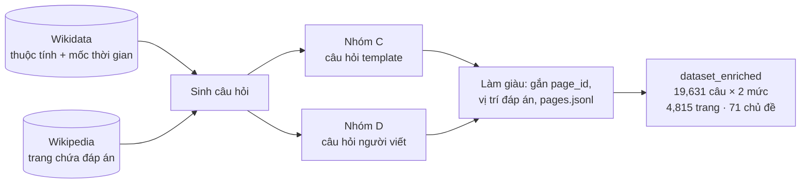
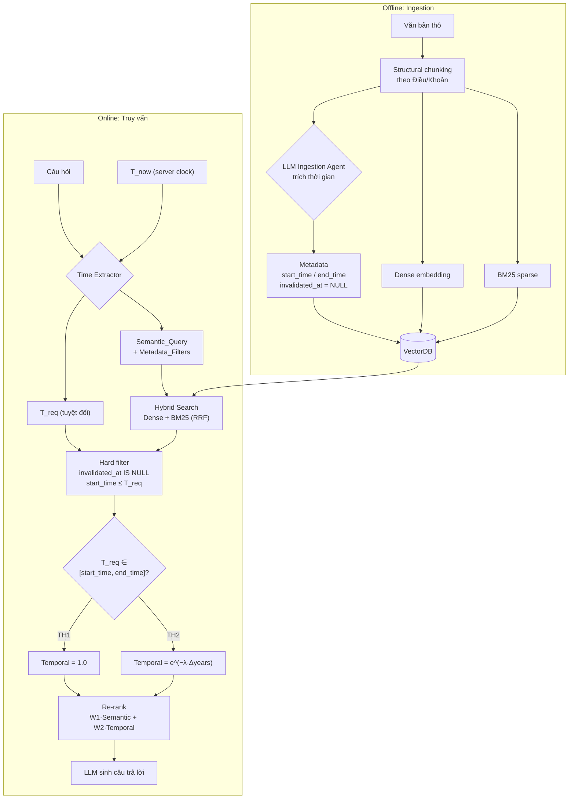

# Báo cáo tuần 2

Hai đầu việc: (1) chốt nguồn và cấu trúc bộ dataset, (2) nghiên cứu và thiết kế Cơ chế 1 — Temporal Information Retrieval.

---

## 1. Bộ dataset

### 1.1 Nguồn gốc

Bộ dữ liệu là bản làm giàu (`dataset_enriched`) của **TimeQA**: câu hỏi nhạy cảm thời gian được sinh từ **Wikidata** (thuộc tính, mốc thời gian) và có đáp án nằm trong **trang Wikipedia** tương ứng. Mỗi câu có hai mức: **easy** (nêu khoảng thời gian tường minh) và **hard** (mốc thời gian ngầm, cần suy luận).

### 1.2 Bảng C và D (số câu, dạng easy / hard)

| Nhóm | dev | train | test | Total |
|---|---:|---:|---:|---:|
| **C** (template) | 2,674 / 2,674 | 12,532 / 12,532 | 2,613 / 2,613 | 17,819 / 17,819 |
| **D** (người viết) | không có | 982 / 982 | 830 / 830 | 1,812 / 1,812 |
| **Tổng C + D** | 2,674 / 2,674 | 13,514 / 13,514 | 3,443 / 3,443 | **19,631 / 19,631** (39,262 dòng) |

Easy và hard là hai cách hỏi của cùng một câu, nên số câu thực sự là 19,631.

### 1.3 Chủ đề (relation) — top 10 trong 71 chủ đề

| Relation | Ý nghĩa | C dev | C train | C test | D train | D test | Total |
|---|---|---:|---:|---:|---:|---:|---:|
| P54 | member of sports team | 788 | 3,735 | 794 | 27 | 56 | 5,400 |
| P39 | position held | 538 | 2,775 | 466 | 18 | 39 | 3,836 |
| P108 | employer | 220 | 999 | 254 | 15 | 39 | 1,527 |
| P69 | educated at | 150 | 719 | 155 | 12 | 20 | 1,056 |
| P26 | spouse | 81 | 466 | 120 | 15 | 33 | 715 |
| P1448 | official name | 74 | 362 | 89 | 21 | 32 | 578 |
| P488 | chairperson | 102 | 248 | 81 | 29 | 53 | 513 |
| P102 | member of political party | 66 | 280 | 54 | 17 | 27 | 444 |
| P127 | owned by | 59 | 254 | 46 | 22 | 36 | 417 |
| P463 | member of | 52 | 223 | 59 | 13 | 22 | 369 |

Số liệu mỗi ô là số câu của một mức (easy hoặc hard). 61 chủ đề còn lại (đuôi dài, mỗi chủ đề dưới 310 câu) xem đầy đủ tại `dataset/full_dataset/RELATIONS.md`.

---

## 2. Cơ chế 1 — Temporal Information Retrieval

Mục tiêu: hiểu mốc thời gian (tường minh hoặc ngầm) trong câu hỏi để truy xuất **đúng tài liệu tại đúng thời điểm**. Nghiên cứu ở `docs/research/02_TEMPORAL_INFO_RETRIEVAL.md`, thiết kế ở `docs/design/02_TEMPORAL_RETRIEVAL_DESIGN.md`.

### 2.1 Schema trong VectorDB (cho Cơ chế 1)

| Tên trường | Kiểu | Bắt buộc | Vai trò | Index |
|---|---|---|---|---|
| `chunk_id` | String | Có | ID duy nhất của chunk; link ngược từ GraphDB (`Chunk_ID`) | Không |
| `text_chunk` | Dense + Sparse vector | Có | Hai biểu diễn của cùng chunk: Dense (ngữ nghĩa) và Sparse/BM25 (từ khóa) cho Hybrid Search | (vector) |
| `domain_features` | JSON lồng nhau | Tùy chọn | Đặc trưng theo bài toán, VD `{"country": "VN", "domain": "Luật"}` | Chỉ 2 key con (bên dưới) |
| `source` | String | Có | Nguồn tài liệu, dùng để trích dẫn khi sinh câu trả lời | Không |
| `start_time` | Timestamp / ISO Date | Có | Thời điểm thông tin bắt đầu đúng; dùng tính Time Decay và chặn tương lai | **Có** |
| `end_time` | Timestamp / ISO Date | Mặc định `NULL` | Thời điểm kết thúc; `NULL` = còn hiệu lực | Không |
| `invalidated_at` | Timestamp / ISO Date | Mặc định `NULL` | Cờ tin giả; `!= NULL` thì bị loại hẳn khỏi Cơ chế 1 | **Có** |

Chỉ đánh index đúng 4 trường: `start_time`, `invalidated_at`, `domain_features.domain`, `domain_features.country`. `source`, `chunk_id`, `end_time` cố ý không index để tiết kiệm tài nguyên (`end_time` chỉ đọc trên số ít chunk đã qua lọc).

### 2.2 Pipeline thiết kế

### 2.3 Tóm tắt: mượn gì từ đâu

| Thành phần trong thiết kế | Lấy từ |
|---|---|
| Tách timestamp bằng LLM lúc nạp, tách `T_req` lúc truy vấn | TempRetriever (01) |
| Tư duy cộng điểm ngữ nghĩa + thời gian | TempRetriever (01) |
| Re-rank `W1·Semantic + W2·Temporal`, hàm suy giảm mũ | **TimelyRAG (02)** — lõi |
| Structural chunking, giữ nhiều phiên bản `start_time`/`end_time` | TimelyRAG (02) |
| Hard filter tin giả / tương lai, RRF + min-max, tiêm `T_now` | Tự thiết kế |
