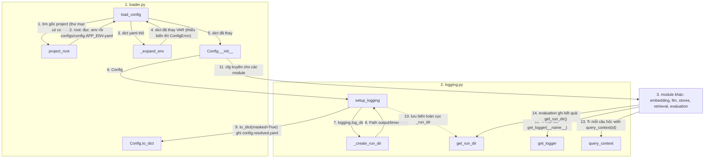

# `tam.config`: cấu hình và logging

**Vị trí trong pipeline:** nền tảng, không thuộc bước nào. Mọi module khác nhận `Config` (hoặc `get_logger`) từ đây. `setup_logging()` gọi **một lần** ở điểm vào của lần chạy (sau này là `scripts/*.py`).

## Các file

| File | Việc | Public API |
|---|---|---|
| `loader.py` | Nạp `.env` → chọn `configs/config.{APP_ENV}.yaml` → thay `${VAR}` → `Config` | `load_config()`, `get_config()` (cache), `Config`, `ConfigError`, `project_root()` |
| `logging.py` | Cấu hình log duy nhất; tạo thư mục output theo lần chạy | `setup_logging(cfg)`, `get_logger(name)`, `get_run_dir()`, `query_context(query_id)` |

## Thứ tự vận hành

Quy ước: mỗi khối = một file (đánh số); node = `Class.hàm` hoặc tên hàm; mũi tên có **số thứ tự** và **tên dữ liệu** truyền đi; `↻` = lặp; một node có thể có nhiều mũi tên vào/ra.



- `setup_logging` gọi **một lần** ở điểm vào; gọi lần hai (không `force`) trả lại cùng thư mục.
- `get_logger` dùng được cả khi chưa `setup_logging` (chưa có handler, không tạo thư mục).

## Pattern

- **`Config` là wrapper dict lồng nhau, không có schema cố định:** `cfg.retrieval.top_k` hoặc `cfg["retrieval"]["top_k"]`. Thêm khóa chỉ cần sửa yaml; đánh đổi là gõ sai khóa chỉ lộ khi đọc tới (lỗi nêu đường dẫn + các khóa hiện có).
- **Che bí mật:** khóa có tên chứa `key/secret/token/password` bị che thành `********` trong `repr` và `config.resolved.yaml`.
- **`query_context(query_id)`** dùng `contextvars`: mọi log trong khối `with` mang `query_id`, lọc được hành trình một câu hỏi.
- **Cạm bẫy tên file:** `config/logging.py` trùng tên thư viện chuẩn. Khối `if __name__ == "__main__"` ở đầu `loader.py` gỡ `config/` khỏi `sys.path` để chạy thẳng không bị nhầm. Đừng chạy thẳng `logging.py`, đừng thêm `config/` vào `PYTHONPATH`.

## Input / Output

| | Vào | Ra |
|---|---|---|
| `load_config` | `APP_ENV`, `.env`, `configs/config.*.yaml` | `Config` |
| `setup_logging` | `Config` (nhóm `logging`) | `Path` thư mục output của lần chạy |
| `get_run_dir` | (không) | cùng `Path` đó (lỗi nếu chưa setup); nơi `evaluation` ghi `metrics.json` |

## Chạy thử

```bash
python src/tam/config/loader.py [dev|prod]
PYTHONPATH=src python -m tam.config.loader [dev|prod]
```

Chi tiết và quyết định thiết kế: `docs/process/01_BASE_SETUP_CONFIG_LOGGING.md`.
