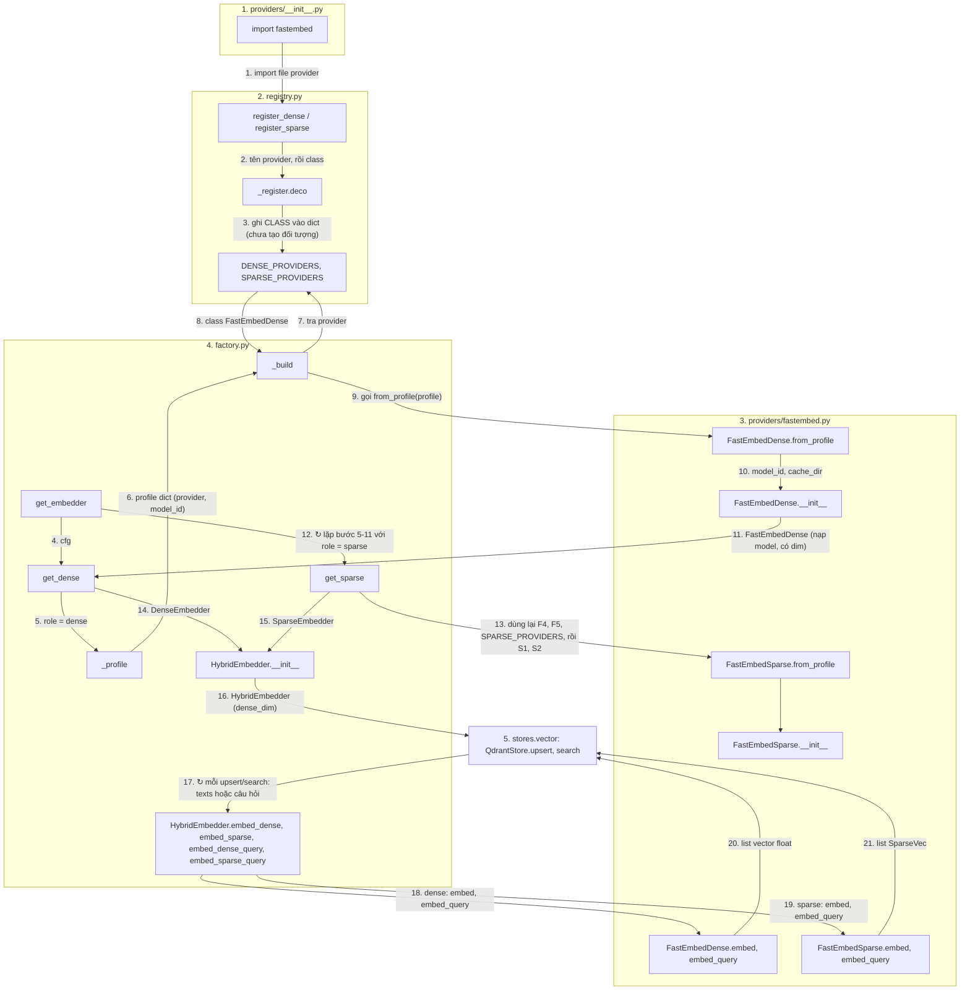

# `tam.embedding`: text → vector (dense + sparse)

**Vị trí trong pipeline:** hạ tầng cho **Ingestion** (embed chunk khi `upsert`) và **Retrieval** (embed câu hỏi khi `search`). Không ai gọi trực tiếp: chỉ `stores/vector/qdrant_store.py` dùng, qua ABC `Embedder`.

## Các file

| File | Việc |
|---|---|
| `base.py` | Ba ABC + `SparseVec`. `DenseEmbedder`, `SparseEmbedder`: hợp đồng cho **provider**. `Embedder`: hợp đồng cho **store** |
| `registry.py` | Hai dict `DENSE_PROVIDERS` / `SPARSE_PROVIDERS` (tên → **class**); decorator `@register_dense("tên")`, `@register_sparse("tên")` |
| `factory.py` | `get_embedder(cfg)`, `get_dense`, `get_sparse`; lớp `HybridEmbedder` ghép dense + sparse |
| `providers/__init__.py` | Import từng file provider để decorator chạy (thiếu dòng import thì registry rỗng) |
| `providers/fastembed.py` | `FastEmbedDense` (vd `BAAI/bge-small-en-v1.5`, dim 384), `FastEmbedSparse` (`Qdrant/bm25`); chạy local bằng ONNX |

## Thứ tự vận hành

Quy ước: mỗi khối = một file (đánh số); node = `Class.hàm` hoặc tên hàm; mũi tên có **số thứ tự** và **tên dữ liệu** truyền đi; `↻` = lặp; một node có thể có nhiều mũi tên vào/ra.

- Bước 1-3 xảy ra **lúc import** (đăng ký class). Bước 4-16 xảy ra **một lần** ở điểm vào (nạp model). Bước 17-21 lặp **mỗi lần** ghi hoặc tìm kiếm.
- `_build` báo lỗi kèm danh sách provider hiện có nếu `provider` chưa đăng ký.

## Pattern

**Registry + Factory + Strategy (ABC).** Cấu hình chọn provider bằng tên, factory không có danh sách provider, nên thêm provider **không sửa factory hay store**.
- Dense và sparse chọn **riêng** vì không phải provider nào cũng có cả hai (OpenAI chỉ có dense; BM25 vẫn chạy local).
- Tài liệu và câu hỏi có hàm embed riêng (`embed` vs `embed_query`) vì một số model xử lý câu hỏi khác tài liệu.
- Hai tầng ABC: store chỉ biết `Embedder`, không biết provider nào đứng sau.

**Thêm provider mới:** viết class kế thừa `DenseEmbedder` (hoặc `SparseEmbedder`) trong `providers/<tên>.py` + `@register_dense("<tên>")`; thêm một dòng import vào `providers/__init__.py`; thêm profile vào `embedding.profiles.dense`; đổi `embedding.dense`. Đổi model dense làm đổi số chiều → `ensure_collection(recreate=True)`.

## Input / Output

| Hàm | Vào | Ra |
|---|---|---|
| `get_embedder(cfg)` | `Config` | `HybridEmbedder` (có `dense_dim`) |
| `embed_dense(texts)` | `list[str]` | `list[list[float]]` (cùng thứ tự) |
| `embed_sparse(texts)` | `list[str]` | `list[SparseVec]` (`indices`, `values`) |
| `embed_*_query(text)` | một câu hỏi | một vector dense / một `SparseVec` |

Chi tiết: `docs/process/02_CORE_COMPONENTS.md` mục 2.
