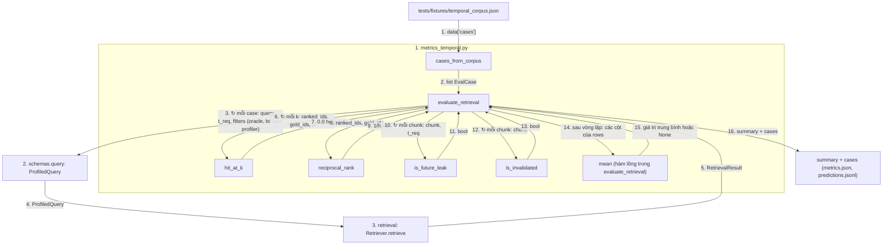

# `tam.evaluation`: đánh giá

**Vị trí trong pipeline:** ngoài luồng online; chạy sau khi đã ingest, để đo chất lượng. Hiện chỉ có metric **retrieval** của Cơ chế 1. Chưa có EM/F1, time slice, `runner.py`, baseline plain RAG.

## Các file

| File | Việc |
|---|---|
| `metrics_temporal.py` | `EvalCase`, `cases_from_corpus`, `evaluate_retrieval`, và các hàm đơn: `hit_at_k`, `reciprocal_rank`, `is_future_leak`, `is_invalidated` |

Mỗi cơ chế một file metric: `metrics_timeline.py` (coverage, thứ tự, token efficiency) và `metrics_conflict.py` (Evolution vs Falsehood, Temporal Freshness) thêm sau, không sửa file này. Hàm dùng chung sẽ tách ra `metrics.py` khi bắt đầu CC2.

## Thứ tự vận hành (`evaluate_retrieval`)

Quy ước: mỗi khối = một file (đánh số); node = `Class.hàm` hoặc tên hàm; mũi tên có **số thứ tự** và **tên dữ liệu** truyền đi; `↻` = lặp; một node có thể có nhiều mũi tên vào/ra.

- Bước 3-13 lặp theo từng case; bước 14-16 chạy một lần sau khi hết case.
- Hit@k và MRR chỉ tính trên case có đáp án; ba tỉ lệ vi phạm (leakage, invalidated, forbidden) tính trên mọi case.

## Metric

| Metric | Định nghĩa | Kỳ vọng |
|---|---|---|
| `hit@k` (1, 3, 5) | có chunk đúng trong top-k | cao |
| `mrr` | trung bình 1/hạng chunk đúng đầu tiên | cao |
| `leakage_rate` | tỉ lệ câu có ≥1 chunk với `start_time > t_req` | **0%** |
| `invalidated_rate` | tỉ lệ câu có chunk đã `invalidated_at` | **0%** |
| `forbidden_rate` | tỉ lệ câu có chunk thuộc `forbidden_ids` (tương lai, tin giả, sai facet) | **0%** |

Case không có đáp án hợp lệ (vd `t_req` trước mọi phiên bản) bị loại khỏi Hit@k/MRR nhưng vẫn tính vào ba tỉ lệ vi phạm. Không có case thì giá trị là `None`.

## Pattern

- **Nhãn ở mức `chunk_id`**, không gọi LLM, hàm thuần.
- **Phụ thuộc vào hợp đồng** `Retriever` (ABC), không vào `TemporalRetriever`: sau này chạy được cùng một hàm cho baseline và các cơ chế khác.
- Ba tỉ lệ vi phạm là kiểm tra **bất biến** (không rò rỉ tương lai, không lấy tin giả) dưới dạng số đo.

## Input / Output

| | Vào | Ra |
|---|---|---|
| `evaluate_retrieval(retriever, cases, ks=(1,3,5))` | `Retriever`, `list[EvalCase]` | `{"summary": {n_cases, n_answerable, hit@k, mrr, leakage_rate, invalidated_rate, forbidden_rate}, "cases": [chi tiết từng câu]}`, sẵn để ghi `metrics.json` / `predictions.jsonl` vào `get_run_dir()` |

Hiện chưa có chỗ nào ghi kết quả ra `output/`. Chi tiết: `docs/process/04_PROFILER_METRICS_INGESTION.md` mục 3.
