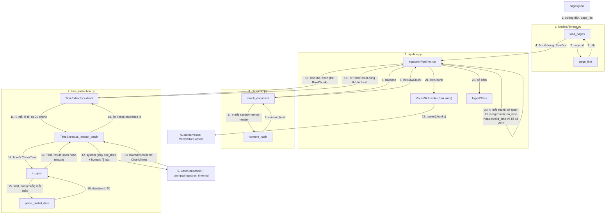

# `tam.ingestion`: nạp tài liệu vào kho time-aware

**Vị trí trong pipeline:** Tầng 1 (Ingestion, **offline**), chạy trước mọi truy vấn: `file dữ liệu → RawDoc → chunk → khử trùng → trích mốc thời gian (LLM) → Chunk → sink → Qdrant`. Chưa có script điểm vào (`scripts/ingest.py` là việc tiếp theo).

## Các file

| File | Việc | Gọi ai |
|---|---|---|
| `types.py` | Kiểu trung gian (dataclass bất biến): `Section`, `RawDoc`, `RawChunk`, `TimeSpan`, `TimeResult` | (không) |
| `loaders/timeqa.py` | `load_pages(path, page_ids=None)`: đọc `pages.jsonl` của TimeQA, mỗi dòng một trang Wikipedia → `RawDoc` | `types` |
| `chunking.py` | `chunk_document(doc)`: mỗi section một chunk; `content_hash(text)` | `types` |
| `time_extraction.py` | `TimeExtractor.extract(title, chunks)`: LLM trích khoảng hiệu lực theo lô; `to_span`, `parse_partial_date` | LLM (tiêm vào), prompt `ingestion_time.md` |
| `pipeline.py` | `IngestionPipeline.run(docs)`: **nơi duy nhất gọi các file còn lại**; `Sink` (ABC), `VectorSink`, `IngestStats` | `chunking`, `time_extraction`, `Sink` |

`chunking.py`, `time_extraction.py` và loader **không gọi nhau**; chỉ `pipeline.py` nối chúng.

## Thứ tự vận hành

Quy ước: mỗi khối = một file (đánh số); node = `Class.hàm` hoặc tên hàm; mũi tên có **số thứ tự** và **tên dữ liệu** truyền đi; `↻` = lặp; một node có thể có nhiều mũi tên vào/ra.

Dữ liệu qua các bước chính (ví dụ trang Knox Cunningham):

| Bước | Vào | Ra |
|---|---|---|
| 2-4 | dòng `pages.jsonl`: `page_id`, `paragraphs=[{title,text}]` | `RawDoc(doc_id="/wiki/Knox_Cunningham", title, source="Wikipedia" (tham số của loader), sections)`; trang không có đoạn bị bỏ |
| 6-8 | `RawDoc` | `RawChunk`, `chunk_id="<doc_id>#<chỉ số section>"` (ổn định, chạy lại là ghi đè); text có header `"Tiêu đề \| Tên mục\n<nội dung>"`; section rỗng bị bỏ |
| 9 | `RawChunk` | chỉ giữ chunk có hash chưa gặp **trong cùng lần chạy** |
| 11-19 | tiêu đề + chunk | `TimeResult`: `TimeSpan(start, end)` hoặc `reason` (`no_time` / `invalid_time`) |
| 20-22 | `RawChunk` + `TimeResult` | `Chunk(start_time, end_time, domain_features, ...)` ghi vào kho (embed dense + BM25) |
| 23 | | `IngestStats(docs, chunks_total, ingested, skipped_no_time, skipped_invalid_time, skipped_duplicate)` |

Chuẩn hóa mốc (bước 15-16, `parse_partial_date`): start chỉ-năm → `YYYY-01-01`, **end** chỉ-năm → `YYYY-12-31` (để "2004 đến 2005" phủ hết 2005 và vẫn là TH1); chỉ-tháng → ngày 1 hoặc ngày cuối tháng; `ongoing` → `end=None`; không có `end` → hết kỳ của `start`; năm < 1 hoặc `end < start` → `invalid_time`.

## Pattern

- **Pipeline (orchestrator) + Strategy:** `pipeline.py` điều phối; `Sink` là ABC nên CC2/3 thêm `GraphSink` vào danh sách `sinks`, không sửa `pipeline.py`.
- **Tiêm phụ thuộc:** `TimeExtractor(llm)` và `VectorSink(store)` nhận từ ngoài; không file nào tự gọi factory.
- **Một lệnh LLM cho cả lô chunk của một tài liệu** (rẻ hơn, LLM thấy mốc lân cận để hiểu "năm sau"); LLM chỉ được dùng ngày có trong chunk/tiêu đề, không thêm từ kiến thức riêng. Chunk bị LLM bỏ sót coi là `no_time`.
- **Bất biến thể hiện ở đây:** structural chunking + content hashing; chunk không có mốc thì **không bao giờ vào Qdrant**; lỗi được đếm chứ không im lặng.
- **Giới hạn đã biết:** khoảng hiệu lực chunk = [mốc sớm nhất, muộn nhất] trong đoạn (đoạn nhiều giai đoạn → khoảng rộng); khử trùng chỉ trong một lần chạy (chưa có cache kết quả LLM nên chạy lại gọi LLM lại); `domain_features` của TimeQA đang rỗng (profiler không được đặt facet khi truy vấn TimeQA); đoạn không có năm bị bỏ.

## Input / Output

| | Vào | Ra |
|---|---|---|
| `IngestionPipeline(extractor, sinks)` | `TimeExtractor` (LLM role `ingestion_time`), `list[Sink]` | pipeline |
| `run(docs)` | `Iterable[RawDoc]` | `IngestStats`; tác dụng phụ: chunk nằm trong Qdrant |

Chi tiết và ví dụ trang Knox Cunningham: `docs/process/04_PROFILER_METRICS_INGESTION.md` mục 5.
