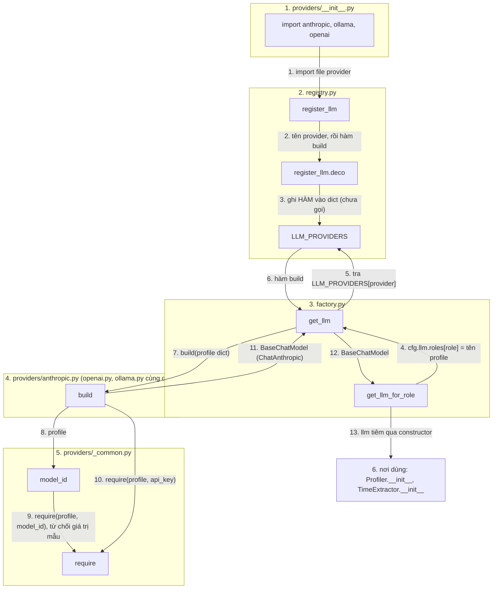

# `tam.llm`: tạo chat model theo profile và role, kèm prompt

**Vị trí trong pipeline:** hạ tầng cho mọi chỗ gọi LLM. Hiện có 2 chỗ dùng: `query/profiler.py` (Query Processing, role `time_extractor`) và `ingestion/time_extraction.py` (Ingestion, role `ingestion_time`). Sau này: `router`, `generation`, `judge`. Module này **chỉ tạo** model; nó không gọi `invoke`.

## Các file

| File | Việc |
|---|---|
| `registry.py` | `LLM_PROVIDERS` (tên provider → **hàm** `build(profile)`); decorator `@register_llm("tên")` |
| `factory.py` | `get_llm(cfg, profile_name)`, `get_llm_for_role(cfg, role)` |
| `providers/__init__.py` | Import `anthropic, ollama, openai` để decorator chạy |
| `providers/anthropic.py`, `openai.py`, `ollama.py` | Mỗi file một hàm `build` → `ChatAnthropic` / `ChatOpenAI` / `ChatOllama` |
| `providers/_common.py` | `require(profile, key, hint)` (thiếu/rỗng thì báo lỗi), `model_id(profile)` (từ chối giá trị mẫu `<điền ...>`) |
| `prompts/time_extractor.md` | System prompt của Time Extractor; chỗ `{t_now}`; few-shot 8 ví dụ |
| `prompts/ingestion_time.md` | System prompt trích mốc lúc ingestion; chỗ `{doc_title}`; few-shot 4 ví dụ |

## Thứ tự vận hành

Quy ước: mỗi khối = một file (đánh số); node = `Class.hàm` hoặc tên hàm; mũi tên có **số thứ tự** và **tên dữ liệu** truyền đi; `↻` = lặp; một node có thể có nhiều mũi tên vào/ra.

- Bước 1-3 lúc import; bước 4-13 chạy khi điểm vào lắp ráp, mỗi role một lần.
- `ValueError` ở bước 8-10 được `get_llm` bọc lại với tiền tố `llm.profiles.<tên>`.
- Prompt `prompts/*.md` không đi qua factory: `Profiler`, `TimeExtractor` tự đọc file và thay `{t_now}` / `{doc_title}`.

## Pattern

**Registry + Factory**, giống `embedding/` nhưng đăng ký **hàm** chứ không phải class, và không có `base.py`: kết quả `build` đã là `BaseChatModel` của langchain-core, nên `with_structured_output` / `bind_tools` dùng được bất kể provider.
- **Tiêm phụ thuộc:** `Profiler`, `TimeExtractor` nhận `llm` qua tham số. Chỉ chỗ lắp ráp (sau này `pipeline/builder.py`, `scripts/*`) mới gọi `get_llm_for_role`. Test truyền LLM giả.
- **Prompt là file `.md`** với placeholder thay bằng `str.replace` (không dùng `format` vì prompt có thể chứa `{}`). Prompt viết tiếng Anh vì dataset TimeQA tiếng Anh.
- **9router** (proxy tương thích OpenAI) dùng lại provider `openai` với `base_url`, không cần code mới.
- Đọc nội dung trả lời bằng `message.text`, không dùng `.content` (có thể là danh sách khối).

**Thêm provider mới:** file `providers/<tên>.py` với hàm `build` + `@register_llm("<tên>")`, một dòng import vào `providers/__init__.py`, thêm profile vào yaml.

## Input / Output

| Hàm | Vào | Ra |
|---|---|---|
| `get_llm(cfg, name)` | `Config`, tên profile | `BaseChatModel` |
| `get_llm_for_role(cfg, role)` | `Config`, tên role (`time_extractor`, `ingestion_time`, `router`, `generation`, `judge`) | `BaseChatModel` |
| Prompt `time_extractor.md` | `{t_now}` = ngày `T_now` | system message cho Profiler |
| Prompt `ingestion_time.md` | `{doc_title}` | system message cho TimeExtractor |

**Chưa làm:** log mỗi lệnh gọi LLM (role, profile, độ trễ, token). Chi tiết: `docs/process/02_CORE_COMPONENTS.md` mục 2.
