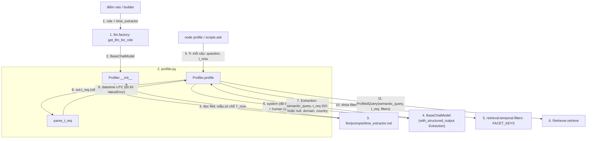

# `tam.query`: xử lý câu hỏi (Time Extractor)

**Vị trí trong pipeline:** Tầng 2 (Query Processing), bước đầu tiên của luồng online: `profile → route → retrieve → generate`. Hiện chỉ có Profiler; Routing Agent (`route`) sẽ nằm ở `agents/`.

## Các file

| File | Việc |
|---|---|
| `profiler.py` | `Profiler(llm).profile(question, t_now) -> ProfiledQuery`; kiểu `Extraction` (đầu ra có cấu trúc của LLM); `parse_t_req(raw)` |

Prompt dùng: `llm/prompts/time_extractor.md`.

## Thứ tự vận hành (`profile`)

Quy ước: mỗi khối = một file (đánh số); node = `Class.hàm` hoặc tên hàm; mũi tên có **số thứ tự** và **tên dữ liệu** truyền đi; `↻` = lặp; một node có thể có nhiều mũi tên vào/ra.

Chuẩn hóa trong `profile` (bước 7-11), không tin hoàn toàn LLM:
- `t_req` đọc bằng `isoparse` (`2020`, `2020-03`, `2020-03-01`), quy về UTC. `null` → dùng `T_now`. `t_req > T_now` chỉ cảnh báo.
- `domain` viết thường, `country` viết hoa, chuỗi rỗng bỏ; chỉ giữ khóa trong `FACET_KEYS` (bước 10).
- `semantic_query` rỗng → quay về nguyên câu hỏi.

## Pattern

- **Tiêm phụ thuộc:** LLM nhận qua constructor, `t_now` qua tham số; không đọc đồng hồ hay biến môi trường bên trong. Test dùng LLM giả + đồng hồ giả. Chỗ lấy `T_now` thật (`datetime.now(timezone.utc)`) sẽ nằm ở node `profile` của pipeline và `scripts/ask.py`.
- **Bất biến thời gian tương đối:** `T_now` luôn được tiêm vào system prompt để quy "last week", "now" thành `T_req` tuyệt đối.
- **Structured output** (`with_structured_output(Extraction)`), few-shot nằm trong system prompt (không dùng lượt hội thoại giả vì tool calling rườm rà).
- **Khoảng thời gian** lấy mốc cuối khoảng ("during the 1990s" → `1999-01-01`) vì `t_req` là một điểm.
- **`domain`/`country` chỉ điền khi câu hỏi nêu rõ:** đoán sai làm filter loại mất đáp án (rỗng), tệ hơn không lọc. Cũng làm sạch `semantic_query` (bỏ từ đệm, sửa lỗi gõ, giữ tên riêng) để nhánh BM25 không nhiễu.
- Module này import `FACET_KEYS` từ `retrieval/temporal/filters.py` để hai bên luôn khớp.

## Input / Output

| | Vào | Ra |
|---|---|---|
| `Profiler(llm)` | `BaseChatModel` (role `time_extractor`, hiện `claude_haiku`) | `Profiler` |
| `profile(question, t_now)` | câu hỏi thô (str), `datetime` | `ProfiledQuery(semantic_query, t_req UTC, filters, mechanism="temporal")` |

**Chưa kiểm chứng với LLM thật:** độ đúng quy đổi "last week", khoảng thời gian. Chi tiết: `docs/process/04_PROFILER_METRICS_INGESTION.md` mục 2.
