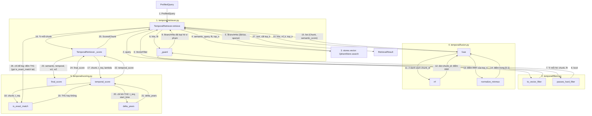

# `tam.retrieval`: truy xuất time-aware

**Vị trí trong pipeline:** Tầng 3 (Retrieval). Nhận `ProfiledQuery` từ Query Processing, trả `RetrievalResult` cho Generation. Hiện có Cơ chế 1 (`temporal/`); `timeline/` (CC2) và `conflict/` (CC3) sẽ thêm cạnh bên. **Thuần Python, không import langchain/langgraph**: dễ test, dễ giải thích; store được tiêm qua constructor.

## Các file

| File | Việc |
|---|---|
| `base.py` | ABC `Retriever`: `mechanism` + `retrieve(ProfiledQuery) -> RetrievalResult`. Hợp đồng chung của 3 cơ chế |
| `temporal/filters.py` | `to_vector_filter(query)` (kiểm tra facet ∈ `FACET_KEYS` = `{domain, country}`), `passes_hard_filter(chunk, flt)` (kiểm lại bằng Python) |
| `temporal/fusion.py` | `rrf` (k=60), `normalize_minmax`, `fuse(hits, k, top_n)` → `Semantic_Score` ∈ [0,1] |
| `temporal/scoring.py` | `is_exact_match`, `delta_years`, `temporal_score` (TH1/TH2), `final_score` |
| `temporal/retriever.py` | `TemporalRetriever(Retriever)`: ghép các bước trên; `from_config(cfg, store)` |

`filters`, `fusion`, `scoring` là hàm thuần, **không gọi nhau**; chỉ `retriever.py` gọi cả ba nên test riêng từng cái được.

## Thứ tự vận hành (`TemporalRetriever.retrieve`)

Quy ước: mỗi khối = một file (đánh số); node = `Class.hàm` hoặc tên hàm; mũi tên có **số thứ tự** và **tên dữ liệu** truyền đi; `↻` = lặp; một node có thể có nhiều mũi tên vào/ra.

- Bước 4: hard filter chạy **trong DB** trước khi xếp hạng. Bước 6-9 (`_guard`) là chốt chặn: với Qdrant thật không nên loại gì, nếu có thì ghi cảnh báo.
- Bước 17-22: TH1 (`end_time` rỗng hoặc `>= t_req`) trả 1.0 ngay; TH2 mới gọi `delta_years` và tính `exp(-λ·Δyears)`. Chunk có `start_time > t_req` ném `ValueError`.
- Bước 27: sắp theo `final_score` giảm dần; hòa thì `temporal_score` giảm dần, rồi `chunk_id`.
- `filters`, `fusion`, `scoring` không gọi nhau; chỉ `retriever.py` gọi cả ba.

## Pattern

- **Strategy qua ABC `Retriever`:** `tools/`, `pipeline/`, `evaluation/` về sau chỉ phụ thuộc hợp đồng này, không phụ thuộc `TemporalRetriever`.
- **Dependency injection:** `TemporalRetriever(store, w1, w2, decay_lambda, rrf_k, top_n, top_k)`; `from_config` đọc khối `retrieval` của yaml (`w1=0.7, w2=0.3, λ=0.5, rrf_k=60, top_n=50, top_k=5` là mặc định). Ràng buộc: `1 <= top_k <= top_n`.
- **Defense in depth** cho bất biến: hard filter ở DB + `_guard` ở Python + `ValueError` trong `scoring`.
- **Rủi ro đã biết:** min-max nhạy với hòa nghĩa (kho giả 7/11 case, Qdrant thật 11/11); ứng viên thay thế để ablation sau. Xem `docs/process/03_TEMPORAL_RETRIEVAL_CORE.md` mục 3.

## Input / Output

| | Vào | Ra |
|---|---|---|
| `TemporalRetriever.retrieve` | `ProfiledQuery(semantic_query, t_req, filters)` | `RetrievalResult(mechanism="temporal", chunks=list[ScoredChunk])` tối đa `top_k`, mỗi chunk có đủ 3 điểm |
| `fuse` | `BranchHits`, `k`, `top_n` | `list[(Chunk, semantic_score)]` giảm dần |
| `temporal_score` | `Chunk`, `t_req`, `λ` | float ∈ (0, 1] |

Thiết kế thuật toán: `docs/design/02_TEMPORAL_RETRIEVAL_DESIGN.md`.
