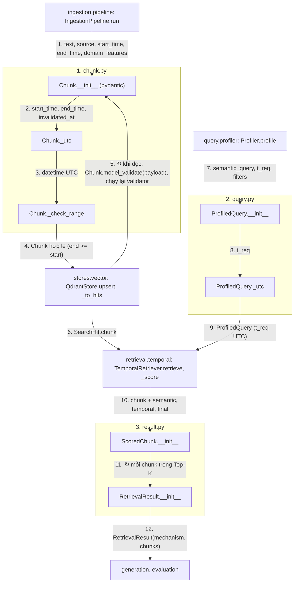

# `tam.schemas`: hình dạng dữ liệu dùng chung

**Vị trí trong pipeline:** xuyên suốt. Đây là "hợp đồng dữ liệu" giữa các tầng; không có logic, không import module nào khác của `tam` (trừ `result.py` import `chunk.py`, `query.py`).

## Các file

| File | Lớp | Ai ghi → ai đọc |
|---|---|---|
| `chunk.py` | `Chunk` | `ingestion/pipeline` tạo → `stores/vector` lưu/đọc → `retrieval` chấm điểm |
| `query.py` | `ProfiledQuery`, `Mechanism` | `query/profiler` tạo → mọi `Retriever` đọc |
| `result.py` | `ScoredChunk`, `RetrievalResult` | `retrieval/*` tạo → generation, `evaluation` đọc |

## Thứ tự vận hành (dữ liệu đi qua)

Quy ước: mỗi khối = một file (đánh số); node = `Class.hàm` hoặc tên hàm; mũi tên có **số thứ tự** và **tên dữ liệu** truyền đi; `↻` = lặp; một node có thể có nhiều mũi tên vào/ra.

- `ingestion/types.py` có kiểu trung gian riêng (`RawDoc`, `RawChunk`, ...), không nằm ở đây vì chỉ ingestion dùng.

## Chi tiết từng kiểu

### `Chunk` (đơn vị lưu trong VectorDB)
`chunk_id`, `text`, `source`, `start_time`, `end_time`, `invalidated_at`, `domain_features`.
- `end_time = None` nghĩa là còn hiệu lực; `invalidated_at != None` nghĩa là **sai từ gốc** (Falsehood), Cơ chế 1 lọc hẳn. Đây là chỗ thể hiện bất biến *Evolution ≠ Falsehood*.
- Validator: datetime không múi giờ coi là UTC (quy hết về UTC); `end_time >= start_time`, vi phạm thì `ValueError`.
- `chunk_id` cũng là con trỏ Boomerang từ GraphDB (Cơ chế 2/3) về sau.

### `ProfiledQuery` (đầu ra Time Extractor)
`semantic_query` (đã bỏ phần thời gian), `t_req` (mốc tuyệt đối, UTC), `filters` (chỉ `domain`, `country`), `mechanism` (`temporal` | `timeline` | `conflict`, mặc định `temporal`).

### `ScoredChunk` / `RetrievalResult`
`ScoredChunk` = `chunk` + `semantic_score` ([0,1], sau RRF + min-max) + `temporal_score` (TH1 = 1.0, TH2 = `exp(-λ·Δyears)`) + `final_score` (`W1·sem + W2·temp`). `RetrievalResult` = `mechanism` + `chunks` đã xếp hạng, dùng chung cho cả 3 cơ chế.

## Pattern

pydantic `BaseModel`; ràng buộc nằm ở validator chứ không rải rác ở nơi dùng. Datetime luôn UTC (mốc trước 1970 đã kiểm chứng đi vòng qua Qdrant đúng).

Chi tiết: `docs/process/02_CORE_COMPONENTS.md`, `docs/design/02_TEMPORAL_RETRIEVAL_DESIGN.md` mục 2.
