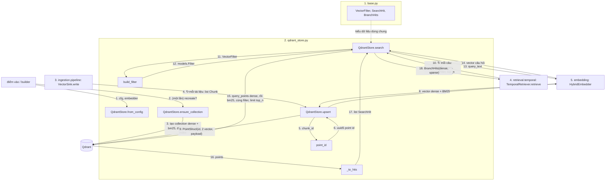

# `tam.stores`: lớp truy cập kho lưu trữ

**Vị trí trong pipeline:** điểm cuối của **Ingestion** (ghi chunk qua `VectorSink`) và điểm đầu của **Retrieval** (bước 2 của `TemporalRetriever.retrieve`: tìm kiếm có hard filter). Hiện chỉ có `vector/`; `graph/` (Neo4j) dành cho Cơ chế 2/3.

## Các file (`stores/vector/`)

| File | Việc |
|---|---|
| `base.py` | ABC `VectorStore` (`ensure_collection`, `upsert`, `search`, `count`) và các kiểu trung lập: `VectorFilter`, `SearchHit`, `BranchHits` |
| `qdrant_store.py` | `QdrantStore(VectorStore)`: cài đặt bằng Qdrant; **file duy nhất biết cú pháp Qdrant** |

## Thứ tự vận hành

Quy ước: mỗi khối = một file (đánh số); node = `Class.hàm` hoặc tên hàm; mũi tên có **số thứ tự** và **tên dữ liệu** truyền đi; `↻` = lặp; một node có thể có nhiều mũi tên vào/ra.

- Hard filter áp **trong DB, trước khi xếp hạng**, ở cả hai nhánh (bước 15). Không gộp hai nhánh ở đây: RRF + min-max nằm ở `retrieval/temporal/fusion.py`.
- Bước 4-9 và 10-18 lặp nhiều lần; bước 1-3 chỉ một lần.

## Pattern

- **Dependency inversion / Strategy:** `retrieval` và `ingestion` chỉ biết ABC `VectorStore`; đổi sang Chroma/Milvus chỉ viết thêm một file store. Kho giả trong test cũng kế thừa `VectorStore`.
- **Kiểu trung lập (`VectorFilter`):** logic nghiệp vụ nói "t_req, bỏ tin giả, facet", chỉ `qdrant_store.build_filter` biết cách dịch. `exclude_invalidated=False` dành cho câu trả lời lịch sử có cảnh báo.
- **`QdrantStore` nhận `Embedder` qua constructor** (`from_config(cfg, embedder)`), không tự tạo embedding.
- **Bất biến thể hiện trong code:**
  - Đúng 4 payload index: `start_time`, `invalidated_at` (DATETIME), `domain_features.domain`, `domain_features.country` (KEYWORD). `source`, `chunk_id`, `end_time` cố ý **không** index. `payload_index_fields()` để test so khớp.
  - Point id = `uuid5(chunk_id)` (Qdrant chỉ nhận UUID/int); `chunk_id` gốc nằm trong payload. Upsert lại cùng chunk thì ghi đè, không nhân đôi.
  - Hard filter áp **trong DB, trước khi xếp hạng**, ở cả hai nhánh.

## Input / Output

| Hàm | Vào | Ra |
|---|---|---|
| `QdrantStore.from_config(cfg, embedder)` | `Config` (`vector_store.url/api_key/collection`), `Embedder` | `QdrantStore` |
| `upsert(chunks)` | `list[Chunk]` | số chunk đã ghi |
| `search(text, flt, top_n)` | câu truy vấn, `VectorFilter`, `top_n` | `BranchHits`: hai danh sách `SearchHit(chunk, score gốc)` đã xếp hạng |
| `count()` | (không) | số point trong collection |

Test Qdrant thật gắn marker `qdrant`, tự skip nếu không có server ở `localhost:6333`. Chi tiết: `docs/process/02_CORE_COMPONENTS.md`.
